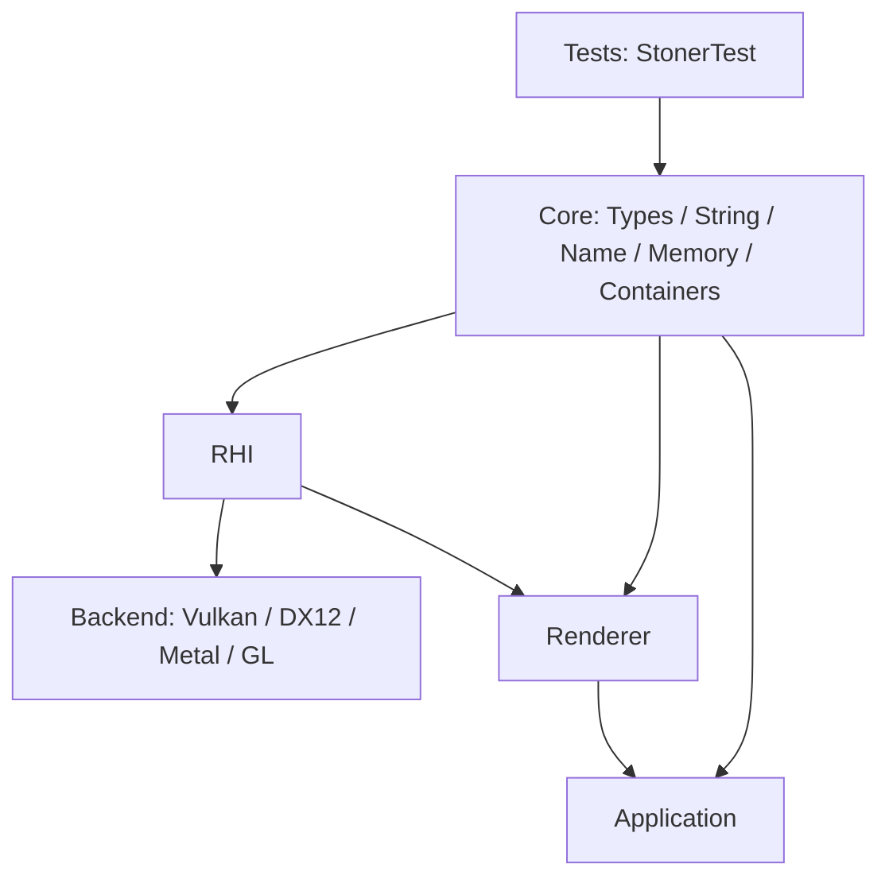

# 一、文档与上下文信息

## 1.基础元数据

- **文档名称**：Spec 003 - Core Foundation Types & Memory 阶段总结
- **对应分支**：`003-core-types-memory`
- **对应规格**：`specs/003-core-types-memory/spec.md`
- **对应计划**：`specs/003-core-types-memory/plan.md`
- **对应任务**：`specs/003-core-types-memory/tasks.md`
- **当前状态**：已实现，Windows 本地构建与测试通过
- **最后验证时间**：2026-04-27

## 2.本期核心摘要

本阶段把 Phase 001 中的空 Core 骨架推进为可用的 Core 基础层，提供固定宽度类型、字符串、名称、智能指针别名、容器别名和内存工具。它是后续 Math、RHI、Backend、Renderer、Application 等阶段共享的底层词汇表，目标是让后续代码不再各自发明局部类型和内存接口。

## 3.上下文与依赖

本阶段来自 `doc/roadmap.md` 的 Phase 002：Core Foundation: Types & Memory。

前置依赖：

- `001-scons-project-skeleton` 已完成，提供 `Source/Core/`、`Tests/` 与 SCons 静态库构建骨架。
- `003-core-types-memory` 的 spec、plan、research、data-model、contract、quickstart 均已生成。
- 构建系统为 SCons 4.10.1，当前本地使用 `python -m SCons` 调用。

本阶段不依赖：

- RHI、Backend、Renderer、Application 的实现细节。
- 图形 API，例如 Vulkan、DX12、Metal、OpenGL。
- 第三方测试框架或第三方容器库。

# 二、目标与边界

## 1.业务与功能目标

本阶段面向引擎开发者，解决“底层类型、所有权、容器、内存操作没有统一入口”的问题。完成后，开发者可以在 Core 或后续层中直接使用项目统一命名的基础设施：

- `FPlatformTypes` 以及 `int8`、`uint32`、`uintptr` 等固定宽度与平台相关类型别名。
- `FString` 作为当前阶段的拥有型字符串值。
- `FName` 作为不可变、支持快速比较且碰撞安全的名称值。
- `TSharedPtr<T>`、`TUniquePtr<T>` 作为统一所有权词汇。
- `TArray<T>`、`TMap<K, V>` 作为统一容器词汇。
- `FMemory` 作为分配、对齐分配、释放、复制、移动、填充、清零的统一入口。

## 2.架构目标与定位

本阶段定位为整个引擎的 Core Foundation。它位于所有后续层之下，只向上提供稳定公共头文件，不向上依赖任何层。



核心架构规则：

- Core 公共头只放在 `Source/Core/Public/Core/`。
- Core 实现文件只放在 `Source/Core/Private/`。
- 下游通过 `#include "Core/CoreMinimal.h"` 或 `#include "Core/<Header>.h"` 使用。
- Core 不包含 RHI、Renderer、Application、Backend 或图形 API 头文件。

## 3.边界与非目标（约束）

本阶段明确不做以下内容：

- 不实现数学类型，例如 `FVector3`、`FMatrix4x4`、`FQuat`、`FColor`。
- 不实现日志、断言、格式化系统。
- 不实现平台文件、进程、时间、窗口抽象。
- 不引入全局 `FName` intern table 或跨进程稳定 Name ID。
- 不实现自研完整容器和自研智能指针，仅先建立项目命名词汇。
- 不引入第三方测试框架。

# 三、交互与产品设计

## 1.用户使用路径

### 1.1 引擎开发者使用 Core 基础类型

#### (1) 聚合式使用

开发者可以在需要完整 Core 基础设施时引入：

```cpp
#include "Core/CoreMinimal.h"
```

随后使用 `Stoner::Core` 命名空间内的 `FString`、`FName`、`TArray<T>`、`TMap<K, V>`、`FMemory` 等类型。

#### (2) 精准头文件使用

如果只需要某一类能力，可以引入单独头文件：

```cpp
#include "Core/FString.h"
#include "Core/FName.h"
#include "Core/FMemory.h"
#include "Core/TArray.h"
#include "Core/TMap.h"
```

#### (3) 测试验证路径

开发者修改 Core 基础能力后，运行：

```bash
python -m SCons
Build/Win64/Debug/Tests/StonerTest.exe
```

当前 Windows 本地验证结果为：

```text
Core foundation tests passed=55 failed=0
```

## 2.核心规则与状态机

### 2.1 `FString` 状态

```text
Empty -> Assigned -> Copied
Empty -> Assigned -> MovedFromValid
Assigned -> Cleared -> Empty
```

关键规则：

- 默认构造为空字符串。
- 从文本构造后保留文本内容。
- 拷贝后内容相等。
- 移动后目标保留原文本，源对象仍可析构、赋值和查询。
- `Clear()` 后重新回到空状态。

### 2.2 `FName` 比较规则

`FName` 是不可变名称值。当前实现保存原始文本和哈希值：

```text
input text -> FString text storage -> hash fast path -> text fallback equality
```

比较规则：

- 相同文本创建的 `FName` 必须相等。
- 不同文本创建的 `FName` 必须不相等。
- 即使两个名称哈希相同，也必须继续比较文本，保证碰撞安全。
- 当前阶段只保证单进程内行为，不保证跨进程稳定 ID。

### 2.3 `FMemory` 生命周期

```text
Unallocated -> Allocated -> Deallocated
Unallocated -> AllocationFailed
Allocated -> Written -> Deallocated
```

关键规则：

- `Allocate(0)` 返回 `nullptr`。
- 合法对齐请求返回满足对齐要求的地址。
- 非法对齐请求返回 `nullptr`，不破坏已有内存。
- `Deallocate(nullptr)` 和 `DeallocateAligned(nullptr)` 安全。
- `Copy`、`Move`、`Set`、`Zero` 只影响指定字节范围。

# 四、技术架构与关键决策

## 1.技术栈与基础设施

- **语言**：C++20，传统 header/source 分离，不使用 C++20 Modules。
- **构建系统**：SCons 4.10.1。
- **测试入口**：现有 `Tests/StonerTest` 可执行文件。
- **主要依赖**：仅 C++ 标准库。
- **目标平台**：Windows、macOS、Linux。
- **当前验证平台**：Windows / Win64 / Debug / MSVC。

代码路径：

```text
Source/Core/
├── Public/Core/
│   ├── CoreMinimal.h
│   ├── FPlatformTypes.h
│   ├── FString.h
│   ├── FName.h
│   ├── TSharedPtr.h
│   ├── TUniquePtr.h
│   ├── FMemory.h
│   ├── TArray.h
│   └── TMap.h
├── Private/
│   ├── CoreModule.cpp
│   └── FMemory.cpp
└── SConscript

Tests/
├── Main.cpp
├── CoreFoundationTests.h
└── CoreFoundationTests.cpp
```

## 2.关键信息

### 2.1 模块对应关系

| 模块 | 文件 | 职责 |
|------|------|------|
| 平台类型 | `FPlatformTypes.h` | 提供固定宽度整数、size、pointer-size、字符类型别名 |
| 字符串 | `FString.h` | 提供拥有型字符串值、比较、长度、空值、视图访问 |
| 名称 | `FName.h` | 提供不可变名称值、哈希快速路径、文本兜底比较 |
| 共享所有权 | `TSharedPtr.h` | 项目命名的 shared ownership 词汇 |
| 独占所有权 | `TUniquePtr.h` | 项目命名的 unique ownership 词汇 |
| 动态数组 | `TArray.h` | 项目命名的动态数组词汇 |
| 键值映射 | `TMap.h` | 项目命名的 key-value map 词汇 |
| 内存工具 | `FMemory.h` / `FMemory.cpp` | 分配、对齐分配、释放、复制、移动、填充、清零 |
| 聚合入口 | `CoreMinimal.h` | 暴露本阶段稳定 Core foundation 公共头 |
| 验证入口 | `CoreFoundationTests.*` | 覆盖 spec003 所有 primitive category 的本地验证 |

### 2.2 关键测试与输出

`Tests/CoreFoundationTests.cpp` 中的测试覆盖以下类别：

- 固定宽度类型大小：`int8`、`uint8`、`int16`、`uint16`、`int32`、`uint32`、`int64`、`uint64`。
- 指针大小：`uintptr`、`intptr` 与 `void*` 大小一致。
- `FString`：默认空值、文本构造、长度、视图、拷贝、移动、清空、不等比较。
- `FName`：空值、重复文本相等、不同文本不等、相同文本同 hash、强制 hash 碰撞时仍不等。
- 指针别名：`TSharedPtr` 空值/共享所有权，`TUniquePtr` 空值/移动/不可拷贝。
- 容器别名：`TArray` 与 `TMap` 的空值、插入、读取、拷贝、移动。
- `FMemory`：零大小分配、小/大分配、16/64 字节对齐、非法对齐、Copy/Move/Set/Zero。
- `CoreMinimal.h` 聚合暴露能力。

当前测试摘要：

```text
[INFO] Core foundation tests passed=55 failed=0
```

### 2.3 使用方法

#### (1) Core-only 示例

```cpp
#include "Core/CoreMinimal.h"

using namespace Stoner::Core;

void Example()
{
    int32 Count = 3;
    FString Label("Core");
    FName Name(Label);

    TArray<FName> Names;
    Names.push_back(Name);

    TMap<FString, int32> Values;
    Values.emplace(FString("Answer"), 42);

    void* Memory = FMemory::AllocateAligned(128, 16);
    FMemory::DeallocateAligned(Memory);
}
```

#### (2) 精准包含示例

```cpp
#include "Core/FMemory.h"

using namespace Stoner::Core;

void ClearBytes(void* Buffer, usize Size)
{
    FMemory::Zero(Buffer, Size);
}
```

注意：当前 `TMap` 直接别名到标准 key-value 容器，因此 key 类型需要满足底层容器的哈希/相等要求。`FString` 自身作为 map key 的哈希支持不属于本阶段已验证范围。

## 3.架构决策记录 (ADR)

### 3.1 ADR-001：先使用标准库背书的初始实现

**决策**：`TSharedPtr`、`TUniquePtr`、`TArray`、`TMap` 当前阶段使用项目命名别名，底层依托标准库设施。

**原因**：

- 本阶段目标是建立稳定 vocabulary，而不是一次性实现完整自研容器系统。
- 这样可以保证 spec003 在一个 speckit cycle 内完成。
- 后续如果需要自研 allocator 或容器，可以保留项目公共命名不变，在内部替换实现。

**放弃方案**：

- 从第一阶段就实现完整自研 string/container/smart pointer，范围过大，会拖慢后续核心路线。

### 3.2 ADR-002：`FString` 使用 class 而不是纯 alias

**决策**：`FString` 是拥有型 class，而不是 `using FString = std::string`。

**原因**：

- 未来可以扩展项目特定行为，而不破坏公共名字。
- 能明确提供 `Len()`、`IsEmpty()`、`View()`、`Clear()` 等引擎风格接口。
- 与 `FName` 的输入和比较关系更稳定。

**放弃方案**：

- 直接 alias 到标准字符串。这样短期最简单，但未来改造公共 API 成本更高。

### 3.3 ADR-003：`FName` 不做全局 intern table

**决策**：`FName` 当前保存文本和 hash，不引入全局名称池。

**原因**：

- 满足当前快速比较和碰撞安全需求。
- 避免全局生命周期、线程安全、序列化策略等额外复杂度。
- 更适合第一阶段 Core 基础设施。

**放弃方案**：

- 类似生产级引擎的全局 intern table。该方案未来可考虑，但不适合 spec003 范围。

### 3.4 ADR-004：`FMemory` 使用手动 aligned allocation 包装

**决策**：`FMemory::AllocateAligned` 自行保存原始指针并返回对齐后的地址。

**原因**：

- 行为可控，`DeallocateAligned` 能找到原始分配地址。
- 可以明确规定零大小和非法 alignment 的确定性行为。
- 避免平台 API 分歧在公共接口中泄漏。

**放弃方案**：

- 直接把不同平台 allocator 行为暴露给调用方。该方案会导致 zero-size 和 alignment 边界行为不一致。

### 3.5 ADR-005：测试继续使用 `StonerTest`

**决策**：不引入第三方测试框架，继续扩展现有 `StonerTest`。

**原因**：

- Phase 001 已经建立测试可执行文件。
- 当前验证逻辑简单，手写 `Record()` 足够。
- 避免为第一批 Core primitives 引入额外依赖。

# 五、实施与验证（任务流）

## 1.任务拆解清单

### 1.1 阶段一：基础结构

#### (1) 测试入口

- 新增 `Tests/CoreFoundationTests.h`。
- 新增 `Tests/CoreFoundationTests.cpp`。
- 修改 `Tests/Main.cpp`，调用 `RunCoreFoundationTests()`，失败时返回非零。

#### (2) Core 头文件骨架

- 新增 `FPlatformTypes.h`
- 新增 `FString.h`
- 新增 `FName.h`
- 新增 `TSharedPtr.h`
- 新增 `TUniquePtr.h`
- 新增 `TArray.h`
- 新增 `TMap.h`
- 新增 `FMemory.h`
- 更新 `CoreMinimal.h`

### 1.2 阶段二：Core vocabulary 实现

#### (1) 类型系统

- `FPlatformTypes` 定义固定宽度整数、size、pointer-size、字符相关别名。
- 额外提供 `int8`、`uint32`、`usize`、`uintptr` 等便捷别名。

#### (2) 字符串与名称

- `FString` 提供拥有型字符串值。
- `FName` 使用 `FString + uint64 hash`，比较时 hash fast path + text fallback。
- 为测试提供 `FromTextAndHashForTesting()`，用于验证 hash 碰撞场景。

#### (3) 所有权与容器

- `TSharedPtr<T>`、`TUniquePtr<T>` 建立项目所有权词汇。
- `TArray<T>`、`TMap<K, V>` 建立项目容器词汇。

### 1.3 阶段三：内存工具

#### (1) API 声明

`FMemory.h` 提供：

- `Allocate`
- `Deallocate`
- `AllocateAligned`
- `DeallocateAligned`
- `Copy`
- `Move`
- `Set`
- `Zero`

#### (2) 实现策略

- 普通分配使用标准分配入口。
- 对齐分配保留原始指针，并返回对齐后的用户指针。
- 字节操作使用标准内存操作。
- 对空指针、零大小、非法 alignment 做确定性处理。

### 1.4 阶段四：测试与验收

#### (1) 构建

```bash
python -m SCons
```

#### (2) 测试

```bash
Build/Win64/Debug/Tests/StonerTest.exe
```

#### (3) 当前结果

```text
55 passed, 0 failed
```

## 2.验收标准

本阶段验收标准如下：

- `python -m SCons` 成功构建 Core、RHI、Renderer、Application、Backend/Vulkan 和 Tests。
- `Build/Win64/Debug/Tests/StonerTest.exe` 返回退出码 0。
- Core foundation 测试输出 `passed=55 failed=0`。
- `CoreMinimal.h` 能暴露所有本阶段公共 Core header。
- Core public header 不包含 RHI、Backend、Renderer、Application 或 graphics API 头。
- `specs/003-core-types-memory/tasks.md` 中 44 个任务全部标记完成。
- `quickstart.md` 已记录当前 Windows 本地输出路径 `Build/Win64/Debug/Tests/StonerTest.exe`。

## 3.已知限制与后续建议

当前已知限制：

- 仅在 Windows / Win64 / Debug / MSVC 环境验证通过，macOS 和 Linux 尚未在本机执行。
- MSVC 构建中仍存在旧骨架文件的 C4819 编码警告，但不影响本阶段构建和测试结果。
- `TArray`、`TMap`、`TSharedPtr`、`TUniquePtr` 当前是项目命名别名，还不是自研容器/智能指针。
- `FName` 当前不是全局 intern table，也不保证跨进程稳定 ID。
- `FString` 还不包含格式化、编码转换、本地化、allocator 注入等能力。

后续建议：

- 在 macOS 和 Linux 上补跑 quickstart 中的构建与测试流程。
- Phase 003 Math Library 可以直接依赖 `FPlatformTypes`、`FString`、`TArray` 和 `FMemory`。
- 后续 Logging 阶段可基于 `FString` 和 `FName` 建立日志类别与消息结构。
- 当 allocator 体系成熟后，再评估是否替换 `TArray`、`TMap` 的底层实现。
