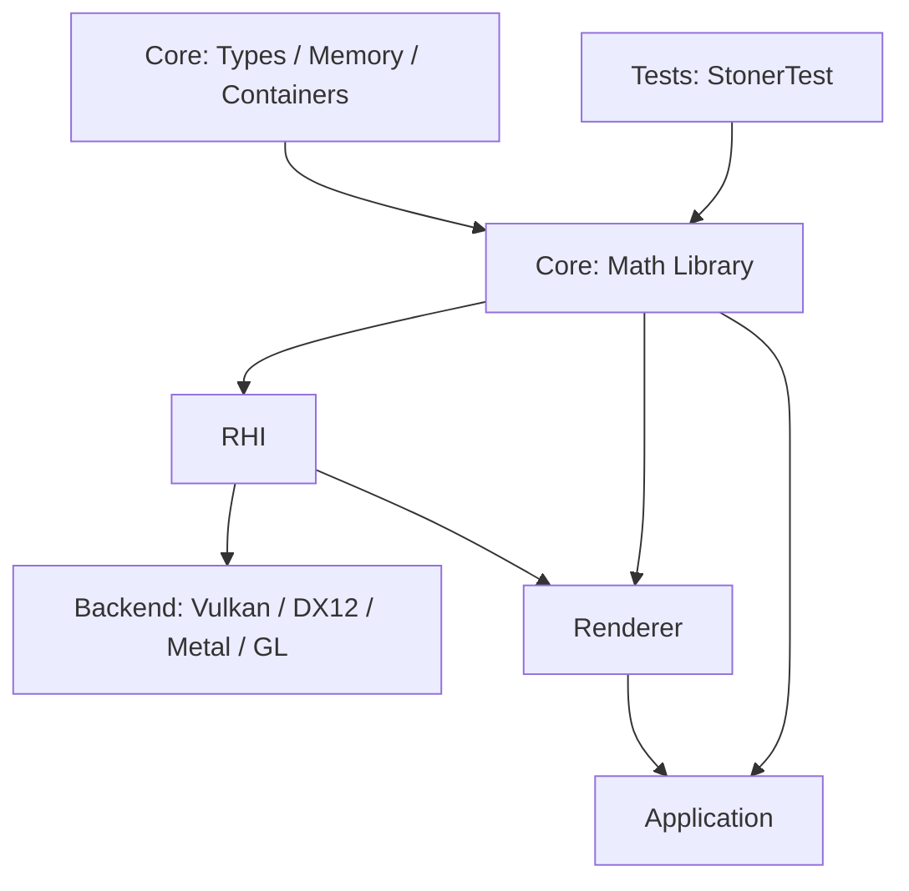
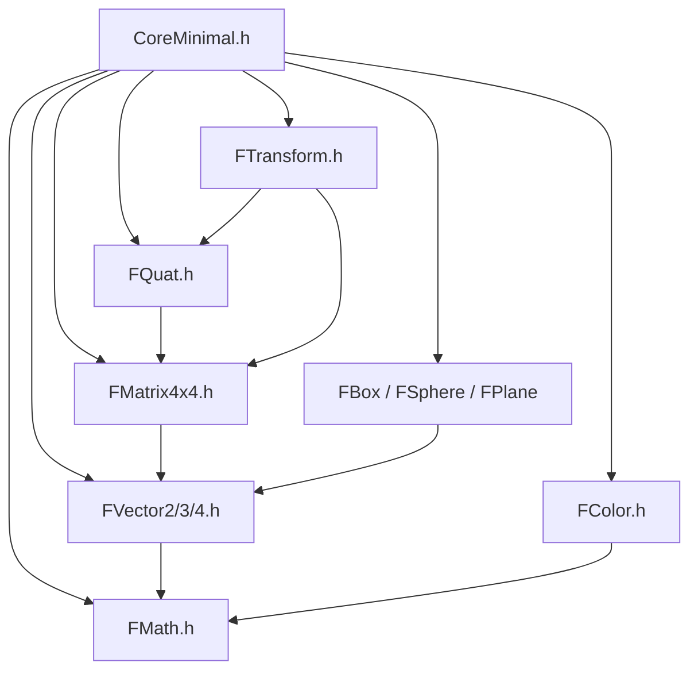

# 一、文档与上下文信息

## 1.基础元数据

- **文档名称**：Spec 004 - Core Foundation Math Library 阶段总结
- **对应分支**：`004-core-math-library`
- **对应规格**：`specs/004-core-math-library/spec.md`
- **对应计划**：`specs/004-core-math-library/plan.md`
- **对应任务**：`specs/004-core-math-library/tasks.md`
- **对应契约**：`specs/004-core-math-library/contracts/core-math-api.md`
- **当前状态**：已实现，macOS 本地构建与测试通过
- **最后验证时间**：2026-04-27
- **实现提交**：`d2b765f feat. spec 004 implement core math library`

## 2.本期核心摘要

本阶段把 Core 层从“基础类型与内存工具”推进到“可表达空间、颜色和几何关系”的数学基础层。它新增向量、矩阵、四元数、变换、颜色、包围盒、球体、平面和标量数学工具，为后续 RHI、Renderer、Application、相机、可见性、Meshlet、Ray Tracing、GI 等系统提供统一数学词汇。

最大设计取舍是：先实现可验证、跨平台、标准库-only 的标量基线版本，同时把公开 API 设计成未来可加入 SIMD 优化而不改变调用方代码的形状。

## 3.上下文与依赖

本阶段来自 `doc/roadmap.md` 的 Phase 003：Core Foundation: Math Library。

前置依赖：

- `001-scons-project-skeleton` 已完成，提供 `Source/Core/`、`Tests/` 与 SCons 静态库构建骨架。
- `003-core-types-memory` 已完成，提供 Core 公共头布局、基础类型、字符串、名称、指针别名、容器别名和 `FMemory`。
- `004-core-math-library` 的 spec、plan、research、data-model、contract、quickstart、tasks 均已生成并执行。
- 构建系统为 SCons 4.10.1；当前 macOS 环境使用本地 `PYTHONPATH="Build/.tools/python" python3 -m SCons` 调用。

本阶段不依赖：

- RHI、Backend、Renderer、Application 的实现细节。
- Vulkan、DX12、Metal、OpenGL 等图形 API。
- 第三方数学库，例如 GLM。
- 第三方测试框架。

# 二、目标与边界

## 1.业务与功能目标

本阶段面向引擎开发者，解决“后续引擎层需要空间数学但项目没有统一数学类型”的问题。完成后，开发者可以在 Core 或后续层中直接使用项目统一命名的数学基础设施：

- `FMath`：标量数学常量和工具函数。
- `FVector2`、`FVector3`、`FVector4`：2D、3D、4D 浮点向量。
- `FMatrix4x4`：4x4 变换矩阵。
- `FQuat`：四元数旋转。
- `FTransform`：平移、旋转、缩放组合变换。
- `FColor`、`FColorBytes`：RGBA 浮点颜色和字节颜色转换。
- `FBox`：轴对齐包围盒。
- `FSphere`：包围球。
- `FPlane`、`EPlaneClassification`：平面和点分类。

这些能力解决的是后续系统的共同语言问题，而不是单个渲染功能问题。RHI 可以用它描述尺寸和变换，Renderer 可以用它描述场景数据和 bounds，Application 可以用它表达对象位置和颜色。

## 2.架构目标与定位

本阶段定位为 Core Foundation 的第二个能力层：在 Types & Memory 之上提供数学值类型。它仍然位于所有图形和应用层之下，只向上暴露稳定头文件，不向上依赖任何系统。



核心架构规则：

- 所有公开数学类型放在 `Source/Core/Public/Core/`。
- 下游通过 `#include "Core/CoreMinimal.h"` 或聚焦头文件使用。
- 数学类型全部位于 `namespace Stoner::Core`。
- Core Math 公共头不得包含 RHI、Backend、Renderer、Application、平台窗口、图形 API 或物理系统头文件。
- 当前阶段采用 header-only value type 方式，避免为小型数值操作引入不必要的 `.cpp` 调度成本。

## 3.边界与非目标（约束）

本阶段明确不做以下内容：

- 不实现空间加速结构，例如 BVH、Octree、Grid。
- 不实现物理专用数学，例如惯性张量、碰撞 manifold、积分器。
- 不实现 Camera、Animation、Scene Graph、ECS。
- 不实现 Renderer-owned scene data。
- 不引入 SIMD intrinsics 的平台分支，仅保留未来优化空间。
- 不引入 double precision 或 integer vector 家族，当前聚焦 float-oriented graphics math。
- 不引入 GLM 等第三方数学库。

# 三、交互与产品设计

## 1.用户使用路径

### 1.1 聚合式使用

开发者需要完整 Core 能力时，直接引入：

```cpp
#include "Core/CoreMinimal.h"
```

随后可以使用 Core 基础类型和数学类型：

```cpp
using namespace Stoner::Core;

FVector3 Position(1.0f, 2.0f, 3.0f);
FQuat Rotation = FQuat::FromAxisAngle(FVector3::UnitZ(), FMath::HalfPi);
FTransform Transform(Position, Rotation);
FVector3 WorldPoint = Transform.TransformPoint(FVector3::UnitX());
```

### 1.2 精准头文件使用

如果只需要某一类能力，可以只引入对应头文件：

```cpp
#include "Core/FVector3.h"
#include "Core/FMatrix4x4.h"
#include "Core/FQuat.h"
#include "Core/FTransform.h"
#include "Core/FColor.h"
#include "Core/FBox.h"
#include "Core/FSphere.h"
#include "Core/FPlane.h"
```

### 1.3 验证路径

开发者修改 Core Math 后，运行：

```bash
PYTHONPATH="Build/.tools/python" python3 -m SCons
Build/Mac/Debug/Tests/StonerTest
```

当前 macOS 本地验证结果为：

```text
Core foundation tests passed=55 failed=0
Core math tests passed=67 failed=0
```

## 2.核心规则与状态机

### 2.1 坐标系与矩阵规则

本阶段选择 Core 级别统一使用右手坐标约定。

```text
Core Math Convention
├── right-handed coordinate
├── row-major FMatrix4x4 storage
├── point transform: implicit W = 1
└── direction transform: implicit W = 0
```

关键规则：

- `FVector3::UnitX().Cross(FVector3::UnitY()) == FVector3::UnitZ()`，测试中明确覆盖右手叉乘。
- `FMatrix4x4` 使用 `float M[4][4]` 保存 row-major 数据。
- 矩阵点变换使用隐式 `W=1`，会应用平移。
- 矩阵方向变换使用隐式 `W=0`，不会应用平移。
- 平移矩阵将平移值放在最后一列，即 `M[0][3]`、`M[1][3]`、`M[2][3]`。

### 2.2 浮点比较规则

浮点计算不依赖精确相等，而是通过 `FMath::DefaultTolerance` 和 near-equality helpers 比较。

```text
raw float result -> FMath::IsNearlyEqual / IsNearlyZero -> deterministic pass/fail
```

关键规则：

- `FMath::DefaultTolerance = 1.0e-5f`。
- 标量使用 `FMath::IsNearlyEqual()` 和 `FMath::IsNearlyZero()`。
- 向量、矩阵、四元数、颜色提供 `NearlyEquals()` 风格能力。
- 直接构造出的组件值仍可使用 `operator==` 做精确比较。
- 计算结果，例如旋转、归一化、矩阵逆，测试必须使用 tolerance。

### 2.3 向量状态

```text
Zero Vector -> SafeNormalize -> Zero Vector
Finite Vector -> SafeNormalize -> Unit Direction
Computed Vector -> NearlyEquals -> Tolerance-aware Result
```

关键规则：

- `FVector2/3/4` 都支持组件构造、加减、标量乘除、点乘、长度、平方长度、安全归一化。
- `FVector3` 额外提供叉乘。
- 近零向量安全归一化返回零向量，不做除零。
- `NaN` 或 infinity 输入不应导致测试路径崩溃；当前暴露 `FMath::IsFinite()` 让调用方检查。

### 2.4 矩阵逆状态

```text
Invertible Matrix -> TryInverse -> true + inverse matrix
Singular Matrix -> TryInverse -> false + identity fallback
```

关键规则：

- `TryInverse()` 通过高斯-约旦消元求逆。
- 主元绝对值低于 tolerance 时判定为不可逆。
- 不可逆时返回 `false`，并将输出矩阵置为 identity，避免未初始化输出。
- 这种设计比“静默返回错误矩阵”更容易在后续渲染系统中定位问题。

### 2.5 四元数与变换规则

```text
Axis + Angle -> FQuat -> RotateVector / ToMatrix
Translation + Rotation + Scale -> FTransform -> TransformPoint / TransformVector
```

关键规则：

- `FQuat` 默认是 identity。
- `FQuat::FromAxisAngle()` 遇到零轴时返回 identity。
- 四元数乘法使用 Hamilton product。
- `A * B` 的语义在注释中约定为旋转向量时先应用 `B`，再应用 `A`。
- `FTransform` 的应用顺序是 Scale -> Rotation -> Translation。
- `TransformPoint()` 应用平移，`TransformVector()` 不应用平移。
- `FTransform::TryInverse()` 遇到近零 scale 时返回失败。

### 2.6 颜色与几何规则

```text
FColor float RGBA <-> FColorBytes byte RGBA
FBox invalid -> AddPoint -> valid bounds
FSphere radius < 0 -> invalid
FPlane normal/distance -> classify point
```

关键规则：

- `FColor` 使用 RGBA 浮点通道，默认 opaque black。
- `FColor::ToBytes()` 将通道 clamp 到 `[0, 1]`，再四舍五入到 `[0, 255]`。
- `FBox` 默认 invalid/empty，第一次 `AddPoint()` 后变为 valid。
- `FBox::Contains()` 包含边界点。
- `FSphere` 半径小于 0 时 invalid。
- `FPlane` 方程为 `Dot(Normal, Point) - Distance = 0`。
- `FPlane::ClassifyPoint()` 使用 tolerance 将点分为 Front、Back、On。

# 四、技术架构与关键决策

## 1.技术栈与基础设施

- **语言**：C++20，传统 header/source 分离，不使用 C++20 Modules。
- **构建系统**：SCons 4.10.1。
- **依赖**：C++ 标准库、已有 Core 基础类型。
- **测试**：沿用现有 `Tests/StonerTest`，新增 `CoreMathTests`。
- **平台目标**：Windows、macOS、Linux。
- **当前验证平台**：macOS，SCons 平台目录为 `Build/Mac/Debug/`。

新增源文件：

```text
Source/Core/Public/Core/
├── FMath.h
├── FVector2.h
├── FVector3.h
├── FVector4.h
├── FMatrix4x4.h
├── FQuat.h
├── FTransform.h
├── FColor.h
├── FBox.h
├── FSphere.h
└── FPlane.h

Tests/
├── CoreMathTests.h
└── CoreMathTests.cpp
```

更新文件：

```text
Source/Core/Public/Core/CoreMinimal.h
Tests/Main.cpp
doc/roadmap.md
specs/004-core-math-library/tasks.md
.cursor/rules/specify-rules.mdc
```

## 2.关键信息

### 2.1 模块对应关系

| 模块 | 文件 | 职责 |
|------|------|------|
| 标量工具 | `FMath.h` | 常量、Clamp、Lerp、角度转换、三角函数、sqrt、tolerance |
| 向量 | `FVector2.h`、`FVector3.h`、`FVector4.h` | 组件值、算术、点乘、长度、安全归一化，`FVector3` 额外提供叉乘 |
| 矩阵 | `FMatrix4x4.h` | row-major 4x4 矩阵、乘法、转置、点/方向变换、TryInverse |
| 四元数 | `FQuat.h` | 轴角构造、归一化、逆、旋转向量、矩阵转换 |
| 变换 | `FTransform.h` | 平移、旋转、缩放组合；点/方向变换；组合；TryInverse |
| 颜色 | `FColor.h` | RGBA float 与 byte 转换、透明/不透明默认值、近似比较 |
| 包围盒 | `FBox.h` | invalid 默认状态、添加点、合并盒、包含、中心、extent |
| 包围球 | `FSphere.h` | center/radius、valid 判断、包含测试 |
| 平面 | `FPlane.h` | normal/distance、点法线构造、三点构造、距离、点分类 |
| 测试 | `CoreMathTests.cpp` | 数学模块所有 normal、boundary、invalid 场景验证 |

### 2.2 Include 关系



注意：`CoreMinimal.h` 是面向使用者的聚合入口；单个数学头仍可独立 include。测试通过 `#include "Core/CoreMinimal.h"` 验证聚合路径。

### 2.3 测试与诊断

`Tests/Main.cpp` 现在顺序执行：

```text
RunCoreFoundationTests()
RunCoreMathTests()
```

只要任一测试集有失败，进程返回非 0。

`CoreMathTests.cpp` 覆盖：

- `FMath`：常量、Clamp、Min/Max、Abs、Lerp、角度转换、Sin/Cos、Sqrt、near equality。
- `FVector2/3/4`：构造、算术、缩放、点乘、长度、近似比较。
- `FVector3`：右手叉乘、安全归一化、零向量归一化、infinity 查询。
- `FMatrix4x4`：identity、row-major 访问、transpose、乘法、点/方向变换、inverse success/failure。
- `FQuat`：identity、axis-angle、组合、归一化、零四元数、安全矩阵转换。
- `FTransform`：identity、点/方向变换、组合、inverse success/failure。
- `FColor`：默认值、透明值、byte 转 float、float 转 byte、clamp、round、近似比较。
- `FBox`：invalid 默认状态、AddPoint、Combine、Contains、Center、Extent。
- `FSphere`：valid、负半径 invalid、边界包含。
- `FPlane`：signed distance、front/back/on-plane、三点构造、退化构造。
- 聚合与隔离：`CoreMinimal` 暴露数学头，Core Math 测试不依赖上层头。
- 基线等价：四元数、矩阵、变换三条旋转路径结果一致。

## 3.架构决策记录 (ADR)

### 3.1 为什么不用 GLM

**决策**：不引入 GLM，先自研 Core Math。

**原因**：

- 项目是学习导向，Core 子系统优先自研。
- 当前需求规模可控，主要是建立 engine vocabulary。
- 自研能显式记录坐标系、矩阵布局、tolerance、invalid behavior。

**放弃方案**：

- GLM：成熟但会隐藏很多底层数学实现细节，不符合本阶段学习目标。

### 3.2 为什么先做标量基线而不是 SIMD

**决策**：先实现 scalar baseline，后续再加 SIMD。

**原因**：

- 标量路径跨 MSVC、Clang、GCC 更容易稳定。
- 测试可以作为未来 SIMD 路径的 reference behavior。
- 公开 API 不暴露 SIMD 类型，未来内部优化不影响调用方。

**放弃方案**：

- 立即使用 SSE/NEON/AVX：平台分支复杂，会提前引入非业务风险。

### 3.3 为什么使用右手坐标系

**决策**：Core Math 使用右手坐标系。

**原因**：

- `X cross Y = Z` 的规则直观，测试可明确验证。
- Vulkan 和大量图形资料中右手约定更常见。
- 具体图形 API 或 shader 需要不同约定时，可以在 Backend 或 shader 边界转换。

**放弃方案**：

- 每个 Backend 自定义坐标系：会导致 Core 数学不可预测。
- 左手 Core：也可行，但与当前 Vulkan-first 学习路径不如右手直观。

### 3.4 为什么矩阵使用 row-major 存储

**决策**：`FMatrix4x4` 使用 row-major 存储，平移放在最后一列。

**原因**：

- C++ 中 `M[row][column]` 的阅读和调试直接。
- 测试可以明确检查 `At(0, 1)` 等 row-major 访问。
- 存储顺序与 shader 上传约定可以在后续 RHI/Backend 边界处理。

**放弃方案**：

- Column-major：在 shader 文献中常见，但在 Core C++ 层并不天然更优。
- 不声明布局：会让测试、序列化、上传和调试都变得模糊。

### 3.5 为什么 inverse 使用 Try 模式

**决策**：矩阵和变换逆使用 `TryInverse(out)` 返回 bool。

**原因**：

- 奇异矩阵、零 scale transform 是正常边界情况。
- bool 返回值使调用方必须显式处理失败。
- 失败时输出 identity fallback，避免未初始化输出。

**放弃方案**：

- 直接返回矩阵：无法区分成功和失败。
- 抛异常：当前 Core 风格偏 deterministic return，不依赖异常控制流。

### 3.6 为什么 `FBox` 默认 invalid

**决策**：默认 `FBox` 是 invalid/empty，而不是零大小 valid box。

**原因**：

- 空包围盒和位于原点的零大小包围盒语义不同。
- `AddPoint()` 第一次调用可以自然初始化 min/max。
- 后续 culling 或 bounds combine 不会误把空 box 当成真实原点 bounds。

**放弃方案**：

- 默认 min=max=0 且 valid：会混淆 empty 和 zero-size。

# 五、实施与验证（任务流）

## 1.任务拆解清单

### 1.1 Setup 与 Foundational

- T001-T004：新增 `CoreMathTests.h/cpp`，接入 `Tests/Main.cpp`，确认 `Tests/SConscript` 自动发现测试源文件。
- T005-T006：创建所有数学公共头。
- T007-T010：写入坐标、矩阵、tolerance、invalid-input 基础约定，更新 `CoreMinimal.h`，并跑通 scaffold build。

### 1.2 US1：核心空间数学

- T011-T016：在 `Tests/CoreMathTests.cpp` 中添加 `FMath`、向量、矩阵、四元数、变换的失败优先测试。
- T017-T023：实现 `FMath`、`FVector2/3/4`、`FMatrix4x4`、`FQuat`、`FTransform`。
- T024-T025：验证 `CoreMinimal.h` 聚合暴露和本地构建测试。

交付结果：

- Core 可以表达点、方向、矩阵、旋转和组合变换。
- 后续 RHI/Renderer 可以不再自定义局部 math 类型。

### 1.3 US2：颜色与几何基础体

- T026-T029：添加 `FColor`、`FBox`、`FSphere`、`FPlane` 的测试。
- T030-T033：实现颜色、包围盒、包围球、平面。
- T034-T035：验证聚合导出和本地测试。

交付结果：

- Core 可以表达 RGBA 颜色、AABB、sphere、plane。
- 后续可见性、调试绘制、资源描述、基础空间判断有统一输入。

### 1.4 US3：一致性、隔离与诊断

- T036-T039：添加 aggregate include、higher-layer isolation、跨平台诊断、baseline equivalence 测试。
- T040-T042：补充公共头注释，记录坐标、布局、变换、颜色、validity、classification 语义。
- T043：再次运行构建和测试。

交付结果：

- Core Math 的行为在 macOS 本地确定可用。
- 测试输出包含关键诊断：右手坐标、row-major、tolerance、pointer size。

### 1.5 Polish 与收尾

- T044-T047：验证命名、依赖隔离、contract 覆盖、测试覆盖。
- T048-T049：运行 quickstart build/test。
- T050：更新 `doc/roadmap.md`，将 Phase 003 标记为 `Done`。

## 2.验收标准

本阶段完成的验收标准：

- `Core/CoreMinimal.h` 暴露所有数学头。
- 聚焦头文件可独立 include。
- 公共数学头不依赖 RHI、Backend、Renderer、Application 或图形 API。
- 所有公开类型遵循 UE5-style `F` 前缀。
- `tasks.md` 中 T001-T050 全部完成。
- `doc/roadmap.md` 中 Phase 003 已更新为 `✅ Done`。
- macOS 本地 SCons 构建通过。
- `StonerTest` 退出码为 0。

验证命令：

```bash
PYTHONPATH="Build/.tools/python" python3 -m SCons
Build/Mac/Debug/Tests/StonerTest
```

验证结果：

```text
Core foundation tests passed=55 failed=0
Core math tests passed=67 failed=0
```

## 3.实现技巧与后续提示

### 3.1 新增数学类型时优先补测试

本阶段的 `CoreMathTests.cpp` 已经形成了自包含测试风格。后续如果加入 `FVector2i`、`FMatrix3x3`、`FRay` 等类型，建议继续遵循：

```text
Add failing tests -> Implement value type -> Run StonerTest -> Mark task complete
```

测试名称要描述行为，而不是描述实现。例如：

- 好：`FMatrix4x4 singular inverse fails deterministically`
- 不好：`Gauss pivot branch works`

### 3.2 计算结果不要直接精确比较

只对直接构造、未计算的值使用 `operator==`。任何经过三角函数、归一化、矩阵乘法、逆、四元数旋转的结果都应使用 near-equality。

推荐：

```cpp
Result.NearlyEquals(Expected)
FMath::IsNearlyEqual(A, B)
```

避免：

```cpp
ComputedVector == ExpectedVector
ComputedFloat == ExpectedFloat
```

### 3.3 失败要显式返回，不要制造静默错误值

矩阵逆、变换逆、退化平面、负半径球体、空 box 这类边界场景都应该有可查询状态或 bool 返回值。后续新增几何类型时也应沿用这条规则。

推荐模式：

```text
TryOperation(out) -> bool
IsValid() -> bool
Default invalid state -> safe query behavior
```

### 3.4 SIMD 优化不要泄漏到公开 API

当前 API 以普通值类型暴露。未来若加入 SIMD，可以在内部实现、编译开关或平台特化中处理，但不要让调用方必须传入平台专属 SIMD 类型。

应保持：

```cpp
FVector3 A;
FVector3 B;
FVector3 C = A + B;
```

而不是把调用方暴露给 SSE/NEON intrinsic 类型。

### 3.5 Backend 或 Shader 的布局差异应在边界转换

Core 选择了右手坐标和 row-major 约定。未来 Vulkan、Metal、DX 或 shader 侧如果需要不同布局、clip-space 或 handedness，应该在 RHI/Backend 或 shader upload 边界转换，不要回头改变 Core Math 的基础语义。

### 3.6 文档与 contract 要同步更新

如果后续改变以下内容，必须同步更新 `contracts/core-math-api.md`、quickstart、测试和本文档：

- 坐标系约定。
- 矩阵存储或乘法语义。
- `FTransform` 应用顺序。
- `FPlane` 方程或分类规则。
- tolerance 默认值。
- 颜色 channel 顺序或转换规则。

## 4.已知限制

- 当前只实现 float 数学类型。
- 当前没有 SIMD 优化路径。
- 当前没有 double precision 类型。
- 当前没有矩阵分解、look-at、projection、frustum 等相机相关工具。
- 当前 `FMatrix4x4::TryInverse()` 是通用高斯-约旦实现，适合正确性基线，不代表最终性能路径。
- 当前 `FBox` 仅为轴对齐包围盒，不支持 oriented box。
- 当前 `FPlane` 分类只返回 front/back/on，不包含更复杂的裁剪或相交结果。

这些限制都符合 spec004 边界；后续应通过新的 spec 逐步扩展，而不是在本阶段继续发散。
