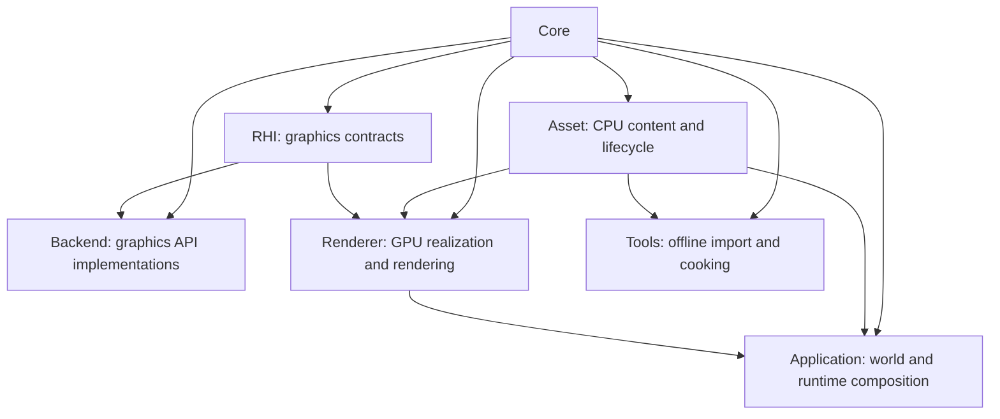
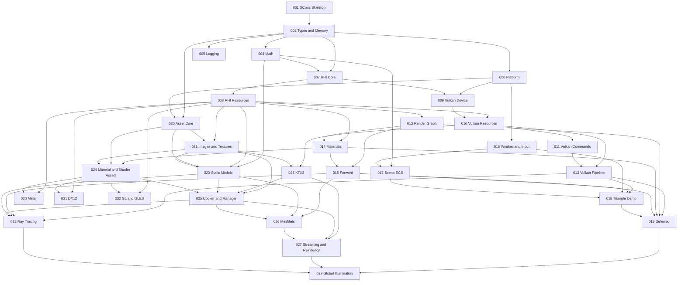

# Stoner Graphics Lab - Engine Development Roadmap

> **Version**: 2.0.0 | **Created**: 2026-04-21 | **Last Updated**: 2026-07-24 | **Status**: Active
> **Constitution**: v1.4.0
> **Numbering Rule**: Every runtime phase number equals its Speckit feature number. Feature 002 is this roadmap meta-feature.
> **Completed Baseline**: Features 001 and 003 through 019 are implemented and verified.

---

## Table of Contents

1. [Overview](#overview)
2. [Architecture Principles](#architecture-principles)
3. [Phase Overview](#phase-overview)
4. [Dependency Graph](#dependency-graph)
5. [Phase Details](#phase-details)
   - [Phase 003 - Core: Types & Memory](#phase-003--core-types--memory)
   - [Phase 004 - Core: Math Library](#phase-004--core-math-library)
   - [Phase 005 - Core: Logging & Assertions](#phase-005--core-logging--assertions)
   - [Phase 006 - Core: Platform Abstraction](#phase-006--core-platform-abstraction)
   - [Phase 007 - RHI: Core Interfaces](#phase-007--rhi-core-interfaces)
   - [Phase 008 - RHI: Resource & Pipeline Interfaces](#phase-008--rhi-resource--pipeline-interfaces)
   - [Phase 009 - Backend: Vulkan Device & Swapchain](#phase-009--backend-vulkan-device--swapchain)
   - [Phase 010 - Backend: Vulkan Resource Management](#phase-010--backend-vulkan-resource-management)
   - [Phase 011 - Backend: Vulkan Commands & Submission](#phase-011--backend-vulkan-commands--submission)
   - [Phase 012 - Backend: Vulkan Pipeline & Shader](#phase-012--backend-vulkan-pipeline--shader)
   - [Phase 013 - Renderer: Render Graph Foundation](#phase-013--renderer-render-graph-foundation)
   - [Phase 014 - Renderer: Material & Shader System](#phase-014--renderer-material--shader-system)
   - [Phase 015 - Renderer: Forward Rendering](#phase-015--renderer-forward-rendering)
   - [Phase 016 - Application: Window & Input](#phase-016--application-window--input)
   - [Phase 017 - Application: Scene Graph & ECS](#phase-017--application-scene-graph--ecs)
   - [Phase 018 - Application: Triangle Demo](#phase-018--application-triangle-demo)
   - [Phase 019 - Renderer: Deferred Rendering](#phase-019--renderer-deferred-rendering)
   - [Phase 020 - Asset: Core, Identity & Registry](#phase-020--asset-core-identity--registry)
   - [Phase 021 - Asset: Image & Texture Foundation](#phase-021--asset-image--texture-foundation)
   - [Phase 022 - Asset: KTX2 Cooking & Compression](#phase-022--asset-ktx2-cooking--compression)
   - [Phase 023 - Asset: Static Mesh & Model Pipeline](#phase-023--asset-static-mesh--model-pipeline)
   - [Phase 024 - Asset: Material & Shader Assets](#phase-024--asset-material--shader-assets)
   - [Phase 025 - Asset: Cooker & Runtime Manager](#phase-025--asset-cooker--runtime-manager)
   - [Phase 026 - Renderer: Meshlet Pipeline](#phase-026--renderer-meshlet-pipeline)
   - [Phase 027 - Asset: Streaming & Residency](#phase-027--asset-streaming--residency)
   - [Phase 028 - Renderer: Ray Tracing](#phase-028--renderer-ray-tracing)
   - [Phase 029 - Renderer: Global Illumination](#phase-029--renderer-global-illumination)
   - [Phase 030 - Backend: Metal](#phase-030--backend-metal)
   - [Phase 031 - Backend: DirectX 12](#phase-031--backend-directx-12)
   - [Phase 032 - Backend: OpenGL/GLES](#phase-032--backend-openglgles)
6. [Parallel Development Tracks](#parallel-development-tracks)
7. [Future Asset Extensions](#future-asset-extensions)
8. [Risk Register](#risk-register)
9. [Constitution Compliance](#constitution-compliance)
10. [How to Use This Roadmap](#how-to-use-this-roadmap)
11. [Change Log](#change-log)

---

## Overview

Stoner Graphics Lab is a C++20 cross-platform graphics engine developed through
one Speckit cycle per roadmap phase. Features 003 through 019 established Core,
RHI, Vulkan, Renderer, Application, visible presentation, and sibling forward
and deferred paths. The next critical gap is content flow: the engine can create
GPU resources and refer to meshes or textures abstractly, but it cannot yet
turn source files into stable CPU assets, cooked payloads, or managed runtime
objects.

Roadmap 2.0 adds Asset as an independent runtime layer. It separates source
interchange, cooked delivery, runtime management, and GPU realization so that
Meshlets, Ray Tracing, and GI consume versioned derived data instead of
hard-coded geometry.

### Roadmap-Wide Decisions

- C++20 uses traditional public/private headers and sources; no C++20 Modules.
- Vulkan remains the first backend; Metal, DX12, and GL/GLES remain independent RHI implementations.
- Core learning systems are implemented locally; mature codecs and format parsers may be vendored when reimplementing them has little educational value.
- Development builds may import source assets; cooked runtime mode consumes manifests and derived payloads without implicit source fallback.
- Asset identity is a typed canonical logical path plus optional subresource. Source/content/cook hashes version and invalidate data but do not change identity.
- Initial source formats are glTF 2.0/GLB and PNG/JPEG/HDR. KTX2/Basis is the cooked texture standard.
- FBX, OBJ, USD, and TGA are future importer/resolver plugins, not initial format commitments.
- Windows, macOS, and Linux automated validation is mandatory for platform-sensitive features.

### Research Basis

- [glTF 2.0 Specification](https://registry.khronos.org/glTF/specs/2.0/glTF-2.0.html) defines the initial runtime-oriented static model interchange boundary.
- [KTX](https://www.khronos.org/ktx/) defines the cooked texture container and Basis cross-platform compression path.
- [OpenUSD Asset Resolution](https://openusd.org/release/api/ar_page_front.html) informs logical identifiers and replaceable resolver strategies; USD composition itself remains a later Scene/Prefab concern.
- [Unreal Asset Management](https://dev.epicgames.com/documentation/en-us/unreal-engine/asset-management-in-unreal-engine) supports separating unloaded metadata, soft references, asynchronous loading, and residency ownership.

### Current State (Post Feature 019)

| Ownership Area | Status | Current Capability |
|---|---|---|
| Core | Done | Types, memory, math, logging, assertions, filesystem/process/time/window handles |
| Asset | Next | No formal layer yet; Feature 020 creates its contracts |
| RHI | Done | Device, resources, descriptors, pipelines, render passes, commands, queues, sync |
| Backend/Vulkan | Done | Native/fallback device, resources, commands, pipelines, presentation, readback |
| Renderer | Done through Deferred | Render Graph, material/shader records, forward and deferred execution |
| Application | Done foundation | Window/input, ECS scene organization, visible triangle integration |
| Additional Backends | Planned | Metal, DX12, and GL/GLES follow the Asset-backed shader path |

---

## Architecture Principles

### Runtime Dependency Directions



Arrows point from dependency to consumer. Asset owns CPU-side payloads,
identities, metadata, dependency records, and import/cook/load contracts. Asset
does not include RHI, Renderer, Application, Backend, or graphics API headers.
Renderer creates RHI resources and owns GPU residency. Runtime modules never
depend on Tools.

### Rules

1. Public Application and Renderer code never calls Vulkan, Metal, DX, GL, or GLES directly.
2. Importers are registered strategies; one source may emit multiple typed subresources.
3. Registry, resolver, importer, cooker, manager, and residency policy remain separate responsibilities.
4. Source assets are authoritative. Meshlets, BLAS, SDF, and compressed textures are versioned derived assets.
5. Public names use UE5-style prefixes (`F`, `I`, `E`, and `T`).
6. Each phase is independently specifiable, testable, and status tracked.

---

## Phase Overview

| # | Phase | Layer | Dependencies | Complexity | Critical Path | Status |
|---|---|---|---|---|---|---|
| 003 | Types & Memory | Core | 001 | M | Yes | ✅ Done |
| 004 | Math Library | Core | 003 | L | Yes | ✅ Done |
| 005 | Logging & Assertions | Core | 003 | S | No | ✅ Done |
| 006 | Platform Abstraction | Core | 003 | M | Yes | ✅ Done |
| 007 | RHI Core Interfaces | RHI | 003, 004 | L | Yes | ✅ Done |
| 008 | RHI Resource & Pipeline | RHI | 007 | L | Yes | ✅ Done |
| 009 | Vulkan Device & Swapchain | Backend | 006, 007 | L | Yes | ✅ Done |
| 010 | Vulkan Resource Management | Backend | 008, 009 | L | Yes | ✅ Done |
| 011 | Vulkan Commands & Submission | Backend | 010 | M | Yes | ✅ Done |
| 012 | Vulkan Pipeline & Shader | Backend | 010, 011 | L | Yes | ✅ Done |
| 013 | Render Graph Foundation | Renderer | 008 | XL | Yes | ✅ Done |
| 014 | Material & Shader System | Renderer | 008, 013 | L | Yes | ✅ Done |
| 015 | Forward Rendering | Renderer | 013, 014 | L | Yes | ✅ Done |
| 016 | Window & Input | Application | 006 | M | Yes | ✅ Done |
| 017 | Scene Graph & ECS | Application | 004, 016 | L | No | ✅ Done |
| 018 | Triangle Demo | Application | 012, 015, 016, 017 | M | Yes | ✅ Done |
| 019 | Deferred Rendering | Renderer | 012, 013, 014, 015, 018 | L | No | ✅ Done |
| 020 | Asset Core, Identity & Registry | Asset | 003, 006 | L | Yes | ⬜ Todo |
| 021 | Image & Texture Foundation | Asset | 008, 020 | L | Yes | ⬜ Todo |
| 022 | KTX2 Cooking & Compression | Asset | 010, 021 | L | Yes | ⬜ Todo |
| 023 | Static Mesh & Model Pipeline | Asset | 004, 008, 020, 021 | XL | Yes | ⬜ Todo |
| 024 | Material & Shader Assets | Asset | 014, 020, 021 | L | Yes | ⬜ Todo |
| 025 | Cooker & Runtime Manager | Asset | 021, 022, 023, 024 | XL | Yes | ⬜ Todo |
| 026 | Meshlet Pipeline | Renderer | 015, 023, 025 | XL | No | ⬜ Todo |
| 027 | Streaming & Residency | Asset | 022, 025, 026 | XL | No | ⬜ Todo |
| 028 | Ray Tracing | Renderer | 012, 015, 023, 025 | XL | No | ⬜ Todo |
| 029 | Global Illumination | Renderer | 019, 027, 028 | XL | No | ⬜ Todo |
| 030 | Metal Backend | Backend | 008, 024 | L | No | ⬜ Todo |
| 031 | DirectX 12 Backend | Backend | 008, 024 | L | No | ⬜ Todo |
| 032 | OpenGL/GLES Backend | Backend | 008, 024 | L | No | ⬜ Todo |

Complexity: S = 1-2 days, M = 3-5 days, L = 1-2 weeks, XL = 2-4 weeks.

---

## Dependency Graph



---

## Phase Details

### Phase 003 — Core: Types & Memory

**Layer**: Core
**Dependencies**: 001 (SCons Skeleton)
**Complexity**: M (3-5 days)
**Critical Path**: ✅ Yes — all runtime layers use these types

#### Scope
Provide fixed-width types, strings, names, containers, smart-pointer aliases,
and memory utilities.

#### Key Deliverables
- `FPlatformTypes`, `FString`, and collision-safe `FName`
- `TArray`, `TMap`, `TSharedPtr`, and `TUniquePtr`
- `FMemory` aligned allocation and tests

#### What's Excluded
- Math, logging, and platform filesystem behavior

#### Speckit Prompt
```text
Implement Core types and memory for Stoner Graphics Lab: fixed-width types, FString, collision-safe FName, container and smart-pointer aliases, aligned FMemory utilities, lifecycle tests, UE5 naming, C++20 headers/sources, and Windows/macOS/Linux validation.
```

### Phase 004 — Core: Math Library

**Layer**: Core
**Dependencies**: 003
**Complexity**: L (1-2 weeks)
**Critical Path**: ✅ Yes — scene and rendering systems require stable math conventions

#### Scope
Implement vectors, matrices, quaternions, transforms, colors, and geometric
primitives with explicit coordinate and matrix conventions.

#### Key Deliverables
- `FVector2/3/4`, `FMatrix4x4`, `FQuat`, and `FTransform`
- `FColor`, `FBox`, `FSphere`, `FPlane`, and `FMath`
- Edge-case and convention tests

#### What's Excluded
- Spatial indexes, physics math, and third-party GLM wrappers

#### Speckit Prompt
```text
Implement the custom Core math library with vector, matrix, quaternion, transform, color, geometry, explicit coordinate conventions, SIMD-ready layout, numerical edge-case tests, and cross-platform C++20 behavior.
```

### Phase 005 — Core: Logging & Assertions

**Layer**: Core
**Dependencies**: 003
**Complexity**: S (1-2 days)
**Critical Path**: ❌ No — useful diagnostics but not a type dependency

#### Scope
Provide categorized logging, sinks, severity filtering, assertions, and
platform-safe debug breaks.

#### Key Deliverables
- `FLog`, categories, severity, and console/file sinks
- Assertion/check macros and injectable assertion handling
- Thread-safe and cross-platform tests

#### What's Excluded
- Remote telemetry and editor consoles

#### Speckit Prompt
```text
Implement Core logging and assertions with categories, severities, sinks, thread safety, injectable assertion handling, portable debugger breaks, deterministic tests, and UE5-style C++20 APIs.
```

### Phase 006 — Core: Platform Abstraction

**Layer**: Core
**Dependencies**: 003
**Complexity**: M (3-5 days)
**Critical Path**: ✅ Yes — filesystem and platform handles underpin Asset and Application

#### Scope
Provide portable process, time, memory, filesystem, and native-window-handle
boundaries.

#### Key Deliverables
- Platform detection and `FPlatform*` APIs
- Basic filesystem read/write/existence/directory operations
- Process, time, memory, and window-handle tests

#### What's Excluded
- Asset semantics, full window lifecycle, and graphics API calls

#### Speckit Prompt
```text
Implement Core platform abstraction for Windows, macOS, and Linux: process, time, memory, filesystem, and native-window handles behind guarded implementation files, deterministic tests, and no graphics API dependency.
```

### Phase 007 — RHI: Core Interfaces

**Layer**: RHI
**Dependencies**: 003, 004
**Complexity**: L (1-2 weeks)
**Critical Path**: ✅ Yes — all backends implement these contracts

#### Scope
Define device, queue, command, synchronization, capabilities, result, and
headless presentation contracts.

#### Key Deliverables
- `IRHIDevice`, `IRHIQueue`, `IRHICommandBuffer`, and synchronization interfaces
- Capabilities, result/status, queue types, and lifecycle rules
- Mock-based contract tests

#### What's Excluded
- Concrete graphics APIs and resource/pipeline interfaces

#### Speckit Prompt
```text
Define backend-neutral RHI core interfaces for device, capabilities, queues, command buffers, synchronization, headless presentation, results, lifecycle invalidation, mocks, and contract tests.
```

### Phase 008 — RHI: Resource & Pipeline Interfaces

**Layer**: RHI
**Dependencies**: 007
**Complexity**: L (1-2 weeks)
**Critical Path**: ✅ Yes — Renderer and every backend share these contracts

#### Scope
Define buffers, textures, samplers, descriptors, shaders, pipelines, render
passes, and framebuffers.

#### Key Deliverables
- Resource descriptions and `IRHIBuffer`, `IRHITexture`, `IRHISampler`
- Descriptor, shader, pipeline, render-pass, and framebuffer contracts
- Compatibility and lifecycle tests

#### What's Excluded
- Concrete allocation and source asset loading

#### Speckit Prompt
```text
Define RHI resource and pipeline interfaces for buffers, textures, samplers, descriptors, shaders, graphics/compute pipelines, render passes, framebuffers, compatibility validation, lifecycle invalidation, and mock tests.
```

### Phase 009 — Backend: Vulkan Device & Swapchain

**Layer**: Backend
**Dependencies**: 006, 007
**Complexity**: L (1-2 weeks)
**Critical Path**: ✅ Yes — establishes the first native backend

#### Scope
Initialize Vulkan, select adapters deterministically, create device/queues, and
manage surfaces and swapchains.

#### Key Deliverables
- Vulkan runtime, adapter, device, queue, surface, and swapchain wrappers
- Capability reporting and unsupported-runtime diagnostics
- Headless and native lifecycle tests

#### What's Excluded
- Resource allocation, commands, and pipelines

#### Speckit Prompt
```text
Implement the Vulkan RHI device and swapchain path with deterministic adapter selection, queue discovery, surface validation, swapchain lifecycle, diagnostics, fallback behavior, and cross-platform tests.
```

### Phase 010 — Backend: Vulkan Resource Management

**Layer**: Backend
**Dependencies**: 008, 009
**Complexity**: L (1-2 weeks)
**Critical Path**: ✅ Yes — rendering and asset realization require resources

#### Scope
Implement Vulkan buffers, textures, samplers, descriptor pools/sets,
allocation ownership, and upload staging.

#### Key Deliverables
- `FVulkanBuffer`, `FVulkanTexture`, and `FVulkanSampler`
- Allocation, descriptor, and upload-staging collaborators
- Failure, invalidation, capacity, and cleanup tests

#### What's Excluded
- Source image decoding and queue execution

#### Speckit Prompt
```text
Implement Vulkan RHI resources, allocation ownership, buffers, textures, samplers, descriptor pools/sets, upload staging, deterministic fallback, diagnostics, lifecycle invalidation, and tests.
```

### Phase 011 — Backend: Vulkan Commands & Submission

**Layer**: Backend
**Dependencies**: 010
**Complexity**: M (3-5 days)
**Critical Path**: ✅ Yes — native frame execution depends on submission

#### Scope
Implement command pools/buffers, barriers, queue submission, synchronization,
and minimal render-pass/framebuffer execution.

#### Key Deliverables
- Vulkan command recording and queue submission
- Barriers, fences, semaphores, uploads, and deterministic fallback
- Failure recovery and completion tests

#### What's Excluded
- Shader and graphics-pipeline creation

#### Speckit Prompt
```text
Implement Vulkan command allocation, recording, barriers, render-pass scope, queue submission, fences/semaphores, upload scheduling, fallback completion, diagnostics, and regression tests.
```

### Phase 012 — Backend: Vulkan Pipeline & Shader

**Layer**: Backend
**Dependencies**: 010, 011
**Complexity**: L (1-2 weeks)
**Critical Path**: ✅ Yes — visible rendering requires pipelines and shaders

#### Scope
Implement shader modules, pipeline layouts, graphics/compute pipelines,
binding validation, and in-process reuse.

#### Key Deliverables
- Vulkan shader modules and interface metadata
- Graphics/compute pipelines and compatibility keys
- Binding, cache-key, failure, and lifecycle tests

#### What's Excluded
- Persistent shader assets and disk pipeline caches

#### Speckit Prompt
```text
Implement Vulkan shader modules, explicit interface metadata, pipeline layouts, graphics/compute pipelines, compatibility validation, process-local reuse, command binding, diagnostics, and tests.
```

### Phase 013 — Renderer: Render Graph Foundation

**Layer**: Renderer
**Dependencies**: 008
**Complexity**: XL (2-4 weeks)
**Critical Path**: ✅ Yes — render pipelines schedule work through this graph

#### Scope
Declare passes/resources, compile deterministic schedules, plan transitions,
track lifetimes, cull unused work, and resolve transient resources.

#### Key Deliverables
- `FRenderGraph`, builder, compiler, executor, passes, and resources
- Transition, lifetime, culling, aliasing, and diagnostics
- Mock-RHI graph tests and text dumps

#### What's Excluded
- Material semantics and a concrete rendering strategy

#### Speckit Prompt
```text
Implement the Renderer Render Graph foundation with pass/resource declarations, deterministic compilation, lifetime tracking, transitions, culling, transient resolution, aliasing diagnostics, execution, debug dumps, and mock-RHI tests.
```

### Phase 014 — Renderer: Material & Shader System

**Layer**: Renderer
**Dependencies**: 008, 013
**Complexity**: L (1-2 weeks)
**Critical Path**: ✅ Yes — draw preparation depends on material semantics

#### Scope
Provide in-memory material definitions, inheritance, typed parameters, abstract
resource references, shader records, and permutations.

#### Key Deliverables
- `FMaterial`, `FMaterialInstance`, and parameter sets
- `FShaderLibrary`, records, permutations, and binding validation
- Resource requirements, diagnostics, dumps, and tests

#### What's Excluded
- Persistent material/shader assets and runtime shader compilation

#### Speckit Prompt
```text
Implement the in-memory Renderer material and shader system with definitions, instances, inheritance, typed parameters, abstract resource references, shader records/permutations, render-graph requirements, diagnostics, and tests.
```

### Phase 015 — Renderer: Forward Rendering

**Layer**: Renderer
**Dependencies**: 013, 014
**Complexity**: L (1-2 weeks)
**Critical Path**: ✅ Yes — this remains the default renderer

#### Scope
Prepare deterministic forward frames, material inputs, lights, draw ordering,
render-graph declarations, and RHI execution.

#### Key Deliverables
- `FForwardRenderer`, frame plans, views, lights, and draw commands
- Opaque/transparent ordering and configurable light selection
- Diagnostics, graph declaration, executor, and tests

#### What's Excluded
- Deferred, shadows, post-processing, and source asset loading

#### Speckit Prompt
```text
Implement the backend-neutral forward rendering strategy with deterministic frame preparation, PBR material inputs, configurable light selection, opaque/transparent ordering, Render Graph declarations, RHI execution, diagnostics, and tests.
```

### Phase 016 — Application: Window & Input

**Layer**: Application
**Dependencies**: 006
**Complexity**: M (3-5 days)
**Critical Path**: ✅ Yes — presentation and interaction require a window loop

#### Scope
Provide primary-window lifecycle, deterministic keyboard/mouse state, events,
headless behavior, and minimized presentation semantics.

#### Key Deliverables
- Window configuration, driver boundary, events, and application loop
- Physical keyboard/mouse frame snapshots
- GLFW adapter, null driver, CI tests, and smoke validation

#### What's Excluded
- Native platform-specific replacements and scene ownership

#### Speckit Prompt
```text
Implement Application window and input with GLFW-first and deterministic null drivers, lifecycle/events, physical keyboard/mouse snapshots, minimized presentation pause, headless tests, optional visible smoke, and three-platform CI.
```

### Phase 017 — Application: Scene Graph & ECS

**Layer**: Application
**Dependencies**: 004, 016
**Complexity**: L (1-2 weeks)
**Critical Path**: ❌ No — integration can use direct frame inputs

#### Scope
Provide generation-safe entities, flat component ownership, hierarchy views,
transform propagation, and deterministic render collection.

#### Key Deliverables
- `FWorld`, `FEntity`, entity slots, and generation validation
- Transform, mesh, light, and camera components
- Hierarchy operations, render summaries, diagnostics, and tests

#### What's Excluded
- Asset loading, scene serialization, physics, animation, and spatial indexes

#### Speckit Prompt
```text
Implement the Application scene graph and ECS foundation with generation-safe entities, flat component storage, transform hierarchy, reparent/destroy semantics, deterministic render collection, diagnostics, and headless tests.
```

### Phase 018 — Application: Triangle Demo

**Layer**: Application
**Dependencies**: 012, 015, 016, 017
**Complexity**: M (3-5 days)
**Critical Path**: ✅ Yes — proves end-to-end native execution

#### Scope
Compose Core, Application, Renderer, RHI, and Vulkan into deterministic,
offscreen, and visible triangle validation modes.

#### Key Deliverables
- Standalone demo composition root and runtime modes
- Native offscreen and GLFW swapchain presentation
- Endurance, screenshot, log, and three-platform CI evidence

#### What's Excluded
- General model/texture loading and an editor

#### Speckit Prompt
```text
Implement an end-to-end triangle demo with deterministic and native runtime modes, Renderer-to-RHI execution, Vulkan offscreen and GLFW presentation, bounded endurance tests, visible Windows/macOS evidence, Linux Lavapipe validation, and CI artifacts.
```

### Phase 019 — Renderer: Deferred Rendering

**Layer**: Renderer
**Dependencies**: 012, 013, 014, 015, 018
**Complexity**: L (1-2 weeks)
**Critical Path**: ❌ No — forward remains a complete default path

#### Scope
Provide a sibling deferred strategy with world-space GBuffer data, depth
policies, directional and local lights, composition, and transparent handoff.

#### Key Deliverables
- Deferred planning, surface layout, graph declaration, and RHI execution
- StandardZ/ReversedZ, instanced local-light volumes, and comparison reports
- Real Vulkan readback, failure injection, cleanup evidence, and CI artifacts

#### What's Excluded
- Tiled/clustered lighting, SSAO/SSR, and source asset loading

#### Speckit Prompt
```text
Implement the sibling deferred Renderer strategy with a world-space GBuffer, depth conventions, directional and instanced local lights, composition, transparent forward handoff, Render Graph/RHI execution, native Vulkan readback, diagnostics, comparison reports, failure injection, and cross-platform CI.
```

### Phase 020 — Asset: Core, Identity & Registry

**Layer**: Asset
**Dependencies**: 003, 006
**Complexity**: L (1-2 weeks)
**Critical Path**: ✅ Yes — every concrete asset phase depends on stable identity and extension contracts

#### Scope
Create `Source/Asset` as a Core-only runtime layer. Define typed canonical
logical identities, version hashes, metadata, dependency records, registry
queries, storage resolution, and extension contracts. One source may emit
multiple typed subresources. Importer selection uses deterministic
extension/content probing and rejects ambiguous registrations.

#### Key Deliverables
- `FAssetId`, `FAssetVersion`, `FAssetMetadata`, and `FAssetDependency`
- `FAssetRegistry`, typed soft references, and deterministic inspection dumps
- `IAssetResolver`, `IAssetImporter`, `IAssetLoader`, and `IAssetCooker`
- Registration, canonicalization, collision, cycle, failure, and lifecycle tests

#### What's Excluded
- Concrete file formats, asynchronous loading, GPU/RHI objects, databases, and editor UI

#### Speckit Prompt
```text
Add the Asset layer foundation for Stoner Graphics Lab: Source/Asset depends only on Core; typed canonical logical-path FAssetId values with optional subresources; separate FAssetVersion source/content/cook hashes; metadata and dependency records; an in-memory FAssetRegistry; typed soft references; resolver/importer/loader/cooker extension contracts; one-source-to-many-output support; deterministic extension and content-probe dispatch; cycle/collision/error diagnostics; lifecycle tests; UE5 naming; and Windows/macOS/Linux headless CI. Do not add concrete formats, asynchronous loading, RHI objects, databases, or editor UI.
```

### Phase 021 — Asset: Image & Texture Foundation

**Layer**: Asset
**Dependencies**: 008, 020
**Complexity**: L (1-2 weeks)
**Critical Path**: ✅ Yes — materials and model packages depend on texture assets

#### Scope
Import PNG, JPEG, and HDR source images into validated CPU-side image and 2D
texture assets. Preserve color space and semantic usage, describe mip chains,
and provide a Renderer adapter that realizes assets through RHI without adding
an RHI dependency to Asset.

#### Key Deliverables
- `FImageAsset`, `FTextureAsset`, mip records, formats, color spaces, and semantics
- PNG/JPEG/HDR importer strategies and actionable decoder diagnostics
- Deterministic mip generation and Renderer-to-RHI upload adapter
- Fixtures covering color, normal/data, malformed, oversized, and missing images

#### What's Excluded
- KTX2, block compression, runtime mip streaming, virtual textures, and initial TGA support

#### Speckit Prompt
```text
Implement the Image and Texture Asset foundation on Feature 020: PNG, JPEG, and HDR source importers; validated FImageAsset/FTextureAsset CPU payloads; explicit linear/sRGB and color/normal/data semantics; deterministic mip generation; 2D textures; malformed/oversized/missing-input diagnostics; importer registration that permits later TGA/cubemap/array/volume support; and a Renderer adapter that creates RHI textures/uploads without Asset depending on RHI. Include deterministic fixtures and three-platform CI. Exclude KTX2, block compression, streaming, and virtual textures.
```

### Phase 022 — Asset: KTX2 Cooking & Compression

**Layer**: Asset
**Dependencies**: 010, 021
**Complexity**: L (1-2 weeks)
**Critical Path**: ✅ Yes — cooked cross-platform textures need explicit format negotiation

#### Scope
Adopt KTX2 as the cooked texture container. Support Basis ETC1S and UASTC,
complete mip chains, deterministic validation, device-capability transcoding,
and an uncompressed fallback. Extend backend-neutral RHI compressed formats
and Vulkan mappings without leaking Vulkan enums into Asset.

#### Key Deliverables
- KTX2 reader/writer/cooker integration and validation-tool workflow
- ETC1S/UASTC policy preserving color, normal, and data semantics
- RHI BC/ETC2/ASTC capability/format contracts and Vulkan realization
- Deterministic transcode, unsupported-format, corruption, fallback, and CI tests

#### What's Excluded
- Runtime mip streaming, virtual textures, and vendor-specific source formats

#### Speckit Prompt
```text
Implement KTX2 cooked textures on Feature 021: KTX2 container validation, Basis ETC1S and UASTC policies, full mip chains, semantic-safe linear/sRGB handling, deterministic cooking, BC/ETC2/ASTC RHI formats and capability negotiation, Vulkan mappings, runtime transcode selection, uncompressed fallback, corruption and unsupported-device diagnostics, Khronos validation tooling, and Windows/macOS/Linux CI. Exclude runtime mip streaming and virtual textures.
```

### Phase 023 — Asset: Static Mesh & Model Pipeline

**Layer**: Asset
**Dependencies**: 004, 008, 020, 021
**Complexity**: XL (2-4 weeks)
**Critical Path**: ✅ Yes — Meshlets and Ray Tracing require canonical mesh data

#### Scope
Import glTF 2.0/GLB static model packages. Support triangle primitives,
indices, position, normal, tangent, UV, local node hierarchy, submeshes,
bounds, material slots, and texture dependencies. A source may produce model,
mesh, material, and texture subresources with stable identities.

#### Key Deliverables
- `FStaticMeshAsset`, `FStaticModelAsset`, primitives, streams, bounds, and slots
- glTF/GLB importer with explicit coordinate, winding, tangent, and index policies
- Renderer adapter for RHI vertex/index buffers
- Khronos-valid fixtures, malformed-data tests, deterministic dumps, and CI

#### What's Excluded
- ECS scene instantiation, skinning, animation, cameras, lights, FBX, OBJ, and USD

#### Speckit Prompt
```text
Implement the Static Mesh and Model Asset pipeline on Features 020-021: glTF 2.0 and GLB static triangle packages; FStaticMeshAsset and FStaticModelAsset; primitives, indices, positions, normals, tangents, UVs, local node hierarchy, submeshes, bounds, material slots, texture dependencies, stable subresource identities, coordinate/winding conversion, missing-attribute policies, malformed and unsupported-feature diagnostics, a Renderer RHI vertex/index-buffer adapter, Khronos-valid fixtures, deterministic tests, and cross-platform CI. Preserve importer extensibility for later OBJ/FBX/USD. Exclude ECS scene creation, skins, animation, cameras, and lights.
```

### Phase 024 — Asset: Material & Shader Assets

**Layer**: Asset
**Dependencies**: 014, 020, 021
**Complexity**: L (1-2 weeks)
**Critical Path**: ✅ Yes — cooking and future backends require persistent material/shader inputs

#### Scope
Represent existing materials, instances, shader records, parameters, and
permutations as serializable assets. Preserve texture/shader/material
dependencies and backend/profile-tagged cooked shader payloads while keeping
existing Renderer APIs compatible.

#### Key Deliverables
- `FMaterialAsset`, `FMaterialInstanceAsset`, and `FShaderAsset`
- Versioned schema, dependency extraction, and Renderer conversion adapters
- GLSL source plus SPIR-V cooked payload; extension slots for MSL, DXIL, and GLSL targets
- Migration of repository shaders, round-trip tests, and diagnostics

#### What's Excluded
- Visual material editors, shader graphs, and arbitrary runtime shader compilation

#### Speckit Prompt
```text
Implement persistent Material and Shader Assets on Features 014, 020, and 021: serializable FMaterialAsset/FMaterialInstanceAsset/FShaderAsset records; typed parameters and inheritance; texture, shader, and material dependencies; backend/profile-tagged cooked shader payloads; current GLSL and SPIR-V support with MSL/DXIL/GLSL extension slots; Renderer conversion adapters preserving existing APIs; repository shader migration; schema/version diagnostics; round-trip and cross-platform tests. Exclude visual editors, shader graphs, and arbitrary runtime shader compilation.
```

### Phase 025 — Asset: Cooker & Runtime Manager

**Layer**: Asset
**Dependencies**: 021, 022, 023, 024
**Complexity**: XL (2-4 weeks)
**Critical Path**: ✅ Yes — Meshlets consume managed cooked assets

#### Scope
Create the offline cooker, deterministic manifests, derived-data keys,
incremental build behavior, and target profiles. Add asynchronous runtime
requests, dependency scheduling, duplicate request coalescing, cache ownership,
cancellation, failure propagation, reference handles, and deterministic unload.

Development mode may import source files. Cooked mode reads only manifests and
cooked payloads. Both paths produce the same `FAssetId` and typed runtime
payload contracts.

#### Key Deliverables
- `Tools/AssetCooker`, target profiles, manifests, and incremental derived-data cache
- Derived keys containing source hash, importer/cooker version, settings, and target
- `FAssetManager`, `FAssetRequestHandle`, and `TAssetHandle<T>`
- Async scheduling, dependency DAG, coalescing, cache, cancellation, unload, diagnostics, and stress tests

#### What's Excluded
- Budget eviction, chunk streaming, hot reload, network storage, editor database, and GPU residency policy

#### Speckit Prompt
```text
Implement the Asset Cooker and Runtime Asset Manager on Features 021-024: Tools/AssetCooker; deterministic manifests and target profiles; incremental derived-data keys from source hash, importer/cooker version, settings, and target; hybrid development source import and strict cooked runtime paths sharing FAssetId and payload contracts; FAssetManager, FAssetRequestHandle, and TAssetHandle; asynchronous dependency scheduling, duplicate request coalescing, cache ownership, cancellation, failure propagation, reference retention, deterministic unload, diagnostics, stress tests, and three-platform CI. Runtime modules must not depend on Tools. Exclude budget eviction, chunk streaming, hot reload, network storage, editor databases, and GPU residency policy.
```

### Phase 026 — Renderer: Meshlet Pipeline

**Layer**: Renderer
**Dependencies**: 015, 023, 025
**Complexity**: XL (2-4 weeks)
**Critical Path**: ❌ No — conventional indexed rendering remains valid

#### Scope
Build versioned meshlet derived assets from cooked static meshes and execute
GPU-driven culling, LOD selection, and drawing. Meshlets are never an
independent hand-authored source of truth.

#### Key Deliverables
- `FMeshletData`, `FMeshletBuilder`, and cooker extension
- Bounds, cone data, hierarchy/LOD records, and deterministic build keys
- `FMeshletRenderer`, frustum/HZB culling, mesh-shader path, and compute fallback
- Render Graph integration, benchmarks, fallback behavior, and tests

#### What's Excluded
- Full Nanite virtual geometry, network streaming, and software rasterization

#### Speckit Prompt
```text
Implement the Meshlet Renderer on Features 015, 023, and 025: derive versioned meshlet assets from cooked FStaticMeshAsset data through a cooker extension; meshlet vertices, primitive indices, bounds, cones, hierarchy and LOD data; GPU-driven frustum/HZB culling; mesh-shader execution with compute/indexed fallback; Render Graph integration; deterministic build keys; capability diagnostics; benchmarks; and tests. Meshlets must not become hand-authored source assets. Exclude full virtual geometry and software rasterization.
```

### Phase 027 — Asset: Streaming & Residency

**Layer**: Asset
**Dependencies**: 022, 025, 026
**Complexity**: XL (2-4 weeks)
**Critical Path**: ❌ No — fully resident assets remain a valid baseline

#### Scope
Add chunk manifests, priority requests, prefetch, cancellation, CPU/GPU
budgets, deterministic eviction, and residency telemetry for texture mips and
meshlet clusters. Asset schedules CPU/cooked payloads; Renderer implements GPU
realization and residency.

#### Key Deliverables
- Chunk descriptors and texture-mip/meshlet-cluster streaming records
- Priority, prefetch, cancellation, budget, and deterministic eviction policies
- Renderer GPU-residency adapter and synchronization-safe release
- Telemetry, memory-pressure tests, long-run stress validation, and CI reports

#### What's Excluded
- CDN/network delivery, virtual texture, virtual geometry, and editor hot reload

#### Speckit Prompt
```text
Implement Asset Streaming and Residency on Features 022, 025, and 026: chunk manifests for texture mips and meshlet clusters; priority requests, prefetch, cancellation, CPU/GPU budgets, deterministic eviction, and residency telemetry; Asset-side CPU/cooked scheduling; Renderer-owned RHI/GPU residency and synchronization-safe release; fallback to fully resident assets; memory-pressure and long-run stress tests; normalized CI reports across Windows, macOS, and Linux. Exclude CDN/network delivery, virtual texture, virtual geometry, and editor hot reload.
```

### Phase 028 — Renderer: Ray Tracing

**Layer**: Renderer
**Dependencies**: 012, 015, 023, 025
**Complexity**: XL (2-4 weeks)
**Critical Path**: ❌ No — raster rendering remains supported

#### Scope
Extend RHI and Vulkan for acceleration structures, ray-tracing pipelines, SBTs,
and scene-level tracing. Build BLAS as versioned static-mesh derived data and
provide fallback behavior when hardware RT is unavailable.

#### Key Deliverables
- RHI acceleration-structure and ray-tracing-pipeline contracts
- Vulkan BLAS/TLAS, pipeline, SBT, and synchronization
- `FRayTracingScene`, reflections, shadows, and ambient occlusion passes
- Asset-derived BLAS keys, fallback path, diagnostics, and tests

#### What's Excluded
- Full path tracing and production denoising

#### Speckit Prompt
```text
Implement Ray Tracing on Features 012, 015, 023, and 025: backend-neutral acceleration-structure and ray-tracing-pipeline RHI contracts; Vulkan BLAS/TLAS, SBT, pipelines, and synchronization; versioned BLAS derived from cooked static meshes; FRayTracingScene; reflection, shadow, and ambient-occlusion passes; Render Graph integration; hardware capability fallback; diagnostics; and integration tests. Exclude full path tracing and production denoising.
```

### Phase 029 — Renderer: Global Illumination

**Layer**: Renderer
**Dependencies**: 019, 027, 028
**Complexity**: XL (2-4 weeks)
**Critical Path**: ❌ No — direct lighting paths remain complete

#### Scope
Combine deferred surfaces, screen-space information, software representations,
hardware RT, temporal accumulation, and caches for dynamic indirect lighting.
SDF and surface-cache content uses derived asset/version contracts.

#### Key Deliverables
- `FGlobalIllumination`, screen-space GI, and radiance/surface caches
- SDF/voxel derived data and hybrid software/hardware tracing
- Temporal accumulation, denoising, quality presets, and residency integration
- Benchmarks, fallback modes, diagnostics, and tests

#### What's Excluded
- Baked lightmaps and production-scale world partition

#### Speckit Prompt
```text
Implement dynamic Global Illumination on Features 019, 027, and 028: screen-space GI, SDF/voxel derived assets, hardware/software tracing, radiance and surface caches, temporal accumulation, denoising, quality presets, streaming/residency integration, Render Graph passes, fallbacks, benchmarks, diagnostics, and tests. Exclude baked lightmaps and production world partition.
```

### Phase 030 — Backend: Metal

**Layer**: Backend
**Dependencies**: 008, 024
**Complexity**: L (1-2 weeks)
**Critical Path**: ❌ No — MoltenVK remains the initial macOS path

#### Scope
Implement native Metal RHI resources, commands, pipelines, presentation, and
shader payload consumption.

#### Key Deliverables
- Metal device, resources, commands, synchronization, and pipelines
- `CAMetalLayer` presentation and capability reporting
- MSL payload cooking/consumption and macOS integration tests

#### What's Excluded
- iOS optimization and Metal mesh shaders

#### Speckit Prompt
```text
Implement a native Metal backend for existing RHI contracts and Feature 024 shader assets: device, resources, descriptors, commands, synchronization, pipelines, CAMetalLayer presentation, capability reporting, MSL payload cooking/consumption, lifecycle diagnostics, and macOS integration tests. Exclude iOS optimization and Metal mesh shaders.
```

### Phase 031 — Backend: DirectX 12

**Layer**: Backend
**Dependencies**: 008, 024
**Complexity**: L (1-2 weeks)
**Critical Path**: ❌ No — Vulkan remains available on Windows

#### Scope
Implement DX12 RHI resources, descriptor heaps, command lists, pipelines,
swapchain presentation, and DXIL shader payload consumption.

#### Key Deliverables
- DX12 device, resources, descriptors, commands, sync, and pipelines
- DXGI swapchain and capability reporting
- DXIL payload cooking/consumption and Windows integration tests

#### What's Excluded
- Xbox and DX12 Ultimate-only enhancements

#### Speckit Prompt
```text
Implement a DirectX 12 backend for existing RHI contracts and Feature 024 shader assets: device, resources, descriptor heaps, command lists, synchronization, pipelines, DXGI presentation, capability reporting, DXIL payload cooking/consumption, lifecycle diagnostics, and Windows integration tests. Exclude Xbox and DX12 Ultimate-only enhancements.
```

### Phase 032 — Backend: OpenGL/GLES

**Layer**: Backend
**Dependencies**: 008, 024
**Complexity**: L (1-2 weeks)
**Critical Path**: ❌ No — this is a compatibility path

#### Scope
Implement OpenGL 4.5 and GLES 3.2 compatibility backends with emulated command
and pipeline state where explicit RHI behavior has no direct equivalent.

#### Key Deliverables
- GL/GLES devices, resources, commands, pipelines, and presentation
- Capability/emulation reporting and GLSL payload consumption
- Desktop GL and GLES-compatible integration tests

#### What's Excluded
- WebGL, OpenGL below 4.5, and GLES below 3.2

#### Speckit Prompt
```text
Implement OpenGL 4.5 and GLES 3.2 compatibility backends for existing RHI contracts and Feature 024 shader assets: resources, emulated command buffers and pipeline state, presentation, capability/emulation reporting, GLSL payload consumption, lifecycle diagnostics, and integration tests. Exclude WebGL and older GL/GLES versions.
```

---

## Parallel Development Tracks

### Completed Foundation

```text
003-006 Core
007-008 RHI
009-012 Vulkan
013-015 Renderer foundations
016-018 Application and integration
019 Deferred
```

### Asset Critical Path

```text
020 Asset Core
  -> 021 Image/Texture
      -> 022 KTX2
      -> 023 Static Mesh/Model
      -> 024 Material/Shader Assets
  -> 025 Cooker/Runtime Manager
      -> 026 Meshlets
      -> 027 Streaming/Residency
```

Features 022, 023, and 024 may overlap after 021, but 025 waits for all three.

### Advanced Rendering

```text
023 + 025 -> 028 Ray Tracing
019 + 027 + 028 -> 029 Global Illumination
```

### Additional Backends

```text
008 + 024 -> 030 Metal
008 + 024 -> 031 DX12
008 + 024 -> 032 OpenGL/GLES
```

These backend phases may run in parallel after shader assets are stable.

### Recommended Solo Order

```text
020 -> 021 -> 022 -> 023 -> 024 -> 025 -> 026 -> 027
-> 028 -> 029 -> 030 -> 031 -> 032
```

---

## Future Asset Extensions

These are explicit extension tracks, not prerequisites for Feature 020 or
Meshlets:

- **TGA and additional images**: register another image importer producing the existing `FImageAsset`.
- **OBJ and FBX**: register model importers producing `FStaticModelAsset` and `FStaticMeshAsset`.
- **USD and Scene/Prefab assets**: add an Application content phase because USD includes resolver contexts, composition, payloads, and scene semantics beyond mesh interchange.
- **Skeletal Mesh and Animation**: add typed skeleton, skin, clip, and animation-graph assets after the static model contract stabilizes.
- **Audio and Font assets**: add independent runtime consumers without changing core identity, registry, cooker, or manager contracts.
- **Editor hot reload and asset database**: add editor-facing discovery, redirects, source watching, and searchable metadata without making the runtime depend on editor services.

---

## Risk Register

| Risk | Impact | Likelihood | Mitigation |
|---|---|---|---|
| Asset layer becomes a god-class | High | Medium | Separate registry, resolver, importer, cooker, manager, and residency policies |
| Logical paths differ across operating systems | High | Medium | Define platform-independent canonicalization and collision tests in Feature 020 |
| Source and cooked paths diverge | High | Medium | Require identical AssetId and typed payload contracts; test both profiles |
| Importer output is nondeterministic | High | Medium | Stable subresource naming, sorted manifests, versioned settings, digest tests |
| Corrupt or hostile source files exhaust memory | High | Medium | Bounds checks, size/count limits, graceful decoder/importer failures |
| KTX2 target format unsupported | Medium | Medium | Capability negotiation and deterministic uncompressed fallback |
| Compressed formats expand RHI/backend scope | High | High | Isolate Feature 022 and require per-format backend capability tests |
| Async cancellation races with unload | High | Medium | Explicit request state machine, retained handles, idempotent cleanup, stress tests |
| Meshlet/BLAS/SDF data becomes a second authority | High | Medium | Treat all as versioned derived assets from canonical static meshes |
| Third-party format dependency changes | Medium | Medium | Vendor pinned versions, record licenses, wrap behind importer/cooker contracts |
| Roadmap number drift returns | High | Low | Enforce feature/phase parity across TOC, table, DAG, and details |
| Hosted CI lacks a real GPU | Medium | High | Deterministic tests everywhere, Lavapipe native gates, manual visible evidence when required |

---

## Constitution Compliance

- **SSD**: Every roadmap phase is one Specify -> Clarify -> Plan -> Tasks -> Analyze -> Implement cycle.
- **Asset Boundary**: Asset depends only on Core; Renderer realizes GPU resources; runtime never depends on Tools.
- **RHI Boundary**: Application/Renderer never call graphics APIs; Backend owns API-specific code.
- **Design Discipline**: Import, registry, cook, load, cache, and residency are separate strategies/collaborators.
- **Multi-API**: Shader assets and compressed texture capabilities remain backend-neutral.
- **Advanced Graphics**: Meshlets, BLAS, SDF, and surface caches use derived asset contracts.
- **Cross-Platform**: Platform-sensitive phases maintain Windows/macOS/Linux CI and document real-device gates.

---

## How to Use This Roadmap

1. Find the first `⬜ Todo` phase whose dependencies are `✅ Done`.
2. Copy its complete Speckit Prompt into `/speckit.specify`.
3. Run `/speckit.clarify`, showing each full question before recommendations and options.
4. Run `/speckit.plan`, `/speckit.tasks`, and `/speckit.analyze`.
5. Run `/speckit.implement`, validate locally and in required CI, and retain evidence.
6. Mark the phase `✅ Done`, update Current State, dependency styling if used, and this change log.

The current next phase is **020 Asset: Core, Identity & Registry**. Do not reuse
Feature 019 or create an offset Phase 019 entry.

### Status Legend

| Symbol | Meaning |
|---|---|
| ⬜ | Todo |
| 🔄 | In Progress |
| ✅ | Done |
| ⏸️ | Paused |

---

## Change Log

| Date | Version | Change |
|---|---|---|
| 2026-07-24 | 2.0.0 | Normalized phase/feature numbering, marked 003-019 complete, added Asset as a constitution-governed layer, inserted Features 020-025 and 027, rebased advanced rendering/backends to 026 and 028-032, and added format-extension and derived-asset policy. |
| 2026-07-24 | 1.2.4 | Recorded Feature 019 Deferred completion and three-platform validation evidence. |
| 2026-04-21 | 1.0.0 | Created the original engine development roadmap. |
