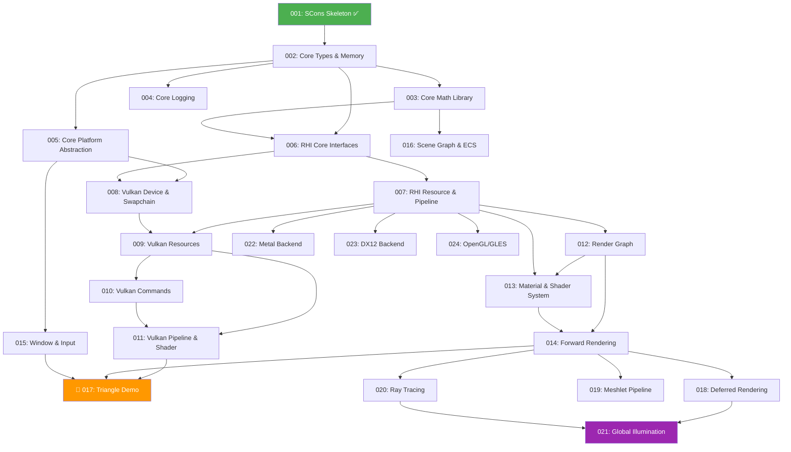

# Stoner Graphics Lab — Engine Development Roadmap

> **Version**: 1.2.1 | **Created**: 2026-04-21 | **Last Updated**: 2026-07-01 | **Status**: Active
> **Constitution**: v1.2.0 (comply with Section VII: Cross-Platform Compatibility)
> **Prerequisite**: [001-scons-project-skeleton](../specs/001-scons-project-skeleton/spec.md) ✅ Complete

---

## Table of Contents

1. [Overview](#overview)
2. [Architecture Principles](#architecture-principles)
3. [Phase Overview Table](#phase-overview-table)
4. [Dependency Graph](#dependency-graph)
5. [Phase Details](#phase-details)
   - [Phase 002 — Core Foundation: Types & Memory](#phase-002--core-foundation-types--memory)
   - [Phase 003 — Core Foundation: Math Library](#phase-003--core-foundation-math-library)
   - [Phase 004 — Core Foundation: Logging & Assertions](#phase-004--core-foundation-logging--assertions)
   - [Phase 005 — Core Foundation: Platform Abstraction Layer](#phase-005--core-foundation-platform-abstraction-layer)
   - [Phase 006 — RHI: Core Interfaces](#phase-006--rhi-core-interfaces)
   - [Phase 007 — RHI: Resource & Pipeline Interfaces](#phase-007--rhi-resource--pipeline-interfaces)
   - [Phase 008 — Backend: Vulkan Device & Swapchain](#phase-008--backend-vulkan-device--swapchain)
   - [Phase 009 — Backend: Vulkan Resource Management](#phase-009--backend-vulkan-resource-management)
   - [Phase 010 — Backend: Vulkan Command Recording & Submission](#phase-010--backend-vulkan-command-recording--submission)
   - [Phase 011 — Backend: Vulkan Pipeline & Shader](#phase-011--backend-vulkan-pipeline--shader)
   - [Phase 012 — Renderer: Render Graph Foundation](#phase-012--renderer-render-graph-foundation)
   - [Phase 013 — Renderer: Material & Shader System](#phase-013--renderer-material--shader-system)
   - [Phase 014 — Renderer: Forward Rendering Pipeline](#phase-014--renderer-forward-rendering-pipeline)
   - [Phase 015 — Application: Window & Input System](#phase-015--application-window--input-system)
   - [Phase 016 — Application: Scene Graph & ECS Foundation](#phase-016--application-scene-graph--ecs-foundation)
   - [Phase 017 — Application: Triangle Demo (Integration Milestone)](#phase-017--application-triangle-demo-integration-milestone)
   - [Phase 018 — Renderer: Deferred Rendering Pipeline](#phase-018--renderer-deferred-rendering-pipeline)
   - [Phase 019 — Renderer: Meshlet Pipeline (Nanite-like)](#phase-019--renderer-meshlet-pipeline-nanite-like)
   - [Phase 020 — Renderer: Ray Tracing Integration](#phase-020--renderer-ray-tracing-integration)
   - [Phase 021 — Renderer: Global Illumination (Lumen-like)](#phase-021--renderer-global-illumination-lumen-like)
   - [Phase 022 — Backend: Metal Implementation](#phase-022--backend-metal-implementation)
   - [Phase 023 — Backend: DX12 Implementation](#phase-023--backend-dx12-implementation)
   - [Phase 024 — Backend: OpenGL/GLES Compatibility Layer](#phase-024--backend-openglgles-compatibility-layer)
6. [Parallel Development Tracks](#parallel-development-tracks)
7. [Risk Register](#risk-register)
8. [How to Use This Roadmap](#how-to-use-this-roadmap)

---

## Overview

Stoner Graphics Lab is a cross-platform graphics engine built in modern C++20 with a strict 5-layer architecture. The SCons build skeleton is complete (Phase 001). This roadmap defines the **next 23 development phases** that transform the skeleton into a functional, advanced graphics engine.

### Design Philosophy

- **Bottom-up construction**: Build from Core upward, never skip layers
- **Spec-driven development**: Every phase = one `/speckit.specify` cycle
- **Incremental value**: Each phase produces testable, demonstrable output
- **Agent-friendly**: Each phase is self-contained with clear inputs/outputs

### Roadmap-Wide Technology Decisions

- **Learning-oriented core**: Implement foundational systems such as types, containers, memory, math, and logging in this repository instead of wrapping broad third-party libraries.
- **Traditional C++20 headers/sources**: Use C++20 language features, but do not use C++20 Modules because cross-compiler and SCons support remains immature.
- **Vulkan-first rendering path**: Build the first real backend on Vulkan, then add native Metal, DX12, and OpenGL/GLES backends as separate RHI implementations.
- **Render Graph terminology**: Use "Render Graph" and `FRenderGraph` as the canonical dependency-management system for render passes and resources.
- **GLFW first, native later**: Use GLFW for the initial window/input phase to reach the first-triangle milestone quickly, then add native Win32/Cocoa/X11-Wayland window implementations behind the same abstraction in a later phase.

### Current State (Post Phase 013)

| Layer | Status | Content |
|-------|--------|---------|
| Core | ✅ Done | Types, memory, math, logging, assertions, platform abstraction all implemented |
| RHI | 🔷 Interface Complete | Core interfaces (006) and Resource & Pipeline interfaces (007) defined as pure virtual; implementations live in backends |
| Backend/Vulkan | ✅ Done | Device, swapchain, resources, commands, shader modules, graphics/compute pipelines, command binding, and process-local pipeline reuse implemented |
| Backend/Others | ⚪ Placeholder | `.gitkeep` files only |
| Renderer | ✅ Material & Shader System Done | Backend-agnostic render graph plus material definitions, material instances, shader library records, deterministic permutations, resource requirement summaries, diagnostics, and text dumps |
| Application | 🟡 Skeleton | Empty namespace, includes Renderer |
| Tests | ✅ Done | Core tests, RHI contract tests, Renderer render graph/material tests, and Vulkan integration tests all pass |
| Build System | ✅ Complete | SCons with LayerBuilder, PlatformDetect, BuildConfig, Vulkan SDK detection |

> **🔷 Interface Complete** = Pure virtual interfaces and contracts defined; implementations exist in backends, but no mock-based RHI unit tests yet.

---

## Architecture Principles

These principles (from the [Constitution v1.2.0](../.specify/memory/constitution.md)) govern all development ordering:

```
┌─────────────────────────────────────────────────────────┐
│                     Application                         │
│         (Scene Graph, Input, Physics, Game Loop)        │
├─────────────────────────────────────────────────────────┤
│                      Renderer                           │
│   (Materials, Lighting, Render Passes, RT, Meshlets, GI)│
├─────────────────────────────────────────────────────────┤
│                        RHI                              │
│     (IDevice, ICommandBuffer, IBuffer, IPipeline)       │
├──────────────┬──────────────┬───────────────────────────┤
│   Vulkan     │    DX12      │   Metal / GL / GLES / WebGL│
│  (Backend)   │  (Backend)   │       (Backend)           │
├──────────────┴──────────────┴───────────────────────────┤
│                       Core                              │
│    (Math, Memory, Logging, Platform, Containers)        │
└─────────────────────────────────────────────────────────┘
```

**Key Rules**:
1. **Adjacent-only dependencies** — no skip-level includes
2. **RHI abstraction** — Application/Renderer never touch graphics API directly
3. **Strategy/Composite patterns** — no god-classes
4. **UE5-style naming** — `FVector3`, `IDevice`, `EPixelFormat`, `TArray<T>`
5. **Cross-platform** — Windows + macOS + Linux at minimum

---

## Phase Overview Table

| # | Phase Name | Layer | Dependencies | Complexity | Critical Path | Status |
|---|-----------|-------|-------------|-----------|--------------|--------|
| 002 | Core: Types & Memory | Core | 001 | M | ✅ Yes | ✅ Done |
| 003 | Core: Math Library | Core | 002 | L | ✅ Yes | ✅ Done |
| 004 | Core: Logging & Assertions | Core | 002 | S | ❌ No | ✅ Done |
| 005 | Core: Platform Abstraction | Core | 002 | M | ✅ Yes | ✅ Done |
| 006 | RHI: Core Interfaces | RHI | 002, 003 | L | ✅ Yes | 🔷 Interface Complete |
| 007 | RHI: Resource & Pipeline | RHI | 006 | L | ✅ Yes | 🔷 Interface Complete |
| 008 | Vulkan: Device & Swapchain | Backend | 005, 006 | L | ✅ Yes | ✅ Done |
| 009 | Vulkan: Resource Management | Backend | 007, 008 | L | ✅ Yes | ✅ Done |
| 010 | Vulkan: Commands & Submission | Backend | 009 | M | ✅ Yes | ✅ Done |
| 011 | Vulkan: Pipeline & Shader | Backend | 009, 010 | L | ✅ Yes | ✅ Done |
| 012 | Render Graph Foundation | Renderer | 007 | XL | ✅ Yes | ✅ Done |
| 013 | Material & Shader System | Renderer | 007, 012 | L | ✅ Yes | ✅ Done |
| 014 | Forward Rendering Pipeline | Renderer | 012, 013 | L | ✅ Yes | ⬜ Todo |
| 015 | Window & Input System | Application | 005 | M | ✅ Yes | ⬜ Todo |
| 016 | Scene Graph & ECS | Application | 003 | L | ❌ No | ⬜ Todo |
| 017 | 🎯 Triangle Demo | Application | 011, 014, 015 | M | ✅ Yes | ⬜ Todo |
| 018 | Deferred Rendering | Renderer | 014 | L | ❌ No | ⬜ Todo |
| 019 | Meshlet Pipeline | Renderer | 014 | XL | ❌ No | ⬜ Todo |
| 020 | Ray Tracing Integration | Renderer | 014 | XL | ❌ No | ⬜ Todo |
| 021 | Global Illumination | Renderer | 018, 020 | XL | ❌ No | ⬜ Todo |
| 022 | Metal Backend | Backend | 007 | L | ❌ No | ⬜ Todo |
| 023 | DX12 Backend | Backend | 007 | L | ❌ No | ⬜ Todo |
| 024 | OpenGL/GLES Compatibility | Backend | 007 | L | ❌ No | ⬜ Todo |

**Complexity Legend**: S = ~1-2 days | M = ~3-5 days | L = ~1-2 weeks | XL = ~2-4 weeks

---

## Dependency Graph



---

## Phase Details

---

### Phase 002 — Core Foundation: Types & Memory

**Layer**: Core  
**Dependencies**: 001 (SCons Skeleton)  
**Complexity**: M (3-5 days)  
**Critical Path**: ✅ Yes — everything depends on Core types

#### Scope

Establish the foundational type system and memory management primitives that all other layers will use. This includes fixed-width integer types, string types, smart pointers, custom allocators, and basic container type aliases.

#### Key Deliverables

- `FPlatformTypes.h` — Fixed-width integer typedefs (`int8`, `uint32`, `int64`, etc.)
- `FString.h` — Engine string type (wrapping or extending `std::string`)
- `FName.h` — Hashed immutable name type for fast comparison (like UE5 `FName`)
- `TSharedPtr<T>`, `TUniquePtr<T>` — Smart pointer aliases/wrappers
- `FMemory.h` — Memory allocation/deallocation utilities, aligned allocation
- `TArray<T>` — Dynamic array type alias (wrapping `std::vector` initially)
- `TMap<K,V>` — Map type alias
- Unit tests for all types

#### What's Excluded

- Math types (Phase 003)
- Logging (Phase 004)
- Platform-specific file I/O (Phase 005)

#### Speckit Prompt

```
Core foundation types and memory management: fixed-width integer types (FPlatformTypes), engine string type (FString), hashed name type (FName), smart pointer wrappers (TSharedPtr, TUniquePtr), memory utilities (FMemory with aligned allocation), and container aliases (TArray, TMap). All types follow UE5 naming conventions. Must be cross-platform (Win/Mac/Linux) and include unit tests.
```

---

### Phase 003 — Core Foundation: Math Library

**Layer**: Core  
**Dependencies**: 002 (Types & Memory)  
**Complexity**: L (1-2 weeks)  
**Critical Path**: ✅ Yes — RHI and Renderer need math types

#### Scope

Implement the core math library with vector, matrix, quaternion, and transform types. These are the fundamental building blocks for all spatial computation in the engine.

#### Key Deliverables

- `FVector2`, `FVector3`, `FVector4` — Float vector types with operator overloads
- `FMatrix4x4` — 4×4 matrix with standard operations (multiply, inverse, transpose)
- `FQuat` — Quaternion type for rotations
- `FTransform` — Combined position/rotation/scale
- `FMath` — Static math utilities (Clamp, Lerp, Sin, Cos, DegToRad, etc.)
- `FColor` — RGBA color type (both float and uint8 variants)
- `FBox`, `FSphere`, `FPlane` — Basic geometric primitives
- SIMD optimization hooks (can be naive implementation initially, with SIMD path planned)
- Unit tests with edge cases (near-zero, NaN, identity transforms)

#### What's Excluded

- Spatial data structures (BVH, octree) — deferred to Renderer phases
- Physics-specific math (inertia tensors, etc.)

#### Speckit Prompt

```
Core math library for the graphics engine: FVector2/3/4, FMatrix4x4, FQuat, FTransform, FMath utilities, FColor (float and uint8), and basic geometric primitives (FBox, FSphere, FPlane). UE5 naming conventions. Cross-platform. SIMD-ready design (naive implementation first). Comprehensive unit tests including edge cases.
```

---

### Phase 004 — Core Foundation: Logging & Assertions

**Layer**: Core  
**Dependencies**: 002 (Types & Memory)  
**Complexity**: S (1-2 days)  
**Critical Path**: ❌ No — useful but not blocking

#### Scope

Implement a structured logging system and assertion macros. This provides diagnostic infrastructure for all subsequent development.

#### Key Deliverables

- `FLog` — Logging system with severity levels (Verbose, Info, Warning, Error, Fatal)
- `SG_LOG(Category, Level, Format, ...)` — Printf-style logging macro
- `SG_CHECK(Expr)` — Runtime assertion (active in Debug, stripped in Release)
- `SG_VERIFY(Expr)` — Assertion that always evaluates the expression
- `SG_CHECKF(Expr, Format, ...)` — Assertion with formatted message
- Category-based filtering (e.g., `LogCore`, `LogRHI`, `LogRenderer`)
- Console output sink (file sink deferred)
- Unit tests

#### What's Excluded

- File-based log sinks (future enhancement)
- Remote/network logging
- Profiling/timing (separate future phase)

#### Speckit Prompt

```
Core logging and assertion system: FLog with severity levels (Verbose/Info/Warning/Error/Fatal), SG_LOG macro with category and printf-style formatting, SG_CHECK/SG_VERIFY/SG_CHECKF assertion macros, category-based filtering. Console output sink. UE5 naming style. Cross-platform. Unit tests.
```

---

### Phase 005 — Core Foundation: Platform Abstraction Layer

**Layer**: Core  
**Dependencies**: 002 (Types & Memory)  
**Complexity**: M (3-5 days)  
**Critical Path**: ✅ Yes — Vulkan backend and Window system need this

#### Scope

Create the platform abstraction layer (PAL) that isolates OS-specific functionality behind cross-platform interfaces. This covers dynamic library loading, file system access, and platform window handle types.

#### Key Deliverables

- `FPlatformProcess` — Dynamic library loading (LoadLibrary, GetSymbol, FreeLibrary)
- `FPlatformFileSystem` — Basic file operations (Read, Write, Exists, CreateDirectory)
- `FPlatformMisc` — Platform info queries (OS name, CPU cores, available memory)
- `FPlatformWindow` — Native window handle type abstraction (`HWND`, `NSWindow*`, `Window`)
- `FPlatformTime` — High-resolution timer (QueryPerformanceCounter / clock_gettime / mach_absolute_time)
- Conditional compilation guards (`#if SG_PLATFORM_WINDOWS`, etc.)
- Platform detection macros (`SG_PLATFORM_WINDOWS`, `SG_PLATFORM_MAC`, `SG_PLATFORM_LINUX`)
- Unit tests (platform-conditional where needed)

#### What's Excluded

- Threading/concurrency primitives (future phase)
- Networking
- Full windowing system (Phase 015 — uses GLFW or similar)

#### Speckit Prompt

```
Core platform abstraction layer: FPlatformProcess (dynamic library loading), FPlatformFileSystem (basic file I/O), FPlatformMisc (OS info queries), FPlatformWindow (native handle types), FPlatformTime (high-res timer). Platform detection macros (SG_PLATFORM_WINDOWS/MAC/LINUX). Conditional compilation. UE5 naming. Cross-platform Win/Mac/Linux. Unit tests.
```

---

### Phase 006 — RHI: Core Interfaces

**Layer**: RHI  
**Dependencies**: 002 (Types), 003 (Math)  
**Complexity**: L (1-2 weeks)  
**Critical Path**: ✅ Yes — all backends and renderer depend on RHI

#### Scope

Define the abstract RHI (Render Hardware Interface) core interfaces. These are pure virtual classes that backends will implement. This phase focuses on device lifecycle, command buffers, and synchronization primitives.

#### Key Deliverables

- `IRHIDevice` — Abstract device interface (Create, Destroy, GetCapabilities)
- `IRHICommandBuffer` — Command recording interface (Begin, End, Draw, Dispatch, Barriers)
- `IRHICommandQueue` — Queue submission interface (Submit, WaitIdle)
- `IRHIFence` — CPU-GPU synchronization primitive
- `IRHISemaphore` — GPU-GPU synchronization primitive
- `IRHISwapchain` — Swapchain interface (AcquireNextImage, Present, Resize)
- `ERHIFormat` — Pixel/vertex format enumeration (R8G8B8A8_UNORM, D32_FLOAT, etc.)
- `FRHIDeviceCapabilities` — Struct describing device features and limits
- `ERHIQueueType` — Graphics, Compute, Transfer, Present queue types
- **Unit tests**: Contract/interface tests exist; mock-based RHI implementations are deferred to a future phase (backends provide real implementations)

> **Status Note**: This phase is marked 🔷 **Interface Complete** — all pure virtual interfaces are defined and implemented by the Vulkan backend. Mock-based unit tests with fake RHI implementations are not yet written.

#### What's Excluded

- Resource types (buffers, textures) — Phase 007
- Pipeline state objects — Phase 007
- Any actual graphics API calls — Backend phases

#### Speckit Prompt

```
RHI core interfaces: IRHIDevice (lifecycle, capabilities), IRHICommandBuffer (recording: Begin/End/Draw/Dispatch/Barriers), IRHICommandQueue (Submit/WaitIdle), IRHIFence, IRHISemaphore, IRHISwapchain (AcquireNextImage/Present/Resize), ERHIFormat enum, FRHIDeviceCapabilities, ERHIQueueType. Pure virtual interfaces. UE5 naming with I-prefix for interfaces, E-prefix for enums, F-prefix for structs. Cross-platform. Mock-based unit tests.
```

---

### Phase 007 — RHI: Resource & Pipeline Interfaces

**Layer**: RHI  
**Dependencies**: 006 (RHI Core)  
**Complexity**: L (1-2 weeks)  
**Critical Path**: ✅ Yes — backends and renderer need resource types

#### Scope

Define RHI interfaces for GPU resources (buffers, textures, samplers) and pipeline state objects (graphics pipeline, compute pipeline, shader modules). This completes the RHI abstraction layer.

#### Key Deliverables

- `IRHIBuffer` — GPU buffer interface (vertex, index, uniform, storage)
- `IRHITexture` — Texture interface (1D, 2D, 3D, Cube, Array)
- `IRHISampler` — Texture sampler interface
- `IRHIShaderModule` — Compiled shader interface
- `IRHIGraphicsPipeline` — Graphics pipeline state (vertex input, rasterizer, blend, depth-stencil)
- `IRHIComputePipeline` — Compute pipeline state
- `IRHIPipelineLayout` — Descriptor/resource binding layout
- `IRHIDescriptorSet` — Resource binding set
- `IRHIRenderPass` — Render pass description (attachments, subpasses)
- `IRHIFramebuffer` — Framebuffer binding
- `FRHIBufferDesc`, `FRHITextureDesc`, `FRHIPipelineDesc` — Creation descriptor structs
- `ERHIBufferUsage`, `ERHITextureUsage`, `ERHIShaderStage` — Usage flag enums
- **Unit tests**: Contract/interface tests exist; mock-based RHI implementations are deferred to a future phase

> **Status Note**: This phase is marked 🔷 **Interface Complete** — all pure virtual interfaces are defined and implemented by the Vulkan backend. Mock-based unit tests with fake RHI implementations are not yet written.

#### What's Excluded

- Ray tracing pipeline interfaces (Phase 020)
- Mesh shader pipeline interfaces (Phase 019)

#### Speckit Prompt

```
RHI resource and pipeline interfaces: IRHIBuffer (vertex/index/uniform/storage), IRHITexture (1D/2D/3D/Cube/Array), IRHISampler, IRHIShaderModule, IRHIGraphicsPipeline, IRHIComputePipeline, IRHIPipelineLayout, IRHIDescriptorSet, IRHIRenderPass, IRHIFramebuffer. Creation descriptor structs (FRHIBufferDesc, FRHITextureDesc, FRHIPipelineDesc). Usage enums (ERHIBufferUsage, ERHITextureUsage, ERHIShaderStage). UE5 naming. Mock-based unit tests.
```

---

### Phase 008 — Backend: Vulkan Device & Swapchain

**Layer**: Backend  
**Dependencies**: 005 (Platform Abstraction), 006 (RHI Core Interfaces)  
**Complexity**: L (1-2 weeks)  
**Critical Path**: ✅ Yes — first real graphics API integration

#### Scope

Implement the Vulkan backend's device initialization, physical device selection, logical device creation, queue exposure, synchronization objects, Core platform-window-backed surface validation, and swapchain lifecycle. The delivered implementation keeps Vulkan SDK use behind build-time detection and provides deterministic supported-stub or explicit unsupported behavior.

#### Key Deliverables

- `FVulkanInstance` — backend runtime initialization with optional validation diagnostics and explicit unsupported fallback
- `FVulkanPhysicalDevice` — deterministic synthetic/real-adapter-ready capability gate and scoring model
- `FVulkanDevice` — `IRHIDevice` implementation for lifecycle, capabilities, queue/sync/swapchain factories, and unsupported out-of-scope factories
- `FVulkanQueue` — `IRHICommandQueue` implementation for queue metadata, wait-idle, and explicit command submission rejection until command recording exists
- `FVulkanSurface` — Core `FPlatformWindow` wrapper validation and presentation-skip diagnostics
- `FVulkanSwapchain` — `IRHISwapchain` frame count, acquire/present, resize-required, unavailable, recreate, and invalidation behavior
- `FVulkanFence`, `FVulkanSemaphore` — synchronization contracts with invalid-state handling after shutdown
- Vulkan SDK detection macro in SCons with compile-safe fallback when SDK headers are absent
- Integration tests for initialization, adapter selection, queues, surface/swapchain, sync objects, unsupported paths, and repeated shutdown

#### What's Excluded

- Buffer/texture creation (Phase 009)
- Command buffer recording (Phase 010)
- Pipeline creation (Phase 011)

#### Speckit Prompt

```
Vulkan backend device and swapchain: FVulkanInstance (validation layers, extensions), FVulkanPhysicalDevice (enumeration, discrete GPU selection), FVulkanDevice implementing IRHIDevice, FVulkanQueue implementing IRHICommandQueue, FVulkanSwapchain implementing IRHISwapchain, FVulkanSurface (Win32/macOS-MoltenVK/X11), FVulkanFence/Semaphore. Vulkan SDK integration in SCons. Validation layers in debug. Integration tests. UE5 naming.
```

---

### Phase 009 — Backend: Vulkan Resource Management

**Layer**: Backend  
**Dependencies**: 007 (RHI Resources), 008 (Vulkan Device)  
**Complexity**: L (1-2 weeks)  
**Critical Path**: ✅ Yes — rendering requires GPU resources

#### Scope

Implement Vulkan resource creation and management: buffers, textures, samplers, and memory allocation. Integrate VMA (Vulkan Memory Allocator) or implement a basic memory allocator.

#### Key Deliverables

- `FVulkanBuffer` — Buffer creation implementing `IRHIBuffer` (vertex, index, uniform, storage)
- `FVulkanTexture` — Texture/image creation implementing `IRHITexture`
- `FVulkanSampler` — Sampler creation implementing `IRHISampler`
- `FVulkanMemoryAllocator` — GPU memory allocation (VMA integration or custom sub-allocator)
- `FVulkanDescriptorPool` — Descriptor pool management
- `FVulkanDescriptorSet` — Descriptor set allocation implementing `IRHIDescriptorSet`
- Staging buffer upload utilities (CPU → GPU transfer)
- Integration tests (create buffers, upload data, verify)

#### What's Excluded

- Command buffer recording (Phase 010)
- Pipeline/shader compilation (Phase 011)

#### Speckit Prompt

```
Vulkan resource management: FVulkanBuffer implementing IRHIBuffer, FVulkanTexture implementing IRHITexture, FVulkanSampler implementing IRHISampler, FVulkanMemoryAllocator (VMA integration or custom), FVulkanDescriptorPool, FVulkanDescriptorSet. Staging buffer upload utilities. Integration tests. UE5 naming. Cross-platform.
```

---

### Phase 010 — Backend: Vulkan Command Recording & Submission

**Layer**: Backend  
**Dependencies**: 009 (Vulkan Resources)  
**Complexity**: M (3-5 days)  
**Critical Path**: ✅ Yes — rendering requires command submission

#### Scope

Implement Vulkan command buffer allocation, recording, and queue submission. This enables the engine to actually issue GPU commands.

#### Key Deliverables

- ✅ `FVulkanCommandPool` — Command pool per queue family with deterministic capacity validation
- ✅ `FVulkanCommandBuffer` — Command buffer implementing `IRHICommandBuffer`
  - Begin/End recording
  - Draw/DrawIndexed commands
  - Dispatch compute commands
  - Pipeline barriers and layout transitions
  - Copy buffer/image commands
  - Begin/End render pass
- ✅ `FVulkanQueue` — Enhanced queue submission with deterministic fallback completion, semaphore consumption/signaling, and fence signaling
- ✅ Command buffer recycling/reset strategy after queue idle or completion observation
- ✅ Minimal Vulkan backend render pass/framebuffer objects for single-subpass command scope
- ✅ Upload scheduling from pending staging records without claiming GPU execution
- ✅ Integration tests for allocation, recording, submission, completion injection, render pass/framebuffer validation, upload scheduling, and shutdown invalidation

#### Implementation Notes

- Spec-kit artifact: [`specs/011-vulkan-commands-submission`](../specs/011-vulkan-commands-submission/spec.md)
- Summary document: [`doc/011-vulkan-commands-submission.html`](./011-vulkan-commands-submission.html)
- Verification: `conda run -n godot scons` and `Build/Mac/Debug/Tests/StonerTest`

#### What's Excluded

- Pipeline state object (PSO) creation and shader module loading — Phase 011
- Descriptor set layout and pipeline layout creation — *Infrastructure already in place via Phase 009 (`FVulkanPipelineLayout`, `FVulkanDescriptorPool`, `FVulkanDescriptorSet`)*
- Multi-threaded command recording (future optimization)

#### Speckit Prompt

```
Vulkan command recording and submission: FVulkanCommandPool, FVulkanCommandBuffer implementing IRHICommandBuffer (Begin/End, Draw/DrawIndexed, Dispatch, Barriers, Copy, BeginRenderPass/EndRenderPass), enhanced FVulkanCommandQueue with fence signaling, command buffer recycling. Integration tests. UE5 naming.
```

---

### Phase 011 — Backend: Vulkan Pipeline & Shader

**Layer**: Backend  
**Dependencies**: 009 (Vulkan Resources), 010 (Vulkan Commands)  
**Complexity**: L (1-2 weeks)  
**Critical Path**: ✅ Yes — rendering requires pipelines

#### Scope

Implement Vulkan graphics/compute pipeline creation and shader module loading. This is the final Vulkan backend phase needed for basic rendering.

#### Key Deliverables

- ✅ `FVulkanShaderModule` — structurally validated SPIR-V-like shader payloads implementing `IRHIShaderModule`
- ✅ Explicit shader interface metadata and layout compatibility validation
- ✅ `FVulkanGraphicsPipeline` — triangle-ready graphics pipeline implementing `IRHIGraphicsPipeline`
  - Vertex input state
  - Input assembly
  - Rasterization state
  - Multisampling
  - Depth-stencil state
  - Color blend state
  - Dynamic state
- ✅ `FVulkanComputePipeline` — compute pipeline implementing `IRHIComputePipeline`
- ✅ `FVulkanPipelineLayout` — descriptor binding plus small constant-data range compatibility
- ✅ `FVulkanPipelineCache` — deterministic process-local graphics/compute reuse records
- ✅ Command buffer graphics/compute pipeline binding and draw/dispatch diagnostics
- ✅ Runtime-unavailable fallback diagnostics for shader, pipeline, bind, draw, and dispatch paths
- ✅ Integration tests for creation success/failure, configured failure limits, reuse, binding, draw/dispatch diagnostics, and shutdown invalidation

#### What's Excluded

- Ray tracing pipeline (Phase 020)
- Mesh shader pipeline (Phase 019)
- Shader compilation from HLSL/GLSL (use pre-compiled SPIR-V)

#### Implementation Notes

- Spec-kit artifact: [`specs/012-vulkan-pipeline-shader`](../specs/012-vulkan-pipeline-shader/spec.md)
- Summary document: [`doc/012-vulkan-pipeline-shader.html`](./012-vulkan-pipeline-shader.html)
- Verification: `conda run -n godot scons` and `Build/Mac/Debug/Tests/StonerTest`

#### Speckit Prompt

```
Vulkan pipeline and shader: FVulkanShaderModule (SPIR-V loading), FVulkanGraphicsPipeline (full state: vertex input, rasterization, depth-stencil, blend, dynamic state), FVulkanComputePipeline, FVulkanPipelineLayout, FVulkanRenderPass, FVulkanFramebuffer. Pipeline cache. Integration tests including draw-a-triangle validation. UE5 naming.
```

---

### Phase 012 — Renderer: Render Graph Foundation

**Layer**: Renderer  
**Dependencies**: 007 (RHI Resource & Pipeline Interfaces)  
**Complexity**: XL (2-4 weeks)  
**Critical Path**: ✅ Yes — all rendering pipelines use the render graph

#### Scope

Implement a render graph system that manages render pass ordering, resource lifetime, and automatic barrier insertion. This is the backbone of the rendering architecture.

#### Key Deliverables

- `FRenderGraph` — Directed acyclic graph of render passes
- `FRenderGraphPass` — Individual render pass node (graphics or compute)
- `FRenderGraphResource` — Virtual resource handle (resolved to real resources at execution)
- `FRenderGraphBuilder` — Builder API for declaring passes and their resource dependencies
- Automatic resource lifetime tracking and aliasing
- Automatic barrier/transition insertion between passes
- Pass culling (remove unused passes)
- Graph compilation and execution against RHI interfaces
- Visualization/debug dump of the graph (text-based)
- Unit tests with mock RHI

#### Implementation Notes

- Spec-kit artifact: [`specs/013-render-graph-foundation`](../specs/013-render-graph-foundation/spec.md)
- Summary document: [`doc/013-render-graph-foundation.html`](./013-render-graph-foundation.html)
- Verification: `conda run -n godot scons`, `Build/Mac/Debug/Tests/StonerTest`, and the Renderer backend-boundary grep passed on 2026-07-01.
- Scope note: Speckit directory number is `013` because repository feature directories already occupied numbers through `012`; this implements roadmap Phase 012.

#### What's Excluded

- Specific render passes (forward, deferred) — Phases 014, 018
- Async compute scheduling (future optimization)

#### Speckit Prompt

```
Render graph foundation: FRenderGraph (DAG of passes), FRenderGraphPass (graphics/compute), FRenderGraphResource (virtual handles), FRenderGraphBuilder (declare passes and dependencies), automatic resource lifetime and aliasing, automatic barrier insertion, pass culling, graph compilation and execution via RHI interfaces, debug visualization. Unit tests with mock RHI. UE5 naming.
```

---

### Phase 013 — Renderer: Material & Shader System

**Layer**: Renderer  
**Dependencies**: 007 (RHI Resource & Pipeline), 012 (Render Graph)  
**Complexity**: L (1-2 weeks)  
**Critical Path**: ✅ Yes — rendering needs materials

#### Scope

Implement the material and shader management system. Materials define how surfaces are rendered; the shader system manages shader permutations and parameter binding.

#### Key Deliverables

- `FMaterial` — Material definition with shader reference, render state summary, domain, blend mode, default parameters, validation, invalidation, and deterministic dumps
- `FMaterialInstance` — Material or instance parent references, per-object overrides, nearest-override resolution, invalidated parent rejection, and deterministic inheritance cycle detection
- `FShaderLibrary` — Explicit in-memory registration of precompiled shader records, allowed permutation flags, variants, required parameter expectations, invalidation, diagnostics, and deterministic dumps
- `FShaderPermutation` — Deterministic feature-flag canonicalization and equality independent of input order
- `FMaterialParameterSet` — Typed parameter collection for scalar, vector, color, and abstract Renderer-level resource references
- `FMaterialResourceRequirement` — Stable abstract resource requirement summaries that can be consumed by render graph declaration code
- `FMaterialShaderBinding` — Deterministic material/instance-to-shader-variant resolution with required parameter validation
- Unit tests in `Tests/RendererMaterialShaderTests.cpp`

#### Implementation Notes

- Spec-kit artifact: [`specs/014-material-shader-system`](../specs/014-material-shader-system/spec.md)
- Summary document: [`doc/014-material-shader-system.html`](./014-material-shader-system.html)
- Verification: `conda run -n godot scons`, `Build/Mac/Debug/Tests/StonerTest`, and the Renderer material/backend-boundary grep passed on 2026-07-01.
- Scope note: Speckit directory number is `014` because `013-render-graph-foundation` already exists in `specs/`; this implements roadmap Phase 013.

#### What's Excluded

- Visual material editor
- Runtime shader compilation, shader source parsing, and local shader file scanning/loading
- PBR-specific material models (Phase 014)

#### Speckit Prompt

```
Material and shader system: FMaterial (shader ref, parameters, render state), FMaterialInstance (per-object overrides), FShaderLibrary (loading, caching, permutations), FShaderPermutation (feature flags), FMaterialParameterSet (scalars/vectors/textures), EMaterialDomain, EMaterialBlendMode. Integration with render graph. Unit tests. UE5 naming.
```

---

### Phase 014 — Renderer: Forward Rendering Pipeline

**Layer**: Renderer  
**Dependencies**: 012 (Render Graph), 013 (Material System)  
**Complexity**: L (1-2 weeks)  
**Critical Path**: ✅ Yes — first visible rendering output

#### Scope

Implement a basic forward rendering pipeline using the render graph. This produces the first real rendered output — geometry with lighting and materials.

#### Key Deliverables

- `FForwardRenderer` — Forward rendering pipeline implementation
- Depth pre-pass
- Opaque geometry pass (with basic PBR: Metallic-Roughness model)
- Directional light support
- Point light support (up to N lights)
- Sky/environment pass (simple gradient or cubemap)
- Transparent geometry pass (sorted back-to-front)
- `FMeshDrawCommand` — Cached draw command for efficient submission
- `FViewUniformBuffer` — Camera/view data (VP matrix, camera position, etc.)
- `FLightUniformBuffer` — Light data packing
- Basic SPIR-V shaders for PBR forward pass
- Integration tests with render graph

#### What's Excluded

- Shadow mapping (future enhancement to forward pipeline)
- Post-processing (future phase)
- Deferred rendering (Phase 018)

#### Speckit Prompt

```
Forward rendering pipeline: FForwardRenderer using render graph, depth pre-pass, opaque PBR pass (metallic-roughness), directional and point lights, sky pass, transparent pass (sorted), FMeshDrawCommand, FViewUniformBuffer, FLightUniformBuffer. Basic PBR SPIR-V shaders. Integration tests. UE5 naming.
```

---

### Phase 015 — Application: Window & Input System

**Layer**: Application  
**Dependencies**: 005 (Platform Abstraction)  
**Complexity**: M (3-5 days)  
**Critical Path**: ✅ Yes — rendering needs a window to present to

#### Scope

Implement window creation and input handling. This provides the surface for rendering output and captures user input events.

#### Key Deliverables

- `FWindow` — Window creation and management (title, size, fullscreen toggle)
- `FInputManager` — Input event polling and dispatch
- `EKey`, `EMouseButton` — Input enumeration types
- `FInputState` — Current frame input state (key states, mouse position, mouse delta)
- Window resize event handling (triggers swapchain recreation)
- Window close event handling
- GLFW integration (via ThirdParty) or native platform windowing
- Game loop skeleton (`while (!ShouldClose) { PollInput(); Update(); Render(); Present(); }`)
- Integration tests (open window, capture input, close)

#### What's Excluded

- Gamepad/controller input (future enhancement)
- Multi-window support
- ImGui integration (future debug UI phase)

#### Speckit Prompt

```
Window and input system: FWindow (creation, resize, fullscreen, close), FInputManager (polling, dispatch), EKey/EMouseButton enums, FInputState (keys, mouse position/delta), window resize/close events, GLFW integration via ThirdParty, game loop skeleton. Integration tests. UE5 naming. Cross-platform.
```

---

### Phase 016 — Application: Scene Graph & ECS Foundation

**Layer**: Application  
**Dependencies**: 003 (Math Library)  
**Complexity**: L (1-2 weeks)  
**Critical Path**: ❌ No — Triangle demo can use hardcoded geometry

#### Scope

Implement a basic Entity-Component-System (ECS) architecture and scene graph for organizing game objects and their spatial relationships.

#### Key Deliverables

- `FWorld` — Top-level container for all entities
- `FEntity` — Lightweight entity handle (ID-based)
- `FComponent` — Base component type
- `FTransformComponent` — Position/rotation/scale component
- `FMeshComponent` — Static mesh reference component
- `FLightComponent` — Light parameters component (type, color, intensity, range)
- `FCameraComponent` — Camera parameters (FOV, near/far, projection type)
- `FSystem` — Base system type for processing component groups
- `FRenderSystem` — Collects renderable entities for the renderer
- Parent-child transform hierarchy
- Unit tests

#### What's Excluded

- Physics components
- Animation components
- Scripting/behavior components
- Full ECS query system (archetype-based optimization deferred)

#### Speckit Prompt

```
Scene graph and ECS foundation: FWorld (entity container), FEntity (ID handle), FComponent base, FTransformComponent, FMeshComponent, FLightComponent, FCameraComponent, FSystem base, FRenderSystem (collect renderables), parent-child transform hierarchy. Unit tests. UE5 naming.
```

---

### Phase 017 — Application: Triangle Demo (Integration Milestone)

**Layer**: Application  
**Dependencies**: 011 (Vulkan Pipeline), 014 (Forward Rendering), 015 (Window & Input)  
**Complexity**: M (3-5 days)  
**Critical Path**: ✅ Yes — first end-to-end validation

#### Scope

🎯 **MILESTONE**: Create a complete demo application that opens a window and renders a colored triangle using the full engine stack. This validates the entire pipeline from Application through Renderer, RHI, to Vulkan backend.

#### Key Deliverables

- `StonerDemo` executable target in SCons
- Window creation via `FWindow`
- Vulkan device/swapchain initialization via RHI
- Vertex buffer with triangle data uploaded via RHI
- Basic vertex/fragment shaders (SPIR-V)
- Forward render pass via render graph
- Frame loop: acquire → record → submit → present
- Clean shutdown (all resources destroyed, no validation errors)
- Runs on Windows, macOS (MoltenVK), and Linux
- Screenshot comparison test (optional)

#### What's Excluded

- Complex geometry
- Lighting (just vertex colors)
- Scene graph usage (hardcoded triangle)

#### Speckit Prompt

```
Triangle demo integration milestone: StonerDemo executable, window creation (FWindow), Vulkan init via RHI, vertex buffer with colored triangle, basic SPIR-V shaders, forward render pass via render graph, frame loop (acquire/record/submit/present), clean shutdown with zero validation errors. Cross-platform (Win/Mac-MoltenVK/Linux). UE5 naming.
```

---

### Phase 018 — Renderer: Deferred Rendering Pipeline

**Layer**: Renderer  
**Dependencies**: 014 (Forward Rendering)  
**Complexity**: L (1-2 weeks)  
**Critical Path**: ❌ No — forward rendering is sufficient for many use cases

#### Scope

Implement a deferred rendering pipeline as an alternative to forward rendering. Deferred rendering enables efficient many-light scenarios and is a prerequisite for advanced GI techniques.

#### Key Deliverables

- `FDeferredRenderer` — Deferred rendering pipeline
- G-Buffer pass (albedo, normal, metallic-roughness, depth)
- Lighting pass (screen-space, processes all lights)
- Light volume rendering for point/spot lights
- G-Buffer format specification and optimization
- Composition pass (combine lighting with albedo)
- Integration with render graph
- Performance comparison with forward renderer
- Integration tests

#### What's Excluded

- Tiled/clustered deferred (future optimization)
- SSAO, SSR (future post-processing phases)

#### Speckit Prompt

```
Deferred rendering pipeline: FDeferredRenderer, G-Buffer pass (albedo/normal/metallic-roughness/depth), screen-space lighting pass, light volumes for point/spot lights, composition pass. Render graph integration. Performance comparison with forward renderer. Integration tests. UE5 naming.
```

---

### Phase 019 — Renderer: Meshlet Pipeline (Nanite-like)

**Layer**: Renderer  
**Dependencies**: 014 (Forward Rendering)  
**Complexity**: XL (2-4 weeks)  
**Critical Path**: ❌ No — advanced feature

#### Scope

Implement a meshlet-based rendering pipeline inspired by UE5's Nanite. This enables rendering of extremely high-polygon geometry through GPU-driven mesh processing.

#### Key Deliverables

- `FMeshletData` — Meshlet data structure (vertex indices, primitive indices, bounds)
- `FMeshletBuilder` — Offline meshlet generation from triangle meshes
- `FMeshletRenderer` — GPU-driven meshlet rendering pipeline
- Meshlet culling (frustum, occlusion via HZB)
- LOD selection per meshlet cluster
- Mesh shader path (if hardware supports) or compute-based fallback
- Integration with render graph
- Performance benchmarks
- Unit and integration tests

#### What's Excluded

- Streaming/virtual geometry (Nanite's full streaming system)
- Software rasterization fallback

#### Speckit Prompt

```
Meshlet rendering pipeline (Nanite-like): FMeshletData structure, FMeshletBuilder (offline generation), FMeshletRenderer (GPU-driven), meshlet culling (frustum + HZB occlusion), LOD selection, mesh shader path with compute fallback. Render graph integration. Performance benchmarks. Unit tests. UE5 naming.
```

---

### Phase 020 — Renderer: Ray Tracing Integration

**Layer**: Renderer  
**Dependencies**: 014 (Forward Rendering)  
**Complexity**: XL (2-4 weeks)  
**Critical Path**: ❌ No — advanced feature

#### Scope

Integrate hardware ray tracing capabilities. This adds acceleration structure management and ray tracing pipeline support for effects like reflections, shadows, and ambient occlusion.

#### Key Deliverables

- `IRHIAccelerationStructure` — RHI interface for BLAS/TLAS (added to RHI layer)
- `IRHIRayTracingPipeline` — Ray tracing pipeline interface (added to RHI layer)
- `FVulkanAccelerationStructure` — Vulkan RT acceleration structure
- `FVulkanRayTracingPipeline` — Vulkan RT pipeline
- `FRayTracingScene` — Scene-level TLAS management
- `FRTReflections` — Ray traced reflections render pass
- `FRTShadows` — Ray traced shadows render pass
- `FRTAmbientOcclusion` — Ray traced AO render pass
- Shader Binding Table (SBT) management
- Integration with render graph
- Fallback path when RT hardware is unavailable
- Integration tests

#### What's Excluded

- Full path tracing
- Denoising (future enhancement)

#### Speckit Prompt

```
Ray tracing integration: IRHIAccelerationStructure (BLAS/TLAS), IRHIRayTracingPipeline (RHI interfaces), Vulkan RT implementations, FRayTracingScene (TLAS management), FRTReflections, FRTShadows, FRTAmbientOcclusion render passes, SBT management. Render graph integration. Fallback when no RT hardware. Integration tests. UE5 naming.
```

---

### Phase 021 — Renderer: Global Illumination (Lumen-like)

**Layer**: Renderer  
**Dependencies**: 018 (Deferred Rendering), 020 (Ray Tracing)  
**Complexity**: XL (2-4 weeks)  
**Critical Path**: ❌ No — most advanced feature

#### Scope

Implement a dynamic global illumination system inspired by UE5's Lumen. Combines software ray tracing (screen-space, SDF) with hardware ray tracing for fully dynamic indirect lighting.

#### Key Deliverables

- `FGlobalIllumination` — GI system orchestrator
- `FScreenSpaceGI` — Screen-space global illumination (SSGI)
- `FVoxelGI` — Voxel-based GI for diffuse indirect lighting
- `FRadianceCache` — World-space radiance cache for indirect lighting
- `FSurfaceCache` — Surface cache for material data (Lumen-style)
- SDF (Signed Distance Field) generation for software ray tracing
- Hybrid approach: software tracing for diffuse, hardware RT for specular
- Temporal accumulation and denoising
- Integration with render graph and deferred pipeline
- Quality presets (Low/Medium/High/Epic)
- Performance benchmarks
- Integration tests

#### What's Excluded

- Baked lightmaps (this is fully dynamic)
- Light propagation volumes (superseded by this approach)

#### Speckit Prompt

```
Global illumination system (Lumen-like): FGlobalIllumination orchestrator, FScreenSpaceGI, FVoxelGI, FRadianceCache, FSurfaceCache, SDF generation, hybrid software+hardware RT approach, temporal accumulation and denoising. Render graph and deferred pipeline integration. Quality presets. Performance benchmarks. Integration tests. UE5 naming.
```

---

### Phase 022 — Backend: Metal Implementation

**Layer**: Backend  
**Dependencies**: 007 (RHI Resource & Pipeline Interfaces)  
**Complexity**: L (1-2 weeks)  
**Critical Path**: ❌ No — Vulkan (via MoltenVK) covers macOS initially

#### Scope

Implement the Metal backend for native macOS/iOS performance. This provides a first-class Metal experience instead of relying on MoltenVK translation.

#### Key Deliverables

- `FMetalDevice` implementing `IRHIDevice`
- `FMetalCommandBuffer` implementing `IRHICommandBuffer`
- `FMetalBuffer`, `FMetalTexture` implementing resource interfaces
- `FMetalPipeline` implementing pipeline interfaces
- `FMetalSwapchain` implementing `IRHISwapchain` (via `CAMetalLayer`)
- Metal shader compilation (MSL from SPIR-V via SPIRV-Cross, or direct MSL)
- Integration tests on macOS

#### What's Excluded

- iOS-specific optimizations
- Metal 3 mesh shader support (future enhancement)

#### Speckit Prompt

```
Metal backend: FMetalDevice, FMetalCommandBuffer, FMetalBuffer, FMetalTexture, FMetalPipeline, FMetalSwapchain (CAMetalLayer), Metal shader compilation (SPIRV-Cross or direct MSL). All implementing corresponding IRHI interfaces. Integration tests on macOS. UE5 naming.
```

---

### Phase 023 — Backend: DX12 Implementation

**Layer**: Backend  
**Dependencies**: 007 (RHI Resource & Pipeline Interfaces)  
**Complexity**: L (1-2 weeks)  
**Critical Path**: ❌ No — Vulkan covers Windows initially

#### Scope

Implement the DirectX 12 backend for native Windows performance. DX12 provides the best Windows-native experience and access to Windows-specific features.

#### Key Deliverables

- `FDX12Device` implementing `IRHIDevice`
- `FDX12CommandList` implementing `IRHICommandBuffer`
- `FDX12Buffer`, `FDX12Texture` implementing resource interfaces
- `FDX12Pipeline` implementing pipeline interfaces
- `FDX12Swapchain` implementing `IRHISwapchain` (via `IDXGISwapChain`)
- `FDX12DescriptorHeap` — Descriptor heap management
- HLSL shader compilation (via DXC) or SPIR-V to DXIL conversion
- Integration tests on Windows

#### What's Excluded

- DX12 Ultimate features (mesh shaders, sampler feedback) — future enhancement
- Xbox-specific extensions

#### Speckit Prompt

```
DX12 backend: FDX12Device, FDX12CommandList, FDX12Buffer, FDX12Texture, FDX12Pipeline, FDX12Swapchain (IDXGISwapChain), FDX12DescriptorHeap. All implementing IRHI interfaces. HLSL compilation via DXC or SPIR-V to DXIL. Integration tests on Windows. UE5 naming.
```

---

### Phase 024 — Backend: OpenGL/GLES Compatibility Layer

**Layer**: Backend  
**Dependencies**: 007 (RHI Resource & Pipeline Interfaces)  
**Complexity**: L (1-2 weeks)  
**Critical Path**: ❌ No — legacy/compatibility path

#### Scope

Implement OpenGL 4.5+ and OpenGL ES 3.2+ backends as compatibility layers for older hardware and mobile/web platforms.

#### Key Deliverables

- `FOpenGLDevice` implementing `IRHIDevice`
- `FOpenGLCommandBuffer` — Emulated command buffer (OpenGL is immediate-mode)
- `FOpenGLBuffer`, `FOpenGLTexture` implementing resource interfaces
- `FOpenGLPipeline` — Pipeline state emulation via GL state machine
- `FOpenGLSwapchain` — Context/surface management
- GLSL shader support
- `FGLESDevice` — OpenGL ES variant (shared code with OpenGL where possible)
- Feature capability reporting (what's supported vs. emulated)
- Integration tests

#### What's Excluded

- WebGL (requires Emscripten toolchain — separate future phase)
- OpenGL < 4.5 support

#### Speckit Prompt

```
OpenGL/GLES compatibility backend: FOpenGLDevice, FOpenGLCommandBuffer (emulated), FOpenGLBuffer, FOpenGLTexture, FOpenGLPipeline (state emulation), FOpenGLSwapchain. GLSL shader support. FGLESDevice (ES 3.2+ variant). Feature capability reporting. Integration tests. UE5 naming.
```

---

## Parallel Development Tracks

Some phases can be developed concurrently by different developers or agents:

### Track A: Core + RHI (Critical Path)
```
002 → 003 → 006 → 007
 └→ 004 (parallel)
 └→ 005 (parallel)
```

### Track B: Vulkan Backend
```
008 → 009 → 010 → 011
```
*Can start as soon as 005 + 006 are complete*

### Track C: Renderer
```
012 → 013 → 014
```
*Can start as soon as 007 is complete*

### Track D: Application
```
015 (after 005)
016 (after 003, parallel with everything)
```

### Track E: Integration Milestone
```
017 (after 011 + 014 + 015)
```

### Track F: Advanced Rendering (Post-Milestone)
```
018, 019, 020 (all parallel, after 014)
021 (after 018 + 020)
```

### Track G: Additional Backends (Post-Milestone)
```
022, 023, 024 (all parallel, after 007)
```

### Recommended Execution Order for Solo Developer

If working alone (or with a single AI agent), follow this linear order:

```
002 → 003 → 004 → 005 → 006 → 007 → 008 → 009 → 010 → 011
→ 012 → 013 → 014 → 015 → 017 → 016 → 018 → 019 → 020 → 021
→ 022 → 023 → 024
```

---

## Risk Register

| Risk | Impact | Likelihood | Mitigation |
|------|--------|-----------|------------|
| Vulkan SDK availability varies across platforms | High | Medium | Document SDK setup per platform; consider bundling headers |
| MoltenVK limitations on macOS | Medium | Medium | Plan native Metal backend (Phase 022) as fallback |
| SPIR-V shader toolchain complexity | Medium | High | Start with pre-compiled SPIR-V; add compilation pipeline later |
| Render graph complexity exceeds single spec | High | Medium | Allow Phase 012 to be split into sub-phases during specification |
| C++20 feature support varies across compilers | Medium | Low | Test on MSVC, Clang, GCC early; avoid bleeding-edge features |
| Third-party dependency management | Medium | Medium | Use ThirdParty/ directory with vendored sources initially |
| Phase scope creep | High | High | Strict adherence to "What's Excluded" sections |

---

## Constitution Compliance Audit

The roadmap and all phase specifications MUST comply with the [Constitution v1.2.0](../.specify/memory/constitution.md). When the constitution is amended, completed phases MUST be re-audited.

### Section VII: Cross-Platform Compatibility Audit

Constitution v1.2.0 added Section VII (Cross-Platform Compatibility) on 2026-04-05. Phases completed before this date have been audited:

| Phase | Spec Created | Cross-Platform in Spec? | Code Compliant? | Notes |
|-------|-------------|-------------------------|-----------------|-------|
| 002 | 2026-04 | N/A (infrastructure) | ✅ Yes | `SGPlatform.h` defines `SG_PLATFORM_*` macros for Win/Mac/Linux |
| 003 | 2026-04 | N/A (math) | ✅ Yes | Pure math, no platform dependencies |
| 004 | 2026-04 | N/A (logging) | ✅ Yes | `FLogConsoleSink` uses `std::cout`, portable |
| 005 | 2026-04 | ✅ Yes | ✅ Yes | `FPlatformProcess.cpp` etc. use `SG_PLATFORM_*` guards |
| 006 | 2026-04 | ✅ Yes (template) | ✅ Yes | Pure virtual interfaces, no platform code |
| 007 | 2026-04 | ✅ Yes (template) | ✅ Yes | Pure virtual interfaces, no platform code |
| 008 | 2026-04 | ✅ Yes (template) | ✅ Yes | `STONER_VULKAN_SDK_AVAILABLE` guard in SConscript; headless init supported |
| 009 | 2026-04 | ✅ Yes (template) | ✅ Yes | Vulkan SDK guard; VMA integration behind compile flag |
| 010 | 2026-04 | ✅ Yes (template) | ✅ Yes | Vulkan SDK guard; command submission portable |

**Action**: All completed phases pass the Section VII audit. No remediation needed.

### Constitution Version Tracking

| Constitution Version | Roadmap Sections Affected | Audited? |
|---------------------|--------------------------|----------|
| v1.0.0 (initial) | All | ✅ |
| v1.1.0 (amend 1) | Build system, Technology Stack | ✅ |
| v1.2.0 (amend 2) | Section VII: Cross-Platform | ✅ (this audit) |

---

## How to Use This Roadmap

### Starting a New Phase

1. **Check prerequisites**: Verify all dependency phases are complete
2. **Run speckit**: Use the phase's "Speckit Prompt" section:
   ```
   /speckit.specify <paste the speckit prompt>
   ```
3. **Plan**: `/speckit.plan` to create the technical plan
4. **Task breakdown**: `/speckit.tasks` to generate implementation tasks
5. **Implement**: `/speckit.implement` to execute tasks
6. **Update this roadmap**: Change the phase status from ⬜ Todo to ✅ Done

### Status Legend

| Symbol | Meaning |
|--------|---------|
| ⬜ | Todo — not yet started |
| 🔄 | In Progress — spec or implementation underway |
| ✅ | Done — implemented and verified |
| 🔷 | Interface Complete — pure virtual interfaces and contracts defined; implementations exist in backends but no mock-based RHI unit tests yet |
| ⏸️ | Paused — blocked or deferred |

### Splitting Large Phases

If a phase turns out to be too large during `/speckit.specify`:
1. Split it into sub-phases (e.g., 012a, 012b)
2. Update this roadmap with the new sub-phases
3. Ensure dependency graph remains valid
4. Each sub-phase must still be independently testable

---

## Roadmap Changelog

| Date | Version | Changes |
|------|---------|---------|
| 2026-07-01 | 1.2.1 | Marked Phase 012 Render Graph Foundation as implemented. Added implementation notes, verification commands, and summary document reference for `specs/013-render-graph-foundation`. Updated current Renderer state to reflect delivered render graph foundation. |
| 2026-06-30 | 1.2.0 | Aligned version with Constitution v1.2.0. Fixed phase status (002-005 ✅ Done, 006-007 🔷 Interface Complete). Added Cross-Platform Compliance Audit section. Added 🔷 status to legend. Updated Current State table to reflect post-Phase 010 reality. Clarified Phase 010 "What's Excluded" to note descriptor infrastructure already in Phase 009. |
| 2026-04-21 | 1.0.0 | Initial roadmap created |
