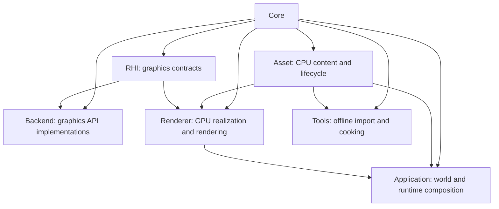
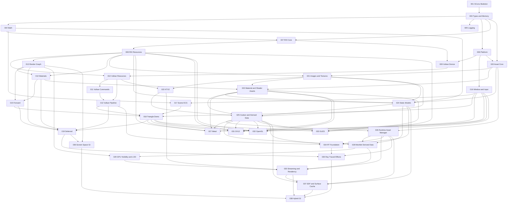

# Stoner Graphics Lab - Engine Development Roadmap

> **Version**: 2.1.5 | **Created**: 2026-04-21 | **Last Updated**: 2026-07-30 | **Status**: Active
> **Constitution**: v1.4.0
> **Numbering Rule**: Every runtime phase number equals its Speckit feature number. Feature 002 is this roadmap meta-feature.
> **Completed Baseline**: Features 001 and 003 through 023 are implemented and verified.

---

## Table of Contents

1. [Overview](#overview)
2. [Architecture Principles](#architecture-principles)
3. [Phase Overview](#phase-overview)
4. [Dependency Graph](#dependency-graph)
5. [Phase Details](#phase-details)
   - [Phase 003 - Core: Types & Memory](#phase-003--core-types--memory)
   - [Phase 004 - Core: Math Library](#phase-004--core-math-library)
   - [Phase 005 - Core: Logging & Assertions](#phase-005--core-logging--assertions)
   - [Phase 006 - Core: Platform Abstraction](#phase-006--core-platform-abstraction)
   - [Phase 007 - RHI: Core Interfaces](#phase-007--rhi-core-interfaces)
   - [Phase 008 - RHI: Resource & Pipeline Interfaces](#phase-008--rhi-resource--pipeline-interfaces)
   - [Phase 009 - Backend: Vulkan Device & Swapchain](#phase-009--backend-vulkan-device--swapchain)
   - [Phase 010 - Backend: Vulkan Resource Management](#phase-010--backend-vulkan-resource-management)
   - [Phase 011 - Backend: Vulkan Commands & Submission](#phase-011--backend-vulkan-commands--submission)
   - [Phase 012 - Backend: Vulkan Pipeline & Shader](#phase-012--backend-vulkan-pipeline--shader)
   - [Phase 013 - Renderer: Render Graph Foundation](#phase-013--renderer-render-graph-foundation)
   - [Phase 014 - Renderer: Material & Shader System](#phase-014--renderer-material--shader-system)
   - [Phase 015 - Renderer: Forward Rendering](#phase-015--renderer-forward-rendering)
   - [Phase 016 - Application: Window & Input](#phase-016--application-window--input)
   - [Phase 017 - Application: Scene Graph & ECS](#phase-017--application-scene-graph--ecs)
   - [Phase 018 - Application: Triangle Demo](#phase-018--application-triangle-demo)
   - [Phase 019 - Renderer: Deferred Rendering](#phase-019--renderer-deferred-rendering)
   - [Phase 020 - Asset: Core, Identity & Registry](#phase-020--asset-core-identity--registry)
   - [Phase 021 - Asset: Image & Texture Foundation](#phase-021--asset-image--texture-foundation)
   - [Phase 022 - Asset: KTX2 Cooking & Compression](#phase-022--asset-ktx2-cooking--compression)
   - [Phase 023 - Asset: Material & Shader Assets](#phase-023--asset-material--shader-assets)
   - [Phase 024 - Asset: Static Mesh & Model Pipeline](#phase-024--asset-static-mesh--model-pipeline)
   - [Phase 025 - Asset: Cooker, Manifest & Derived Data](#phase-025--asset-cooker-manifest--derived-data)
   - [Phase 026 - Asset: Runtime Asset Manager](#phase-026--asset-runtime-asset-manager)
   - [Phase 027 - Backend: Metal](#phase-027--backend-metal)
   - [Phase 028 - Asset: Meshlet Derived Data](#phase-028--asset-meshlet-derived-data)
   - [Phase 029 - Renderer: GPU-Driven Visibility & LOD](#phase-029--renderer-gpu-driven-visibility--lod)
   - [Phase 030 - Asset: Streaming & Residency](#phase-030--asset-streaming--residency)
   - [Phase 031 - Backend: DirectX 12](#phase-031--backend-directx-12)
   - [Phase 032 - Backend: OpenGL](#phase-032--backend-opengl)
   - [Phase 033 - Backend: GLES](#phase-033--backend-gles)
   - [Phase 034 - RHI: Ray Tracing & Vulkan Backend Foundation](#phase-034--rhi-ray-tracing--vulkan-backend-foundation)
   - [Phase 035 - Renderer: Ray-Traced Effects](#phase-035--renderer-ray-traced-effects)
   - [Phase 036 - Renderer: Screen-Space GI & Temporal](#phase-036--renderer-screen-space-gi--temporal)
   - [Phase 037 - Asset: SDF & Surface Cache](#phase-037--asset-sdf--surface-cache)
   - [Phase 038 - Renderer: Hybrid GI Integration](#phase-038--renderer-hybrid-gi-integration)
6. [Parallel Development Tracks](#parallel-development-tracks)
7. [Future Asset Extensions](#future-asset-extensions)
8. [Risk Register](#risk-register)
9. [Constitution Compliance](#constitution-compliance)
10. [How to Use This Roadmap](#how-to-use-this-roadmap)
11. [Change Log](#change-log)

---

## Overview

Stoner Graphics Lab is a C++20 cross-platform graphics engine developed through
one Speckit cycle per roadmap phase. Features 003 through 019 established Core,
RHI, Vulkan, Renderer, Application, visible presentation, and sibling forward
and deferred paths. Features 020 through 023 establish the CPU Asset foundation:
stable identity/registry, source images and textures, KTX2 cooking, and
versioned Material/Shader definitions with Renderer snapshots. The next
critical gap is canonical static mesh/model ingestion before offline packaging
and managed runtime loading.

Roadmap 2.1 adds Asset as an independent runtime layer. It separates source
interchange, cooked delivery, runtime management, and GPU realization so that
Meshlets, Ray Tracing, and GI consume versioned derived data instead of
hard-coded geometry.

It also enforces one principal responsibility per future feature: persistent
material schemas precede model ingestion; offline cooking is separate from the
runtime manager; meshlet data is separate from GPU visibility; ray-tracing
backend infrastructure is separate from renderer effects; and GI is staged
through screen-space, derived-data, and hybrid integration milestones.

### Roadmap-Wide Decisions

- C++20 uses traditional public/private headers and sources; no C++20 Modules.
- Vulkan remains the first backend; Metal, DX12, and GL/GLES remain independent RHI implementations.
- Core learning systems are implemented locally; mature codecs and format parsers may be vendored when reimplementing them has little educational value.
- Development builds may import source assets; cooked runtime mode consumes manifests and derived payloads without implicit source fallback.
- Asset identity is a typed canonical logical path plus optional subresource. Source/content/cook hashes version and invalidate data but do not change identity.
- Initial source formats are glTF 2.0/GLB and PNG/JPEG/HDR. KTX2/Basis is the cooked texture standard.
- FBX, OBJ, USD, and TGA are future importer/resolver plugins, not initial format commitments.
- Windows, macOS, and Linux automated validation is mandatory for platform-sensitive features.

### Research Basis

- [glTF 2.0 Specification](https://registry.khronos.org/glTF/specs/2.0/glTF-2.0.html) defines the initial runtime-oriented static model interchange boundary.
- [KTX](https://www.khronos.org/ktx/) defines the cooked texture container and Basis cross-platform compression path.
- [OpenUSD Asset Resolution](https://openusd.org/release/api/ar_page_front.html) informs logical identifiers and replaceable resolver strategies; USD composition itself remains a later Scene/Prefab concern.
- [Unreal Asset Management](https://dev.epicgames.com/documentation/en-us/unreal-engine/asset-management-in-unreal-engine) supports separating unloaded metadata, soft references, asynchronous loading, and residency ownership.

### Current State (Feature 023 Complete)

| Ownership Area | Status | Current Capability |
|---|---|---|
| Core | Done | Types, memory, math, logging, assertions, filesystem/process/time/window handles |
| Asset | Done through Material/Shader Assets | Identity, registry, image/texture/KTX2 data, versioned Material/Shader definitions, typed dependencies, deterministic target selection, and bounded canonical loading |
| RHI | KTX2 extension done | Device/resources plus total compressed-format, block-footprint, upload, and per-format usage contracts |
| Backend/Vulkan | KTX2 extension done | Native/fallback resources plus compressed format queries, image creation, upload, and readback |
| Renderer | Feature 023 adapter done | Render Graph, forward/deferred execution, immutable Asset-to-Renderer material/shader snapshots, and transactional shader registration |
| Application | Done foundation | Window/input, ECS scene organization, visible triangle integration |
| Additional Backends | Planned | Metal, DX12, desktop OpenGL, and GLES follow the Asset-backed shader path |

---

## Architecture Principles

### Runtime Dependency Directions



Arrows point from dependency to consumer. Asset owns CPU-side payloads,
identities, metadata, dependency records, and import/cook/load contracts. Asset
does not include RHI, Renderer, Application, Backend, or graphics API headers.
Renderer creates RHI resources and owns GPU residency. Runtime modules never
depend on Tools.

### Rules

1. Public Application and Renderer code never calls Vulkan, Metal, DX, GL, or GLES directly.
2. Importers are registered strategies; one source may emit multiple typed subresources.
3. Registry, resolver, importer, cooker, manager, and residency policy remain separate responsibilities.
4. Source assets are authoritative. Meshlets, BLAS, SDF, and compressed textures are versioned derived assets.
5. Public names use UE5-style prefixes (`F`, `I`, `E`, and `T`).
6. Each phase is independently specifiable, testable, and status tracked.

---

## Phase Overview

| # | Phase | Layer | Dependencies | Complexity | Critical Path | Status |
|---|---|---|---|---|---|---|
| 003 | Types & Memory | Core | 001 | M | Yes | ✅ Done |
| 004 | Math Library | Core | 003 | L | Yes | ✅ Done |
| 005 | Logging & Assertions | Core | 003 | S | No | ✅ Done |
| 006 | Platform Abstraction | Core | 003 | M | Yes | ✅ Done |
| 007 | RHI Core Interfaces | RHI | 003, 004 | L | Yes | ✅ Done |
| 008 | RHI Resource & Pipeline | RHI | 007 | L | Yes | ✅ Done |
| 009 | Vulkan Device & Swapchain | Backend | 006, 007 | L | Yes | ✅ Done |
| 010 | Vulkan Resource Management | Backend | 008, 009 | L | Yes | ✅ Done |
| 011 | Vulkan Commands & Submission | Backend | 010 | M | Yes | ✅ Done |
| 012 | Vulkan Pipeline & Shader | Backend | 010, 011 | L | Yes | ✅ Done |
| 013 | Render Graph Foundation | Renderer | 008 | XL | Yes | ✅ Done |
| 014 | Material & Shader System | Renderer | 008, 013 | L | Yes | ✅ Done |
| 015 | Forward Rendering | Renderer | 013, 014 | L | Yes | ✅ Done |
| 016 | Window & Input | Application | 006 | M | Yes | ✅ Done |
| 017 | Scene Graph & ECS | Application | 004, 016 | L | No | ✅ Done |
| 018 | Triangle Demo | Application | 012, 015, 016, 017 | M | Yes | ✅ Done |
| 019 | Deferred Rendering | Renderer | 012, 013, 014, 015, 018 | L | No | ✅ Done |
| 020 | Asset Core, Identity & Registry | Asset | 003, 006 | L | Yes | ✅ Done |
| 021 | Image & Texture Foundation | Asset | 008, 020 | L | Yes | ✅ Done |
| 022 | KTX2 Cooking & Compression | Asset | 010, 021 | XL | Yes | ✅ Done |
| 023 | Material & Shader Assets | Asset | 014, 020, 021 | XL | Yes | ✅ Done |
| 024 | Static Mesh & Model Pipeline | Asset | 004, 008, 020, 021, 023 | XL | Yes | ⬜ Todo |
| 025 | Cooker, Manifest & Derived Data | Asset | 021, 022, 023, 024 | XL | Yes | ⬜ Todo |
| 026 | Runtime Asset Manager | Asset | 020, 025 | XL | Yes | ⬜ Todo |
| 027 | Metal Backend | Backend | 008, 016, 018, 023, 025 | XL | No | ⬜ Todo |
| 028 | Meshlet Derived Data | Asset | 024, 025, 026 | XL | No | ⬜ Todo |
| 029 | GPU-Driven Visibility & LOD | Renderer | 013, 028 | XL | No | ⬜ Todo |
| 030 | Streaming & Residency | Asset | 022, 026, 028, 029 | XL | No | ⬜ Todo |
| 031 | DirectX 12 Backend | Backend | 008, 016, 018, 023, 025 | XL | No | ⬜ Todo |
| 032 | OpenGL Backend | Backend | 008, 016, 018, 023, 025 | XL | No | ⬜ Todo |
| 033 | GLES Backend | Backend | 008, 016, 018, 023, 025 | XL | No | ⬜ Todo |
| 034 | Ray Tracing & Vulkan Backend Foundation | RHI | 012, 024, 025, 026 | XL | No | ⬜ Todo |
| 035 | Ray-Traced Renderer Effects | Renderer | 019, 026, 034 | XL | No | ⬜ Todo |
| 036 | Screen-Space GI & Temporal | Renderer | 013, 019 | XL | No | ⬜ Todo |
| 037 | SDF & Surface Cache Assets | Asset | 024, 025, 026, 030 | XL | No | ⬜ Todo |
| 038 | Hybrid GI Integration | Renderer | 030, 035, 036, 037 | XL | No | ⬜ Todo |

Complexity: S = 1-2 days, M = 3-5 days, L = 1-2 weeks, XL = 2-4 weeks.

---

## Dependency Graph



---

## Phase Details

### Phase 003 — Core: Types & Memory

**Layer**: Core
**Dependencies**: 001 (SCons Skeleton)
**Complexity**: M (3-5 days)
**Critical Path**: ✅ Yes — all runtime layers use these types

#### Scope
Provide fixed-width types, strings, names, containers, smart-pointer aliases,
and memory utilities.

#### Key Deliverables
- `FPlatformTypes`, `FString`, and collision-safe `FName`
- `TArray`, `TMap`, `TSharedPtr`, and `TUniquePtr`
- `FMemory` aligned allocation and tests

#### What's Excluded
- Math, logging, and platform filesystem behavior

#### Speckit Prompt
```text
Implement Core types and memory for Stoner Graphics Lab: fixed-width types, FString, collision-safe FName, container and smart-pointer aliases, aligned FMemory utilities, lifecycle tests, UE5 naming, C++20 headers/sources, and Windows/macOS/Linux validation.
```

### Phase 004 — Core: Math Library

**Layer**: Core
**Dependencies**: 003
**Complexity**: L (1-2 weeks)
**Critical Path**: ✅ Yes — scene and rendering systems require stable math conventions

#### Scope
Implement vectors, matrices, quaternions, transforms, colors, and geometric
primitives with explicit coordinate and matrix conventions.

#### Key Deliverables
- `FVector2/3/4`, `FMatrix4x4`, `FQuat`, and `FTransform`
- `FColor`, `FBox`, `FSphere`, `FPlane`, and `FMath`
- Edge-case and convention tests

#### What's Excluded
- Spatial indexes, physics math, and third-party GLM wrappers

#### Speckit Prompt
```text
Implement the custom Core math library with vector, matrix, quaternion, transform, color, geometry, explicit coordinate conventions, SIMD-ready layout, numerical edge-case tests, and cross-platform C++20 behavior.
```

### Phase 005 — Core: Logging & Assertions

**Layer**: Core
**Dependencies**: 003
**Complexity**: S (1-2 days)
**Critical Path**: ❌ No — useful diagnostics but not a type dependency

#### Scope
Provide categorized logging, sinks, severity filtering, assertions, and
platform-safe debug breaks.

#### Key Deliverables
- `FLog`, categories, severity, and console/file sinks
- Assertion/check macros and injectable assertion handling
- Thread-safe and cross-platform tests

#### What's Excluded
- Remote telemetry and editor consoles

#### Speckit Prompt
```text
Implement Core logging and assertions with categories, severities, sinks, thread safety, injectable assertion handling, portable debugger breaks, deterministic tests, and UE5-style C++20 APIs.
```

### Phase 006 — Core: Platform Abstraction

**Layer**: Core
**Dependencies**: 003
**Complexity**: M (3-5 days)
**Critical Path**: ✅ Yes — filesystem and platform handles underpin Asset and Application

#### Scope
Provide portable process, time, memory, filesystem, and native-window-handle
boundaries.

#### Key Deliverables
- Platform detection and `FPlatform*` APIs
- Basic filesystem read/write/existence/directory operations
- Process, time, memory, and window-handle tests

#### What's Excluded
- Asset semantics, full window lifecycle, and graphics API calls

#### Speckit Prompt
```text
Implement Core platform abstraction for Windows, macOS, and Linux: process, time, memory, filesystem, and native-window handles behind guarded implementation files, deterministic tests, and no graphics API dependency.
```

### Phase 007 — RHI: Core Interfaces

**Layer**: RHI
**Dependencies**: 003, 004
**Complexity**: L (1-2 weeks)
**Critical Path**: ✅ Yes — all backends implement these contracts

#### Scope
Define device, queue, command, synchronization, capabilities, result, and
headless presentation contracts.

#### Key Deliverables
- `IRHIDevice`, `IRHIQueue`, `IRHICommandBuffer`, and synchronization interfaces
- Capabilities, result/status, queue types, and lifecycle rules
- Mock-based contract tests

#### What's Excluded
- Concrete graphics APIs and resource/pipeline interfaces

#### Speckit Prompt
```text
Define backend-neutral RHI core interfaces for device, capabilities, queues, command buffers, synchronization, headless presentation, results, lifecycle invalidation, mocks, and contract tests.
```

### Phase 008 — RHI: Resource & Pipeline Interfaces

**Layer**: RHI
**Dependencies**: 007
**Complexity**: L (1-2 weeks)
**Critical Path**: ✅ Yes — Renderer and every backend share these contracts

#### Scope
Define buffers, textures, samplers, descriptors, shaders, pipelines, render
passes, and framebuffers.

#### Key Deliverables
- Resource descriptions and `IRHIBuffer`, `IRHITexture`, `IRHISampler`
- Descriptor, shader, pipeline, render-pass, and framebuffer contracts
- Compatibility and lifecycle tests

#### What's Excluded
- Concrete allocation and source asset loading

#### Speckit Prompt
```text
Define RHI resource and pipeline interfaces for buffers, textures, samplers, descriptors, shaders, graphics/compute pipelines, render passes, framebuffers, compatibility validation, lifecycle invalidation, and mock tests.
```

### Phase 009 — Backend: Vulkan Device & Swapchain

**Layer**: Backend
**Dependencies**: 006, 007
**Complexity**: L (1-2 weeks)
**Critical Path**: ✅ Yes — establishes the first native backend

#### Scope
Initialize Vulkan, select adapters deterministically, create device/queues, and
manage surfaces and swapchains.

#### Key Deliverables
- Vulkan runtime, adapter, device, queue, surface, and swapchain wrappers
- Capability reporting and unsupported-runtime diagnostics
- Headless and native lifecycle tests

#### What's Excluded
- Resource allocation, commands, and pipelines

#### Speckit Prompt
```text
Implement the Vulkan RHI device and swapchain path with deterministic adapter selection, queue discovery, surface validation, swapchain lifecycle, diagnostics, fallback behavior, and cross-platform tests.
```

### Phase 010 — Backend: Vulkan Resource Management

**Layer**: Backend
**Dependencies**: 008, 009
**Complexity**: L (1-2 weeks)
**Critical Path**: ✅ Yes — rendering and asset realization require resources

#### Scope
Implement Vulkan buffers, textures, samplers, descriptor pools/sets,
allocation ownership, and upload staging.

#### Key Deliverables
- `FVulkanBuffer`, `FVulkanTexture`, and `FVulkanSampler`
- Allocation, descriptor, and upload-staging collaborators
- Failure, invalidation, capacity, and cleanup tests

#### What's Excluded
- Source image decoding and queue execution

#### Speckit Prompt
```text
Implement Vulkan RHI resources, allocation ownership, buffers, textures, samplers, descriptor pools/sets, upload staging, deterministic fallback, diagnostics, lifecycle invalidation, and tests.
```

### Phase 011 — Backend: Vulkan Commands & Submission

**Layer**: Backend
**Dependencies**: 010
**Complexity**: M (3-5 days)
**Critical Path**: ✅ Yes — native frame execution depends on submission

#### Scope
Implement command pools/buffers, barriers, queue submission, synchronization,
and minimal render-pass/framebuffer execution.

#### Key Deliverables
- Vulkan command recording and queue submission
- Barriers, fences, semaphores, uploads, and deterministic fallback
- Failure recovery and completion tests

#### What's Excluded
- Shader and graphics-pipeline creation

#### Speckit Prompt
```text
Implement Vulkan command allocation, recording, barriers, render-pass scope, queue submission, fences/semaphores, upload scheduling, fallback completion, diagnostics, and regression tests.
```

### Phase 012 — Backend: Vulkan Pipeline & Shader

**Layer**: Backend
**Dependencies**: 010, 011
**Complexity**: L (1-2 weeks)
**Critical Path**: ✅ Yes — visible rendering requires pipelines and shaders

#### Scope
Implement shader modules, pipeline layouts, graphics/compute pipelines,
binding validation, and in-process reuse.

#### Key Deliverables
- Vulkan shader modules and interface metadata
- Graphics/compute pipelines and compatibility keys
- Binding, cache-key, failure, and lifecycle tests

#### What's Excluded
- Persistent shader assets and disk pipeline caches

#### Speckit Prompt
```text
Implement Vulkan shader modules, explicit interface metadata, pipeline layouts, graphics/compute pipelines, compatibility validation, process-local reuse, command binding, diagnostics, and tests.
```

### Phase 013 — Renderer: Render Graph Foundation

**Layer**: Renderer
**Dependencies**: 008
**Complexity**: XL (2-4 weeks)
**Critical Path**: ✅ Yes — render pipelines schedule work through this graph

#### Scope
Declare passes/resources, compile deterministic schedules, plan transitions,
track lifetimes, cull unused work, and resolve transient resources.

#### Key Deliverables
- `FRenderGraph`, builder, compiler, executor, passes, and resources
- Transition, lifetime, culling, aliasing, and diagnostics
- Mock-RHI graph tests and text dumps

#### What's Excluded
- Material semantics and a concrete rendering strategy

#### Speckit Prompt
```text
Implement the Renderer Render Graph foundation with pass/resource declarations, deterministic compilation, lifetime tracking, transitions, culling, transient resolution, aliasing diagnostics, execution, debug dumps, and mock-RHI tests.
```

### Phase 014 — Renderer: Material & Shader System

**Layer**: Renderer
**Dependencies**: 008, 013
**Complexity**: L (1-2 weeks)
**Critical Path**: ✅ Yes — draw preparation depends on material semantics

#### Scope
Provide in-memory material definitions, inheritance, typed parameters, abstract
resource references, shader records, and permutations.

#### Key Deliverables
- `FMaterial`, `FMaterialInstance`, and parameter sets
- `FShaderLibrary`, records, permutations, and binding validation
- Resource requirements, diagnostics, dumps, and tests

#### What's Excluded
- Persistent material/shader assets and runtime shader compilation

#### Speckit Prompt
```text
Implement the in-memory Renderer material and shader system with definitions, instances, inheritance, typed parameters, abstract resource references, shader records/permutations, render-graph requirements, diagnostics, and tests.
```

### Phase 015 — Renderer: Forward Rendering

**Layer**: Renderer
**Dependencies**: 013, 014
**Complexity**: L (1-2 weeks)
**Critical Path**: ✅ Yes — this remains the default renderer

#### Scope
Prepare deterministic forward frames, material inputs, lights, draw ordering,
render-graph declarations, and RHI execution.

#### Key Deliverables
- `FForwardRenderer`, frame plans, views, lights, and draw commands
- Opaque/transparent ordering and configurable light selection
- Diagnostics, graph declaration, executor, and tests

#### What's Excluded
- Deferred, shadows, post-processing, and source asset loading

#### Speckit Prompt
```text
Implement the backend-neutral forward rendering strategy with deterministic frame preparation, PBR material inputs, configurable light selection, opaque/transparent ordering, Render Graph declarations, RHI execution, diagnostics, and tests.
```

### Phase 016 — Application: Window & Input

**Layer**: Application
**Dependencies**: 006
**Complexity**: M (3-5 days)
**Critical Path**: ✅ Yes — presentation and interaction require a window loop

#### Scope
Provide primary-window lifecycle, deterministic keyboard/mouse state, events,
headless behavior, and minimized presentation semantics.

#### Key Deliverables
- Window configuration, driver boundary, events, and application loop
- Physical keyboard/mouse frame snapshots
- GLFW adapter, null driver, CI tests, and smoke validation

#### What's Excluded
- Native platform-specific replacements and scene ownership

#### Speckit Prompt
```text
Implement Application window and input with GLFW-first and deterministic null drivers, lifecycle/events, physical keyboard/mouse snapshots, minimized presentation pause, headless tests, optional visible smoke, and three-platform CI.
```

### Phase 017 — Application: Scene Graph & ECS

**Layer**: Application
**Dependencies**: 004, 016
**Complexity**: L (1-2 weeks)
**Critical Path**: ❌ No — integration can use direct frame inputs

#### Scope
Provide generation-safe entities, flat component ownership, hierarchy views,
transform propagation, and deterministic render collection.

#### Key Deliverables
- `FWorld`, `FEntity`, entity slots, and generation validation
- Transform, mesh, light, and camera components
- Hierarchy operations, render summaries, diagnostics, and tests

#### What's Excluded
- Asset loading, scene serialization, physics, animation, and spatial indexes

#### Speckit Prompt
```text
Implement the Application scene graph and ECS foundation with generation-safe entities, flat component storage, transform hierarchy, reparent/destroy semantics, deterministic render collection, diagnostics, and headless tests.
```

### Phase 018 — Application: Triangle Demo

**Layer**: Application
**Dependencies**: 012, 015, 016, 017
**Complexity**: M (3-5 days)
**Critical Path**: ✅ Yes — proves end-to-end native execution

#### Scope
Compose Core, Application, Renderer, RHI, and Vulkan into deterministic,
offscreen, and visible triangle validation modes.

#### Key Deliverables
- Standalone demo composition root and runtime modes
- Native offscreen and GLFW swapchain presentation
- Endurance, screenshot, log, and three-platform CI evidence

#### What's Excluded
- General model/texture loading and an editor

#### Speckit Prompt
```text
Implement an end-to-end triangle demo with deterministic and native runtime modes, Renderer-to-RHI execution, Vulkan offscreen and GLFW presentation, bounded endurance tests, visible Windows/macOS evidence, Linux Lavapipe validation, and CI artifacts.
```

### Phase 019 — Renderer: Deferred Rendering

**Layer**: Renderer
**Dependencies**: 012, 013, 014, 015, 018
**Complexity**: L (1-2 weeks)
**Critical Path**: ❌ No — forward remains a complete default path

#### Scope
Provide a sibling deferred strategy with world-space GBuffer data, depth
policies, directional and local lights, composition, and transparent handoff.

#### Key Deliverables
- Deferred planning, surface layout, graph declaration, and RHI execution
- StandardZ/ReversedZ, instanced local-light volumes, and comparison reports
- Real Vulkan readback, failure injection, cleanup evidence, and CI artifacts

#### What's Excluded
- Tiled/clustered lighting, SSAO/SSR, and source asset loading

#### Speckit Prompt
```text
Implement the sibling deferred Renderer strategy with a world-space GBuffer, depth conventions, directional and instanced local lights, composition, transparent forward handoff, Render Graph/RHI execution, native Vulkan readback, diagnostics, comparison reports, failure injection, and cross-platform CI.
```

### Phase 020 — Asset: Core, Identity & Registry

**Layer**: Asset
**Dependencies**: 003, 006
**Complexity**: L (1-2 weeks)
**Critical Path**: ✅ Yes — every concrete asset phase depends on stable identity and extension contracts

#### Scope
Create `Source/Asset` as a Core-only runtime layer. Define typed canonical
logical identities, version hashes, metadata, dependency records, registry
queries, storage resolution, and extension contracts. One source may emit
multiple typed subresources. Importer selection uses deterministic
extension/content probing and rejects ambiguous registrations.

#### Key Deliverables
- `FAssetId`, `FAssetVersion`, `FAssetMetadata`, and `FAssetDependency`
- `FAssetRegistry`, typed soft references, and deterministic inspection dumps
- `IAssetResolver`, `IAssetImporter`, `IAssetLoader`, and `IAssetCooker`
- Registration, canonicalization, collision, cycle, failure, and lifecycle tests

#### What's Excluded
- Concrete file formats, asynchronous loading, GPU/RHI objects, databases, and editor UI

#### Speckit Prompt
```text
Add the Asset layer foundation for Stoner Graphics Lab: Source/Asset depends only on Core; typed canonical logical-path FAssetId values with optional subresources; separate FAssetVersion source/content/cook hashes; metadata and dependency records; an in-memory FAssetRegistry; typed soft references; resolver/importer/loader/cooker extension contracts; one-source-to-many-output support; deterministic extension and content-probe dispatch; cycle/collision/error diagnostics; lifecycle tests; UE5 naming; and Windows/macOS/Linux headless CI. Do not add concrete formats, asynchronous loading, RHI objects, databases, or editor UI.
```

### Phase 021 — Asset: Image & Texture Foundation

**Layer**: Asset
**Dependencies**: 008, 020
**Complexity**: L (1-2 weeks)
**Critical Path**: ✅ Yes — materials and model packages depend on texture assets

#### Scope
Import PNG, JPEG, and HDR source images into validated CPU-side image and 2D
texture assets. Preserve color space and semantic usage, describe mip chains,
and provide a Renderer adapter that realizes assets through RHI without adding
an RHI dependency to Asset.

#### Key Deliverables
- `FImageAsset`, `FTextureAsset`, mip records, formats, color spaces, and semantics
- PNG/JPEG/HDR importer strategies and actionable decoder diagnostics
- Deterministic mip generation and Renderer-to-RHI upload adapter
- Fixtures covering color, normal/data, malformed, oversized, and missing images

#### What's Excluded
- KTX2, block compression, runtime mip streaming, virtual textures, and initial TGA support

#### Speckit Prompt
```text
Implement the Image and Texture Asset foundation on Feature 020: PNG, JPEG, and HDR source importers; validated FImageAsset/FTextureAsset CPU payloads; explicit linear/sRGB and color/normal/data semantics; deterministic mip generation; 2D textures; malformed/oversized/missing-input diagnostics; importer registration that permits later TGA/cubemap/array/volume support; and a Renderer adapter that creates RHI textures/uploads without Asset depending on RHI. Include deterministic fixtures and three-platform CI. Exclude KTX2, block compression, streaming, and virtual textures.
```

### Phase 022 — Asset: KTX2 Cooking & Compression

**Layer**: Asset
**Dependencies**: 010, 021
**Complexity**: XL (2-4 weeks)
**Critical Path**: ✅ Yes — cooked cross-platform textures need explicit format negotiation

#### Scope
Adopt KTX2 as the cooked texture container. Support Basis ETC1S and UASTC,
complete mip chains, deterministic validation, device-capability transcoding,
and an uncompressed fallback. Extend backend-neutral RHI compressed formats
and Vulkan mappings without leaking Vulkan enums into Asset.

#### Key Deliverables
- KTX2 reader/writer/cooker integration and validation-tool workflow
- ETC1S/UASTC policy preserving color, normal, and data semantics
- RHI BC/ETC2/ASTC capability/format contracts and Vulkan realization
- Deterministic transcode, unsupported-format, corruption, fallback, and CI tests

#### What's Excluded
- Runtime mip streaming, virtual textures, and vendor-specific source formats

#### Speckit Prompt
```text
Implement KTX2 cooked textures on Feature 021: KTX2 container validation, Basis ETC1S and UASTC policies, full mip chains, semantic-safe linear/sRGB handling, deterministic cooking, BC/ETC2/ASTC RHI formats and capability negotiation, Vulkan mappings, runtime transcode selection, uncompressed fallback, corruption and unsupported-device diagnostics, Khronos validation tooling, and Windows/macOS/Linux CI. Exclude runtime mip streaming and virtual textures.
```

### Phase 023 — Asset: Material & Shader Assets

**Layer**: Asset
**Dependencies**: 014, 020, 021
**Complexity**: XL (2-4 weeks)
**Critical Path**: ✅ Yes — model import and every native backend need stable material/shader schemas

#### Scope
Represent materials, instances, shader records, parameters, and permutations as
serializable assets. Preserve texture/shader/material dependencies and
backend/profile-tagged cooked shader payloads while keeping Renderer APIs
compatible.

#### Key Deliverables
- `FMaterialAsset`, `FMaterialInstanceAsset`, and `FShaderAsset`
- Versioned schemas, dependency extraction, and Renderer conversion adapters
- GLSL source and SPIR-V payloads with MSL, DXIL, and GLSL target slots
- Repository shader migration, round-trip tests, and diagnostics

#### What's Excluded
- Visual editors, shader graphs, and arbitrary runtime shader compilation

#### Speckit Prompt
```text
Implement persistent Material and Shader Assets on Features 014, 020, and 021: serializable FMaterialAsset, FMaterialInstanceAsset, and FShaderAsset records; typed parameters and inheritance; texture, shader, and material dependencies; backend/profile-tagged cooked payloads; current GLSL and SPIR-V support with MSL, DXIL, and GLSL target slots; Renderer adapters preserving existing APIs; repository shader migration; schema/version diagnostics; round-trip tests; and cross-platform CI. Exclude visual editors, shader graphs, and arbitrary runtime shader compilation.
```

### Phase 024 — Asset: Static Mesh & Model Pipeline

**Layer**: Asset
**Dependencies**: 004, 008, 020, 021, 023
**Complexity**: XL (2-4 weeks)
**Critical Path**: ✅ Yes — meshlets, streaming, and ray tracing require canonical mesh data

#### Scope
Import glTF 2.0/GLB static model packages into established mesh, texture, and
material asset schemas. Support triangle primitives, streams, local hierarchy,
bounds, material slots, and stable typed subresources.

#### Key Deliverables
- `FStaticMeshAsset`, `FStaticModelAsset`, streams, primitives, bounds, and slots
- glTF/GLB importer with coordinate, winding, tangent, and index policies
- Stable model, mesh, material, and texture subresource identities
- Renderer RHI buffer adapter, Khronos fixtures, malformed-data tests, and CI

#### What's Excluded
- ECS scene creation, skins, animation, cameras, lights, FBX, OBJ, and USD

#### Speckit Prompt
```text
Implement the Static Mesh and Model Asset pipeline on Features 020, 021, and 023: glTF 2.0 and GLB static triangle packages; FStaticMeshAsset and FStaticModelAsset; primitives, indices, positions, normals, tangents, UVs, local hierarchy, submeshes, bounds, material slots, texture and material dependencies, stable typed subresource identities, coordinate/winding conversion, missing-attribute policy, malformed-data diagnostics, a Renderer RHI buffer adapter, Khronos-valid fixtures, deterministic tests, and cross-platform CI. Preserve later OBJ, FBX, and USD importer extension points. Exclude ECS scenes, skins, animation, cameras, and lights.
```

### Phase 025 — Asset: Cooker, Manifest & Derived Data

**Layer**: Asset
**Dependencies**: 021, 022, 023, 024
**Complexity**: XL (2-4 weeks)
**Critical Path**: ✅ Yes — runtime delivery and derived rendering data require deterministic cooked outputs

#### Scope
Build the offline `Tools/AssetCooker`, target profiles, manifests, incremental
cook graph, and derived-data cache. Development source import and cooked output
must produce identical asset identities and typed payload contracts.

#### Key Deliverables
- `Tools/AssetCooker`, target profiles, deterministic manifests, and validation CLI
- Derived keys from source hash, importer/cooker version, settings, and target
- Incremental dependency invalidation and atomic cooked output publication
- Reproducibility, corruption, stale-cache, clean-machine, and CI tests

#### What's Excluded
- Runtime async requests, handles, in-process cache ownership, streaming, and GPU residency

#### Speckit Prompt
```text
Implement the offline Asset Cooker and derived-data pipeline on Features 021-024: Tools/AssetCooker; deterministic target-profile manifests; derived keys containing source hash, importer and cooker versions, settings, and target; incremental dependency invalidation; atomic output publication; strict cooked payload validation; development and cooked paths sharing FAssetId and payload contracts; reproducibility, stale-cache, corruption, and clean-machine tests; diagnostics; and three-platform CI. Runtime modules must not depend on Tools. Exclude runtime async loading, asset handles, streaming, and GPU residency.
```

### Phase 026 — Asset: Runtime Asset Manager

**Layer**: Asset
**Dependencies**: 020, 025
**Complexity**: XL (2-4 weeks)
**Critical Path**: ✅ Yes — later systems need managed runtime asset lifetimes

#### Scope
Load source-backed development assets or strict cooked manifests through one
runtime contract. Schedule dependencies asynchronously, coalesce duplicate
requests, retain typed handles, propagate failure/cancellation, and unload
deterministically.

#### Key Deliverables
- `FAssetManager`, `FAssetRequestHandle`, and `TAssetHandle<T>`
- Request state machine, dependency scheduler, coalescing, and cache ownership
- Cancellation, failure propagation, reference retention, and deterministic unload
- Concurrency, shutdown, repeated-load, strict-cooked-mode, and stress tests

#### What's Excluded
- Offline cooking, budget eviction, chunk streaming, GPU residency, hot reload, and network storage

#### Speckit Prompt
```text
Implement the Runtime Asset Manager on Features 020 and 025: hybrid development source-backed loading and strict cooked-manifest loading with identical FAssetId and typed payload contracts; FAssetManager, FAssetRequestHandle, and TAssetHandle; asynchronous dependency scheduling, duplicate-request coalescing, cache ownership, cancellation, failure propagation, reference retention, deterministic unload, shutdown safety, diagnostics, concurrency and stress tests, and cross-platform CI. Exclude offline cooking, budget eviction, chunk streaming, GPU residency, hot reload, and network storage.
```

### Phase 027 — Backend: Metal

**Layer**: Backend
**Dependencies**: 008, 016, 018, 023, 025
**Complexity**: XL (2-4 weeks)
**Critical Path**: ❌ No — Vulkan/MoltenVK remains available, but early Metal validates RHI portability

#### Scope
Implement native Metal realization for existing RHI contracts, visible
presentation, and Asset-backed MSL shader payloads on macOS.

#### Key Deliverables
- Metal device, resources, descriptors, commands, synchronization, and pipelines
- `CAMetalLayer` presentation, resize handling, and capability reporting
- MSL payload cooking/consumption and backend-neutral demo execution
- macOS native, lifecycle, failure, and comparison validation

#### What's Excluded
- iOS application lifecycle, Metal mesh shaders, and ray tracing

#### Speckit Prompt
```text
Implement a native Metal backend on Features 008, 016, 018, 023, and 025: RHI device, resources, descriptors, commands, synchronization, pipelines, CAMetalLayer presentation, resize and lifecycle handling, capability reporting, MSL shader payload cooking and consumption, backend-neutral triangle/deferred validation, diagnostics, failure injection, and macOS native tests. Preserve Vulkan/MoltenVK fallback. Exclude iOS lifecycle, Metal mesh shaders, and ray tracing.
```

### Phase 028 — Asset: Meshlet Derived Data

**Layer**: Asset
**Dependencies**: 024, 025, 026
**Complexity**: XL (2-4 weeks)
**Critical Path**: ❌ No — conventional indexed meshes remain authoritative

#### Scope
Derive versioned meshlet clusters and LOD metadata from cooked static meshes.
This phase establishes deterministic data and CPU validation only; it does not
implement GPU culling or drawing.

#### Key Deliverables
- `FMeshletAsset`, `FMeshletBuilder`, and cooker extension
- Vertex/primitive clusters, bounds, cones, hierarchy, and LOD records
- Deterministic build keys, validation, serialization, and indexed fallback mapping
- Quality metrics, malformed-input tests, and reproducible fixtures

#### What's Excluded
- GPU visibility, HZB, mesh-shader execution, streaming, and virtual geometry

#### Speckit Prompt
```text
Implement Meshlet Derived Data on Features 024, 025, and 026: derive versioned FMeshletAsset payloads from canonical cooked FStaticMeshAsset data; FMeshletBuilder; vertex and primitive clusters, bounds, cones, hierarchy and LOD records; deterministic cooker keys; serialization and validation; indexed fallback mapping; quality metrics; reproducibility tests; and cross-platform CI. Meshlets must never become hand-authored source authority. Exclude GPU culling, HZB, mesh-shader execution, streaming, and virtual geometry.
```

### Phase 029 — Renderer: GPU-Driven Visibility & LOD

**Layer**: Renderer
**Dependencies**: 013, 028
**Complexity**: XL (2-4 weeks)
**Critical Path**: ❌ No — CPU visibility and indexed drawing remain valid

#### Scope
Consume meshlet assets for GPU-driven instance/cluster visibility, LOD
selection, and indirect drawing with capability-based execution paths.

#### Key Deliverables
- `FMeshletRenderer`, instance/cluster buffers, and indirect draw generation
- Frustum, cone, and HZB occlusion culling with deterministic CPU reference
- Mesh-shader path where supported and compute/indexed fallback elsewhere
- Render Graph integration, counters, benchmarks, and native validation

#### What's Excluded
- Asset streaming, virtual geometry, and software rasterization

#### Speckit Prompt
```text
Implement GPU-Driven Visibility and LOD on Features 013 and 028: FMeshletRenderer; instance and cluster buffers; frustum, cone, and HZB occlusion culling; deterministic CPU reference results; LOD selection; indirect drawing; mesh-shader execution where supported; compute/indexed fallback; Render Graph integration; capability diagnostics; counters; benchmarks; and native validation. Exclude asset streaming, virtual geometry, and software rasterization.
```

### Phase 030 — Asset: Streaming & Residency

**Layer**: Asset
**Dependencies**: 022, 026, 028, 029
**Complexity**: XL (2-4 weeks)
**Critical Path**: ❌ No — fully resident assets remain a valid baseline

#### Scope
Add chunk manifests, priorities, prefetch, cancellation, CPU/GPU budgets,
deterministic eviction, and residency telemetry for texture mips and meshlet
clusters. Renderer retains ownership of RHI/GPU realization.

#### Key Deliverables
- Texture-mip and meshlet-cluster chunk descriptors
- Priority, prefetch, cancellation, budget, and eviction policies
- Renderer GPU-residency adapter with synchronization-safe release
- Telemetry, pressure tests, long-run stress validation, and CI reports

#### What's Excluded
- CDN delivery, virtual texture, virtual geometry, and editor hot reload

#### Speckit Prompt
```text
Implement Asset Streaming and Residency on Features 022, 026, 028, and 029: chunk manifests for texture mips and meshlet clusters; priority requests, prefetch, cancellation, CPU/GPU budgets, deterministic eviction, and residency telemetry; Asset-side CPU/cooked scheduling; Renderer-owned RHI/GPU realization and synchronization-safe release; fully resident fallback; memory-pressure and long-run stress tests; normalized CI reports; and diagnostics. Exclude CDN delivery, virtual texture, virtual geometry, and editor hot reload.
```

### Phase 031 — Backend: DirectX 12

**Layer**: Backend
**Dependencies**: 008, 016, 018, 023, 025
**Complexity**: XL (2-4 weeks)
**Critical Path**: ❌ No — Vulkan remains available on Windows

#### Scope
Implement DX12 RHI resources, descriptor heaps, command lists, pipelines,
DXGI presentation, and Asset-backed DXIL payload consumption.

#### Key Deliverables
- DX12 device, resources, descriptors, commands, synchronization, and pipelines
- DXGI swapchain, resize/lifecycle handling, and capability reporting
- DXIL payload cooking/consumption and backend-neutral demo validation
- Windows native, failure, cleanup, and comparison tests

#### What's Excluded
- Xbox and DX12 Ultimate-only rendering features

#### Speckit Prompt
```text
Implement a DirectX 12 backend on Features 008, 016, 018, 023, and 025: RHI device, resources, descriptor heaps, command lists, synchronization, pipelines, DXGI presentation, resize and lifecycle handling, capability reporting, DXIL shader payload cooking and consumption, backend-neutral demo validation, diagnostics, failure injection, and Windows native tests. Exclude Xbox and DX12 Ultimate-only rendering features.
```

### Phase 032 — Backend: OpenGL

**Layer**: Backend
**Dependencies**: 008, 016, 018, 023, 025
**Complexity**: XL (2-4 weeks)
**Critical Path**: ❌ No — this is a desktop compatibility path

#### Scope
Implement a desktop OpenGL 4.5 backend, explicitly adapting the RHI's command
and pipeline model to a stateful API.

#### Key Deliverables
- Desktop GL device, resources, commands, pipelines, synchronization, and presentation
- State cache, command emulation, capability reporting, and GLSL payload consumption
- Windows/Linux/macOS availability policy and backend-neutral demo tests
- State-leak, context-loss, lifecycle, and comparison diagnostics

#### What's Excluded
- GLES, WebGL, and OpenGL versions below 4.5

#### Speckit Prompt
```text
Implement a desktop OpenGL 4.5 backend on Features 008, 016, 018, 023, and 025: RHI resources, state-cached command and pipeline emulation, synchronization, presentation, capability reporting, GLSL asset payload consumption, explicit platform availability policy, backend-neutral demo validation, state-leak and context-lifecycle diagnostics, and native tests. Exclude GLES, WebGL, and OpenGL versions below 4.5.
```

### Phase 033 — Backend: GLES

**Layer**: Backend
**Dependencies**: 008, 016, 018, 023, 025
**Complexity**: XL (2-4 weeks)
**Critical Path**: ❌ No — this is a constrained-device compatibility path

#### Scope
Implement a GLES 3.2 backend with explicit reduced capabilities and fallbacks.
Validate the graphics backend independently of any Android application shell.

#### Key Deliverables
- GLES resources, command/pipeline emulation, synchronization, and presentation bridge
- Capability reduction table, GLSL ES payloads, and fallback diagnostics
- Desktop EGL or equivalent headless/visible validation harness
- Precision, context-loss, lifecycle, and compatibility tests

#### What's Excluded
- Android lifecycle, packaging, input, store delivery, WebGL, and GLES below 3.2

#### Speckit Prompt
```text
Implement a GLES 3.2 backend on Features 008, 016, 018, 023, and 025: reduced-capability RHI resources, command and pipeline emulation, synchronization, presentation bridge, GLSL ES shader payload cooking and consumption, explicit fallback table, desktop EGL or equivalent validation, precision and context-loss diagnostics, backend-neutral demo tests, and CI. Exclude Android application lifecycle, packaging, input, store delivery, WebGL, and GLES below 3.2.
```

### Phase 034 — RHI: Ray Tracing & Vulkan Backend Foundation

**Layer**: RHI
**Dependencies**: 012, 024, 025, 026
**Complexity**: XL (2-4 weeks)
**Critical Path**: ❌ No — raster rendering remains supported

#### Scope
Define backend-neutral acceleration-structure and ray-pipeline contracts, then
implement Vulkan BLAS/TLAS, shader binding tables, synchronization, and
capability fallbacks. No visual ray-traced effect belongs here.

#### Key Deliverables
- RHI acceleration-structure, ray-pipeline, SBT, and command contracts
- Vulkan BLAS/TLAS build/update, compaction, barriers, pipelines, and dispatch
- Versioned BLAS derived keys from cooked static meshes
- Capability, lifecycle, failure, memory, and native execution tests

#### What's Excluded
- Reflections, shadows, AO, path tracing, and denoising

#### Speckit Prompt
```text
Implement the Ray Tracing RHI and Vulkan Backend Foundation on Features 012, 024, 025, and 026: backend-neutral acceleration-structure, ray-pipeline, shader-binding-table, and command contracts; Vulkan BLAS/TLAS build, update, compaction, barriers, pipelines, and dispatch; versioned BLAS derived keys from cooked static meshes; capability fallback; lifecycle and failure diagnostics; memory accounting; and native tests. Exclude renderer effects, path tracing, and denoising.
```

### Phase 035 — Renderer: Ray-Traced Effects

**Layer**: Renderer
**Dependencies**: 019, 026, 034
**Complexity**: XL (2-4 weeks)
**Critical Path**: ❌ No — raster lighting remains supported

#### Scope
Build scene-level ray-tracing integration and bounded reflection, shadow, and
ambient-occlusion effects on the RHI/backend foundation.

#### Key Deliverables
- `FRayTracingScene` instance collection and update policy
- Ray-traced reflection, shadow, and ambient-occlusion passes
- Render Graph integration, temporal inputs, and raster fallbacks
- Quality presets, comparison evidence, performance counters, and tests

#### What's Excluded
- Full path tracing, production denoising, and GI integration

#### Speckit Prompt
```text
Implement Ray-Traced Renderer Effects on Features 019, 026, and 034: FRayTracingScene collection and updates; ray-traced reflections, shadows, and ambient occlusion; Render Graph integration; temporal inputs; deterministic raster fallbacks; quality presets; diagnostics; comparison evidence; performance counters; and native tests. Exclude full path tracing, production denoising, and global-illumination integration.
```

### Phase 036 — Renderer: Screen-Space GI & Temporal

**Layer**: Renderer
**Dependencies**: 013, 019
**Complexity**: XL (2-4 weeks)
**Critical Path**: ❌ No — direct lighting remains complete

#### Scope
Implement a self-contained screen-space indirect-lighting baseline using the
deferred surfaces, hierarchical depth, temporal accumulation, and denoising.

#### Key Deliverables
- Screen-space ray marching, hierarchical depth, and hit validation
- Temporal reprojection, history rejection, neighborhood filtering, and denoising
- Render Graph passes, quality presets, debug views, and deterministic fixtures
- Camera-cut, disocclusion, ghosting, performance, and native tests

#### What's Excluded
- SDF tracing, surface caches, hardware RT, and final hybrid GI policy

#### Speckit Prompt
```text
Implement Screen-Space GI and Temporal Reconstruction on Features 013 and 019: deferred-surface ray marching, hierarchical depth, hit validation, temporal reprojection, history rejection, neighborhood filtering, denoising, Render Graph passes, quality presets, debug views, deterministic fixtures, camera-cut and disocclusion handling, ghosting diagnostics, performance counters, and native tests. Exclude SDF tracing, surface caches, hardware ray tracing, and hybrid GI integration.
```

### Phase 037 — Asset: SDF & Surface Cache

**Layer**: Asset
**Dependencies**: 024, 025, 026, 030
**Complexity**: XL (2-4 weeks)
**Critical Path**: ❌ No — screen-space and ray-traced effects remain usable

#### Scope
Cook, load, stream, and validate mesh SDF and surface-cache derived assets.
Asset owns CPU/cooked representations; Renderer owns GPU realization.

#### Key Deliverables
- `FMeshSDFAsset`, `FSurfaceCacheAsset`, page/chunk records, and derived keys
- Deterministic voxelization, distance-field generation, and surface capture cooking
- Runtime requests, streaming/residency integration, and Renderer adapters
- Error bounds, invalidation, memory-pressure, and visualization tests

#### What's Excluded
- GI tracing/integration, world partition, and production virtual geometry

#### Speckit Prompt
```text
Implement SDF and Surface Cache Assets on Features 024, 025, 026, and 030: FMeshSDFAsset and FSurfaceCacheAsset; deterministic voxelization, distance-field and surface-capture cooking; versioned derived keys; page and chunk records; runtime requests; streaming and residency integration; Renderer-owned GPU adapters; error-bound validation; invalidation diagnostics; memory-pressure tests; and debug visualization. Exclude GI tracing, world partition, and production virtual geometry.
```

### Phase 038 — Renderer: Hybrid GI Integration

**Layer**: Renderer
**Dependencies**: 030, 035, 036, 037
**Complexity**: XL (2-4 weeks)
**Critical Path**: ❌ No — all component lighting paths remain independently usable

#### Scope
Combine screen-space, SDF/surface-cache, and hardware ray-traced signals into a
quality-scalable dynamic GI strategy with deterministic fallback policy.

#### Key Deliverables
- `FHybridGlobalIllumination` policy and signal-composition passes
- Screen-space, SDF/cache, and hardware RT routing and fallback hierarchy
- Radiance history/cache management, temporal stabilization, and denoising
- Quality presets, residency coordination, benchmarks, diagnostics, and tests

#### What's Excluded
- Baked lightmaps, full path tracing, and production-scale world partition

#### Speckit Prompt
```text
Implement Hybrid Global Illumination on Features 030, 035, 036, and 037: FHybridGlobalIllumination; composition of screen-space, SDF/surface-cache, and hardware ray-traced signals; explicit fallback hierarchy; radiance history and cache management; temporal stabilization and denoising; streaming/residency coordination; Render Graph integration; quality presets; benchmarks; diagnostics; comparison evidence; and native tests. Exclude baked lightmaps, full path tracing, and production world partition.
```

---

## Parallel Development Tracks

### Completed Foundation

```text
003-006 Core
007-008 RHI
009-012 Vulkan
013-015 Renderer foundations
016-018 Application and integration
019 Deferred
```

### Asset Critical Path

```text
020 Asset Core
  -> 021 Image/Texture
      -> 022 KTX2
      -> 023 Material/Shader Assets
          -> 024 Static Mesh/Model
  -> 025 Cooker/Manifest/Derived Data
      -> 026 Runtime Asset Manager
```

Feature 022 may overlap with 023. Feature 024 waits for 023 so glTF material
subresources target a stable schema; Feature 025 waits for all concrete payloads.

### Early Portability Gate

```text
008 + 016 + 018 + 023 + 025 -> 027 Native Metal
```

Metal is intentionally early because the primary development machine can
exercise it directly. It validates RHI, presentation, and shader-asset
portability before advanced rendering deepens Vulkan-specific assumptions.

### Advanced Rendering

```text
024 + 025 + 026 -> 028 Meshlet Derived Data
028 -> 029 GPU Visibility/LOD
022 + 026 + 028 + 029 -> 030 Streaming/Residency

012 + 024 + 025 + 026 -> 034 RT RHI/Backend Foundation
019 + 026 + 034 -> 035 Ray-Traced Effects
013 + 019 -> 036 Screen-Space GI
024 + 025 + 026 + 030 -> 037 SDF/Surface Cache
030 + 035 + 036 + 037 -> 038 Hybrid GI
```

### Additional Backends

```text
008 + 016 + 018 + 023 + 025 -> 031 DX12
008 + 016 + 018 + 023 + 025 -> 032 OpenGL
008 + 016 + 018 + 023 + 025 -> 033 GLES
```

These backend phases may run in parallel after shader assets and cooked payloads
are stable. GLES validates graphics capabilities only; Android lifecycle,
packaging, input, and deployment require a future Application/platform phase.

### Recommended Solo Order

```text
020 -> 021 -> 022 -> 023 -> 024 -> 025 -> 026 -> 027
-> 028 -> 029 -> 030 -> 031 -> 032 -> 033
-> 034 -> 035 -> 036 -> 037 -> 038
```

At each batch boundary, address accepted S0-S2 debt that affects the next
feature. Feature 020 closed CR001-B09-F003 with the reusable test-suite
registry. Decompose CR001-B09-F005 before Feature 027 or another new native
execution path would duplicate the same oversized Vulkan session
responsibility.

---

## Future Asset Extensions

These are explicit extension tracks, not prerequisites for Feature 020 or
Meshlets:

- **TGA and additional images**: register another image importer producing the existing `FImageAsset`.
- **OBJ and FBX**: register model importers producing `FStaticModelAsset` and `FStaticMeshAsset`.
- **USD and Scene/Prefab assets**: add an Application content phase because USD includes resolver contexts, composition, payloads, and scene semantics beyond mesh interchange.
- **Skeletal Mesh and Animation**: add typed skeleton, skin, clip, and animation-graph assets after the static model contract stabilizes.
- **Audio and Font assets**: add independent runtime consumers without changing core identity, registry, cooker, or manager contracts.
- **Editor hot reload and asset database**: add editor-facing discovery, redirects, source watching, and searchable metadata without making the runtime depend on editor services.
- **Android platform shell**: add lifecycle, native window, input, packaging, deployment, and device validation after the GLES backend is stable.

---

## Risk Register

| Risk | Impact | Likelihood | Mitigation |
|---|---|---|---|
| Asset layer becomes a god-class | High | Medium | Separate registry, resolver, importer, cooker, manager, and residency policies |
| Logical paths differ across operating systems | High | Medium | Define platform-independent canonicalization and collision tests in Feature 020 |
| Source and cooked paths diverge | High | Medium | Require identical AssetId and typed payload contracts; test both profiles |
| Importer output is nondeterministic | High | Medium | Stable subresource naming, sorted manifests, versioned settings, digest tests |
| Corrupt or hostile source files exhaust memory | High | Medium | Bounds checks, size/count limits, graceful decoder/importer failures |
| KTX2 target format unsupported | Medium | Medium | Capability negotiation and deterministic uncompressed fallback |
| Compressed formats expand RHI/backend scope | High | High | Isolate Feature 022 and require per-format backend capability tests |
| Async cancellation races with unload | High | Medium | Explicit request state machine, retained handles, idempotent cleanup, stress tests |
| Offline cooker and runtime manager drift | High | Medium | Separate Features 025/026 but require identical AssetId, manifest, and payload contracts |
| Meshlet/BLAS/SDF data becomes a second authority | High | Medium | Treat all as versioned derived assets from canonical static meshes |
| Vulkan assumptions leak before a second backend | High | Medium | Implement native Metal at 027 before advanced rendering expands |
| Advanced rendering phases become multi-subsystem rewrites | High | High | Separate data, backend contracts, renderer effects, temporal methods, and final integration |
| Desktop GL and GLES capability policy diverges | Medium | High | Separate phases and explicit fallback tables; keep Android app concerns outside GLES |
| Oversized Vulkan validation responsibility propagates into another native backend | High | Medium | Decompose CR001-B09-F005 before Feature 027; CR001-B09-F003 was closed by Feature 020 |
| Third-party format dependency changes | Medium | Medium | Vendor pinned versions, record licenses, wrap behind importer/cooker contracts |
| Roadmap number drift returns | High | Low | Enforce feature/phase parity across TOC, table, DAG, and details |
| Hosted CI lacks a real GPU | Medium | High | Deterministic tests everywhere, Lavapipe native gates, manual visible evidence when required |

---

## Constitution Compliance

- **SSD**: Every roadmap phase is one Specify -> Clarify -> Plan -> Tasks -> Analyze -> Implement cycle.
- **Asset Boundary**: Asset depends only on Core; Renderer realizes GPU resources; runtime never depends on Tools.
- **RHI Boundary**: Application/Renderer never call graphics APIs; Backend owns API-specific code.
- **Design Discipline**: Import, registry, cook, load, cache, and residency are separate strategies/collaborators.
- **Multi-API**: Shader assets and compressed texture capabilities remain backend-neutral.
- **Advanced Graphics**: Meshlets, BLAS, SDF, and surface caches use derived asset contracts; backend infrastructure and Renderer effects remain separate.
- **Cross-Platform**: Platform-sensitive phases maintain Windows/macOS/Linux CI and document real-device gates.

---

## How to Use This Roadmap

1. Find the first `⬜ Todo` phase whose dependencies are `✅ Done`.
2. Copy its complete Speckit Prompt into `/speckit.specify`.
3. Run `/speckit.clarify`, showing each full question before recommendations and options.
4. Run `/speckit.plan`, `/speckit.tasks`, and `/speckit.analyze`.
5. Run `/speckit.implement`, validate locally and in required CI, and retain evidence.
6. Mark the phase `✅ Done`, update Current State, dependency styling if used, and this change log.

Feature 023 Asset: Material & Shader Assets is complete. Local macOS validation
and GitHub Actions run 30553736883 passed Windows/macOS/Linux Debug and strict
Release, full regression, identical 40-valid/40-invalid corpus digests, the
six-program and 22-dependency repository inventory, Linux ASan/UBSan,
ThreadSanitizer, and applicable Lavapipe native gates. The next phase is
**024 Asset: Static Mesh & Model Pipeline**.

### Status Legend

| Symbol | Meaning |
|---|---|
| ⬜ | Todo |
| 🔄 | In Progress |
| ✅ | Done |
| ⏸️ | Paused |

---

## Change Log

| Date | Version | Change |
|---|---|---|
| 2026-07-30 | 2.1.5 | Marked Feature 023 complete after GitHub Actions run 30553736883 passed Windows/macOS/Linux Debug and Release, exact cross-platform corpus/repository evidence, full regression, Linux sanitizers, and applicable Lavapipe native gates; activated Phase 024 as the next roadmap target. |
| 2026-07-30 | 2.1.4 | Recorded Feature 023 local implementation, shader-content migration, deterministic schema/Renderer evidence, and configured cross-platform gates; retained In Progress status pending remote CI. |
| 2026-07-30 | 2.1.3 | Marked Feature 022 complete after GitHub Actions run 30509436643 passed Windows/macOS/Linux Debug and Release, Linux sanitizers, deterministic digest comparison, independent validation, and conditional Lavapipe native evidence; activated Phase 023 as the next roadmap target. |
| 2026-07-29 | 2.1.2 | Recorded Feature 022 implementation and local macOS validation without marking the phase complete before Windows/Linux, sanitizer, and Linux native CI evidence. |
| 2026-07-29 | 2.1.1 | Marked Features 020 and 021 complete, activated Feature 022, and synchronized the current Asset capability summary after Feature 021 validation. |
| 2026-07-28 | 2.1.0 | Reordered Material/Shader Assets before Static Models, split offline cooking from runtime management, moved Metal forward as an early portability gate, split Meshlet data from GPU visibility, separated desktop GL from GLES, and decomposed Ray Tracing and GI into bounded backend/data/effect/integration phases through Feature 038. |
| 2026-07-24 | 2.0.0 | Normalized phase/feature numbering, marked 003-019 complete, added Asset as a constitution-governed layer, inserted Features 020-025 and 027, rebased advanced rendering/backends to 026 and 028-032, and added format-extension and derived-asset policy. |
| 2026-07-24 | 1.2.4 | Recorded Feature 019 Deferred completion and three-platform validation evidence. |
| 2026-04-21 | 1.0.0 | Created the original engine development roadmap. |
