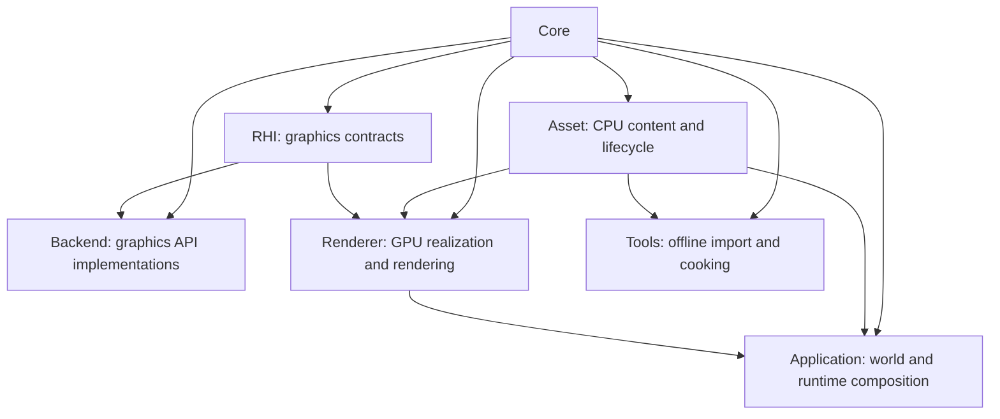

> Current acceptance update (2026-09-17): Feature 030 is complete by [maintainer exception](../specs/030-interactive-rendering-lab/closeout.md); Feature 031 is next. Strict 030 rejection records remain unchanged.

# Stoner Graphics Lab - Engine Development Roadmap

> **Version**: 3.1.0 | **Created**: 2026-04-21 | **Last Updated**: 2026-09-06 | **Status**: Active
> **Constitution**: v1.4.0
> **Numbering Rule**: Every runtime phase number equals its Speckit feature number. The roadmap is a standalone governance document and does not occupy a feature number; runtime phases begin at 003.
> **Completed Baseline**: Features 001 and 003 through 028 are implemented and verified; Feature 029 is complete by the explicitly recorded maintainer exception at `2ee7116`.

---

## Table of Contents

1. [Overview](#overview)
2. [Architecture Principles](#architecture-principles)
3. [Phase Overview](#phase-overview)
4. [Dependency Graph](#dependency-graph)
5. [Phase Details](#phase-details)
   - [Phase 003 - Core: Types & Memory](#phase-003--core-types--memory)
   - [Phase 004 - Core: Math Library](#phase-004--core-math-library)
   - [Phase 005 - Core: Logging & Assertions](#phase-005--core-logging--assertions)
   - [Phase 006 - Core: Platform Abstraction](#phase-006--core-platform-abstraction)
   - [Phase 007 - RHI: Core Interfaces](#phase-007--rhi-core-interfaces)
   - [Phase 008 - RHI: Resource & Pipeline Interfaces](#phase-008--rhi-resource--pipeline-interfaces)
   - [Phase 009 - Backend: Vulkan Device & Swapchain](#phase-009--backend-vulkan-device--swapchain)
   - [Phase 010 - Backend: Vulkan Resource Management](#phase-010--backend-vulkan-resource-management)
   - [Phase 011 - Backend: Vulkan Commands & Submission](#phase-011--backend-vulkan-commands--submission)
   - [Phase 012 - Backend: Vulkan Pipeline & Shader](#phase-012--backend-vulkan-pipeline--shader)
   - [Phase 013 - Renderer: Render Graph Foundation](#phase-013--renderer-render-graph-foundation)
   - [Phase 014 - Renderer: Material & Shader System](#phase-014--renderer-material--shader-system)
   - [Phase 015 - Renderer: Forward Rendering](#phase-015--renderer-forward-rendering)
   - [Phase 016 - Application: Window & Input](#phase-016--application-window--input)
   - [Phase 017 - Application: Scene Graph & ECS](#phase-017--application-scene-graph--ecs)
   - [Phase 018 - Application: Triangle Demo](#phase-018--application-triangle-demo)
   - [Phase 019 - Renderer: Deferred Rendering](#phase-019--renderer-deferred-rendering)
   - [Phase 020 - Asset: Core, Identity & Registry](#phase-020--asset-core-identity--registry)
   - [Phase 021 - Asset: Image & Texture Foundation](#phase-021--asset-image--texture-foundation)
   - [Phase 022 - Asset: KTX2 Cooking & Compression](#phase-022--asset-ktx2-cooking--compression)
   - [Phase 023 - Asset: Material & Shader Assets](#phase-023--asset-material--shader-assets)
   - [Phase 024 - Asset: Static Mesh & Model Pipeline](#phase-024--asset-static-mesh--model-pipeline)
   - [Phase 025 - Asset: Cooker, Manifest & Derived Data](#phase-025--asset-cooker-manifest--derived-data)
   - [Phase 026 - Asset: Runtime Asset Manager](#phase-026--asset-runtime-asset-manager)
   - [Phase 027 - Backend: Metal](#phase-027--backend-metal)
   - [Phase 028 - Asset: Production Content Integration & Acceptance](#phase-028--asset-production-content-integration--acceptance)
   - [Phase 029 - Renderer: HDR Post-Processing & Output Transform](#phase-029--renderer-hdr-post-processing--output-transform)
   - [Phase 030 - Application: Interactive Rendering Lab & ImGui Integration](#phase-030--application-interactive-rendering-lab--imgui-integration)
   - [Phase 031 - Renderer: Anti-Aliasing & Temporal Reconstruction](#phase-031--renderer-anti-aliasing--temporal-reconstruction)
   - [Phase 032 - Renderer: Raster Shadow Maps & Cascades](#phase-032--renderer-raster-shadow-maps--cascades)
   - [Phase 033 - Renderer: Screen-Space Shadows & Shadow Filtering](#phase-033--renderer-screen-space-shadows--shadow-filtering)
   - [Phase 034 - Renderer: Sky Atmosphere & Environment Lighting](#phase-034--renderer-sky-atmosphere--environment-lighting)
   - [Phase 035 - Renderer: Height Fog & Volumetric Fog](#phase-035--renderer-height-fog--volumetric-fog)
   - [Phase 036 - Renderer: Volumetric Clouds](#phase-036--renderer-volumetric-clouds)
   - [Phase 037 - Renderer: Exposure, Bloom & Color Grading](#phase-037--renderer-exposure-bloom--color-grading)
   - [Phase 038 - Renderer: Depth of Field & Motion Blur](#phase-038--renderer-depth-of-field--motion-blur)
   - [Phase 039 - Renderer: Virtual Shadow Maps](#phase-039--renderer-virtual-shadow-maps)
   - [Phase 040 - Renderer: Screen-Space Ambient Occlusion & Reflections](#phase-040--renderer-screen-space-ambient-occlusion--reflections)
   - [Phase 041 - Renderer: Frame Profiling & Render Diagnostics](#phase-041--renderer-frame-profiling--render-diagnostics)
   - [Phase 042 - Renderer: Complete Rendering Pipeline Integration & Quality Baseline](#phase-042--renderer-complete-rendering-pipeline-integration--quality-baseline)
   - [Phase 043 - Asset: Meshlet Derived Data](#phase-043--asset-meshlet-derived-data)
   - [Phase 044 - Renderer: GPU-Driven Visibility & LOD](#phase-044--renderer-gpu-driven-visibility--lod)
   - [Phase 045 - Asset: Streaming & Residency](#phase-045--asset-streaming--residency)
   - [Phase 046 - Renderer: Screen-Space GI & Temporal](#phase-046--renderer-screen-space-gi--temporal)
   - [Phase 047 - RHI: Ray Tracing & Vulkan Backend Foundation](#phase-047--rhi-ray-tracing--vulkan-backend-foundation)
   - [Phase 048 - Renderer: Ray-Traced Renderer Effects](#phase-048--renderer-ray-traced-renderer-effects)
   - [Phase 049 - Asset: SDF & Surface Cache Assets](#phase-049--asset-sdf--surface-cache-assets)
   - [Phase 050 - Renderer: Hybrid GI Integration](#phase-050--renderer-hybrid-gi-integration)
   - [Phase 051 - Backend: DirectX 12 Backend](#phase-051--backend-directx-12-backend)
   - [Phase 052 - Backend: OpenGL Backend](#phase-052--backend-opengl-backend)
   - [Phase 053 - Backend: GLES Backend](#phase-053--backend-gles-backend)
6. [Complete Rendering Pipeline Layout](#complete-rendering-pipeline-layout)
7. [Parallel Development Tracks](#parallel-development-tracks)
8. [Future Asset Extensions](#future-asset-extensions)
9. [Risk Register](#risk-register)
10. [Constitution Compliance](#constitution-compliance)
11. [How to Use This Roadmap](#how-to-use-this-roadmap)
12. [Change Log](#change-log)

---

## Overview

Stoner Graphics Lab is a C++20 cross-platform graphics engine developed through
one Speckit cycle per roadmap phase. Features 003 through 019 established Core,
RHI, Vulkan, Renderer, Application, visible presentation, and sibling forward
and deferred paths. Features 020 through 025 establish the Asset delivery foundation:
stable identity/registry, source images and textures, KTX2 cooking, versioned
Material/Shader definitions, and canonical static mesh/model ingestion with
Renderer RHI realization, deterministic offline cooking, manifests, and local
derived data. Feature 026 has implemented managed asynchronous runtime loading
and passed its local and required remote cross-platform/sanitizer gates. Feature
027 has delivered the native Metal portability backend with physical arm64 and
hosted x86_64 native acceptance. Feature 028 has closed the remaining content-
realism gap with selected production assets and an end-to-end source-to-visible-
render acceptance path. Feature 029 HDR Post-Processing & Output Transform is
complete at `2ee7116` by an explicit maintainer exception; Feature 030
Interactive Rendering Lab & ImGui Integration is complete by the 2026-09-17 maintainer exception at `6a9e5df4`; next is 031
Anti-Aliasing & Temporal Reconstruction. The exception preserves older
Windows SDR and +3 EV HDR visual provenance and is not a strict all-gates pass.

Roadmap 2.1 added Asset as an independent runtime layer. It separates source
interchange, cooked delivery, runtime management, and GPU realization so that
Meshlets, Ray Tracing, and GI consume versioned derived data instead of
hard-coded geometry.

Roadmap 2.2 adds a production-content acceptance gate between the second native
backend and advanced asset work. Format-valid synthetic fixtures remain the
fast contract suite; licensed artist-authored content proves composition,
scale, cooking, runtime loading, and visible rendering as one system.

Historically, Roadmap 2.3 inserted a backend-neutral HDR output pipeline and a separate
anti-aliasing/temporal-reconstruction phase immediately after production
content acceptance. The then-future Features 029-039 moved to 031-041 without
renumbering or changing completed Features 003-028.

It also enforces one principal responsibility per future feature: persistent
material schemas precede model ingestion; offline cooking is separate from the
runtime manager; meshlet data is separate from GPU visibility; ray-tracing
backend infrastructure is separate from renderer effects; and GI is staged
through screen-space, derived-data, and hybrid integration milestones.

Roadmap 3.1.0 now prioritizes a complete raster/environment/post-processing
renderer on Vulkan/Metal: 030-042 are the near-term track, beginning with a
hands-on application/UI shell before temporal reconstruction and visual effects. Meshlet data, GPU
visibility, residency, advanced GI/RT and additional backends move to 043-053.
Only unstarted phases move; 003-029 implementation identities, historical
phase text, signed acceptance and evidence digests remain unchanged.
[The historical 2.3.2-to-3.0 migration map](../specs/002-engine-development-roadmap/migration-3.0.md)
resolves old future references inside completed 028/029 documents and receipts.
Those historical references are not current work assignments.
[The 3.0.0-to-3.0.1 amendment](../specs/002-engine-development-roadmap/migration-3.0.1.md)
records the earlier profiling move. [The current 3.1 migration](../specs/002-engine-development-roadmap/migration-3.1.md)
inserts interactive Feature 030 and shifts only unstarted 030-052 to 031-053.
The current phase index composes those historical mappings, including old 030
TAA now at 031. Full profiling is 041 after effects, followed by acceptance 042.

### Roadmap-Wide Decisions

- C++20 uses traditional public/private headers and sources; no C++20 Modules.
- Vulkan remains the first backend; Metal, DX12, and GL/GLES remain independent RHI implementations.
- Core learning systems are implemented locally; mature codecs and format parsers may be vendored when reimplementing them has little educational value.
- Development builds may import source assets; cooked runtime mode consumes manifests and derived payloads without implicit source fallback.
- Asset identity is a typed canonical logical path plus optional subresource. Source/content/cook hashes version and invalidate data but do not change identity.
- Initial source formats are glTF 2.0/GLB and PNG/JPEG/HDR. KTX2/Basis is the cooked texture standard.
- FBX, OBJ, USD, and TGA are future importer/resolver plugins, not initial format commitments.
- HDR SceneColor, tone mapping, output transfer, and presentation/readback policy remain backend-neutral Renderer responsibilities; backends only execute and present the declared work.
- Feature 030 delivers the interactive camera/ImGui shell before effects, reusing existing inputs and Renderer/RHI. Full profiling remains 041, not a prerequisite of this shell. UI is display-referred, excluded from scene effects and off in formal scene captures by default.
- TAA operates before tone mapping and FXAA operates after tone mapping. Later temporal effects reuse the shared jitter, motion-vector, history, and reprojection contracts instead of creating parallel frameworks.
- Windows, macOS, and Linux automated validation is mandatory for platform-sensitive features.
- Conventional shadow maps/CSM establish the shadow baseline; screen-space contact shadows supplement it, and VirtualShadowMaps is a later page-cache strategy with explicit fallback. VarianceShadowMaps names the moment-filtering alternative, not virtualization.
- Atmosphere, environment lighting, fog, clouds and camera/post-processing effects precede extra backends and advanced GI in the recommended work queue.
- Temporal consumers share Feature 031 lifecycle/reprojection services with signal-specific histories; shared services do not mean mixing surface color, fog density and cloud radiance in one buffer.
- Feature 033 owns one SceneDepthPyramid reused by contact shadows, VirtualShadowMaps, AO/SSR, GPU culling and SSGI.
- Features 031-040 retain debug outputs, resource/sample counters and bounded execution; they do not depend on full profiling. Feature 041 measures the completed effects with GPU/CPU timing, performance views and budget checks before Feature 042 acceptance. Unavailable GPU timing is not a zero-cost pass.

### Research Basis

- [glTF 2.0 Specification](https://registry.khronos.org/glTF/specs/2.0/glTF-2.0.html) defines the initial runtime-oriented static model interchange boundary.
- [KTX](https://www.khronos.org/ktx/) defines the cooked texture container and Basis cross-platform compression path.
- [OpenUSD Asset Resolution](https://openusd.org/release/api/ar_page_front.html) informs logical identifiers and replaceable resolver strategies; USD composition itself remains a later Scene/Prefab concern.
- [Unreal Asset Management](https://dev.epicgames.com/documentation/en-us/unreal-engine/asset-management-in-unreal-engine) supports separating unloaded metadata, soft references, asynchronous loading, and residency ownership.

### Current State (Feature 029 Complete by Exception; Feature 030 Next)

| Ownership Area | Status | Current Capability |
|---|---|---|
| Core | Done | Types, memory, math, logging, assertions, durable file transactions, native leases, long-path-safe filesystem/process/time/window handles |
| Asset | Production-content acceptance complete | Typed source/cooked loading, async dependency scheduling, strict generation consumption, real Lantern/Sponza closure validation, transactional GPU realization, and deterministic image/lifecycle evidence |
| Tools | Asset Cooker done | Deterministic graph/snapshot scheduling, local immutable DDC, incremental invalidation, atomic generation publication, strict validation, CLI, and normalized reports |
| RHI | Static-mesh transfer contracts done | Device/resources plus compressed formats, bounded buffer upload, and complete indexed-draw arguments |
| Backend/Vulkan | Static-mesh native evidence done | Native/fallback resources plus compressed formats, buffer upload, indexed draw mapping, cleanup, and Lavapipe attachment readback |
| Renderer | HDR output delivered; closeout by maintainer exception | Shared Forward/Deferred RGBA16F SceneColor, pre/post-tonemap seams, manual exposure, versioned SDR/HDR output transforms, typed Render Graph, native presentation/readback and lifecycle |
| Application | Done foundation | Window/input, ECS scene organization, visible triangle and calibration-only camera preview; formal interactive lab/GUI is next at 030 |
| Additional Backends | Metal done | Native Metal device/resources/commands/synchronization/presentation plus strict-cooked shader execution; DX12, desktop OpenGL, and GLES remain planned |

---

## Architecture Principles

### Runtime Dependency Directions



Arrows point from dependency to consumer. Asset owns CPU-side payloads,
identities, metadata, dependency records, and import/cook/load contracts. Asset
does not include RHI, Renderer, Application, Backend, or graphics API headers.
Renderer creates RHI resources and owns GPU residency. Runtime modules never
depend on Tools.

### Rules

1. Public Application and Renderer code never calls Vulkan, Metal, DX, GL, or GLES directly.
2. Importers are registered strategies; one source may emit multiple typed subresources.
3. Registry, resolver, importer, cooker, manager, and residency policy remain separate responsibilities.
4. Source assets are authoritative. Meshlets, BLAS, SDF, and compressed textures are versioned derived assets.
5. Public names use UE5-style prefixes (`F`, `I`, `E`, and `T`).
6. Each phase is independently specifiable, testable, and status tracked.

---

## Phase Overview

| # | Phase | Layer | Dependencies | Complexity | Critical Path | Status |
|---|---|---|---|---|---|---|
| 003 | Types & Memory | Core | 001 | M | Yes | ✅ Done |
| 004 | Math Library | Core | 003 | L | Yes | ✅ Done |
| 005 | Logging & Assertions | Core | 003 | S | No | ✅ Done |
| 006 | Platform Abstraction | Core | 003 | M | Yes | ✅ Done |
| 007 | RHI Core Interfaces | RHI | 003, 004 | L | Yes | ✅ Done |
| 008 | RHI Resource & Pipeline | RHI | 007 | L | Yes | ✅ Done |
| 009 | Vulkan Device & Swapchain | Backend | 006, 007 | L | Yes | ✅ Done |
| 010 | Vulkan Resource Management | Backend | 008, 009 | L | Yes | ✅ Done |
| 011 | Vulkan Commands & Submission | Backend | 010 | M | Yes | ✅ Done |
| 012 | Vulkan Pipeline & Shader | Backend | 010, 011 | L | Yes | ✅ Done |
| 013 | Render Graph Foundation | Renderer | 008 | XL | Yes | ✅ Done |
| 014 | Material & Shader System | Renderer | 008, 013 | L | Yes | ✅ Done |
| 015 | Forward Rendering | Renderer | 013, 014 | L | Yes | ✅ Done |
| 016 | Window & Input | Application | 006 | M | Yes | ✅ Done |
| 017 | Scene Graph & ECS | Application | 004, 016 | L | No | ✅ Done |
| 018 | Triangle Demo | Application | 012, 015, 016, 017 | M | Yes | ✅ Done |
| 019 | Deferred Rendering | Renderer | 012, 013, 014, 015, 018 | L | No | ✅ Done |
| 020 | Asset Core, Identity & Registry | Asset | 003, 006 | L | Yes | ✅ Done |
| 021 | Image & Texture Foundation | Asset | 008, 020 | L | Yes | ✅ Done |
| 022 | KTX2 Cooking & Compression | Asset | 010, 021 | XL | Yes | ✅ Done |
| 023 | Material & Shader Assets | Asset | 014, 020, 021 | XL | Yes | ✅ Done |
| 024 | Static Mesh & Model Pipeline | Asset | 004, 008, 020, 021, 023 | XL | Yes | ✅ Done |
| 025 | Cooker, Manifest & Derived Data | Asset | 021, 022, 023, 024 | XL | Yes | ✅ Done |
| 026 | Runtime Asset Manager | Asset | 020, 025 | XL | Yes | ✅ Done |
| 027 | Metal Backend | Backend | 008, 016, 018, 023, 025 | XL | No | ✅ Done |
| 028 | Production Content Integration & Acceptance | Asset | 018, 019, 022, 024, 026, 027 | L | Yes | ✅ Done |
| 029 | HDR Post-Processing & Output Transform | Renderer | 013, 015, 018, 019, 027, 028 | XL | Yes | ✅ Done (maintainer exception) |
| 030 | Interactive Rendering Lab & ImGui Integration | Application | 004, 008, 013, 015, 016, 017, 018, 019, 027, 028, 029 | XL | Yes | ⬜ Todo |
| 031 | Anti-Aliasing & Temporal Reconstruction | Renderer | 004, 013, 015, 017, 019, 028, 029, 030 | XL | Yes | ⬜ Todo |
| 032 | Raster Shadow Maps & Cascades | Renderer | 013, 015, 017, 019, 027, 028, 029, 030 | XL | Yes | ⬜ Todo |
| 033 | Screen-Space Shadows & Shadow Filtering | Renderer | 013, 019, 031, 032 | XL | Yes | ⬜ Todo |
| 034 | Sky Atmosphere & Environment Lighting | Renderer | 013, 015, 019, 027, 029, 032 | XL | Yes | ⬜ Todo |
| 035 | Height Fog & Volumetric Fog | Renderer | 013, 019, 027, 029, 031, 032, 034 | XL | Yes | ⬜ Todo |
| 036 | Volumetric Clouds | Renderer | 013, 019, 027, 029, 031, 032, 034, 035 | XL | Yes | ⬜ Todo |
| 037 | Exposure, Bloom & Color Grading | Renderer | 013, 029, 031 | XL | Yes | ⬜ Todo |
| 038 | Depth of Field & Motion Blur | Renderer | 013, 019, 029, 031, 037 | XL | Yes | ⬜ Todo |
| 039 | Virtual Shadow Maps | Renderer | 008, 013, 017, 019, 027, 031, 032, 033 | XL | Yes | ⬜ Todo |
| 040 | Screen-Space Ambient Occlusion & Reflections | Renderer | 013, 019, 029, 031, 033, 034 | XL | Yes | ⬜ Todo |
| 041 | Frame Profiling & Render Diagnostics | Renderer | 008, 013, 018, 019, 027, 029, 036, 038, 039, 040 | L | Yes | ⬜ Todo |
| 042 | Complete Rendering Pipeline Integration & Quality Baseline | Renderer | 028, 031, 036, 038, 039, 040, 041 | L | Yes | ⬜ Todo |
| 043 | Meshlet Derived Data | Asset | 024, 025, 026, 028 | XL | No | ⬜ Todo |
| 044 | GPU-Driven Visibility & LOD | Renderer | 008, 013, 033, 041, 043 | XL | No | ⬜ Todo |
| 045 | Streaming & Residency | Asset | 022, 026, 043, 044 | XL | No | ⬜ Todo |
| 046 | Screen-Space GI & Temporal | Renderer | 013, 019, 031, 040, 041 | XL | No | ⬜ Todo |
| 047 | Ray Tracing & Vulkan Backend Foundation | RHI | 008, 012, 024, 025, 026, 041 | XL | No | ⬜ Todo |
| 048 | Ray-Traced Renderer Effects | Renderer | 013, 019, 026, 031, 032, 040, 047 | XL | No | ⬜ Todo |
| 049 | SDF & Surface Cache Assets | Asset | 024, 025, 026, 045 | XL | No | ⬜ Todo |
| 050 | Hybrid GI Integration | Renderer | 031, 041, 045, 046, 048, 049 | XL | No | ⬜ Todo |
| 051 | DirectX 12 Backend | Backend | 008, 016, 018, 023, 025, 029, 041 | XL | No | ⬜ Todo |
| 052 | OpenGL Backend | Backend | 008, 016, 018, 023, 025, 029, 041 | XL | No | ⬜ Todo |
| 053 | GLES Backend | Backend | 008, 016, 018, 023, 025, 029, 041 | XL | No | ⬜ Todo |

Historical estimates remain unchanged for completed phases. For future phases,
L/XL indicate scope/risk only, not an automatic 1-4 week promise. Each phase
specification estimates its bounded milestones and native evidence workload.

---

## Dependency Graph

```mermaid
graph TD
    P001[001 SCons Skeleton]
    P003[003 Types and Memory]
    P001 --> P003
    P003 --> P004[004 Math]
    P003 --> P005[005 Logging]
    P003 --> P006[006 Platform]
    P003 --> P007[007 RHI Core]
    P004 --> P007
    P007 --> P008[008 RHI Resources]
    P006 --> P009[009 Vulkan Device]
    P007 --> P009
    P008 --> P010[010 Vulkan Resources]
    P009 --> P010
    P010 --> P011[011 Vulkan Commands]
    P010 --> P012[012 Vulkan Pipeline]
    P011 --> P012
    P008 --> P013[013 Render Graph]
    P008 --> P014[014 Materials]
    P013 --> P014
    P013 --> P015[015 Forward]
    P014 --> P015
    P006 --> P016[016 Window and Input]
    P004 --> P017[017 Scene ECS]
    P016 --> P017
    P012 --> P018[018 Triangle Demo]
    P015 --> P018
    P016 --> P018
    P017 --> P018
    P012 --> P019[019 Deferred]
    P013 --> P019
    P014 --> P019
    P015 --> P019
    P018 --> P019

    P003 --> P020[020 Asset Core]
    P006 --> P020
    P008 --> P021[021 Images and Textures]
    P020 --> P021
    P010 --> P022[022 KTX2]
    P021 --> P022
    P014 --> P023[023 Material and Shader Assets]
    P020 --> P023
    P021 --> P023
    P004 --> P024[024 Static Models]
    P008 --> P024
    P020 --> P024
    P021 --> P024
    P023 --> P024
    P021 --> P025[025 Cooker and Derived Data]
    P022 --> P025
    P023 --> P025
    P024 --> P025
    P020 --> P026[026 Runtime Asset Manager]
    P025 --> P026
    P008 --> P027[027 Metal]
    P016 --> P027
    P018 --> P027
    P023 --> P027
    P025 --> P027
    P018 --> P028[028 Production Content Acceptance]
    P019 --> P028
    P022 --> P028
    P024 --> P028
    P026 --> P028
    P027 --> P028
    P013 --> P029[029 HDR Output Transform]
    P015 --> P029
    P018 --> P029
    P019 --> P029
    P027 --> P029
    P028 --> P029
    P030[030 Interactive Rendering Lab and ImGui]
    P031[031 Anti-Aliasing and Temporal Reconstruction]
    P041[041 Frame Profiling and Render Diagnostics]
    P032[032 Raster Shadow Maps and Cascades]
    P033[033 Screen-Space Shadows and Shadow Filtering]
    P034[034 Sky Atmosphere and Environment Lighting]
    P035[035 Height Fog and Volumetric Fog]
    P036[036 Volumetric Clouds]
    P037[037 Exposure, Bloom and Color Grading]
    P038[038 Depth of Field and Motion Blur]
    P039[039 Virtual Shadow Maps]
    P040[040 Screen-Space Ambient Occlusion and Reflections]
    P042[042 Complete Rendering Pipeline Integration and Quality Baseline]
    P043[043 Meshlet Derived Data]
    P044[044 GPU-Driven Visibility and LOD]
    P045[045 Streaming and Residency]
    P046[046 Screen-Space GI and Temporal]
    P047[047 Ray Tracing and Vulkan Backend Foundation]
    P048[048 Ray-Traced Renderer Effects]
    P049[049 SDF and Surface Cache Assets]
    P050[050 Hybrid GI Integration]
    P051[051 DirectX 12 Backend]
    P052[052 OpenGL Backend]
    P053[053 GLES Backend]
    P004 --> P030
    P008 --> P030
    P013 --> P030
    P015 --> P030
    P016 --> P030
    P017 --> P030
    P018 --> P030
    P019 --> P030
    P027 --> P030
    P028 --> P030
    P029 --> P030
    P004 --> P031
    P013 --> P031
    P015 --> P031
    P017 --> P031
    P019 --> P031
    P028 --> P031
    P029 --> P031
    P030 --> P031
    P013 --> P032
    P015 --> P032
    P017 --> P032
    P019 --> P032
    P027 --> P032
    P028 --> P032
    P029 --> P032
    P030 --> P032
    P013 --> P033
    P019 --> P033
    P031 --> P033
    P032 --> P033
    P013 --> P034
    P015 --> P034
    P019 --> P034
    P027 --> P034
    P029 --> P034
    P032 --> P034
    P013 --> P035
    P019 --> P035
    P027 --> P035
    P029 --> P035
    P031 --> P035
    P032 --> P035
    P034 --> P035
    P013 --> P036
    P019 --> P036
    P027 --> P036
    P029 --> P036
    P031 --> P036
    P032 --> P036
    P034 --> P036
    P035 --> P036
    P013 --> P037
    P029 --> P037
    P031 --> P037
    P013 --> P038
    P019 --> P038
    P029 --> P038
    P031 --> P038
    P037 --> P038
    P008 --> P039
    P013 --> P039
    P017 --> P039
    P019 --> P039
    P027 --> P039
    P031 --> P039
    P032 --> P039
    P033 --> P039
    P013 --> P040
    P019 --> P040
    P029 --> P040
    P031 --> P040
    P033 --> P040
    P034 --> P040
    P008 --> P041
    P013 --> P041
    P018 --> P041
    P019 --> P041
    P027 --> P041
    P029 --> P041
    P036 --> P041
    P038 --> P041
    P039 --> P041
    P040 --> P041
    P028 --> P042
    P031 --> P042
    P036 --> P042
    P038 --> P042
    P039 --> P042
    P040 --> P042
    P041 --> P042
    P024 --> P043
    P025 --> P043
    P026 --> P043
    P028 --> P043
    P008 --> P044
    P013 --> P044
    P033 --> P044
    P041 --> P044
    P043 --> P044
    P022 --> P045
    P026 --> P045
    P043 --> P045
    P044 --> P045
    P013 --> P046
    P019 --> P046
    P031 --> P046
    P040 --> P046
    P041 --> P046
    P008 --> P047
    P012 --> P047
    P024 --> P047
    P025 --> P047
    P026 --> P047
    P041 --> P047
    P013 --> P048
    P019 --> P048
    P026 --> P048
    P031 --> P048
    P032 --> P048
    P040 --> P048
    P047 --> P048
    P024 --> P049
    P025 --> P049
    P026 --> P049
    P045 --> P049
    P031 --> P050
    P041 --> P050
    P045 --> P050
    P046 --> P050
    P048 --> P050
    P049 --> P050
    P008 --> P051
    P016 --> P051
    P018 --> P051
    P023 --> P051
    P025 --> P051
    P029 --> P051
    P041 --> P051
    P008 --> P052
    P016 --> P052
    P018 --> P052
    P023 --> P052
    P025 --> P052
    P029 --> P052
    P041 --> P052
    P008 --> P053
    P016 --> P053
    P018 --> P053
    P023 --> P053
    P025 --> P053
    P029 --> P053
    P041 --> P053
```



---

## Phase Details

### Phase 003 — Core: Types & Memory

**Layer**: Core
**Dependencies**: 001 (SCons Skeleton)
**Complexity**: M (3-5 days)
**Critical Path**: ✅ Yes — all runtime layers use these types

#### Scope
Provide fixed-width types, strings, names, containers, smart-pointer aliases,
and memory utilities.

#### Key Deliverables
- `FPlatformTypes`, `FString`, and collision-safe `FName`
- `TArray`, `TMap`, `TSharedPtr`, and `TUniquePtr`
- `FMemory` aligned allocation and tests

#### What's Excluded
- Math, logging, and platform filesystem behavior

#### Speckit Prompt
```text
Implement Core types and memory for Stoner Graphics Lab: fixed-width types, FString, collision-safe FName, container and smart-pointer aliases, aligned FMemory utilities, lifecycle tests, UE5 naming, C++20 headers/sources, and Windows/macOS/Linux validation.
```

### Phase 004 — Core: Math Library

**Layer**: Core
**Dependencies**: 003
**Complexity**: L (1-2 weeks)
**Critical Path**: ✅ Yes — scene and rendering systems require stable math conventions

#### Scope
Implement vectors, matrices, quaternions, transforms, colors, and geometric
primitives with explicit coordinate and matrix conventions.

#### Key Deliverables
- `FVector2/3/4`, `FMatrix4x4`, `FQuat`, and `FTransform`
- `FColor`, `FBox`, `FSphere`, `FPlane`, and `FMath`
- Edge-case and convention tests

#### What's Excluded
- Spatial indexes, physics math, and third-party GLM wrappers

#### Speckit Prompt
```text
Implement the custom Core math library with vector, matrix, quaternion, transform, color, geometry, explicit coordinate conventions, SIMD-ready layout, numerical edge-case tests, and cross-platform C++20 behavior.
```

### Phase 005 — Core: Logging & Assertions

**Layer**: Core
**Dependencies**: 003
**Complexity**: S (1-2 days)
**Critical Path**: ❌ No — useful diagnostics but not a type dependency

#### Scope
Provide categorized logging, sinks, severity filtering, assertions, and
platform-safe debug breaks.

#### Key Deliverables
- `FLog`, categories, severity, and console/file sinks
- Assertion/check macros and injectable assertion handling
- Thread-safe and cross-platform tests

#### What's Excluded
- Remote telemetry and editor consoles

#### Speckit Prompt
```text
Implement Core logging and assertions with categories, severities, sinks, thread safety, injectable assertion handling, portable debugger breaks, deterministic tests, and UE5-style C++20 APIs.
```

### Phase 006 — Core: Platform Abstraction

**Layer**: Core
**Dependencies**: 003
**Complexity**: M (3-5 days)
**Critical Path**: ✅ Yes — filesystem and platform handles underpin Asset and Application

#### Scope
Provide portable process, time, memory, filesystem, and native-window-handle
boundaries.

#### Key Deliverables
- Platform detection and `FPlatform*` APIs
- Basic filesystem read/write/existence/directory operations
- Process, time, memory, and window-handle tests

#### What's Excluded
- Asset semantics, full window lifecycle, and graphics API calls

#### Speckit Prompt
```text
Implement Core platform abstraction for Windows, macOS, and Linux: process, time, memory, filesystem, and native-window handles behind guarded implementation files, deterministic tests, and no graphics API dependency.
```

### Phase 007 — RHI: Core Interfaces

**Layer**: RHI
**Dependencies**: 003, 004
**Complexity**: L (1-2 weeks)
**Critical Path**: ✅ Yes — all backends implement these contracts

#### Scope
Define device, queue, command, synchronization, capabilities, result, and
headless presentation contracts.

#### Key Deliverables
- `IRHIDevice`, `IRHIQueue`, `IRHICommandBuffer`, and synchronization interfaces
- Capabilities, result/status, queue types, and lifecycle rules
- Mock-based contract tests

#### What's Excluded
- Concrete graphics APIs and resource/pipeline interfaces

#### Speckit Prompt
```text
Define backend-neutral RHI core interfaces for device, capabilities, queues, command buffers, synchronization, headless presentation, results, lifecycle invalidation, mocks, and contract tests.
```

### Phase 008 — RHI: Resource & Pipeline Interfaces

**Layer**: RHI
**Dependencies**: 007
**Complexity**: L (1-2 weeks)
**Critical Path**: ✅ Yes — Renderer and every backend share these contracts

#### Scope
Define buffers, textures, samplers, descriptors, shaders, pipelines, render
passes, and framebuffers.

#### Key Deliverables
- Resource descriptions and `IRHIBuffer`, `IRHITexture`, `IRHISampler`
- Descriptor, shader, pipeline, render-pass, and framebuffer contracts
- Compatibility and lifecycle tests

#### What's Excluded
- Concrete allocation and source asset loading

#### Speckit Prompt
```text
Define RHI resource and pipeline interfaces for buffers, textures, samplers, descriptors, shaders, graphics/compute pipelines, render passes, framebuffers, compatibility validation, lifecycle invalidation, and mock tests.
```

### Phase 009 — Backend: Vulkan Device & Swapchain

**Layer**: Backend
**Dependencies**: 006, 007
**Complexity**: L (1-2 weeks)
**Critical Path**: ✅ Yes — establishes the first native backend

#### Scope
Initialize Vulkan, select adapters deterministically, create device/queues, and
manage surfaces and swapchains.

#### Key Deliverables
- Vulkan runtime, adapter, device, queue, surface, and swapchain wrappers
- Capability reporting and unsupported-runtime diagnostics
- Headless and native lifecycle tests

#### What's Excluded
- Resource allocation, commands, and pipelines

#### Speckit Prompt
```text
Implement the Vulkan RHI device and swapchain path with deterministic adapter selection, queue discovery, surface validation, swapchain lifecycle, diagnostics, fallback behavior, and cross-platform tests.
```

### Phase 010 — Backend: Vulkan Resource Management

**Layer**: Backend
**Dependencies**: 008, 009
**Complexity**: L (1-2 weeks)
**Critical Path**: ✅ Yes — rendering and asset realization require resources

#### Scope
Implement Vulkan buffers, textures, samplers, descriptor pools/sets,
allocation ownership, and upload staging.

#### Key Deliverables
- `FVulkanBuffer`, `FVulkanTexture`, and `FVulkanSampler`
- Allocation, descriptor, and upload-staging collaborators
- Failure, invalidation, capacity, and cleanup tests

#### What's Excluded
- Source image decoding and queue execution

#### Speckit Prompt
```text
Implement Vulkan RHI resources, allocation ownership, buffers, textures, samplers, descriptor pools/sets, upload staging, deterministic fallback, diagnostics, lifecycle invalidation, and tests.
```

### Phase 011 — Backend: Vulkan Commands & Submission

**Layer**: Backend
**Dependencies**: 010
**Complexity**: M (3-5 days)
**Critical Path**: ✅ Yes — native frame execution depends on submission

#### Scope
Implement command pools/buffers, barriers, queue submission, synchronization,
and minimal render-pass/framebuffer execution.

#### Key Deliverables
- Vulkan command recording and queue submission
- Barriers, fences, semaphores, uploads, and deterministic fallback
- Failure recovery and completion tests

#### What's Excluded
- Shader and graphics-pipeline creation

#### Speckit Prompt
```text
Implement Vulkan command allocation, recording, barriers, render-pass scope, queue submission, fences/semaphores, upload scheduling, fallback completion, diagnostics, and regression tests.
```

### Phase 012 — Backend: Vulkan Pipeline & Shader

**Layer**: Backend
**Dependencies**: 010, 011
**Complexity**: L (1-2 weeks)
**Critical Path**: ✅ Yes — visible rendering requires pipelines and shaders

#### Scope
Implement shader modules, pipeline layouts, graphics/compute pipelines,
binding validation, and in-process reuse.

#### Key Deliverables
- Vulkan shader modules and interface metadata
- Graphics/compute pipelines and compatibility keys
- Binding, cache-key, failure, and lifecycle tests

#### What's Excluded
- Persistent shader assets and disk pipeline caches

#### Speckit Prompt
```text
Implement Vulkan shader modules, explicit interface metadata, pipeline layouts, graphics/compute pipelines, compatibility validation, process-local reuse, command binding, diagnostics, and tests.
```

### Phase 013 — Renderer: Render Graph Foundation

**Layer**: Renderer
**Dependencies**: 008
**Complexity**: XL (2-4 weeks)
**Critical Path**: ✅ Yes — render pipelines schedule work through this graph

#### Scope
Declare passes/resources, compile deterministic schedules, plan transitions,
track lifetimes, cull unused work, and resolve transient resources.

#### Key Deliverables
- `FRenderGraph`, builder, compiler, executor, passes, and resources
- Transition, lifetime, culling, aliasing, and diagnostics
- Mock-RHI graph tests and text dumps

#### What's Excluded
- Material semantics and a concrete rendering strategy

#### Speckit Prompt
```text
Implement the Renderer Render Graph foundation with pass/resource declarations, deterministic compilation, lifetime tracking, transitions, culling, transient resolution, aliasing diagnostics, execution, debug dumps, and mock-RHI tests.
```

### Phase 014 — Renderer: Material & Shader System

**Layer**: Renderer
**Dependencies**: 008, 013
**Complexity**: L (1-2 weeks)
**Critical Path**: ✅ Yes — draw preparation depends on material semantics

#### Scope
Provide in-memory material definitions, inheritance, typed parameters, abstract
resource references, shader records, and permutations.

#### Key Deliverables
- `FMaterial`, `FMaterialInstance`, and parameter sets
- `FShaderLibrary`, records, permutations, and binding validation
- Resource requirements, diagnostics, dumps, and tests

#### What's Excluded
- Persistent material/shader assets and runtime shader compilation

#### Speckit Prompt
```text
Implement the in-memory Renderer material and shader system with definitions, instances, inheritance, typed parameters, abstract resource references, shader records/permutations, render-graph requirements, diagnostics, and tests.
```

### Phase 015 — Renderer: Forward Rendering

**Layer**: Renderer
**Dependencies**: 013, 014
**Complexity**: L (1-2 weeks)
**Critical Path**: ✅ Yes — this remains the default renderer

#### Scope
Prepare deterministic forward frames, material inputs, lights, draw ordering,
render-graph declarations, and RHI execution.

#### Key Deliverables
- `FForwardRenderer`, frame plans, views, lights, and draw commands
- Opaque/transparent ordering and configurable light selection
- Diagnostics, graph declaration, executor, and tests

#### What's Excluded
- Deferred, shadows, post-processing, and source asset loading

#### Speckit Prompt
```text
Implement the backend-neutral forward rendering strategy with deterministic frame preparation, PBR material inputs, configurable light selection, opaque/transparent ordering, Render Graph declarations, RHI execution, diagnostics, and tests.
```

### Phase 016 — Application: Window & Input

**Layer**: Application
**Dependencies**: 006
**Complexity**: M (3-5 days)
**Critical Path**: ✅ Yes — presentation and interaction require a window loop

#### Scope
Provide primary-window lifecycle, deterministic keyboard/mouse state, events,
headless behavior, and minimized presentation semantics.

#### Key Deliverables
- Window configuration, driver boundary, events, and application loop
- Physical keyboard/mouse frame snapshots
- GLFW adapter, null driver, CI tests, and smoke validation

#### What's Excluded
- Native platform-specific replacements and scene ownership

#### Speckit Prompt
```text
Implement Application window and input with GLFW-first and deterministic null drivers, lifecycle/events, physical keyboard/mouse snapshots, minimized presentation pause, headless tests, optional visible smoke, and three-platform CI.
```

### Phase 017 — Application: Scene Graph & ECS

**Layer**: Application
**Dependencies**: 004, 016
**Complexity**: L (1-2 weeks)
**Critical Path**: ❌ No — integration can use direct frame inputs

#### Scope
Provide generation-safe entities, flat component ownership, hierarchy views,
transform propagation, and deterministic render collection.

#### Key Deliverables
- `FWorld`, `FEntity`, entity slots, and generation validation
- Transform, mesh, light, and camera components
- Hierarchy operations, render summaries, diagnostics, and tests

#### What's Excluded
- Asset loading, scene serialization, physics, animation, and spatial indexes

#### Speckit Prompt
```text
Implement the Application scene graph and ECS foundation with generation-safe entities, flat component storage, transform hierarchy, reparent/destroy semantics, deterministic render collection, diagnostics, and headless tests.
```

### Phase 018 — Application: Triangle Demo

**Layer**: Application
**Dependencies**: 012, 015, 016, 017
**Complexity**: M (3-5 days)
**Critical Path**: ✅ Yes — proves end-to-end native execution

#### Scope
Compose Core, Application, Renderer, RHI, and Vulkan into deterministic,
offscreen, and visible triangle validation modes.

#### Key Deliverables
- Standalone demo composition root and runtime modes
- Native offscreen and GLFW swapchain presentation
- Endurance, screenshot, log, and three-platform CI evidence

#### What's Excluded
- General model/texture loading and an editor

#### Speckit Prompt
```text
Implement an end-to-end triangle demo with deterministic and native runtime modes, Renderer-to-RHI execution, Vulkan offscreen and GLFW presentation, bounded endurance tests, visible Windows/macOS evidence, Linux Lavapipe validation, and CI artifacts.
```

### Phase 019 — Renderer: Deferred Rendering

**Layer**: Renderer
**Dependencies**: 012, 013, 014, 015, 018
**Complexity**: L (1-2 weeks)
**Critical Path**: ❌ No — forward remains a complete default path

#### Scope
Provide a sibling deferred strategy with world-space GBuffer data, depth
policies, directional and local lights, composition, and transparent handoff.

#### Key Deliverables
- Deferred planning, surface layout, graph declaration, and RHI execution
- StandardZ/ReversedZ, instanced local-light volumes, and comparison reports
- Real Vulkan readback, failure injection, cleanup evidence, and CI artifacts

#### What's Excluded
- Tiled/clustered lighting, SSAO/SSR, and source asset loading

#### Speckit Prompt
```text
Implement the sibling deferred Renderer strategy with a world-space GBuffer, depth conventions, directional and instanced local lights, composition, transparent forward handoff, Render Graph/RHI execution, native Vulkan readback, diagnostics, comparison reports, failure injection, and cross-platform CI.
```

### Phase 020 — Asset: Core, Identity & Registry

**Layer**: Asset
**Dependencies**: 003, 006
**Complexity**: L (1-2 weeks)
**Critical Path**: ✅ Yes — every concrete asset phase depends on stable identity and extension contracts

#### Scope
Create `Source/Asset` as a Core-only runtime layer. Define typed canonical
logical identities, version hashes, metadata, dependency records, registry
queries, storage resolution, and extension contracts. One source may emit
multiple typed subresources. Importer selection uses deterministic
extension/content probing and rejects ambiguous registrations.

#### Key Deliverables
- `FAssetId`, `FAssetVersion`, `FAssetMetadata`, and `FAssetDependency`
- `FAssetRegistry`, typed soft references, and deterministic inspection dumps
- `IAssetResolver`, `IAssetImporter`, `IAssetLoader`, and `IAssetCooker`
- Registration, canonicalization, collision, cycle, failure, and lifecycle tests

#### What's Excluded
- Concrete file formats, asynchronous loading, GPU/RHI objects, databases, and editor UI

#### Speckit Prompt
```text
Add the Asset layer foundation for Stoner Graphics Lab: Source/Asset depends only on Core; typed canonical logical-path FAssetId values with optional subresources; separate FAssetVersion source/content/cook hashes; metadata and dependency records; an in-memory FAssetRegistry; typed soft references; resolver/importer/loader/cooker extension contracts; one-source-to-many-output support; deterministic extension and content-probe dispatch; cycle/collision/error diagnostics; lifecycle tests; UE5 naming; and Windows/macOS/Linux headless CI. Do not add concrete formats, asynchronous loading, RHI objects, databases, or editor UI.
```

### Phase 021 — Asset: Image & Texture Foundation

**Layer**: Asset
**Dependencies**: 008, 020
**Complexity**: L (1-2 weeks)
**Critical Path**: ✅ Yes — materials and model packages depend on texture assets

#### Scope
Import PNG, JPEG, and HDR source images into validated CPU-side image and 2D
texture assets. Preserve color space and semantic usage, describe mip chains,
and provide a Renderer adapter that realizes assets through RHI without adding
an RHI dependency to Asset.

#### Key Deliverables
- `FImageAsset`, `FTextureAsset`, mip records, formats, color spaces, and semantics
- PNG/JPEG/HDR importer strategies and actionable decoder diagnostics
- Deterministic mip generation and Renderer-to-RHI upload adapter
- Fixtures covering color, normal/data, malformed, oversized, and missing images

#### What's Excluded
- KTX2, block compression, runtime mip streaming, virtual textures, and initial TGA support

#### Speckit Prompt
```text
Implement the Image and Texture Asset foundation on Feature 020: PNG, JPEG, and HDR source importers; validated FImageAsset/FTextureAsset CPU payloads; explicit linear/sRGB and color/normal/data semantics; deterministic mip generation; 2D textures; malformed/oversized/missing-input diagnostics; importer registration that permits later TGA/cubemap/array/volume support; and a Renderer adapter that creates RHI textures/uploads without Asset depending on RHI. Include deterministic fixtures and three-platform CI. Exclude KTX2, block compression, streaming, and virtual textures.
```

### Phase 022 — Asset: KTX2 Cooking & Compression

**Layer**: Asset
**Dependencies**: 010, 021
**Complexity**: XL (2-4 weeks)
**Critical Path**: ✅ Yes — cooked cross-platform textures need explicit format negotiation

#### Scope
Adopt KTX2 as the cooked texture container. Support Basis ETC1S and UASTC,
complete mip chains, deterministic validation, device-capability transcoding,
and an uncompressed fallback. Extend backend-neutral RHI compressed formats
and Vulkan mappings without leaking Vulkan enums into Asset.

#### Key Deliverables
- KTX2 reader/writer/cooker integration and validation-tool workflow
- ETC1S/UASTC policy preserving color, normal, and data semantics
- RHI BC/ETC2/ASTC capability/format contracts and Vulkan realization
- Deterministic transcode, unsupported-format, corruption, fallback, and CI tests

#### What's Excluded
- Runtime mip streaming, virtual textures, and vendor-specific source formats

#### Speckit Prompt
```text
Implement KTX2 cooked textures on Feature 021: KTX2 container validation, Basis ETC1S and UASTC policies, full mip chains, semantic-safe linear/sRGB handling, deterministic cooking, BC/ETC2/ASTC RHI formats and capability negotiation, Vulkan mappings, runtime transcode selection, uncompressed fallback, corruption and unsupported-device diagnostics, Khronos validation tooling, and Windows/macOS/Linux CI. Exclude runtime mip streaming and virtual textures.
```

### Phase 023 — Asset: Material & Shader Assets

**Layer**: Asset
**Dependencies**: 014, 020, 021
**Complexity**: XL (2-4 weeks)
**Critical Path**: ✅ Yes — model import and every native backend need stable material/shader schemas

#### Scope
Represent materials, instances, shader records, parameters, and permutations as
serializable assets. Preserve texture/shader/material dependencies and
backend/profile-tagged cooked shader payloads while keeping Renderer APIs
compatible.

#### Key Deliverables
- `FMaterialAsset`, `FMaterialInstanceAsset`, and `FShaderAsset`
- Versioned schemas, dependency extraction, and Renderer conversion adapters
- GLSL source and SPIR-V payloads with MSL, DXIL, and GLSL target slots
- Repository shader migration, round-trip tests, and diagnostics

#### What's Excluded
- Visual editors, shader graphs, and arbitrary runtime shader compilation

#### Speckit Prompt
```text
Implement persistent Material and Shader Assets on Features 014, 020, and 021: serializable FMaterialAsset, FMaterialInstanceAsset, and FShaderAsset records; typed parameters and inheritance; texture, shader, and material dependencies; backend/profile-tagged cooked payloads; current GLSL and SPIR-V support with MSL, DXIL, and GLSL target slots; Renderer adapters preserving existing APIs; repository shader migration; schema/version diagnostics; round-trip tests; and cross-platform CI. Exclude visual editors, shader graphs, and arbitrary runtime shader compilation.
```

### Phase 024 — Asset: Static Mesh & Model Pipeline

**Layer**: Asset
**Dependencies**: 004, 008, 020, 021, 023
**Complexity**: XL (2-4 weeks)
**Critical Path**: ✅ Yes — meshlets, streaming, and ray tracing require canonical mesh data

#### Scope
Import glTF 2.0/GLB static model packages into established mesh, texture, and
material asset schemas. Support triangle primitives, streams, local hierarchy,
bounds, material slots, and stable typed subresources.

#### Key Deliverables
- `FStaticMeshAsset`, `FStaticModelAsset`, streams, primitives, bounds, and slots
- glTF/GLB importer with coordinate, winding, tangent, and index policies
- Stable model, mesh, material, and texture subresource identities
- Renderer RHI buffer adapter, Khronos fixtures, malformed-data tests, and CI

#### What's Excluded
- ECS scene creation, skins, animation, cameras, lights, FBX, OBJ, and USD

#### Speckit Prompt
```text
Implement the Static Mesh and Model Asset pipeline on Features 020, 021, and 023: glTF 2.0 and GLB static triangle packages; FStaticMeshAsset and FStaticModelAsset; primitives, indices, positions, normals, tangents, UVs, local hierarchy, submeshes, bounds, material slots, texture and material dependencies, stable typed subresource identities, coordinate/winding conversion, missing-attribute policy, malformed-data diagnostics, a Renderer RHI buffer adapter, Khronos-valid fixtures, deterministic tests, and cross-platform CI. Preserve later OBJ, FBX, and USD importer extension points. Exclude ECS scenes, skins, animation, cameras, and lights.
```

### Phase 025 — Asset: Cooker, Manifest & Derived Data

**Layer**: Asset
**Dependencies**: 021, 022, 023, 024
**Complexity**: XL (2-4 weeks)
**Critical Path**: ✅ Yes — runtime delivery and derived rendering data require deterministic cooked outputs

#### Scope
Build the offline `Tools/AssetCooker`, target profiles, manifests, incremental
cook graph, and derived-data cache. Development source import and cooked output
must produce identical asset identities and typed payload contracts.

#### Key Deliverables
- `Tools/AssetCooker`, target profiles, deterministic manifests, and validation CLI
- Derived keys from source hash, importer/cooker version, settings, and target
- Incremental dependency invalidation and atomic cooked output publication
- Reproducibility, corruption, stale-cache, clean-machine, and CI tests

#### What's Excluded
- Runtime async requests, handles, in-process cache ownership, streaming, and GPU residency

#### Completion Evidence
- Consumes the typed Image/Texture, KTX2, Material/Shader, and Static Model
  payload contracts from Features 021-024 without introducing a runtime-to-Tools dependency.
- GitHub Actions run 31827665459 passed all eight Windows/macOS/Linux Debug,
  strict Release, ASan/UBSan, and TSan jobs; normalized artifact identities are
  recorded under `Validation/025/`.
- Runtime requests/handles/cache ownership remain in Feature 026; streaming,
  package archives, remote DDC, hot reload, and GPU residency remain excluded.
- The bounded published-generation validator is an Asset public contract shared
  by the offline Tool and future runtime consumers; unknown codec revisions fail
  closed and manifest/envelope codec evidence must agree.

#### Speckit Prompt
```text
Implement the offline Asset Cooker and derived-data pipeline on Features 021-024: Tools/AssetCooker; deterministic target-profile manifests; derived keys containing source hash, importer and cooker versions, settings, and target; incremental dependency invalidation; atomic output publication; strict cooked payload validation; development and cooked paths sharing FAssetId and payload contracts; reproducibility, stale-cache, corruption, and clean-machine tests; diagnostics; and three-platform CI. Runtime modules must not depend on Tools. Exclude runtime async loading, asset handles, streaming, and GPU residency.
```

### Phase 026 — Asset: Runtime Asset Manager

**Layer**: Asset
**Dependencies**: 020, 025
**Complexity**: XL (2-4 weeks)
**Critical Path**: ✅ Yes — later systems need managed runtime asset lifetimes

#### Scope
Load source-backed development assets or strict cooked manifests through one
runtime contract. Schedule dependencies asynchronously, coalesce duplicate
requests, retain typed handles, propagate failure/cancellation, and unload
deterministically. Reader leases expose live-generation evidence without giving
the runtime ownership of offline pruning policy.

#### Key Deliverables
- `FAssetManager`, `FAssetRequestHandle`, and `TAssetHandle<T>`
- Request state machine, dependency scheduler, coalescing, and cache ownership
- Cancellation, failure propagation, reference retention, and deterministic unload
- Published-generation reader leases and live-generation evidence for later safe maintenance
- Concurrency, shutdown, repeated-load, strict-cooked-mode, and stress tests

#### What's Excluded
- Offline cooking, generation pruning, DDC garbage collection, budget eviction, chunk streaming, GPU residency, hot reload, and network storage

#### Local Implementation Evidence
- Development and strict cooked loading share typed Asset identities and payload
  contracts; cooked mode validates and binds one immutable generation and never
  falls back to source import.
- Request/operation/dependency ownership, per-caller cancellation, typed-handle
  retention, deterministic zero-reference unload, explicit completion pumping,
  bounded inspection, and cross-process generation reader leases are implemented.
- macOS Debug, strict Release, focused validation, M4 Pro benchmark gates, and
  complete Debug/Release regression passed; normalized reports are stored under
  `Validation/026/reports/`.
- GitHub Actions run 31882332020 passed all eight Windows/macOS/Linux
  Debug/strict Release and Linux ASan/UBSan/TSan jobs for revision `8427e13`;
  artifact conclusions and SHA-256 digests are recorded in
  `Validation/026/CI/README.md`.

#### Speckit Prompt
```text
Implement the Runtime Asset Manager on Features 020 and 025: hybrid development source-backed loading and strict cooked-manifest loading through the shared Asset generation validator with identical FAssetId and typed payload contracts; FAssetManager, FAssetRequestHandle, and TAssetHandle; asynchronous dependency scheduling, duplicate-request coalescing, cache ownership, cancellation, failure propagation, reference retention, deterministic unload, shutdown safety, published-generation reader leases and live-generation evidence, diagnostics, concurrency and stress tests, and cross-platform CI. Exclude offline cooking, generation pruning, DDC garbage collection, budget eviction, chunk streaming, GPU residency, hot reload, and network storage.
```

### Phase 027 — Backend: Metal

**Layer**: Backend
**Dependencies**: 008, 016, 018, 023, 025
**Complexity**: XL (2-4 weeks)
**Critical Path**: ❌ No — Vulkan/MoltenVK remains available, but early Metal validates RHI portability

#### Scope
Implement native Metal realization for existing RHI contracts, visible
presentation, and Asset-backed MSL shader payloads on macOS.

#### Key Deliverables
- Metal device, resources, descriptors, commands, synchronization, and pipelines
- `CAMetalLayer` presentation, resize handling, and capability reporting
- MSL payload cooking/consumption and backend-neutral demo execution
- macOS native, lifecycle, failure, and comparison validation

#### What's Excluded
- iOS application lifecycle, Metal mesh shaders, and ray tracing

#### Speckit Prompt
```text
Implement a native Metal backend on Features 008, 016, 018, 023, and 025: RHI device, resources, descriptors, commands, synchronization, pipelines, CAMetalLayer presentation, resize and lifecycle handling, capability reporting, MSL shader payload cooking and consumption, backend-neutral triangle/deferred validation, diagnostics, failure injection, and macOS native tests. Preserve Vulkan/MoltenVK fallback. Exclude iOS lifecycle, Metal mesh shaders, and ray tracing.
```

### Phase 028 — Asset: Production Content Integration & Acceptance

**Layer**: Asset
**Dependencies**: 018, 019, 022, 024, 026, 027
**Complexity**: L (1-2 weeks)
**Critical Path**: ✅ Yes — advanced asset work must first prove the existing pipeline against representative production content

#### Scope
Establish a maintainer-selected, provenance-tracked production-content corpus and a
backend-neutral acceptance path from source import through strict cooked
runtime loading to visible rendering. This phase validates the contracts built
by Features 020-027; it does not add another source format or asset subsystem.
Cross-layer composition remains in Application/Demo and Validation adapters;
the Asset runtime layer continues to depend only on Core.

#### Key Deliverables
- Two or more artist-authored glTF/GLB packages with stable source URL, revision, attribution where known, and SHA-256 records; license/compliance decisions remain out of band
- Representative multi-primitive, multi-material PBR content with external and embedded dependencies plus 1K/2K color, normal, and data textures
- Deterministic source import, KTX2 cook, DDC/publication, strict-cooked `FAssetManager` loading, and typed payload equivalence evidence
- Asset-backed demo composition with transactional Renderer/RHI realization, hosted Vulkan/Metal functional validation, final-revision maintainer-local M4 Metal RSS/image authority, and explicitly provenance-labeled Windows Vulkan physical evidence plus bounded working-set observation
- Tiered validation: bounded production asset in regular CI, medium corpus in scheduled/manual gates, and normalized screenshots/readbacks, timing, memory, and diagnostics

#### What's Excluded
- New source formats, skeletal animation, editor workflows, asset hot reload, meshlets, streaming/residency, virtual geometry, and visual-quality redesign

#### Historical Output Baseline

Feature 028 v2 references intentionally record `sampleCount=1` with no
general post-processing. They remain valid evidence for the geometry, camera,
lighting, strict-cooked, semantic, lifecycle, and exact-image state accepted at
Feature 028 closeout. Features 029 and 030 must create new workload revisions
and Candidates for any changed formal output; they may not rewrite or reinterpret
the v2 references as though tone mapping or anti-aliasing had already existed.

#### Local Physical Authority and Deferred Hardware-Lab Follow-up

The delivered contract has explicit fail-closed local preflights for the M4
Metal and manually synchronized x86_64 Windows Vulkan devices; no self-hosted
runner is required. Final revision `588d245` passed M4 Metal. For this closeout
only, the maintainer explicitly carried forward the complete Windows physical
bundle at `0cf0182`, its subsequently admitted exact references, and the final-
revision hosted Windows producer/consumer. No final-revision Windows hardware
run is claimed, and future Windows baseline or render-path changes require a
fresh local authority run. M4 Metal retains the calibrated 16 MiB RSS gate;
Windows working-set RSS remains a bounded observation until future reference-
set/WPR qualification. macOS Vulkan also remains a hardware-lab follow-up.

#### Speckit Prompt
```text
Implement Production Content Integration and Acceptance on Features 018, 019, 022, 024, 026, and 027: add a provenance- and hash-tracked artist-authored glTF/GLB corpus with representative PBR materials and 1K/2K color, normal, and data textures; exercise deterministic source import, KTX2 cooking, DDC and generation publication, strict-cooked FAssetManager loading, typed payload equivalence, Renderer/RHI realization, and backend-neutral demo composition; retain hosted Windows/Linux Vulkan and macOS Metal functional evidence, use manually synchronized maintainer-local native arm64 Metal and x86_64 Windows Vulkan devices for same-revision physical image authority, retain the calibrated Metal RSS gate and bounded Windows working-set observation, and defer macOS Vulkan plus stable Windows reference-set/WPR memory qualification to explicit hardware-lab follow-ups; record timing, memory, diagnostics, screenshots/readbacks, and tiered regular-CI versus scheduled/manual gates. Keep cross-layer composition in Application/Demo and Validation adapters so Asset remains Core-only. Do not add new formats, skeletal animation, editor workflows, hot reload, meshlets, streaming, or virtual geometry.
```

### Phase 029 — Renderer: HDR Post-Processing & Output Transform

**Status**: Complete by explicit maintainer exception on 2026-09-06 at software
`2ee7116ffb382c021ed575aff223c7b760a2ce7d`. Hosted run 34002580090 passed
14/14 and current M4 SDR/four-mode HDR 1,000/20 captures passed. Current M4
SDR is accepted; Windows recapture and repeated HDR viewing/separate attestation
were waived, retaining the older `1f46352` evidence and human decision.
The strict same-SHA physical/human aggregate is not passed. See
[closeout decision](../specs/029-hdr-output-transform/closeout.md) and
[evidence index](../Validation/029/CI/README.md). Scope and normal gates below
remain the default contract, not a reusable exception.

**Layer**: Renderer
**Dependencies**: 013, 015, 018, 019, 027, 028
**Complexity**: XL (2-4 weeks)
**Critical Path**: ✅ Yes — all subsequent image-quality work needs one formal HDR-to-display contract

#### Scope
Establish the backend-neutral output pipeline from HDR `SceneColor` to the
display target. Forward and Deferred feed the same Render Graph contract, with
explicit pre-tonemap and post-tonemap insertion points, deterministic manual
exposure, and an RGBA16F scene-referred linear Rec.709/sRGB-D65 working space.
SDR implements versioned Khronos PBR Neutral, ACES fitted, and Extended
Reinhard tone maps with Khronos PBR Neutral as the default, followed by explicit
sRGB, Rec.709, or gamma output transfer. HDR instead uses a separate versioned
ACES-style viewing transform and 1000/2000-nit PQ Rec.2020 or scRGB/EDR output-
device transform; SDR curves must not pre-compress the HDR path.

Vulkan and Metal execute the same Renderer policy for native presentation and
readback, including output-device-aware swapchain/drawable creation, resize,
mode changes, and a diagnostic bypass that can expose the declared intermediate
without silently changing the formal output path. Windows retains required SDR
validation but claims no HDR validation. macOS Metal is the sole HDR visual
authority for PQ and EDR/scRGB; a maintainer must inspect the live output and
record the decision, while automation may validate only non-visual transform,
format, metadata, submission, readback, and attestation-completeness contracts.

Feature 028's v2 `sampleCount=1` output with no general post-processing remains
historical correctness evidence. Once this phase changes formal output, every
affected workload must increment its workload revision, generate a new
exact-dimension SDR Candidate, and receive explicit maintainer acceptance.
SDR comparison tooling must reject automatic alignment, cropping, scaling, or
resampling. HDR visual acceptance uses a bounded manual JSON attestation rather
than automated perceptual scoring or Candidate/reference image comparison. All
paths retain the bounded PNG/JSON evidence policy.

#### Key Deliverables
- `FHDRPostProcessPipeline`, `FOutputTransformSettings`, `EPostProcessInsertionPoint`, versioned SDR tone maps, and a separate versioned HDR viewing-transform contract
- Render Graph `SceneColor` input/output declarations plus explicit pre-tonemap and post-tonemap extension points
- Deterministic manual exposure; RGBA16F linear Rec.709/sRGB-D65 working space; SDR sRGB/Rec.709/gamma and HDR PQ/scRGB output-device transforms; debug-bypass modes
- One Forward/Deferred composition path with Vulkan/Metal native presentation, HDR-capable applicable swapchains/drawables, readback, resize/mode-change, and lifecycle validation
- Revisioned exact-dimension SDR Candidate/reference reports plus macOS Metal live-view PQ/EDR maintainer attestations, all with explicit acceptance and bounded PNG/JSON artifacts

#### What's Excluded
- Anti-aliasing, bloom, depth of field, motion blur, automatic exposure, vendor upscalers, and a post-processing editor

#### Speckit Prompt
```text
Implement Renderer HDR Post-Processing and Output Transform on Features 013, 015, 018, 019, 027, and 028: define one Forward/Deferred Render Graph path from RGBA16F scene-referred linear Rec.709/sRGB-D65 SceneColor through manual exposure and explicit pre/post-tonemap insertion points. Implement versioned SDR Khronos PBR Neutral, ACES fitted, and Extended Reinhard tone maps with Khronos PBR Neutral as default, then explicit sRGB, Rec.709, or gamma output transfer. For HDR, do not run an SDR curve first; use a separate versioned ACES-style HDR viewing transform plus 1000/2000-nit PQ Rec.2020 and scRGB/EDR output-device transforms, including applicable HDR swapchains/drawables, native presentation/readback, resize/mode changes, and diagnostic bypass. Windows retains SDR validation but claims no HDR validation. macOS Metal alone performs PQ and EDR/scRGB HDR visual authority through live maintainer inspection; automation may check only non-visual contracts and attestation completeness and must not score or accept HDR appearance. Preserve Feature 028 v2 sampleCount=1/no-general-post-processing output as historical evidence. Changed SDR output increments workload revision, generates an exact-dimension Candidate, requires explicit maintainer acceptance, rejects alignment/cropping/scaling/resampling, and retains bounded PNG/JSON evidence. HDR visual output uses a bounded explicit maintainer JSON attestation rather than automated Candidate/reference comparison. Exclude anti-aliasing, bloom, depth of field, motion blur, automatic exposure, vendor upscalers, and a post-processing editor.
```

### Phase 030 — Application: Interactive Rendering Lab & ImGui Integration

**Layer**: Application
**Dependencies**: 004, 008, 013, 015, 016, 017, 018, 019, 027, 028, 029
**Complexity**: XL (milestone-scoped; estimate after specification)
**Critical Path**: ✅ Yes — next, interactive foundation for the complete-renderer track

#### Scope
Promote the existing calibration-only camera preview into a reusable interactive rendering lab before TAA and subsequent effects. Application owns camera controls, input routing, UI state and commands; Renderer owns backend-neutral UI draw packets and Render Graph execution through RHI. Integrate a pinned Dear ImGui revision behind private adapters, without exposing ImGui types in public engine contracts or calling Vulkan/Metal directly from Application/Renderer. Use an engine input adapter rather than installing competing GLFW callbacks.

#### Key Deliverables
- Reusable WASD/QE/Shift free camera, right-mouse look, cursor capture/release, focus-loss recovery, speed/FOV controls, reset and bounded camera/settings presets; distinguish camera cut/reset/FOV changes for the later temporal consumer
- Dear ImGui controls for the loaded scene, camera, manual exposure, existing tone maps, SDR/PQ/EDR output modes and debug bypass; expose capability failures explicitly and recover safely from unsupported mode changes; later effects extend this shell
- Keyboard, mouse, scroll and UTF-8 text events, clipboard basics and explicit UI capture arbitration; typing or dragging widgets must not also move the camera; start with one native window and a HiDPI-correct viewport
- Immutable UI draw snapshots, font/texture upload lifecycle, indexed triangles, clip/scissor rectangles and alpha blending through Renderer/RHI on Vulkan and Metal; no third-party ownership leakage or parallel backend-specific demo renderer
- Interactive native presentation must not require synchronous CPU readback every frame; bound frames in flight, resource retirement and idle/minimized behavior; explicit captures may use a separate bounded readback path
- Display-linear UI composition after scene post-processing and before the sole Feature 029 output transfer/native packing; define UI reference-white brightness, input color decoding/gamut conversion and linear alpha blending for SDR/PQ/EDR; UI bypasses scene exposure, TAA, DOF, motion blur and bloom
- Formal scene captures default to UI disabled with frozen camera/settings; interactive previews and preset exports are not Accepted evidence. Bounded UI-specific smoke evidence is separate; no automatic baseline update or HDR appearance scoring

#### What's Excluded
- Full editor/world authoring, native OS widget toolkit, material/node editors, docking or multi-window viewports, general IME/accessibility framework, full GPU profiling and new rendering algorithms; no VT foundation or texture-streaming implementation

#### Delivery Milestones
- M0: reusable camera/input arbitration and one-window native presentation without a mandatory per-frame CPU readback
- M1: pinned ImGui/private adapters, font/texture lifecycle, HiDPI and Vulkan/Metal UI rendering
- M2: live scene/output controls, SDR/PQ/EDR UI composition and resize/focus/minimize/mode-switch recovery
- M3: bounded automated input/lifecycle/off-parity checks and maintainer hands-on navigation/control review; macOS HDR appearance remains human-only

#### Speckit Prompt
```text
Implement Application Interactive Rendering Lab & ImGui Integration on Features 004, 008, 013, 015, 016, 017, 018, 019, 027, 028, 029. Promote the existing calibration-only camera preview into a reusable interactive rendering lab before TAA and subsequent effects. Application owns camera controls, input routing, UI state and commands; Renderer owns backend-neutral UI draw packets and Render Graph execution through RHI. Integrate a pinned Dear ImGui revision behind private adapters, without exposing ImGui types in public engine contracts or calling Vulkan/Metal directly from Application/Renderer. Use an engine input adapter rather than installing competing GLFW callbacks. Deliver Reusable WASD/QE/Shift free camera, right-mouse look, cursor capture/release, focus-loss recovery, speed/FOV controls, reset and bounded camera/settings presets; distinguish camera cut/reset/FOV changes for the later temporal consumer; Dear ImGui controls for the loaded scene, camera, manual exposure, existing tone maps, SDR/PQ/EDR output modes and debug bypass; expose capability failures explicitly and recover safely from unsupported mode changes; later effects extend this shell; Keyboard, mouse, scroll and UTF-8 text events, clipboard basics and explicit UI capture arbitration; typing or dragging widgets must not also move the camera; start with one native window and a HiDPI-correct viewport; Immutable UI draw snapshots, font/texture upload lifecycle, indexed triangles, clip/scissor rectangles and alpha blending through Renderer/RHI on Vulkan and Metal; no third-party ownership leakage or parallel backend-specific demo renderer; Interactive native presentation must not require synchronous CPU readback every frame; bound frames in flight, resource retirement and idle/minimized behavior; explicit captures may use a separate bounded readback path; Display-linear UI composition after scene post-processing and before the sole Feature 029 output transfer/native packing; define UI reference-white brightness, input color decoding/gamut conversion and linear alpha blending for SDR/PQ/EDR; UI bypasses scene exposure, TAA, DOF, motion blur and bloom; Formal scene captures default to UI disabled with frozen camera/settings; interactive previews and preset exports are not Accepted evidence. Bounded UI-specific smoke evidence is separate; no automatic baseline update or HDR appearance scoring. Milestones: M0: reusable camera/input arbitration and one-window native presentation without a mandatory per-frame CPU readback; M1: pinned ImGui/private adapters, font/texture lifecycle, HiDPI and Vulkan/Metal UI rendering; M2: live scene/output controls, SDR/PQ/EDR UI composition and resize/focus/minimize/mode-switch recovery; M3: bounded automated input/lifecycle/off-parity checks and maintainer hands-on navigation/control review; macOS HDR appearance remains human-only. Exclude Full editor/world authoring, native OS widget toolkit, material/node editors, docking or multi-window viewports, general IME/accessibility framework, full GPU profiling and new rendering algorithms; no VT foundation or texture-streaming implementation. Preserve completed 003-029 identities and evidence. Changed formal SDR scene output requires a workload revision bump, exact-dimension Candidate and explicit maintainer acceptance; prohibit alignment/cropping/scaling/resampling. Keep bounded PNG/JSON evidence. Windows claims SDR validation only; macOS PQ/EDR appearance requires live maintainer review under Feature 029 Apple metadata governance.
```

### Phase 031 — Renderer: Anti-Aliasing & Temporal Reconstruction

**Layer**: Renderer
**Dependencies**: 004, 013, 015, 017, 019, 028, 029, 030
**Complexity**: XL (milestone-scoped; estimate after specification)
**Critical Path**: ✅ Yes — near-term complete-renderer track

#### Scope
TAA is the pre-tonemap primary path and FXAA the post-tonemap fallback. Feature 031 owns deterministic jitter, previous/current ViewProjection and object transforms, motion-vector conventions, history ping-pong, reprojection, depth/normal rejection, disocclusion, neighborhood clamp, and camera-cut/resize/FOV invalidation. Deferred defaults to sampleCount=1.

Define velocity units/sign and jitter removal explicitly. Handle spawn/despawn, exposure-ratio compensation or explicit history reset, transparent/reactive coverage boundaries, and fixed input/output extent for the first milestone. Later consumers reuse lifetime, invalidation and reprojection services with signal-specific history; volume advection is not represented by opaque-surface velocity.

#### Key Deliverables
- Expose this effect's relevant controls and debug views through Feature 030's interactive lab; do not create a separate GUI or input framework.
- FTemporalReconstruction and debug views for velocity, jitter, rejection and history age
- Static convergence, thin geometry, dynamic-object motion, disocclusion and exposure-step fixtures
- Forward/Deferred and Vulkan/Metal native presentation/readback; exact-size v3-successor Candidate review

#### What's Excluded
- General MSAA, dynamic-resolution upscaling, DLSS/FSR/XeSS and unrelated effects

#### Delivery Milestones
- M0: motion-vector conventions and previous-state lifecycle; deterministic FXAA fallback
- M1: native TAA, history rejection and static/dynamic image-quality gates
- M2: reusable temporal signal adapters and exposure-change regression

#### Speckit Prompt
```text
Implement Renderer Anti-Aliasing & Temporal Reconstruction on Features 004, 013, 015, 017, 019, 028, 029, 030. TAA is the pre-tonemap primary path and FXAA the post-tonemap fallback. Feature 031 owns deterministic jitter, previous/current ViewProjection and object transforms, motion-vector conventions, history ping-pong, reprojection, depth/normal rejection, disocclusion, neighborhood clamp, and camera-cut/resize/FOV invalidation. Deferred defaults to sampleCount=1.  Define velocity units/sign and jitter removal explicitly. Handle spawn/despawn, exposure-ratio compensation or explicit history reset, transparent/reactive coverage boundaries, and fixed input/output extent for the first milestone. Later consumers reuse lifetime, invalidation and reprojection services with signal-specific history; volume advection is not represented by opaque-surface velocity. Deliver FTemporalReconstruction and debug views for velocity, jitter, rejection and history age; Static convergence, thin geometry, dynamic-object motion, disocclusion and exposure-step fixtures; Forward/Deferred and Vulkan/Metal native presentation/readback; exact-size v3-successor Candidate review. Milestones: M0: motion-vector conventions and previous-state lifecycle; deterministic FXAA fallback; M1: native TAA, history rejection and static/dynamic image-quality gates; M2: reusable temporal signal adapters and exposure-change regression. Exclude General MSAA, dynamic-resolution upscaling, DLSS/FSR/XeSS and unrelated effects. Retain debug outputs, resource/sample counters and bounded execution; full GPU/CPU timing, performance views and measured budget checks are deferred to Feature 041 and are not prerequisites of this effect. Use the existing Render Graph and backend-neutral Renderer/RHI ownership. Validate applicable Vulkan/Metal native execution and explicit Unsupported/fallback cases. Changed formal SDR output requires a workload revision bump, exact-dimension Candidate, explicit maintainer acceptance, no alignment/cropping/scaling/resampling, and bounded PNG/JSON evidence. HDR appearance remains live maintainer authority under the Feature 029 platform policy; automation must not score or accept it. Expose this effect's relevant controls and debug views through Feature 030's interactive lab; do not create a separate GUI or input framework.
```

### Phase 032 — Renderer: Raster Shadow Maps & Cascades

**Layer**: Renderer
**Dependencies**: 013, 015, 017, 019, 027, 028, 029, 030
**Complexity**: XL (milestone-scoped; estimate after specification)
**Critical Path**: ✅ Yes — near-term complete-renderer track

#### Scope
Establish the non-ray-traced shadow authority for directional, spot and point lights. Directional lights use stable Cascaded Shadow Maps (CSM); local lights use bounded atlases/cubemap faces. Separate caster collection, light-space rendering and receiver sampling. Conventional depth shadow maps remain the correctness fallback when later screen-space or virtual paths are disabled.

#### Key Deliverables
- Expose this effect's relevant controls and debug views through Feature 030's interactive lab; do not create a separate GUI or input framework.
- FShadowView and FShadowMapRenderer; caster/receiver policies for opaque and explicitly supported masked materials
- Stable cascade splits, texel snapping, transition blending, depth/normal bias and PCF
- Atlas allocation, resize/light movement invalidation, off-screen caster tests and Forward/Deferred lighting integration

#### What's Excluded
- Virtual page caches, ray-traced shadows, arbitrary translucent colored shadows

#### Delivery Milestones
- M0: single directional shadow and native depth correctness
- M1: stable CSM, spot/point atlases and filtering
- M2: acne/peter-panning, moving-caster, cascade-seam and bounded resource/sample evidence

#### Speckit Prompt
```text
Implement Renderer Raster Shadow Maps & Cascades on Features 013, 015, 017, 019, 027, 028, 029, 030. Establish the non-ray-traced shadow authority for directional, spot and point lights. Directional lights use stable Cascaded Shadow Maps (CSM); local lights use bounded atlases/cubemap faces. Separate caster collection, light-space rendering and receiver sampling. Conventional depth shadow maps remain the correctness fallback when later screen-space or virtual paths are disabled. Deliver FShadowView and FShadowMapRenderer; caster/receiver policies for opaque and explicitly supported masked materials; Stable cascade splits, texel snapping, transition blending, depth/normal bias and PCF; Atlas allocation, resize/light movement invalidation, off-screen caster tests and Forward/Deferred lighting integration. Milestones: M0: single directional shadow and native depth correctness; M1: stable CSM, spot/point atlases and filtering; M2: acne/peter-panning, moving-caster, cascade-seam and bounded resource/sample evidence. Exclude Virtual page caches, ray-traced shadows, arbitrary translucent colored shadows. Retain debug outputs, resource/sample counters and bounded execution; full GPU/CPU timing, performance views and measured budget checks are deferred to Feature 041 and are not prerequisites of this effect. Use the existing Render Graph and backend-neutral Renderer/RHI ownership. Validate applicable Vulkan/Metal native execution and explicit Unsupported/fallback cases. Changed formal SDR output requires a workload revision bump, exact-dimension Candidate, explicit maintainer acceptance, no alignment/cropping/scaling/resampling, and bounded PNG/JSON evidence. HDR appearance remains live maintainer authority under the Feature 029 platform policy; automation must not score or accept it. Expose this effect's relevant controls and debug views through Feature 030's interactive lab; do not create a separate GUI or input framework.
```

### Phase 033 — Renderer: Screen-Space Shadows & Shadow Filtering

**Layer**: Renderer
**Dependencies**: 013, 019, 031, 032
**Complexity**: XL (milestone-scoped; estimate after specification)
**Critical Path**: ✅ Yes — near-term complete-renderer track

#### Scope
Add screen-space contact shadows as a supplement to Feature 032, not a replacement for off-screen occluders. Own one backend-neutral SceneDepthPyramid with explicit StandardZ/ReversedZ reduction and extent/mip contracts, reusable by virtual-shadow requests, AO/SSR, GPU culling and SSGI.

Compare PCF/PCSS against an explicitly named Variance Shadow Maps filtering mode with moment precision, minimum variance and light-bleeding controls. Use VarianceShadowMaps for that technique; reserve VirtualShadowMaps for page-based virtualization. They are alternatives on different design axes, not mandatory sequential filters.

#### Key Deliverables
- Expose this effect's relevant controls and debug views through Feature 030's interactive lab; do not create a separate GUI or input framework.
- Hierarchical depth build, contact ray marching, thickness/confidence and screen-edge fallback
- Bounded shadow filter strategy and variance-moment diagnostics; explicit sample budgets
- Feature 031 motion-vector/jitter/history/reprojection adapters where accumulation is used

#### What's Excluded
- Off-screen occluder recovery from screen depth, virtual pages, mandatory moment filtering for every light

#### Delivery Milestones
- M0: depth-pyramid contract and short contact rays
- M1: stable PCF/PCSS and variance-filter comparison
- M2: silhouette, light-bleeding, disocclusion and native execution and resource/sample limits

#### Speckit Prompt
```text
Implement Renderer Screen-Space Shadows & Shadow Filtering on Features 013, 019, 031, 032. Add screen-space contact shadows as a supplement to Feature 032, not a replacement for off-screen occluders. Own one backend-neutral SceneDepthPyramid with explicit StandardZ/ReversedZ reduction and extent/mip contracts, reusable by virtual-shadow requests, AO/SSR, GPU culling and SSGI.  Compare PCF/PCSS against an explicitly named Variance Shadow Maps filtering mode with moment precision, minimum variance and light-bleeding controls. Use VarianceShadowMaps for that technique; reserve VirtualShadowMaps for page-based virtualization. They are alternatives on different design axes, not mandatory sequential filters. Deliver Hierarchical depth build, contact ray marching, thickness/confidence and screen-edge fallback; Bounded shadow filter strategy and variance-moment diagnostics; explicit sample budgets; Feature 031 motion-vector/jitter/history/reprojection adapters where accumulation is used. Milestones: M0: depth-pyramid contract and short contact rays; M1: stable PCF/PCSS and variance-filter comparison; M2: silhouette, light-bleeding, disocclusion and native execution and resource/sample limits. Exclude Off-screen occluder recovery from screen depth, virtual pages, mandatory moment filtering for every light. Retain debug outputs, resource/sample counters and bounded execution; full GPU/CPU timing, performance views and measured budget checks are deferred to Feature 041 and are not prerequisites of this effect. Use the existing Render Graph and backend-neutral Renderer/RHI ownership. Validate applicable Vulkan/Metal native execution and explicit Unsupported/fallback cases. Changed formal SDR output requires a workload revision bump, exact-dimension Candidate, explicit maintainer acceptance, no alignment/cropping/scaling/resampling, and bounded PNG/JSON evidence. HDR appearance remains live maintainer authority under the Feature 029 platform policy; automation must not score or accept it. Expose this effect's relevant controls and debug views through Feature 030's interactive lab; do not create a separate GUI or input framework.
```

### Phase 034 — Renderer: Sky Atmosphere & Environment Lighting

**Layer**: Renderer
**Dependencies**: 013, 015, 019, 027, 029, 032
**Complexity**: XL (milestone-scoped; estimate after specification)
**Critical Path**: ✅ Yes — near-term complete-renderer track

#### Scope
Create a coherent outdoor-lighting baseline: physically parameterized sun/sky, Rayleigh/Mie scattering, absorption, transmittance/multiple-scattering/sky-view LUTs and aerial perspective. Feed a bounded sky irradiance/specular environment path into Forward/Deferred, with pinned input units and explicit environment update cadence. Existing Asset owns only CPU/cooked parameters or textures; Renderer owns LUTs, captures and GPU lighting.

#### Key Deliverables
- Expose this effect's relevant controls and debug views through Feature 030's interactive lab; do not create a separate GUI or input framework.
- FSkyAtmosphere and FEnvironmentLighting with sun direction/intensity and time-of-day controls
- Diffuse irradiance, prefiltered specular environment and BRDF integration LUT
- Ground/horizon/day-night tests, HDR energy/finite checks and sky/geometry aerial-perspective composition

#### What's Excluded
- Clouds, weather simulation, production light-probe volumes, full planetary simulation

#### Delivery Milestones
- M0: static sky and environment-lighting reference
- M1: scattering LUTs, sun and aerial perspective
- M2: bounded dynamic sky updates and native quality and bounded resource/sample gates

#### Speckit Prompt
```text
Implement Renderer Sky Atmosphere & Environment Lighting on Features 013, 015, 019, 027, 029, 032. Create a coherent outdoor-lighting baseline: physically parameterized sun/sky, Rayleigh/Mie scattering, absorption, transmittance/multiple-scattering/sky-view LUTs and aerial perspective. Feed a bounded sky irradiance/specular environment path into Forward/Deferred, with pinned input units and explicit environment update cadence. Existing Asset owns only CPU/cooked parameters or textures; Renderer owns LUTs, captures and GPU lighting. Deliver FSkyAtmosphere and FEnvironmentLighting with sun direction/intensity and time-of-day controls; Diffuse irradiance, prefiltered specular environment and BRDF integration LUT; Ground/horizon/day-night tests, HDR energy/finite checks and sky/geometry aerial-perspective composition. Milestones: M0: static sky and environment-lighting reference; M1: scattering LUTs, sun and aerial perspective; M2: bounded dynamic sky updates and native quality and bounded resource/sample gates. Exclude Clouds, weather simulation, production light-probe volumes, full planetary simulation. Retain debug outputs, resource/sample counters and bounded execution; full GPU/CPU timing, performance views and measured budget checks are deferred to Feature 041 and are not prerequisites of this effect. Use the existing Render Graph and backend-neutral Renderer/RHI ownership. Validate applicable Vulkan/Metal native execution and explicit Unsupported/fallback cases. Changed formal SDR output requires a workload revision bump, exact-dimension Candidate, explicit maintainer acceptance, no alignment/cropping/scaling/resampling, and bounded PNG/JSON evidence. HDR appearance remains live maintainer authority under the Feature 029 platform policy; automation must not score or accept it. Expose this effect's relevant controls and debug views through Feature 030's interactive lab; do not create a separate GUI or input framework.
```

### Phase 035 — Renderer: Height Fog & Volumetric Fog

**Layer**: Renderer
**Dependencies**: 013, 019, 027, 029, 031, 032, 034
**Complexity**: XL (milestone-scoped; estimate after specification)
**Critical Path**: ✅ Yes — near-term complete-renderer track

#### Scope
Add an inexpensive analytic height-fog baseline, then camera-frustum froxel participating media with extinction, scattering and shadowed directional/local-light injection. Compose radiance and transmittance in scene-linear HDR, accounting for overlap with atmosphere without applying the same extinction twice. Define opaque-depth and transparent-object participation explicitly.

#### Key Deliverables
- Expose this effect's relevant controls and debug views through Feature 030's interactive lab; do not create a separate GUI or input framework.
- FHeightFog and FVolumetricFog; density/height/local-volume controls and bounded froxel grid
- Feature 031 history lifecycle, jitter and reprojection services with volume-specific depth, light-change and density-change rejection
- Light-shaft, moving-light trail, camera-cut, inside-volume and resize fixtures; analytic fallback

#### What's Excluded
- Fluid simulation, arbitrary sparse-volume asset pipeline, a second global temporal manager

#### Delivery Milestones
- M0: analytic height fog and atmosphere composition
- M1: froxel injection/integration and shadowed lighting
- M2: temporal stability, local volumes and quality-tier resource/sample limits

#### Speckit Prompt
```text
Implement Renderer Height Fog & Volumetric Fog on Features 013, 019, 027, 029, 031, 032, 034. Add an inexpensive analytic height-fog baseline, then camera-frustum froxel participating media with extinction, scattering and shadowed directional/local-light injection. Compose radiance and transmittance in scene-linear HDR, accounting for overlap with atmosphere without applying the same extinction twice. Define opaque-depth and transparent-object participation explicitly. Deliver FHeightFog and FVolumetricFog; density/height/local-volume controls and bounded froxel grid; Feature 031 history lifecycle, jitter and reprojection services with volume-specific depth, light-change and density-change rejection; Light-shaft, moving-light trail, camera-cut, inside-volume and resize fixtures; analytic fallback. Milestones: M0: analytic height fog and atmosphere composition; M1: froxel injection/integration and shadowed lighting; M2: temporal stability, local volumes and quality-tier resource/sample limits. Exclude Fluid simulation, arbitrary sparse-volume asset pipeline, a second global temporal manager. Retain debug outputs, resource/sample counters and bounded execution; full GPU/CPU timing, performance views and measured budget checks are deferred to Feature 041 and are not prerequisites of this effect. Use the existing Render Graph and backend-neutral Renderer/RHI ownership. Validate applicable Vulkan/Metal native execution and explicit Unsupported/fallback cases. Changed formal SDR output requires a workload revision bump, exact-dimension Candidate, explicit maintainer acceptance, no alignment/cropping/scaling/resampling, and bounded PNG/JSON evidence. HDR appearance remains live maintainer authority under the Feature 029 platform policy; automation must not score or accept it. Expose this effect's relevant controls and debug views through Feature 030's interactive lab; do not create a separate GUI or input framework.
```

### Phase 036 — Renderer: Volumetric Clouds

**Layer**: Renderer
**Dependencies**: 013, 019, 027, 029, 031, 032, 034, 035
**Complexity**: XL (milestone-scoped; estimate after specification)
**Critical Path**: ✅ Yes — near-term complete-renderer track

#### Scope
Ray-march a bounded cloud layer from reproducible density/noise/weather inputs. Couple cloud illumination to sky atmosphere and sun; declare cloud-shadow/transmittance dependencies before affected scene lighting. Composite cloud radiance/depth/transmittance consistently with fog and aerial perspective, including ground/below/inside/above-cloud camera cases.

#### Key Deliverables
- Expose this effect's relevant controls and debug views through Feature 030's interactive lab; do not create a separate GUI or input framework.
- FVolumetricCloudRenderer; density shaping, ray bounds, empty-space skipping and adaptive step limits
- Low-resolution cloud integration, depth-aware reconstruction and shared Feature 031 history services with wind/advection-aware reprojection
- Cloud-to-ground shadow map, self-shadow approximation, sun/sky coupling and moving-weather fixtures

#### What's Excluded
- Meteorological simulation, fluid dynamics, unrestricted planet-scale streaming

#### Delivery Milestones
- M0: static cloud density and reference integration
- M1: temporal reconstruction, sun illumination and cloud shadows
- M2: fog/atmosphere overlap, weather motion and resource/sample-limit validation

#### Speckit Prompt
```text
Implement Renderer Volumetric Clouds on Features 013, 019, 027, 029, 031, 032, 034, 035. Ray-march a bounded cloud layer from reproducible density/noise/weather inputs. Couple cloud illumination to sky atmosphere and sun; declare cloud-shadow/transmittance dependencies before affected scene lighting. Composite cloud radiance/depth/transmittance consistently with fog and aerial perspective, including ground/below/inside/above-cloud camera cases. Deliver FVolumetricCloudRenderer; density shaping, ray bounds, empty-space skipping and adaptive step limits; Low-resolution cloud integration, depth-aware reconstruction and shared Feature 031 history services with wind/advection-aware reprojection; Cloud-to-ground shadow map, self-shadow approximation, sun/sky coupling and moving-weather fixtures. Milestones: M0: static cloud density and reference integration; M1: temporal reconstruction, sun illumination and cloud shadows; M2: fog/atmosphere overlap, weather motion and resource/sample-limit validation. Exclude Meteorological simulation, fluid dynamics, unrestricted planet-scale streaming. Retain debug outputs, resource/sample counters and bounded execution; full GPU/CPU timing, performance views and measured budget checks are deferred to Feature 041 and are not prerequisites of this effect. Use the existing Render Graph and backend-neutral Renderer/RHI ownership. Validate applicable Vulkan/Metal native execution and explicit Unsupported/fallback cases. Changed formal SDR output requires a workload revision bump, exact-dimension Candidate, explicit maintainer acceptance, no alignment/cropping/scaling/resampling, and bounded PNG/JSON evidence. HDR appearance remains live maintainer authority under the Feature 029 platform policy; automation must not score or accept it. Expose this effect's relevant controls and debug views through Feature 030's interactive lab; do not create a separate GUI or input framework.
```

### Phase 037 — Renderer: Exposure, Bloom & Color Grading

**Layer**: Renderer
**Dependencies**: 013, 029, 031
**Complexity**: XL (milestone-scoped; estimate after specification)
**Critical Path**: ✅ Yes — near-term complete-renderer track

#### Scope
Extend the delivered Feature 029 seams rather than introducing another output pipeline. Add opt-in histogram auto exposure with metering masks, EV bounds and adaptation rates; manual exposure remains the deterministic acceptance mode. Apply HDR bloom and scene-referred grading before the existing SDR/HDR viewing transform; explicitly typed display-referred finishing follows it and precedes the sole output transfer.

#### Key Deliverables
- Expose this effect's relevant controls and debug views through Feature 030's interactive lab; do not create a separate GUI or input framework.
- FExposureController, histogram/metering diagnostics and exposure-to-Feature-031 history compensation/reset contract
- FBloomPipeline downsample/upsample chain, energy and threshold controls
- Versioned color-grading/LUT settings, vignette, grain/dither and optional bounded lens-flare/chromatic-aberration controls; all individually bypassable

#### What's Excluded
- A second tone mapper/output transfer, a post-processing editor, local exposure and convolution bloom in the first milestone

#### Delivery Milestones
- M0: manual-mode equivalence and histogram adaptation
- M1: HDR bloom and HDR-safe grading with neutral bypass
- M2: display finishing, optional lens effects and SDR/PQ/EDR acceptance

#### Speckit Prompt
```text
Implement Renderer Exposure, Bloom & Color Grading on Features 013, 029, 031. Extend the delivered Feature 029 seams rather than introducing another output pipeline. Add opt-in histogram auto exposure with metering masks, EV bounds and adaptation rates; manual exposure remains the deterministic acceptance mode. Apply HDR bloom and scene-referred grading before the existing SDR/HDR viewing transform; explicitly typed display-referred finishing follows it and precedes the sole output transfer. Deliver FExposureController, histogram/metering diagnostics and exposure-to-Feature-031 history compensation/reset contract; FBloomPipeline downsample/upsample chain, energy and threshold controls; Versioned color-grading/LUT settings, vignette, grain/dither and optional bounded lens-flare/chromatic-aberration controls; all individually bypassable. Milestones: M0: manual-mode equivalence and histogram adaptation; M1: HDR bloom and HDR-safe grading with neutral bypass; M2: display finishing, optional lens effects and SDR/PQ/EDR acceptance. Exclude A second tone mapper/output transfer, a post-processing editor, local exposure and convolution bloom in the first milestone. Retain debug outputs, resource/sample counters and bounded execution; full GPU/CPU timing, performance views and measured budget checks are deferred to Feature 041 and are not prerequisites of this effect. Use the existing Render Graph and backend-neutral Renderer/RHI ownership. Validate applicable Vulkan/Metal native execution and explicit Unsupported/fallback cases. Changed formal SDR output requires a workload revision bump, exact-dimension Candidate, explicit maintainer acceptance, no alignment/cropping/scaling/resampling, and bounded PNG/JSON evidence. HDR appearance remains live maintainer authority under the Feature 029 platform policy; automation must not score or accept it. Expose this effect's relevant controls and debug views through Feature 030's interactive lab; do not create a separate GUI or input framework.
```

### Phase 038 — Renderer: Depth of Field & Motion Blur

**Layer**: Renderer
**Dependencies**: 013, 019, 029, 031, 037
**Complexity**: XL (milestone-scoped; estimate after specification)
**Critical Path**: ✅ Yes — near-term complete-renderer track

#### Scope
Add camera-lens and shutter effects with explicit depth/velocity domains. Define circle-of-confusion units, near/far separation and foreground dilation for depth of field (DOF); motion blur uses the shared camera/object motion vectors with shutter-time and maximum-radius controls. Keep the chosen order visible in the graph: DOF before TAA, then motion blur and bloom before tone mapping.

#### Key Deliverables
- Expose this effect's relevant controls and debug views through Feature 030's interactive lab; do not create a separate GUI or input framework.
- FDepthOfField with bounded gather/bokeh quality tiers and depth-edge handling
- FMotionBlur with velocity dilation/tile bounds, sample budgets and camera-cut suppression
- Exposure-aware histories, transparent coverage rules, debug bypass and controlled focus/motion fixtures

#### What's Excluded
- Film-renderer lens simulation, offline accumulation, skeletal animation implementation or separate motion-vector framework

#### Delivery Milestones
- M0: circle-of-confusion and camera/velocity semantics
- M1: near/far DOF and bounded shutter blur
- M2: temporal order, thin-geometry/disocclusion and native execution and resource/sample limits

#### Speckit Prompt
```text
Implement Renderer Depth of Field & Motion Blur on Features 013, 019, 029, 031, 037. Add camera-lens and shutter effects with explicit depth/velocity domains. Define circle-of-confusion units, near/far separation and foreground dilation for depth of field (DOF); motion blur uses the shared camera/object motion vectors with shutter-time and maximum-radius controls. Keep the chosen order visible in the graph: DOF before TAA, then motion blur and bloom before tone mapping. Deliver FDepthOfField with bounded gather/bokeh quality tiers and depth-edge handling; FMotionBlur with velocity dilation/tile bounds, sample budgets and camera-cut suppression; Exposure-aware histories, transparent coverage rules, debug bypass and controlled focus/motion fixtures. Milestones: M0: circle-of-confusion and camera/velocity semantics; M1: near/far DOF and bounded shutter blur; M2: temporal order, thin-geometry/disocclusion and native execution and resource/sample limits. Exclude Film-renderer lens simulation, offline accumulation, skeletal animation implementation or separate motion-vector framework. Retain debug outputs, resource/sample counters and bounded execution; full GPU/CPU timing, performance views and measured budget checks are deferred to Feature 041 and are not prerequisites of this effect. Use the existing Render Graph and backend-neutral Renderer/RHI ownership. Validate applicable Vulkan/Metal native execution and explicit Unsupported/fallback cases. Changed formal SDR output requires a workload revision bump, exact-dimension Candidate, explicit maintainer acceptance, no alignment/cropping/scaling/resampling, and bounded PNG/JSON evidence. HDR appearance remains live maintainer authority under the Feature 029 platform policy; automation must not score or accept it. Expose this effect's relevant controls and debug views through Feature 030's interactive lab; do not create a separate GUI or input framework.
```

### Phase 039 — Renderer: Virtual Shadow Maps

**Layer**: Renderer
**Dependencies**: 008, 013, 017, 019, 027, 031, 032, 033
**Complexity**: XL (milestone-scoped; estimate after specification)
**Critical Path**: ✅ Yes — near-term complete-renderer track

#### Scope
Evolve the conventional shadow interface into VirtualShadowMaps: virtual address/clipmap tables, depth-driven page requests, a bounded physical atlas, dirty-page rasterization and explicit cache invalidation for moving lights/casters. Retain Feature 032 shadow maps/CSM when unavailable or over budget. This is a portable learning implementation on conventional indexed meshes, not a Nanite-dependent Unreal implementation or a claim of equivalent performance.

#### Key Deliverables
- Expose this effect's relevant controls and debug views through Feature 030's interactive lab; do not create a separate GUI or input framework.
- FVirtualShadowMapCache; page-table translation, allocation/eviction, request compaction and safe update/read ordering
- Directional clipmaps and local-light virtual addressing; missing-page policy and stable fallback
- RHI/backend capability and buffer/atomic/barrier work explicitly scoped here; ordinary texture-array/atlas baseline, no mandatory hardware sparse residency

#### What's Excluded
- Nanite/virtual geometry, dependency on future meshlet production, mandatory mesh shaders or production-scale sparse-texture management

#### Delivery Milestones
- M0: static virtual addressing and physical atlas
- M1: request generation, page rendering/cache and invalidation
- M2: atlas overflow, moving casters, cache hit/miss and PCF fallback resource limits

#### Speckit Prompt
```text
Implement Renderer Virtual Shadow Maps on Features 008, 013, 017, 019, 027, 031, 032, 033. Evolve the conventional shadow interface into VirtualShadowMaps: virtual address/clipmap tables, depth-driven page requests, a bounded physical atlas, dirty-page rasterization and explicit cache invalidation for moving lights/casters. Retain Feature 032 shadow maps/CSM when unavailable or over budget. This is a portable learning implementation on conventional indexed meshes, not a Nanite-dependent Unreal implementation or a claim of equivalent performance. Deliver FVirtualShadowMapCache; page-table translation, allocation/eviction, request compaction and safe update/read ordering; Directional clipmaps and local-light virtual addressing; missing-page policy and stable fallback; RHI/backend capability and buffer/atomic/barrier work explicitly scoped here; ordinary texture-array/atlas baseline, no mandatory hardware sparse residency. Milestones: M0: static virtual addressing and physical atlas; M1: request generation, page rendering/cache and invalidation; M2: atlas overflow, moving casters, cache hit/miss and PCF fallback resource limits. Exclude Nanite/virtual geometry, dependency on future meshlet production, mandatory mesh shaders or production-scale sparse-texture management. Retain debug outputs, resource/sample counters and bounded execution; full GPU/CPU timing, performance views and measured budget checks are deferred to Feature 041 and are not prerequisites of this effect. Use the existing Render Graph and backend-neutral Renderer/RHI ownership. Validate applicable Vulkan/Metal native execution and explicit Unsupported/fallback cases. Changed formal SDR output requires a workload revision bump, exact-dimension Candidate, explicit maintainer acceptance, no alignment/cropping/scaling/resampling, and bounded PNG/JSON evidence. HDR appearance remains live maintainer authority under the Feature 029 platform policy; automation must not score or accept it. Expose this effect's relevant controls and debug views through Feature 030's interactive lab; do not create a separate GUI or input framework.
```

### Phase 040 — Renderer: Screen-Space Ambient Occlusion & Reflections

**Layer**: Renderer
**Dependencies**: 013, 019, 029, 031, 033, 034
**Complexity**: XL (milestone-scoped; estimate after specification)
**Critical Path**: ✅ Yes — near-term complete-renderer track

#### Scope
Complete the raster image-quality baseline with SSAO/GTAO-class ambient occlusion and screen-space reflections (SSR). Reuse Feature 033 SceneDepthPyramid and Feature 031 temporal services. Apply AO to the intended indirect-lighting terms, not indiscriminately to all direct light; SSR has explicit roughness/confidence, thickness and screen-edge rules, falling back to Feature 034 environment lighting.

#### Key Deliverables
- Expose this effect's relevant controls and debug views through Feature 030's interactive lab; do not create a separate GUI or input framework.
- FScreenSpaceOcclusion and FScreenSpaceReflections with depth/normal/roughness contracts
- Signal-specific temporal rejection/denoising adapters and shared history diagnostics
- Off-screen/disocclusion/transparent-boundary fixtures and optional-feature resource/sample tiers

#### What's Excluded
- Off-screen GI recovery, hardware ray tracing, a separate depth pyramid or temporal framework

#### Delivery Milestones
- M0: bounded AO and unfiltered SSR hits
- M1: environment fallback and temporal confidence
- M2: lighting composition, roughness/edge stability and native resource/sample limits

#### Speckit Prompt
```text
Implement Renderer Screen-Space Ambient Occlusion & Reflections on Features 013, 019, 029, 031, 033, 034. Complete the raster image-quality baseline with SSAO/GTAO-class ambient occlusion and screen-space reflections (SSR). Reuse Feature 033 SceneDepthPyramid and Feature 031 temporal services. Apply AO to the intended indirect-lighting terms, not indiscriminately to all direct light; SSR has explicit roughness/confidence, thickness and screen-edge rules, falling back to Feature 034 environment lighting. Deliver FScreenSpaceOcclusion and FScreenSpaceReflections with depth/normal/roughness contracts; Signal-specific temporal rejection/denoising adapters and shared history diagnostics; Off-screen/disocclusion/transparent-boundary fixtures and optional-feature resource/sample tiers. Milestones: M0: bounded AO and unfiltered SSR hits; M1: environment fallback and temporal confidence; M2: lighting composition, roughness/edge stability and native resource/sample limits. Exclude Off-screen GI recovery, hardware ray tracing, a separate depth pyramid or temporal framework. Retain debug outputs, resource/sample counters and bounded execution; full GPU/CPU timing, performance views and measured budget checks are deferred to Feature 041 and are not prerequisites of this effect. Use the existing Render Graph and backend-neutral Renderer/RHI ownership. Validate applicable Vulkan/Metal native execution and explicit Unsupported/fallback cases. Changed formal SDR output requires a workload revision bump, exact-dimension Candidate, explicit maintainer acceptance, no alignment/cropping/scaling/resampling, and bounded PNG/JSON evidence. HDR appearance remains live maintainer authority under the Feature 029 platform policy; automation must not score or accept it. Expose this effect's relevant controls and debug views through Feature 030's interactive lab; do not create a separate GUI or input framework.
```

### Phase 041 — Renderer: Frame Profiling & Render Diagnostics

**Layer**: Renderer
**Dependencies**: 008, 013, 018, 019, 027, 029, 036, 038, 039, 040
**Complexity**: L (milestone-scoped; estimate after specification)
**Critical Path**: ✅ Yes — near-term complete-renderer track

#### Scope
Profile the completed 031-040 raster/environment/post-processing pipeline before Feature 042 integrated acceptance. Earlier effects retain debug outputs, resource/sample counters and bounded execution without depending on this full profiling stage. Extend RHI with capability-correct GPU timestamp/query contracts and Vulkan/Metal implementations; connect frame/pass markers, CPU timings and memory accounting to the existing Render Graph and Feature 030's UI shell; do not introduce a second GUI framework. Unsupported timing reports unavailable, never a fabricated zero. Read query results asynchronously without imposing per-frame GPU readback stalls.

#### Key Deliverables
- FRenderFrameMetrics, per-pass GPU/CPU timing and resource-memory summaries
- Fixed device/resolution/scene/warmup benchmark presets, percentile statistics and debug overlays
- Explicit budgets for full-frame cost, individual effects, resident bytes and query latency

#### What's Excluded
- A full external GPU debugger, telemetry service, performance guarantees independent of hardware

#### Delivery Milestones
- M0: RHI query capability and deterministic tests
- M1: Vulkan/Metal timestamps and reproducible baseline reports
- M2: budget checks and pass/resource debug views

#### Speckit Prompt
```text
Implement Renderer Frame Profiling & Render Diagnostics on Features 008, 013, 018, 019, 027, 029, 036, 038, 039, 040. Profile the completed 031-040 raster/environment/post-processing pipeline before Feature 042 integrated acceptance. Earlier effects retain debug outputs, resource/sample counters and bounded execution without depending on this full profiling stage. Extend RHI with capability-correct GPU timestamp/query contracts and Vulkan/Metal implementations; connect frame/pass markers, CPU timings and memory accounting to the existing Render Graph and Feature 030's UI shell; do not introduce a second GUI framework. Unsupported timing reports unavailable, never a fabricated zero. Read query results asynchronously without imposing per-frame GPU readback stalls. Deliver FRenderFrameMetrics, per-pass GPU/CPU timing and resource-memory summaries; Fixed device/resolution/scene/warmup benchmark presets, percentile statistics and debug overlays; Explicit budgets for full-frame cost, individual effects, resident bytes and query latency. Milestones: M0: RHI query capability and deterministic tests; M1: Vulkan/Metal timestamps and reproducible baseline reports; M2: budget checks and pass/resource debug views. Exclude A full external GPU debugger, telemetry service, performance guarantees independent of hardware. Use the existing Render Graph and backend-neutral Renderer/RHI ownership. Validate applicable Vulkan/Metal native execution and explicit Unsupported/fallback cases. Changed formal SDR output requires a workload revision bump, exact-dimension Candidate, explicit maintainer acceptance, no alignment/cropping/scaling/resampling, and bounded PNG/JSON evidence. HDR appearance remains live maintainer authority under the Feature 029 platform policy; automation must not score or accept it.
```

### Phase 042 — Renderer: Complete Rendering Pipeline Integration & Quality Baseline

**Layer**: Renderer
**Dependencies**: 028, 031, 036, 038, 039, 040, 041
**Complexity**: L (milestone-scoped; estimate after specification)
**Critical Path**: ✅ Yes — near-term complete-renderer track

#### Scope
Deliver an integrated indoor/outdoor renderer on the existing Vulkan/Metal pair before advanced geometry, extra backends or hybrid GI becomes the default work queue. Validate feature interactions, not just isolated screenshots: sun/shadow transitions, sky/environment lighting, fog/cloud overlap, exposure adaptation, camera effects, temporal stability and final SDR/PQ/EDR output.

#### Key Deliverables
- A bounded daylight/night/interior-to-exterior/weather/camera-motion scene matrix with production-content fixtures
- Coherent Low/Medium/High quality presets, per-pass GPU timings, memory limits and explicit fallback combinations
- Same-frame presentation/readback, all-features-off parity, invalidation matrix and revisioned exact-size SDR/human HDR evidence

#### What's Excluded
- New core rendering algorithms, editor/world authoring, film-quality completeness, feature count used as proof of performance

#### Delivery Milestones
- M0: assembled graph and all-off/minimum-preset regression
- M1: coupled lighting/atmosphere/post-processing correctness
- M2: physical-device quality/performance review and bounded release baseline

#### Speckit Prompt
```text
Implement Renderer Complete Rendering Pipeline Integration & Quality Baseline on Features 028, 031, 036, 038, 039, 040, 041. Deliver an integrated indoor/outdoor renderer on the existing Vulkan/Metal pair before advanced geometry, extra backends or hybrid GI becomes the default work queue. Validate feature interactions, not just isolated screenshots: sun/shadow transitions, sky/environment lighting, fog/cloud overlap, exposure adaptation, camera effects, temporal stability and final SDR/PQ/EDR output. Deliver A bounded daylight/night/interior-to-exterior/weather/camera-motion scene matrix with production-content fixtures; Coherent Low/Medium/High quality presets, per-pass GPU timings, memory limits and explicit fallback combinations; Same-frame presentation/readback, all-features-off parity, invalidation matrix and revisioned exact-size SDR/human HDR evidence. Milestones: M0: assembled graph and all-off/minimum-preset regression; M1: coupled lighting/atmosphere/post-processing correctness; M2: physical-device quality/performance review and bounded release baseline. Exclude New core rendering algorithms, editor/world authoring, film-quality completeness, feature count used as proof of performance. Use the existing Render Graph and backend-neutral Renderer/RHI ownership. Validate applicable Vulkan/Metal native execution and explicit Unsupported/fallback cases. Changed formal SDR output requires a workload revision bump, exact-dimension Candidate, explicit maintainer acceptance, no alignment/cropping/scaling/resampling, and bounded PNG/JSON evidence. HDR appearance remains live maintainer authority under the Feature 029 platform policy; automation must not score or accept it.
```

### Phase 043 — Asset: Meshlet Derived Data

**Layer**: Asset
**Dependencies**: 024, 025, 026, 028
**Complexity**: XL (milestone-scoped; estimate after specification)
**Critical Path**: ❌ No — independent later expansion or portability track

#### Scope
Derive versioned meshlet clusters and LOD metadata from canonical cooked static meshes. Asset owns deterministic CPU data, build keys and validation, not GPU culling/drawing. Dependencies remain exactly 024/025/026/028; neither post-processing nor virtual shadows is a prerequisite.

#### Key Deliverables
- FMeshletAsset and FMeshletBuilder; clusters, bounds, cones, hierarchy and LOD records
- Deterministic cooker serialization, indexed fallback mapping and quality metrics

#### What's Excluded
- GPU visibility, streaming, mesh-shader execution and virtual geometry

#### Delivery Milestones
- M0: validated clusters and indexed equivalence
- M1: hierarchy/LOD quality and reproducibility

#### Speckit Prompt
```text
Implement Asset Meshlet Derived Data on Features 024, 025, 026, 028. Derive versioned meshlet clusters and LOD metadata from canonical cooked static meshes. Asset owns deterministic CPU data, build keys and validation, not GPU culling/drawing. Dependencies remain exactly 024/025/026/028; neither post-processing nor virtual shadows is a prerequisite. Deliver FMeshletAsset and FMeshletBuilder; clusters, bounds, cones, hierarchy and LOD records; Deterministic cooker serialization, indexed fallback mapping and quality metrics. Milestones: M0: validated clusters and indexed equivalence; M1: hierarchy/LOD quality and reproducibility. Exclude GPU visibility, streaming, mesh-shader execution and virtual geometry. Keep Asset CPU-only; Renderer owns GPU realization. Use reproducible derived-data tests and cross-platform CI.
```

### Phase 044 — Renderer: GPU-Driven Visibility & LOD

**Layer**: Renderer
**Dependencies**: 008, 013, 033, 041, 043
**Complexity**: XL (milestone-scoped; estimate after specification)
**Critical Path**: ❌ No — independent later expansion or portability track

#### Scope
Consume Feature 043 data for instance/cluster visibility, LOD and indirect drawing. Reuse the shared SceneDepthPyramid rather than building another HZB. Explicitly extend RHI/backend indirect draw/count/dispatch, buffer usage and compute-to-draw synchronization contracts; native implementations and capability tests are part of this phase, not hidden prerequisites.

#### Key Deliverables
- FMeshletRenderer; frustum/cone/HZB culling and deterministic CPU reference
- Compute/indexed indirect baseline with counters and GPU timing; optional mesh-shader milestone

#### What's Excluded
- Asset streaming, virtual geometry and software rasterization

#### Delivery Milestones
- M0: RHI indirect contract and native indexed fallback
- M1: GPU culling/LOD and equivalence/performance gates
- M2: separately bounded capability-dependent mesh-shader path

#### Speckit Prompt
```text
Implement Renderer GPU-Driven Visibility & LOD on Features 008, 013, 033, 041, 043. Consume Feature 043 data for instance/cluster visibility, LOD and indirect drawing. Reuse the shared SceneDepthPyramid rather than building another HZB. Explicitly extend RHI/backend indirect draw/count/dispatch, buffer usage and compute-to-draw synchronization contracts; native implementations and capability tests are part of this phase, not hidden prerequisites. Deliver FMeshletRenderer; frustum/cone/HZB culling and deterministic CPU reference; Compute/indexed indirect baseline with counters and GPU timing; optional mesh-shader milestone. Milestones: M0: RHI indirect contract and native indexed fallback; M1: GPU culling/LOD and equivalence/performance gates; M2: separately bounded capability-dependent mesh-shader path. Exclude Asset streaming, virtual geometry and software rasterization. Use the existing Render Graph and backend-neutral Renderer/RHI ownership. Validate applicable Vulkan/Metal native execution and explicit Unsupported/fallback cases. Changed formal SDR output requires a workload revision bump, exact-dimension Candidate, explicit maintainer acceptance, no alignment/cropping/scaling/resampling, and bounded PNG/JSON evidence. HDR appearance remains live maintainer authority under the Feature 029 platform policy; automation must not score or accept it.
```

### Phase 045 — Asset: Streaming & Residency

**Layer**: Asset
**Dependencies**: 022, 026, 043, 044
**Complexity**: XL (milestone-scoped; estimate after specification)
**Critical Path**: ❌ No — independent later expansion or portability track

#### Scope
Add chunk manifests, priority/prefetch/cancellation, CPU/GPU budgets and deterministic eviction for texture mips and meshlet clusters. Asset owns CPU/cooked scheduling; Renderer owns RHI realization and synchronization-safe release. Separate runtime residency from offline DDC/generation retention.

#### Key Deliverables
- Chunk records and scheduling, budget/eviction telemetry
- Renderer residency adapter, fully resident fallback and pressure/endurance tests

#### What's Excluded
- CDN delivery, virtual textures/geometry and editor hot reload

#### Delivery Milestones
- M0: immutable chunks and bounded requests
- M1: budget eviction and safe GPU retirement
- M2: memory-pressure/native stress

#### Speckit Prompt
```text
Implement Asset Streaming & Residency on Features 022, 026, 043, 044. Add chunk manifests, priority/prefetch/cancellation, CPU/GPU budgets and deterministic eviction for texture mips and meshlet clusters. Asset owns CPU/cooked scheduling; Renderer owns RHI realization and synchronization-safe release. Separate runtime residency from offline DDC/generation retention. Deliver Chunk records and scheduling, budget/eviction telemetry; Renderer residency adapter, fully resident fallback and pressure/endurance tests. Milestones: M0: immutable chunks and bounded requests; M1: budget eviction and safe GPU retirement; M2: memory-pressure/native stress. Exclude CDN delivery, virtual textures/geometry and editor hot reload. Keep Asset CPU-only; Renderer owns GPU realization. Use reproducible derived-data tests and cross-platform CI.
```

### Phase 046 — Renderer: Screen-Space GI & Temporal

**Layer**: Renderer
**Dependencies**: 013, 019, 031, 040, 041
**Complexity**: XL (milestone-scoped; estimate after specification)
**Critical Path**: ❌ No — independent later expansion or portability track

#### Scope
Implement bounded screen-space indirect lighting on deferred surfaces and the shared hierarchical-depth path. Feature 046 reuses Feature 031 motion-vector, jitter, history and reprojection services, rejection and invalidation; it may specialize GI confidence and denoising but may not define a duplicate temporal framework.

#### Key Deliverables
- Hierarchical ray marching, hit validation and bounded indirect radiance
- GI-specific temporal/denoising adapters; quality/debug controls and energy checks

#### What's Excluded
- SDF tracing, surface caches, hardware RT and final hybrid policy

#### Delivery Milestones
- M0: direct screen-space GI reference
- M1: temporal stability and disocclusion
- M2: combined renderer and GPU-budget evidence

#### Speckit Prompt
```text
Implement Renderer Screen-Space GI & Temporal on Features 013, 019, 031, 040, 041. Implement bounded screen-space indirect lighting on deferred surfaces and the shared hierarchical-depth path. Feature 046 reuses Feature 031 motion-vector, jitter, history and reprojection services, rejection and invalidation; it may specialize GI confidence and denoising but may not define a duplicate temporal framework. Deliver Hierarchical ray marching, hit validation and bounded indirect radiance; GI-specific temporal/denoising adapters; quality/debug controls and energy checks. Milestones: M0: direct screen-space GI reference; M1: temporal stability and disocclusion; M2: combined renderer and GPU-budget evidence. Exclude SDF tracing, surface caches, hardware RT and final hybrid policy. Use the existing Render Graph and backend-neutral Renderer/RHI ownership. Validate applicable Vulkan/Metal native execution and explicit Unsupported/fallback cases. Changed formal SDR output requires a workload revision bump, exact-dimension Candidate, explicit maintainer acceptance, no alignment/cropping/scaling/resampling, and bounded PNG/JSON evidence. HDR appearance remains live maintainer authority under the Feature 029 platform policy; automation must not score or accept it.
```

### Phase 047 — RHI: Ray Tracing & Vulkan Backend Foundation

**Layer**: RHI
**Dependencies**: 008, 012, 024, 025, 026, 041
**Complexity**: XL (milestone-scoped; estimate after specification)
**Critical Path**: ❌ No — independent later expansion or portability track

#### Scope
Define backend-neutral acceleration-structure/ray-pipeline/SBT contracts and implement Vulkan BLAS/TLAS build/update/compaction, synchronization and dispatch. Version derived keys from cooked static meshes; no visual effect belongs here. Native evidence requires supported physical Vulkan RT hardware; unsupported Metal/other devices make no RT execution claim.

#### Key Deliverables
- RHI acceleration structures and explicit ownership/barriers
- Vulkan pipelines/SBT/dispatch, memory accounting and capability/lifecycle tests

#### What's Excluded
- Renderer reflections/shadows/AO, denoising and path tracing

#### Delivery Milestones
- M0: native BLAS/TLAS and lifecycle
- M1: ray pipeline/SBT/dispatch correctness
- M2: update/compaction/memory and capability gates

#### Speckit Prompt
```text
Implement RHI Ray Tracing & Vulkan Backend Foundation on Features 008, 012, 024, 025, 026, 041. Define backend-neutral acceleration-structure/ray-pipeline/SBT contracts and implement Vulkan BLAS/TLAS build/update/compaction, synchronization and dispatch. Version derived keys from cooked static meshes; no visual effect belongs here. Native evidence requires supported physical Vulkan RT hardware; unsupported Metal/other devices make no RT execution claim. Deliver RHI acceleration structures and explicit ownership/barriers; Vulkan pipelines/SBT/dispatch, memory accounting and capability/lifecycle tests. Milestones: M0: native BLAS/TLAS and lifecycle; M1: ray pipeline/SBT/dispatch correctness; M2: update/compaction/memory and capability gates. Exclude Renderer reflections/shadows/AO, denoising and path tracing. Use the existing Render Graph and backend-neutral Renderer/RHI ownership. Validate applicable Vulkan/Metal native execution and explicit Unsupported/fallback cases. Changed formal SDR output requires a workload revision bump, exact-dimension Candidate, explicit maintainer acceptance, no alignment/cropping/scaling/resampling, and bounded PNG/JSON evidence. HDR appearance remains live maintainer authority under the Feature 029 platform policy; automation must not score or accept it.
```

### Phase 048 — Renderer: Ray-Traced Renderer Effects

**Layer**: Renderer
**Dependencies**: 013, 019, 026, 031, 032, 040, 047
**Complexity**: XL (milestone-scoped; estimate after specification)
**Critical Path**: ❌ No — independent later expansion or portability track

#### Scope
Integrate FRayTracingScene and bounded reflections, shadows and AO. Reuse Feature 031 temporal inputs/history services, conventional raster shadows from 032 and screen-space/environment fallbacks from 040. Admit one effect at a time and state whether each quality tier uses accumulation or only a noisy diagnostic result.

#### Key Deliverables
- Scene instance collection/update policy and separate reflection/shadow/AO passes
- Shared temporal adapters, explicit fallback routing, quality/performance evidence

#### What's Excluded
- Full path tracing, production denoiser suite and GI integration

#### Delivery Milestones
- M0: one ray-traced effect with raster fallback
- M1: signal-specific temporal stabilization
- M2: remaining effects with individual budgets

#### Speckit Prompt
```text
Implement Renderer Ray-Traced Renderer Effects on Features 013, 019, 026, 031, 032, 040, 047. Integrate FRayTracingScene and bounded reflections, shadows and AO. Reuse Feature 031 temporal inputs/history services, conventional raster shadows from 032 and screen-space/environment fallbacks from 040. Admit one effect at a time and state whether each quality tier uses accumulation or only a noisy diagnostic result. Deliver Scene instance collection/update policy and separate reflection/shadow/AO passes; Shared temporal adapters, explicit fallback routing, quality/performance evidence. Milestones: M0: one ray-traced effect with raster fallback; M1: signal-specific temporal stabilization; M2: remaining effects with individual budgets. Exclude Full path tracing, production denoiser suite and GI integration. Use the existing Render Graph and backend-neutral Renderer/RHI ownership. Validate applicable Vulkan/Metal native execution and explicit Unsupported/fallback cases. Changed formal SDR output requires a workload revision bump, exact-dimension Candidate, explicit maintainer acceptance, no alignment/cropping/scaling/resampling, and bounded PNG/JSON evidence. HDR appearance remains live maintainer authority under the Feature 029 platform policy; automation must not score or accept it.
```

### Phase 049 — Asset: SDF & Surface Cache Assets

**Layer**: Asset
**Dependencies**: 024, 025, 026, 045
**Complexity**: XL (milestone-scoped; estimate after specification)
**Critical Path**: ❌ No — independent later expansion or portability track

#### Scope
Cook and stream mesh SDF plus immutable surface/card descriptors and material attributes. Renderer owns runtime surface capture, dynamic lighting/radiance updates and GPU residency; dynamic radiance must not be serialized as immutable Asset authority. Keep offline representation and runtime cache lifecycles explicit before hybrid GI.

#### Key Deliverables
- FMeshSDFAsset and FSurfaceCacheAsset; bounded voxelization, page/chunk records and derived keys
- Surface parameterization/material descriptors, Renderer capture adapters and invalidation diagnostics

#### What's Excluded
- GI tracing/integration, world partition and production virtual geometry

#### Delivery Milestones
- M0: SDF error-bound and reproducibility tests
- M1: static surface descriptors and Renderer update boundary
- M2: residency pressure and cache invalidation

#### Speckit Prompt
```text
Implement Asset SDF & Surface Cache Assets on Features 024, 025, 026, 045. Cook and stream mesh SDF plus immutable surface/card descriptors and material attributes. Renderer owns runtime surface capture, dynamic lighting/radiance updates and GPU residency; dynamic radiance must not be serialized as immutable Asset authority. Keep offline representation and runtime cache lifecycles explicit before hybrid GI. Deliver FMeshSDFAsset and FSurfaceCacheAsset; bounded voxelization, page/chunk records and derived keys; Surface parameterization/material descriptors, Renderer capture adapters and invalidation diagnostics. Milestones: M0: SDF error-bound and reproducibility tests; M1: static surface descriptors and Renderer update boundary; M2: residency pressure and cache invalidation. Exclude GI tracing/integration, world partition and production virtual geometry. Keep Asset CPU-only; Renderer owns GPU realization. Use reproducible derived-data tests and cross-platform CI.
```

### Phase 050 — Renderer: Hybrid GI Integration

**Layer**: Renderer
**Dependencies**: 031, 041, 045, 046, 048, 049
**Complexity**: XL (milestone-scoped; estimate after specification)
**Critical Path**: ❌ No — independent later expansion or portability track

#### Scope
Compose screen-space, SDF/surface-cache and hardware RT signals with explicit confidence, energy accounting and fallback priority. Reuse the Feature 031 temporal framework through 046/048; keep each component independently usable and profile routing/denoising costs.

#### Key Deliverables
- FHybridGlobalIllumination; routing and signal composition
- Radiance cache update policy, residency coordination and temporal stabilization
- Quality presets, reference scenes, budgets and native evidence

#### What's Excluded
- Baked lightmaps, full path tracing and production world partition

#### Delivery Milestones
- M0: screen-space plus one fallback
- M1: three-source routing and cache updates
- M2: combined-scene quality/performance closeout

#### Speckit Prompt
```text
Implement Renderer Hybrid GI Integration on Features 031, 041, 045, 046, 048, 049. Compose screen-space, SDF/surface-cache and hardware RT signals with explicit confidence, energy accounting and fallback priority. Reuse the Feature 031 temporal framework through 046/048; keep each component independently usable and profile routing/denoising costs. Deliver FHybridGlobalIllumination; routing and signal composition; Radiance cache update policy, residency coordination and temporal stabilization; Quality presets, reference scenes, budgets and native evidence. Milestones: M0: screen-space plus one fallback; M1: three-source routing and cache updates; M2: combined-scene quality/performance closeout. Exclude Baked lightmaps, full path tracing and production world partition. Use the existing Render Graph and backend-neutral Renderer/RHI ownership. Validate applicable Vulkan/Metal native execution and explicit Unsupported/fallback cases. Changed formal SDR output requires a workload revision bump, exact-dimension Candidate, explicit maintainer acceptance, no alignment/cropping/scaling/resampling, and bounded PNG/JSON evidence. HDR appearance remains live maintainer authority under the Feature 029 platform policy; automation must not score or accept it.
```

### Phase 051 — Backend: DirectX 12 Backend

**Layer**: Backend
**Dependencies**: 008, 016, 018, 023, 025, 029, 041
**Complexity**: XL (milestone-scoped; estimate after specification)
**Critical Path**: ❌ No — independent later expansion or portability track

#### Scope
Implement DX12 as an independent optional portability track: DXGI presentation, descriptor heaps, command lists, synchronization and cooked DXIL bytecode. Consume current RHI/output/timing contracts with explicit capability fallbacks. These backends do not gate the Vulkan/Metal complete-renderer baseline or screen-space GI.

#### Key Deliverables
- DX12 resources, commands, pipelines, presentation and native lifecycle tests
- Shader asset cooking/consumption, output-profile support matrix and backend-neutral demo evidence

#### What's Excluded
- Xbox and DX12 Ultimate-only features
- Automatic equivalence to Vulkan/Metal on unsupported effects

#### Delivery Milestones
- M0: device/resources and strict cooked triangle
- M1: applicable renderer/output contracts
- M2: native comparison, failures and performance

#### Speckit Prompt
```text
Implement Backend DirectX 12 Backend on Features 008, 016, 018, 023, 025, 029, 041. Implement DX12 as an independent optional portability track: DXGI presentation, descriptor heaps, command lists, synchronization and cooked DXIL bytecode. Consume current RHI/output/timing contracts with explicit capability fallbacks. These backends do not gate the Vulkan/Metal complete-renderer baseline or screen-space GI. Deliver DX12 resources, commands, pipelines, presentation and native lifecycle tests; Shader asset cooking/consumption, output-profile support matrix and backend-neutral demo evidence. Milestones: M0: device/resources and strict cooked triangle; M1: applicable renderer/output contracts; M2: native comparison, failures and performance. Exclude Xbox and DX12 Ultimate-only features; Automatic equivalence to Vulkan/Metal on unsupported effects. Use the existing Render Graph and backend-neutral Renderer/RHI ownership. Validate applicable Vulkan/Metal native execution and explicit Unsupported/fallback cases. Changed formal SDR output requires a workload revision bump, exact-dimension Candidate, explicit maintainer acceptance, no alignment/cropping/scaling/resampling, and bounded PNG/JSON evidence. HDR appearance remains live maintainer authority under the Feature 029 platform policy; automation must not score or accept it.
```

### Phase 052 — Backend: OpenGL Backend

**Layer**: Backend
**Dependencies**: 008, 016, 018, 023, 025, 029, 041
**Complexity**: XL (milestone-scoped; estimate after specification)
**Critical Path**: ❌ No — independent later expansion or portability track

#### Scope
Implement OpenGL 4.5 as an independent optional portability track: state-cached command/pipeline emulation, synchronization and cooked GLSL; explicit Windows/Linux availability and unsupported macOS 4.5 policy. Consume current RHI/output/timing contracts with explicit capability fallbacks. These backends do not gate the Vulkan/Metal complete-renderer baseline or screen-space GI.

#### Key Deliverables
- OpenGL 4.5 resources, commands, pipelines, presentation and native lifecycle tests
- Shader asset cooking/consumption, output-profile support matrix and backend-neutral demo evidence

#### What's Excluded
- GLES, WebGL and versions below 4.5
- Automatic equivalence to Vulkan/Metal on unsupported effects

#### Delivery Milestones
- M0: device/resources and strict cooked triangle
- M1: applicable renderer/output contracts
- M2: native comparison, failures and performance

#### Speckit Prompt
```text
Implement Backend OpenGL Backend on Features 008, 016, 018, 023, 025, 029, 041. Implement OpenGL 4.5 as an independent optional portability track: state-cached command/pipeline emulation, synchronization and cooked GLSL; explicit Windows/Linux availability and unsupported macOS 4.5 policy. Consume current RHI/output/timing contracts with explicit capability fallbacks. These backends do not gate the Vulkan/Metal complete-renderer baseline or screen-space GI. Deliver OpenGL 4.5 resources, commands, pipelines, presentation and native lifecycle tests; Shader asset cooking/consumption, output-profile support matrix and backend-neutral demo evidence. Milestones: M0: device/resources and strict cooked triangle; M1: applicable renderer/output contracts; M2: native comparison, failures and performance. Exclude GLES, WebGL and versions below 4.5; Automatic equivalence to Vulkan/Metal on unsupported effects. Use the existing Render Graph and backend-neutral Renderer/RHI ownership. Validate applicable Vulkan/Metal native execution and explicit Unsupported/fallback cases. Changed formal SDR output requires a workload revision bump, exact-dimension Candidate, explicit maintainer acceptance, no alignment/cropping/scaling/resampling, and bounded PNG/JSON evidence. HDR appearance remains live maintainer authority under the Feature 029 platform policy; automation must not score or accept it.
```

### Phase 053 — Backend: GLES Backend

**Layer**: Backend
**Dependencies**: 008, 016, 018, 023, 025, 029, 041
**Complexity**: XL (milestone-scoped; estimate after specification)
**Critical Path**: ❌ No — independent later expansion or portability track

#### Scope
Implement GLES 3.2 as an independent optional portability track: reduced-capability tables, GLSL ES, precision/context-loss tests and desktop EGL validation. Consume current RHI/output/timing contracts with explicit capability fallbacks. These backends do not gate the Vulkan/Metal complete-renderer baseline or screen-space GI.

#### Key Deliverables
- GLES 3.2 resources, commands, pipelines, presentation and native lifecycle tests
- Shader asset cooking/consumption, output-profile support matrix and backend-neutral demo evidence

#### What's Excluded
- Android lifecycle/packaging/input/deployment, WebGL and versions below 3.2
- Automatic equivalence to Vulkan/Metal on unsupported effects

#### Delivery Milestones
- M0: device/resources and strict cooked triangle
- M1: applicable renderer/output contracts
- M2: native comparison, failures and performance

#### Speckit Prompt
```text
Implement Backend GLES Backend on Features 008, 016, 018, 023, 025, 029, 041. Implement GLES 3.2 as an independent optional portability track: reduced-capability tables, GLSL ES, precision/context-loss tests and desktop EGL validation. Consume current RHI/output/timing contracts with explicit capability fallbacks. These backends do not gate the Vulkan/Metal complete-renderer baseline or screen-space GI. Deliver GLES 3.2 resources, commands, pipelines, presentation and native lifecycle tests; Shader asset cooking/consumption, output-profile support matrix and backend-neutral demo evidence. Milestones: M0: device/resources and strict cooked triangle; M1: applicable renderer/output contracts; M2: native comparison, failures and performance. Exclude Android lifecycle/packaging/input/deployment, WebGL and versions below 3.2; Automatic equivalence to Vulkan/Metal on unsupported effects. Use the existing Render Graph and backend-neutral Renderer/RHI ownership. Validate applicable Vulkan/Metal native execution and explicit Unsupported/fallback cases. Changed formal SDR output requires a workload revision bump, exact-dimension Candidate, explicit maintainer acceptance, no alignment/cropping/scaling/resampling, and bounded PNG/JSON evidence. HDR appearance remains live maintainer authority under the Feature 029 platform policy; automation must not score or accept it.
```

---

## Complete Rendering Pipeline Layout

This is a dependency layout, not a claim that each row is one serial GPU pass.
The target is a complete baseline raster renderer, not every production-engine
feature. Water, animation, general OIT, fluid simulation and a post-process
editor remain explicit later extensions.

| Order / branch | Color or data domain | Owner and rules |
|---|---|---|
| View/scene preparation | Current/previous transforms and jitter | 017 + 031; define exposure-history compensation and cut/resize/FOV invalidation |
| Shadow preparation | Light-space depth and visibility | 032 conventional maps/CSM; 033 filtering; 039 virtual page/cache alternative |
| Depth/GBuffer and shared depth pyramid | Depth, normal, material, velocity | 019 + 031 + 033; depth requests can schedule dirty virtual-shadow pages before lighting |
| Sun/sky LUTs and cloud-shadow branch | Scene-linear lighting inputs | 034 + 036; cloud shadow/transmittance needed by lighting must be produced first |
| Opaque lighting, AO and reflections | Unexposed linear HDR | 032/033 shadows + 034 environment + 040 AO/SSR; lighting consumes only valid shadow pages |
| Sky, atmosphere, cloud/fog and transparency composition | Linear HDR radiance + transmittance/depth | 034-036; define medium ordering and transparency participation; avoid double extinction |
| Exposure measurement/control | Histogram/EV, not display color | 037 computes optional adaptation from the declared pre-exposure source; manual mode stays available |
| Manual/resolved exposure and ordered pre-tonemap effects | Exposed linear HDR | 029 + 038 DOF -> 031 TAA -> 038 motion blur -> 037 bloom and scene-referred grading |
| One SDR/HDR viewing transform | Display-linear output | 029 remains sole owner; HDR does not first run an SDR curve |
| Post-tonemap effects | Explicit display-referred domain | 031 FXAA fallback, 037 display finishing; FXAA replaces TAA in the fallback mode, not a mandatory second AA |
| UI composition | Display-linear RGB in the output gamut | 030 UI after scene post-processing; defined reference white and linear alpha blend; bypass exposure/TAA/DOF/bloom; UI disabled for formal scene captures by default |
| Output transfer/native packing and terminals | Encoded SDR/PQ or linear EDR | 029 alone owns output transfer/packing; native presentation and separate bounded captures; interactive display does not require per-frame synchronous CPU readback |

Not all effects belong in a generic fullscreen post-process list: shadow
visibility feeds lighting; sky/fog/cloud composition produces SceneColor;
bloom/DOF/motion blur use the established pre-tonemap contract. Interactive UI
uses Feature 030's display-referred composition contract instead of silently inheriting
HDR exposure. Volume-specific reprojection extends the shared temporal services;
opaque motion vectors alone cannot model changing participating media.

### Shared implementation and evidence gates

- Vulkan and Metal are the baseline native pair. New effects extend the RHI
  only where needed (timestamps, volume resources, shadow views/samplers,
  indirect buffers), with capability tests included in the owning phase.
- Each effect gets neutral/off parity, isolated correctness, combined-graph,
  invalidation and bounded resource/sample checks. Full GPU/CPU timing and
  measured performance-budget gates are deferred to Feature 041; Feature 042 validates interactions with
  a bounded indoor/outdoor/time-of-day/weather/camera-motion corpus.
- Static image tests use manual exposure and a pinned temporal settle point.
  Dynamic tests use reproducible camera/light/weather sequences and bounded
  summary/sample evidence, not unlimited per-frame captures.
- Keep formal Accepted PNG/JSON and human decisions; raw PPMs and DDC are
  regenerable. Use explicit manifests, reader-lease checks and retain-current
  policies for pruning. Evidence-impact decisions must be explicit, never
  an automatic visual acceptance or reuse of the 029 closeout exception.
- Later features changing formal output bump workload revision and need fresh
  exact-dimension Candidates and explicit acceptance. No automatic alignment,
  crop, scale or resampling; HDR visual authority remains live human review.

---

## Parallel Development Tracks

### Completed Foundation

```text
003-006 Core
007-008 RHI
009-012 Vulkan
013-015 Renderer foundations
016-018 Application and integration
019 Deferred
```

### Asset Critical Path

```text
020 Asset Core
  -> 021 Image/Texture
      -> 022 KTX2
      -> 023 Material/Shader Assets
          -> 024 Static Mesh/Model
  -> 025 Cooker/Manifest/Derived Data
      -> 026 Runtime Asset Manager
```

Feature 022 may overlap with 023. Feature 024 waits for 023 so glTF material
subresources target a stable schema; Feature 025 waits for all concrete payloads.
Feature 028 turns these contract-focused assets into a reusable production
acceptance corpus before derived-data algorithms rely on their topology.

### Early Portability Gate

```text
008 + 016 + 018 + 023 + 025 -> 027 Native Metal
```

Metal is intentionally early because the primary development machine can
exercise it directly. It validates RHI, presentation, and shader-asset
portability before advanced rendering deepens Vulkan-specific assumptions.

### Production Content Gate

```text
018 + 019 + 022 + 024 + 026 + 027
  -> 028 Production Content Integration/Acceptance
```

Feature 028 is the shared source-to-cooked-to-visible gate for the existing
Vulkan and Metal paths. It supplies licensed artist-authored inputs and stable
acceptance evidence to later output-transform, temporal, meshlet, streaming,
ray-tracing, and GI work. Its v2 `sampleCount=1`, no-general-post-processing
references remain historical correctness evidence rather than Candidates that
future output changes may silently overwrite.

### Near-Term Complete Renderer

```text
030 interactive rendering lab/ImGui -> 031 AA/temporal
032 shadow maps/CSM -> 033 contact shadows/filtering/shared depth pyramid
034 atmosphere/environment -> 035 height/volumetric fog -> 036 clouds
037 exposure/bloom/grading -> 038 DOF/motion blur
039 virtual shadows + 040 AO/SSR -> 041 full profiling
-> 042 integrated raster quality baseline
```

This is the recommended work queue, not additional hidden dependency edges.
The phase table/DAG is authoritative: atmosphere and post-processing can overlap
once their own prerequisites are complete. Virtual shadows refine, rather than
replace the existence of, the conventional shadow-map fallback.

### Advanced Geometry and Lighting

```text
024 + 025 + 026 + 028 -> 043 Meshlet Derived Data
008 + 013 + 041 + 033 + 043 -> 044 GPU Visibility/LOD
022 + 026 + 043 + 044 -> 045 Streaming/Residency

013 + 019 + 031 + 041 + 040 -> 046 Screen-Space GI
008 + 012 + 024 + 025 + 026 + 041 -> 047 RT RHI/Vulkan Foundation
013 + 019 + 026 + 031 + 032 + 040 + 047 -> 048 Ray-Traced Effects
024 + 025 + 026 + 045 -> 049 SDF/Surface Cache
031 + 041 + 045 + 046 + 048 + 049 -> 050 Hybrid GI
```

Feature 043 retains the original Meshlet dependencies on 024/025/026/028,
without a post-processing or virtual-shadow prerequisite. Feature 046 can be
explored after the raster baseline without waiting for RT or another backend.
Features 046/048/050 reuse Feature 031's motion-vector, jitter, history and
reprojection contracts; volume effects use appropriate signal-specific adapters.

### Optional Additional Backends

```text
008 + 016 + 018 + 023 + 025 + 029 + 041 -> 051 DX12
008 + 016 + 018 + 023 + 025 + 029 + 041 -> 052 OpenGL
008 + 016 + 018 + 023 + 025 + 029 + 041 -> 053 GLES
```

These are independent portability/learning tracks, not prerequisites for the
Vulkan/Metal complete renderer or SSGI. Platform availability and reduced
capabilities must be explicit. GLES does not deliver an Android application.

### Recommended Solo Order

```text
Completed 003-029
-> 030 interactive lab/ImGui -> 031 -> 032 -> 033 -> 034 -> 035 -> 036
-> 037 -> 038 -> 039 -> 040 -> 041 full profiling -> 042
-> choose 043/044/045 geometry-residency or 046 screen-space GI
-> 047/048 RT -> 049/050 hybrid lighting when prerequisites are ready

051/052/053 extra backends: independent, demand-driven tracks
```

Numbering is stable identity and a valid topological listing, not a requirement
to wait for unrelated earlier-numbered phases. Feature 049 still needs 045;
choosing the SSGI track first does not waive that dependency.

At each batch boundary, address accepted S0-S2 debt that affects the next
feature. Feature 020 closed CR001-B09-F003 with the reusable test-suite
registry. Feature 027 avoided duplicating CR001-B09-F005 by decomposing Metal
resources, commands, queues, synchronization, and presentation around a shared
owner state; the oversized Vulkan native session remains debt to address before
its next major expansion.

---

## Future Asset Extensions

These are explicit extension tracks, not prerequisites for Feature 020 or
Meshlets:

- **TGA and additional images**: register another image importer producing the existing `FImageAsset`.
- **OBJ and FBX**: register model importers producing `FStaticModelAsset` and `FStaticMeshAsset`.
- **USD and Scene/Prefab assets**: add an Application content phase because USD includes resolver contexts, composition, payloads, and scene semantics beyond mesh interchange.
- **Skeletal Mesh and Animation**: add typed skeleton, skin, clip, and animation-graph assets after the static model contract stabilizes.
- **Audio and Font assets**: add independent runtime consumers without changing core identity, registry, cooker, or manager contracts.
- **Editor hot reload and asset database**: add editor-facing discovery, redirects, source watching, and searchable metadata without making the runtime depend on editor services.
- **Cooked build maintenance and packaging**: consume Feature 026 reader-lease evidence to own generation retention, safe pruning, local DDC quarantine/GC, package archives, and optional remote DDC without moving offline policy into runtime modules.
- **Android platform shell**: add lifecycle, native window, input, packaging, deployment, and device validation after the GLES backend is stable.

---

## Risk Register

| Risk | Impact | Likelihood | Mitigation |
|---|---|---|---|
| Asset layer becomes a god-class | High | Medium | Separate registry, resolver, importer, cooker, manager, and residency policies |
| Logical paths differ across operating systems | High | Medium | Define platform-independent canonicalization and collision tests in Feature 020 |
| Source and cooked paths diverge | High | Medium | Require identical AssetId and typed payload contracts; test both profiles |
| Importer output is nondeterministic | High | Medium | Stable subresource naming, sorted manifests, versioned settings, digest tests |
| Corrupt or hostile source files exhaust memory | High | Medium | Bounds checks, size/count limits, graceful decoder/importer failures |
| KTX2 target format unsupported | Medium | Medium | Capability negotiation and deterministic uncompressed fallback |
| Compressed formats expand RHI/backend scope | High | High | Isolate Feature 022 and require per-format backend capability tests |
| Async cancellation races with unload | High | Medium | Explicit request state machine, retained handles, idempotent cleanup, stress tests |
| Offline cooker and runtime manager drift | High | Medium | Separate Features 025/026 but require identical AssetId, manifest, and payload contracts |
| Immutable generations and local DDC grow without bound | Medium | High | Feature 026 exposes reader leases; manifest-driven Tools maintenance owns retention/pruning now; larger packaging/remote-DDC services remain later work |
| Meshlet/BLAS/SDF data becomes a second authority | High | Medium | Treat all as versioned derived assets from canonical static meshes |
| Vulkan assumptions leak before a second backend | High | Medium | Implement native Metal at 027 before advanced rendering expands |
| Advanced rendering phases become multi-subsystem rewrites | High | High | Separate data, backend contracts, renderer effects, temporal methods, and final integration |
| Forward and Deferred or Vulkan and Metal apply different output transforms | High | Medium | Feature 029 owns one backend-neutral HDR SceneColor, tone-map version, transfer, presentation, and readback contract |
| Image acceptance hides output changes through geometric normalization | High | Medium | Require exact dimensions, workload revision bumps, new Candidates, explicit maintainer acceptance, and reject alignment, crop, scale, or resampling |
| Temporal consumers duplicate motion/history infrastructure or retain stale history | High | High | Feature 031 owns shared lifetime/jitter/reprojection services; 033/035/036/038/039/040/046/048/050 use signal-specific adapters instead of another framework |
| Desktop GL and GLES capability policy diverges | Medium | High | Separate phases and explicit fallback tables; keep Android app concerns outside GLES |
| Oversized Vulkan validation responsibility propagates into another native backend | High | Medium | Decompose CR001-B09-F005 before Feature 027; CR001-B09-F003 was closed by Feature 020 |
| Third-party format dependency changes | Medium | Medium | Vendor pinned versions, record licenses, wrap behind importer/cooker contracts |
| Virtual shadows grow beyond bounded atlas/performance budgets | High | High | 039 uses conventional indexed meshes and explicit overflow/CSM fallback; no Nanite-equivalent scale claim |
| Atmosphere, clouds and fog double-apply extinction or lose shadow ordering | High | Medium | Declare radiance/transmittance ownership and pre-light cloud-shadow dependencies; validate combined scenes in 042 |
| Camera effects violate HDR/temporal order | High | High | 029 owns output transform; 031 owns temporal services; 037/038 declare domains, exposure policy and effect order |
| Optional backends delay a complete renderer | High | High | 031-042 is the near-term queue; 051-053 remain independent |
| UI input steals camera control or HDR widgets inherit scene exposure | High | Medium | 030 owns capture arbitration, focus/cursor lifecycle and display-linear reference-white composition; later effects reuse its controls and keep formal scene captures UI-free |
| Roadmap number drift returns | High | Low | Enforce feature/phase parity across TOC, table, DAG, and details |
| Hosted CI lacks a real GPU | Medium | High | Deterministic tests everywhere, Lavapipe native gates, manual visible evidence when required |
| Contract fixtures pass while production content exposes untested composition or scale behavior | High | High | Feature 028 adds licensed artist-authored assets, strict-cooked end-to-end loading, tiered corpus gates, and visible Vulkan/Metal evidence before later image and geometry work |

---

## Constitution Compliance

- **SSD**: Every roadmap phase is one Specify -> Clarify -> Plan -> Tasks -> Analyze -> Implement cycle.
- **Asset Boundary**: Asset depends only on Core; Renderer realizes GPU resources; runtime never depends on Tools.
- **RHI Boundary**: Application/Renderer never call graphics APIs; Backend owns API-specific code.
- **Design Discipline**: Import, registry, cook, load, cache, and residency are separate strategies/collaborators.
- **Multi-API**: Shader assets and compressed texture capabilities remain backend-neutral.
- **Advanced Graphics**: HDR output and temporal reconstruction are separate shared Renderer foundations; Meshlets, BLAS, SDF, and surface caches use derived asset contracts; backend infrastructure and Renderer effects remain separate.
- **Cross-Platform**: Platform-sensitive phases maintain Windows/macOS/Linux CI and document real-device gates.

---

## How to Use This Roadmap

1. Resume any `🔄 In Progress` phase; only when none exists, select the first
   `⬜ Todo` phase whose dependencies are `✅ Done`.
2. Copy its complete Speckit Prompt into `/speckit.specify`.
3. Run `/speckit.clarify`, showing each full question before recommendations and options.
4. Run `/speckit.plan`, `/speckit.tasks`, and `/speckit.analyze`.
5. Run `/speckit.implement`, validate locally and in required CI, and retain evidence.
6. Mark the phase `✅ Done`, update Current State, dependency styling if used, and this change log.

Feature 028 Production Content Integration & Acceptance is complete at
implementation revision `588d245`. Hosted closeout run 33467298777 passed every
regular producer/consumer, sanitizer, medium shard, and aggregate job, and the
same revision passed both full 1,000/20 packages on maintainer-local M4 Metal.
Windows closed through the explicitly recorded one-time physical-evidence
carry-forward without claiming a final-revision hardware run. Feature 029 HDR
Post-Processing & Output Transform subsequently closed by its own explicit,
revision-scoped maintainer exception at `2ee7116`; see its phase evidence above.
Feature 031 Anti-Aliasing & Temporal Reconstruction is the next roadmap phase.

### Status Legend

| Symbol | Meaning |
|---|---|
| ⬜ | Todo |
| 🔄 | In Progress |
| ✅ | Done |
| ⏸️ | Paused |

---

## Change Log

| Date | Version | Change |
|---|---|---|
| 2026-09-06 | 3.1.0 | Inserted Application Interactive Rendering Lab & ImGui Integration as next 030; shifted unstarted 030-052 to 031-053. Preserved completed 003-029, Meshlet dependencies and historical evidence. TAA is 031, full Profiling 041, integration 042; no VT insertion. |
| 2026-09-06 | 3.0.1 | Moved full Profiling from 031 to 040 after rendering effects; shifted former 032-040 to 031-039, removed their profiling prerequisites, and made 040 a prerequisite of 041 integrated acceptance. Completed 003-029 and historical evidence remain unchanged. |
| 2026-09-06 | 3.0.0 | Prioritized a complete Vulkan/Metal raster renderer: kept 030 temporal next; added 031-041 profiling, raster/CSM/contact/variance/virtual shadows, atmosphere/environment, fog, clouds, post-processing, AO/SSR and integration. Moved only unstarted geometry/GI/RT/backend phases to 042-052; preserved Meshlet dependencies and completed 003-029 evidence. Added shared depth/temporal contracts, milestone budgets and explicit migration mapping. |
| 2026-09-06 | 2.3.2 | Closed Feature 029 at `2ee7116` by explicit maintainer exception: hosted 14/14 and current M4 SDR/HDR machine evidence passed; current M4 SDR accepted; historical `1f46352` Windows SDR and +3 EV HDR visual conclusion retained with current Windows rerun and repeated HDR viewing/separate attestation waived. No strict same-SHA aggregate pass is claimed. Feature 030 is next; Feature 031 and Feature 039 dependencies remain unchanged. |
| 2026-09-02 | 2.3.1 | Expanded Feature 029 from SDR-only output to the clarified Unreal-style SDR/PQ/scRGB output-device matrix; froze the Rec.709/sRGB-D65 working space and SDR/HDR transform split; made macOS Metal live human review the sole HDR visual authority; retained Windows SDR but no Windows HDR validation; and separated SDR Candidate/reference automation from bounded HDR maintainer attestations. |
| 2026-09-01 | 2.3.0 | Inserted Feature 029 HDR Post-Processing & Output Transform and Feature 030 Anti-Aliasing & Temporal Reconstruction after completed Feature 028; shifted the former future Features 029-039 to 031-041; preserved Meshlet dependencies; made Screen-Space GI reuse the Feature 030 temporal foundation; and retained Feature 028 v2 as immutable historical correctness evidence with revisioned, exact-dimension, maintainer-accepted future Candidates. |
| 2026-09-01 | 2.2.2 | Marked Feature 028 complete at implementation revision `588d245` after hosted run 33467298777 and final M4 Metal authority passed; recorded the maintainer-approved one-time Windows physical-evidence carry-forward without fabricating a final-revision run; activated Meshlet Derived Data under the then-current numbering, subsequently renumbered to Feature 031 by Roadmap 2.3. |
| 2026-08-21 | 2.2.1 | Marked Feature 027 complete after the ten-job hosted matrix and required hardware run 32394691067 passed physical M4 Pro arm64 Metal/Vulkan and hosted Intel x86_64 Metal-only native acceptance; activated Feature 028 Production Content Integration & Acceptance. |
| 2026-08-15 | 2.2.0 | Inserted Feature 028 Production Content Integration & Acceptance as the licensed source-to-cooked-to-visible gate after Metal; shifted the former Features 028-038 to 029-039 and updated dependencies, prompts, DAG, tracks, solo order, and risks. |
| 2026-08-15 | 2.1.11 | Hardened Feature 026 terminal publication, ready-cache handoff, and shared-dependency cancellation; GitHub Actions run 31882332020 passed Windows/macOS/Linux Debug and strict Release plus Linux ASan/UBSan/TSan; downloaded all eight artifacts, recorded their digests, and activated Feature 027 Metal. |
| 2026-08-15 | 2.1.10 | Recorded Feature 026 local implementation, Debug/strict Release/full-regression and M4 Pro evidence; retained In Progress status pending the required eight-job Windows/macOS/Linux and sanitizer CI matrix. |
| 2026-08-15 | 2.1.8 | Marked Feature 025 complete after GitHub Actions run 31827665459 passed all eight Windows/macOS/Linux Debug and strict Release plus Linux ASan/UBSan/TSan jobs, archived normalized corruption and benchmark artifacts, and activated Feature 026 Runtime Asset Manager as the next roadmap target. |
| 2026-08-14 | 2.1.7 | Marked Feature 024 complete after GitHub Actions run 31766671726 passed Windows/macOS/Linux Debug and strict Release, Linux ASan/UBSan/TSan, refreshed Feature 018/019 native evidence, and native run 31766671729 passed indexed-clockwise static-mesh attachment readback; activated Feature 025 as the next roadmap target. |
| 2026-08-13 | 2.1.6 | Marked Feature 024 In Progress after its blocking coordinate, Material v2, RHI transfer, static-mesh value, container, parser, and accessor foundations passed local strict Debug/Release and regression gates; retained complete glTF import and closeout as pending work. |
| 2026-07-30 | 2.1.5 | Marked Feature 023 complete after GitHub Actions run 30553736883 passed Windows/macOS/Linux Debug and Release, exact cross-platform corpus/repository evidence, full regression, Linux sanitizers, and applicable Lavapipe native gates; activated Phase 024 as the next roadmap target. |
| 2026-07-30 | 2.1.4 | Recorded Feature 023 local implementation, shader-content migration, deterministic schema/Renderer evidence, and configured cross-platform gates; retained In Progress status pending remote CI. |
| 2026-07-30 | 2.1.3 | Marked Feature 022 complete after GitHub Actions run 30509436643 passed Windows/macOS/Linux Debug and Release, Linux sanitizers, deterministic digest comparison, independent validation, and conditional Lavapipe native evidence; activated Phase 023 as the next roadmap target. |
| 2026-07-29 | 2.1.2 | Recorded Feature 022 implementation and local macOS validation without marking the phase complete before Windows/Linux, sanitizer, and Linux native CI evidence. |
| 2026-07-29 | 2.1.1 | Marked Features 020 and 021 complete, activated Feature 022, and synchronized the current Asset capability summary after Feature 021 validation. |
| 2026-07-28 | 2.1.0 | Reordered Material/Shader Assets before Static Models, split offline cooking from runtime management, moved Metal forward as an early portability gate, split Meshlet data from GPU visibility, separated desktop GL from GLES, and decomposed Ray Tracing and GI into bounded backend/data/effect/integration phases through Feature 038. |
| 2026-07-24 | 2.0.0 | Normalized phase/feature numbering, marked 003-019 complete, added Asset as a constitution-governed layer, inserted Features 020-025 and 027, rebased advanced rendering/backends to 026 and 028-032, and added format-extension and derived-asset policy. |
| 2026-07-24 | 1.2.4 | Recorded Feature 019 Deferred completion and three-platform validation evidence. |
| 2026-04-21 | 1.0.0 | Created the original engine development roadmap. |
