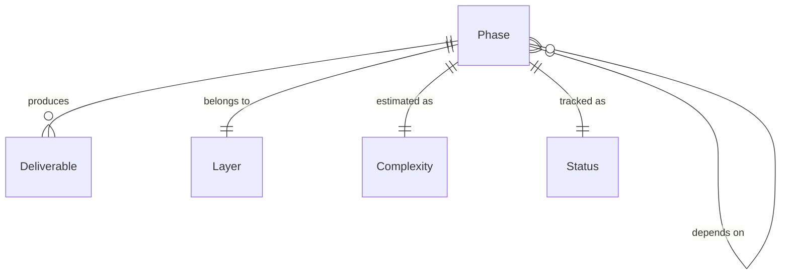

# Data Model: Engine Development Roadmap

**Feature**: 002-engine-development-roadmap
**Date**: 2026-04-21
**Last Amended**: 2026-09-06

## Overview

The roadmap document (`doc/roadmap.md`) is structured around a small set of well-defined entities. This data model describes those entities, their fields, relationships, and validation rules.

---

## Entities

### 1. Phase

The primary unit of work in the roadmap. Each Phase maps to exactly one speckit feature cycle.

| Field | Type | Required | Description |
|-------|------|----------|-------------|
| `number` | Integer (3-digit, zero-padded) | ✅ | Unique runtime identifier, e.g., `003`, `029`. Monotonically increasing and equal to the Speckit feature number. |
| `name` | String | ✅ | Human-readable name, e.g., "Core: Types & Memory" |
| `layer` | Layer (enum) | ✅ | Which architectural layer or cross-cutting runtime subsystem owns the phase |
| `dependencies` | List\<Phase.number\> | ✅ | Phase numbers that must be completed first. Can be empty (only for Phase 001). |
| `complexity` | Complexity (enum) | ✅ | Estimated effort: S, M, L, XL |
| `critical_path` | Boolean | ✅ | Whether this phase blocks other phases |
| `status` | Status (enum) | ✅ | Current progress state |
| `scope` | String (Markdown) | ✅ | Description of what the phase covers |
| `deliverables` | List\<Deliverable\> | ✅ | Concrete, verifiable outputs |
| `exclusions` | List\<String\> | ✅ | What is explicitly NOT included |
| `speckit_prompt` | String | ✅ | Ready-to-use prompt for `/speckit.specify` |

**Validation Rules**:
- `dependencies` must only reference phases with lower numbers (topological ordering)
- `dependencies` must not create circular references
- Every phase must have at least 1 deliverable
- `speckit_prompt` must be self-contained (no external references needed)
- Completed runtime phase numbers 003-029 are immutable; current future phases occupy 031-053

**State Transitions**:
```
⬜ Todo → 🔄 In Progress → ✅ Done
⬜ Todo → ⏸️ Paused → 🔄 In Progress → ✅ Done
```

---

### 2. Layer (Enum)

| Value | Description |
|-------|-------------|
| `Core` | Foundation utilities (types, math, logging, platform) |
| `Asset` | CPU-side content identities, metadata, import/cook/load contracts, and runtime asset management |
| `RHI` | Render Hardware Interface abstractions |
| `Backend` | Graphics API implementations (Vulkan, Metal, DX12, GL) |
| `Renderer` | Rendering pipelines and systems |
| `Application` | Window, input, scene graph, demos |

**Validation**: Every phase must use one of these values. Tools are offline
deliverables, not a runtime Layer value. The Asset layer may depend only on Core;
Renderer and Application may consume Asset contracts without introducing a
reverse dependency.

---

### 3. Complexity (Enum)

| Value | Estimated Duration | Description |
|-------|-------------------|-------------|
| `S` | 1-2 days | Small, well-scoped task |
| `M` | 3-5 days | Medium complexity, clear boundaries |
| `L` | 1-2 weeks | Large, may have sub-components |
| `XL` | 2-4 weeks | Very large, candidate for splitting |

---

### 4. Status (Enum)

| Value | Symbol | Description |
|-------|--------|-------------|
| `Todo` | ⬜ | Not yet started |
| `InProgress` | 🔄 | Spec or implementation underway |
| `Done` | ✅ | Implemented and verified |
| `Paused` | ⏸️ | Blocked or deferred |

---

### 5. Deliverable

A concrete, verifiable output of a phase.

| Field | Type | Required | Description |
|-------|------|----------|-------------|
| `name` | String | ✅ | Class/file/artifact name, e.g., `FVector3`, `IRHIDevice` |
| `description` | String | ✅ | Brief description of what it does |

**Validation**: Names must follow UE5 naming conventions (F-prefix for structs, I-prefix for interfaces, E-prefix for enums, T-prefix for templates).

---

### 6. Dependency (Relationship)

A directed edge in the phase dependency graph.

| Field | Type | Description |
|-------|------|-------------|
| `from` | Phase.number | The phase that has the dependency |
| `to` | Phase.number | The phase that must be completed first |

**Validation**:
- `to` < `from` (enforces topological ordering)
- The full dependency graph must be a DAG (no cycles)
- Transitive dependencies are implicit (if A→B→C, A does not need to list C)

---

## Entity Relationships



## Cross-Phase Governance Invariants

### Output Evidence

Feature 028 v2 references are historical evidence with
`sampleCount=1` and no general post-processing. A later phase that changes
formal output creates a new workload revision and exact-dimension Candidate,
requires explicit maintainer acceptance, prohibits alignment/cropping/scaling/
resampling, and retains only bounded PNG/JSON evidence.

### Temporal Contract

Feature 031 is the single owner of Renderer jitter, previous/current
`ViewProjection`, motion vectors, history ping-pong, reprojection,
depth/normal rejection, disocclusion, neighborhood clamp, and camera-cut/
resize/FOV invalidation. Feature 046 consumes and extends this contract for GI;
it cannot define an independent temporal framework.

### Shared Depth and Volume Signals

Feature 033 owns SceneDepthPyramid (extent, mip count, depth convention,
reduction and lifetime). Virtual-shadow requests, AO/SSR, GPU visibility and
SSGI consume the same contract. Volume histories use the shared temporal
lifecycle with density/light/advection-specific state, not surface velocity alone.

### Frame Quality Budget

A budget binds device/backend, scene/camera, extent, quality preset, warmup,
CPU/GPU timing availability, pass percentiles and resource bytes. Unknown GPU
timing is unavailable, not zero. Features 041/042 own measurement/integration.

### Renumbering Map

Roadmap 3.1 keeps completed 003-029, inserts interactive 030, and moves
all former unstarted 030-052 phases to 031-053 per `phase-index.json` and
`migration-3.1.md`. Feature 043 Meshlet Derived Data retains exactly
024/025/026/028 dependencies and remains independent of post-processing.
Dated completed artifacts are not rewritten to change their historical numbers.

---

## Roadmap Document Structure

The `doc/roadmap.md` file is organized as follows:

```
1. Overview (project state, design philosophy)
2. Architecture Principles (from constitution)
3. Phase Overview Table (all phases in tabular form)
4. Dependency Graph (Mermaid diagram)
5. Phase Details (one section per phase, all fields populated)
6. Parallel Development Tracks (groupings for concurrent work)
7. Risk Register (identified risks and mitigations)
8. How to Use This Roadmap (workflow instructions)
```

Each section maps to the entities above:
- **Phase Overview Table** → renders all Phase entities as rows
- **Dependency Graph** → renders all Dependency relationships as edges
- **Phase Details** → renders each Phase with all fields expanded

### Profiling scheduling amendment (3.0.1)

The full measurement stage is 040, after effects 030-039 and before acceptance
041. Before 040, diagnostics contain debug outputs, resource/sample counts and
bounded execution outcomes; they do not imply GPU timing or measured budget
acceptance. The index records `previousRoadmapVersion` and `previousToCurrent`
for the 3.0.0-to-3.0.1 move without replacing the original 2.3.2 migration.

### Current interactive UI contracts (3.1)

Feature 030 owns the application interaction session: captured-input state,
camera/settings commands and bounded presets. Renderer owns immutable UI draw
snapshots (vertices/indices, clip rectangles, texture identities) and RHI lifetime.
ImGui types remain private. Display-linear UI color/reference white is distinct
from exposed scene color. Capture policy separates interactive/UI smoke output
from frozen-camera, UI-disabled formal scene evidence. Feature 031 owns temporal
state, 041 owns full measurement and 042 integrated acceptance.
The earlier 3.0.1 subsection above is a historical scheduling record, not current
phase numbering. The index now maps 3.0.1 to 3.1 and retains prior migration history.
