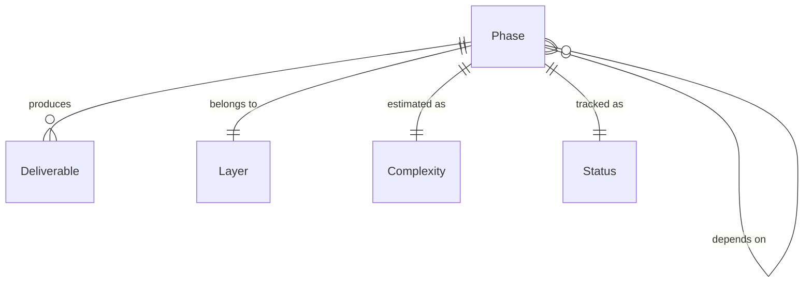

# Data Model: Engine Development Roadmap

**Feature**: 002-engine-development-roadmap
**Date**: 2026-04-21

## Overview

The roadmap document (`doc/roadmap.md`) is structured around a small set of well-defined entities. This data model describes those entities, their fields, relationships, and validation rules.

---

## Entities

### 1. Phase

The primary unit of work in the roadmap. Each Phase maps to exactly one speckit feature cycle.

| Field | Type | Required | Description |
|-------|------|----------|-------------|
| `number` | Integer (3-digit, zero-padded) | ✅ | Unique identifier, e.g., `002`, `003`. Monotonically increasing. |
| `name` | String | ✅ | Human-readable name, e.g., "Core: Types & Memory" |
| `layer` | Layer (enum) | ✅ | Which architectural layer this phase belongs to |
| `dependencies` | List\<Phase.number\> | ✅ | Phase numbers that must be completed first. Can be empty (only for Phase 001). |
| `complexity` | Complexity (enum) | ✅ | Estimated effort: S, M, L, XL |
| `critical_path` | Boolean | ✅ | Whether this phase blocks other phases |
| `status` | Status (enum) | ✅ | Current progress state |
| `scope` | String (Markdown) | ✅ | Description of what the phase covers |
| `deliverables` | List\<Deliverable\> | ✅ | Concrete, verifiable outputs |
| `exclusions` | List\<String\> | ✅ | What is explicitly NOT included |
| `speckit_prompt` | String | ✅ | Ready-to-use prompt for `/speckit.specify` |

**Validation Rules**:
- `dependencies` must only reference phases with lower numbers (topological ordering)
- `dependencies` must not create circular references
- Every phase must have at least 1 deliverable
- `speckit_prompt` must be self-contained (no external references needed)

**State Transitions**:
```
⬜ Todo → 🔄 In Progress → ✅ Done
⬜ Todo → ⏸️ Paused → 🔄 In Progress → ✅ Done
```

---

### 2. Layer (Enum)

| Value | Description |
|-------|-------------|
| `Core` | Foundation utilities (types, math, logging, platform) |
| `RHI` | Render Hardware Interface abstractions |
| `Backend` | Graphics API implementations (Vulkan, Metal, DX12, GL) |
| `Renderer` | Rendering pipelines and systems |
| `Application` | Window, input, scene graph, demos |

**Validation**: Every Layer must have at least 2 phases in the roadmap.

---

### 3. Complexity (Enum)

| Value | Estimated Duration | Description |
|-------|-------------------|-------------|
| `S` | 1-2 days | Small, well-scoped task |
| `M` | 3-5 days | Medium complexity, clear boundaries |
| `L` | 1-2 weeks | Large, may have sub-components |
| `XL` | 2-4 weeks | Very large, candidate for splitting |

---

### 4. Status (Enum)

| Value | Symbol | Description |
|-------|--------|-------------|
| `Todo` | ⬜ | Not yet started |
| `InProgress` | 🔄 | Spec or implementation underway |
| `Done` | ✅ | Implemented and verified |
| `Paused` | ⏸️ | Blocked or deferred |

---

### 5. Deliverable

A concrete, verifiable output of a phase.

| Field | Type | Required | Description |
|-------|------|----------|-------------|
| `name` | String | ✅ | Class/file/artifact name, e.g., `FVector3`, `IRHIDevice` |
| `description` | String | ✅ | Brief description of what it does |

**Validation**: Names must follow UE5 naming conventions (F-prefix for structs, I-prefix for interfaces, E-prefix for enums, T-prefix for templates).

---

### 6. Dependency (Relationship)

A directed edge in the phase dependency graph.

| Field | Type | Description |
|-------|------|-------------|
| `from` | Phase.number | The phase that has the dependency |
| `to` | Phase.number | The phase that must be completed first |

**Validation**: 
- `to` < `from` (enforces topological ordering)
- The full dependency graph must be a DAG (no cycles)
- Transitive dependencies are implicit (if A→B→C, A does not need to list C)

---

## Entity Relationships



---

## Roadmap Document Structure

The `doc/roadmap.md` file is organized as follows:

```
1. Overview (project state, design philosophy)
2. Architecture Principles (from constitution)
3. Phase Overview Table (all phases in tabular form)
4. Dependency Graph (Mermaid diagram)
5. Phase Details (one section per phase, all fields populated)
6. Parallel Development Tracks (groupings for concurrent work)
7. Risk Register (identified risks and mitigations)
8. How to Use This Roadmap (workflow instructions)
```

Each section maps to the entities above:
- **Phase Overview Table** → renders all Phase entities as rows
- **Dependency Graph** → renders all Dependency relationships as edges
- **Phase Details** → renders each Phase with all fields expanded
