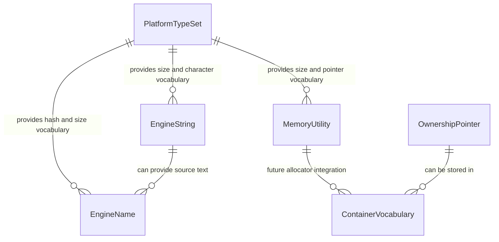

# Data Model: Core Foundation Types & Memory

**Feature**: 003-core-types-memory  
**Date**: 2026-04-27

## Overview

This feature defines Core-layer value and utility entities that later engine layers use as their default vocabulary. These are code-level entities rather than persisted data records.

---

## Entities

### 1. Platform Type Set

Canonical aliases for fixed-width and size-related primitive values.

| Field | Type | Required | Description |
|-------|------|----------|-------------|
| `signed_integer_types` | Alias set | Yes | Signed 8/16/32/64-bit integer vocabulary |
| `unsigned_integer_types` | Alias set | Yes | Unsigned 8/16/32/64-bit integer vocabulary |
| `character_types` | Alias set | Yes | Character vocabulary needed by Core strings |
| `size_types` | Alias set | Yes | Size and pointer-difference vocabulary |
| `pointer_integer_types` | Alias set | Yes | Integer vocabulary capable of storing pointer-sized values |

**Validation Rules**:

- Each fixed-width type must match its documented byte size on Windows, macOS, and Linux.
- Public names must remain available through Core public headers.
- No type alias may require higher-layer includes.

---

### 2. Engine String (`FString`)

Owning textual value for Core and later layer diagnostics and identifiers.

| Field | Type | Required | Description |
|-------|------|----------|-------------|
| `text` | Character sequence | Yes | Stored text value |
| `length` | Size value | Yes | Number of stored characters in the current representation |
| `is_empty` | Boolean | Yes | Whether the string has zero length |

**Validation Rules**:

- Default construction produces an empty value.
- Copy construction and copy assignment preserve text.
- Move construction and move assignment leave both source and destination valid.
- Equality compares textual content.
- Very long inputs either succeed or fail without corrupting existing values.

**State Transitions**:

```text
Empty -> Assigned -> Copied
Empty -> Assigned -> MovedFromValid
Assigned -> Cleared -> Empty
```

---

### 3. Engine Name (`FName`)

Immutable identifier optimized for repeated comparison.

| Field | Type | Required | Description |
|-------|------|----------|-------------|
| `text` | Engine String or textual value | Yes | Original name text used for collision-safe equality |
| `hash` | Unsigned integer | Yes | Hash used as the equality fast path |
| `is_empty` | Boolean | Yes | Whether the name was created from empty text |

**Validation Rules**:

- Construction from identical text produces equal names.
- Construction from different text produces unequal names even if an internal hash collision is simulated or forced in tests.
- Name values are immutable after construction.
- Equality is reflexive, symmetric, and transitive.

---

### 4. Ownership Pointer

Project-named vocabulary for shared and unique ownership.

| Field | Type | Required | Description |
|-------|------|----------|-------------|
| `owned_value` | Object reference | Optional | The object being owned |
| `ownership_mode` | Enum | Yes | `Shared` or `Unique` |
| `is_null` | Boolean | Yes | Whether the pointer currently owns or references no object |

**Validation Rules**:

- Unique ownership cannot be copied.
- Shared ownership can be copied and observes shared lifetime behavior.
- Null ownership values are valid.

---

### 5. Memory Utility (`FMemory`)

Core operations for raw memory management and byte manipulation.

| Field | Type | Required | Description |
|-------|------|----------|-------------|
| `size` | Size value | Yes | Number of bytes requested or operated on |
| `alignment` | Size value | Conditional | Required for aligned allocation |
| `source` | Memory address | Conditional | Required for copy and move operations |
| `destination` | Memory address | Conditional | Required for copy, move, set, and zero operations |

**Validation Rules**:

- Zero-size allocation returns a deterministic non-owning result.
- Valid aligned allocation returns an address aligned to the requested boundary.
- Deallocation accepts null without corruption.
- Copy, move, set, and zero affect exactly the requested byte range.
- Invalid allocation or alignment requests fail deterministically.

**State Transitions**:

```text
Unallocated -> Allocated -> Deallocated
Unallocated -> AllocationFailed
Allocated -> Written -> Deallocated
```

---

### 6. Container Vocabulary

Project-named dynamic array and key-value map collection vocabulary.

| Field | Type | Required | Description |
|-------|------|----------|-------------|
| `count` | Size value | Yes | Number of stored elements |
| `is_empty` | Boolean | Yes | Whether the container has zero elements |
| `elements` | Value sequence or key-value pairs | Optional | Stored values |

**Validation Rules**:

- Default construction produces an empty container.
- Inserted elements can be retrieved using the collection's normal access pattern.
- Empty containers are valid and report zero count.
- Copy and move behavior leaves values valid according to the selected backing collection semantics.

---

## Entity Relationships



---

## Scope Boundaries

- Math vectors, matrices, colors, and geometry primitives are excluded.
- Logging, assertions, and formatting are excluded.
- Platform file/process/time/window abstractions are excluded.
- Persistent serialization of names or strings is excluded.
