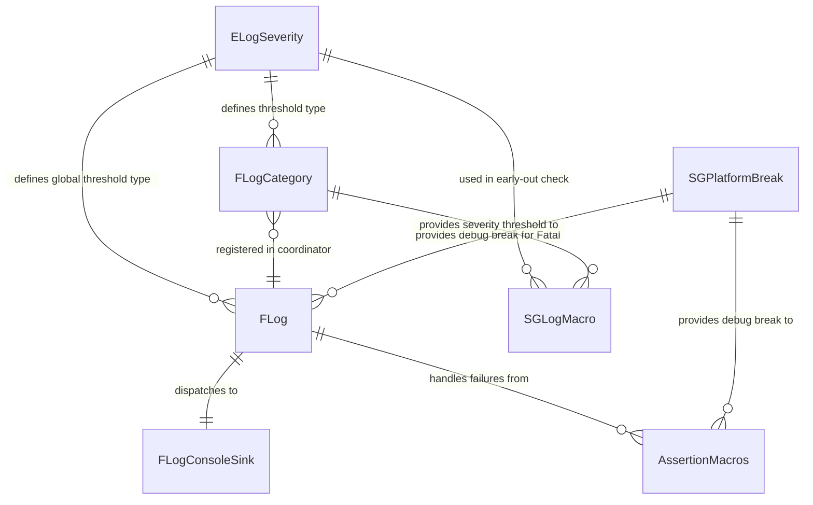

# Data Model: Core Foundation — Logging & Assertions

**Feature**: 005-core-logging-assertions
**Date**: 2026-05-13

## Overview

This feature defines Core-layer diagnostic entities: a structured logging system with severity-based filtering and assertion macros for runtime invariant checking. These are code-level entities that provide the engine's fundamental observability infrastructure.

---

## Entities

### 1. Log Severity (`ELogSeverity`)

Enumeration representing message importance levels, ordered from least to most severe.

| Value | Integer | Description |
|-------|---------|-------------|
| `Verbose` | 0 | Detailed diagnostic output for deep debugging |
| `Info` | 1 | General informational messages about engine state |
| `Warning` | 2 | Potential issues that do not prevent operation |
| `Error` | 3 | Errors that may affect functionality but are recoverable |
| `Fatal` | 4 | Unrecoverable errors that terminate the process |

**Validation Rules**:

- Values must be ordered such that `Verbose < Info < Warning < Error < Fatal`.
- Integer representation must support direct comparison for severity filtering.
- The enum must be usable in both macro contexts and function parameters.

---

### 2. Log Category (`FLogCategory`)

Named log category with an associated minimum severity filter. Categories are declared statically and self-register.

| Field | Type | Required | Description |
|-------|------|----------|-------------|
| `Name` | `const char*` | Yes | Human-readable category identifier (e.g., `"LogCore"`) |
| `MinSeverity` | `ELogSeverity` | Yes | Minimum severity threshold; messages below this are filtered |
| `DefaultMinSeverity` | `ELogSeverity` | Yes | The severity threshold set at declaration time |

**Validation Rules**:

- `Name` must be non-null and non-empty.
- `MinSeverity` can be changed at runtime for per-category filtering.
- `DefaultMinSeverity` is immutable after construction.
- Categories self-register into the global registry on construction.
- Multiple categories with different names can coexist across translation units without conflict.
- Duplicate category names (same static variable) must not cause double-registration errors.

**State Transitions**:

```text
Declared -> Constructed (self-registered) -> Active
Active -> FilterChanged (MinSeverity updated) -> Active
```

---

### 3. Log Coordinator (`FLog`)

Central coordinator that receives log messages, applies filtering, formats output, and dispatches to the active sink.

| Field | Type | Required | Description |
|-------|------|----------|-------------|
| `GlobalMinSeverity` | `ELogSeverity` | Yes | Global severity threshold applied when no per-category override |
| `ConsoleSink` | `FLogConsoleSink` | Yes | The default output sink |
| `OutputMutex` | `std::mutex` | Yes | Serializes sink writes for thread safety |
| `AssertionHandler` | Function pointer | Yes | Callback invoked on assertion failure (default: debug break) |

**Validation Rules**:

- Must function with default configuration before any explicit initialization (FR-014).
- `GlobalMinSeverity` defaults to `Verbose` (show everything).
- Thread-safe: concurrent `LogMessage` calls must produce non-interleaved output.
- Fatal messages must trigger process termination after logging (behavior differs by build config).
- The assertion handler is replaceable for testing purposes.

**State Transitions**:

```text
Uninitialized -> DefaultInitialized (on first use or static init)
DefaultInitialized -> Configured (global severity changed)
Configured -> Active (processing messages)
```

---

### 4. Console Sink (`FLogConsoleSink`)

Output sink that formats and writes log messages to the console.

| Field | Type | Required | Description |
|-------|------|----------|-------------|
| `FormatBuffer` | Stack array (1024 bytes) | Yes | Temporary buffer for message formatting |

**Validation Rules**:

- Verbose and Info messages write to `stdout`.
- Warning, Error, and Fatal messages write to `stderr`.
- Output format: `[HH:MM:SS.mmm] CategoryName: SeverityLabel: Message\n`
- Messages exceeding the format buffer are truncated with `...` indicator.
- Each write call produces exactly one complete line (atomic from the caller's perspective after mutex acquisition).

---

### 5. Assertion Macros

Macro-based interfaces for runtime invariant checking with compile-time stripping.

| Macro | Active In | Expression Evaluated | Format Message | On Failure |
|-------|-----------|---------------------|----------------|------------|
| `SG_CHECK(Expr)` | Debug only | Debug only | No | Log + debug break |
| `SG_VERIFY(Expr)` | Always evaluates | Always | No | Log + debug break (Debug only) |
| `SG_CHECKF(Expr, Fmt, ...)` | Debug only | Debug only | Yes | Log + debug break |

**Validation Rules**:

- `SG_CHECK`: In Release builds, the entire macro (including `Expr`) is compiled out. Zero cost.
- `SG_VERIFY`: `Expr` is always evaluated in all builds. The result check and failure handling only occur in Debug builds.
- `SG_CHECKF`: Same as `SG_CHECK` but includes a printf-formatted failure message.
- On failure (Debug), all macros report: source file, line number, failed expression text, and optional formatted message.
- After reporting, assertion failure triggers `SG_DEBUG_BREAK()` via the assertion handler. The developer can continue in the debugger.
- Assertions do NOT call `std::abort()`.

---

### 6. Platform Debug Break (`SG_DEBUG_BREAK`)

Platform-abstracted macro for triggering a debugger break point.

| Platform | Intrinsic |
|----------|-----------|
| MSVC (`_MSC_VER`) | `__debugbreak()` |
| Clang (`__clang__`) | `__builtin_debugtrap()` |
| GCC on POSIX (`__GNUC__`) | `raise(SIGTRAP)` |
| Fallback | `std::abort()` |

**Validation Rules**:

- Active when assertions are enabled (`_DEBUG` defined or `NDEBUG` absent).
- In Release builds (`NDEBUG` defined), `SG_DEBUG_BREAK()` expands to nothing.
- Must be resumable on platforms that support it (developer can continue after break).

---

## Entity Relationships



---

## Pre-Defined Log Categories

| Category | Default Min Severity | Owning Layer |
|----------|---------------------|--------------|
| `LogCore` | `Verbose` | Core |
| `LogRHI` | `Verbose` | RHI |
| `LogRenderer` | `Verbose` | Renderer |
| `LogBackend` | `Verbose` | Backend |
| `LogApplication` | `Verbose` | Application |

All pre-defined categories are declared in Core headers and defined in Core source, making them available to all layers without circular dependencies.

---

## Scope Boundaries

- File-based log sinks are excluded (future enhancement).
- Remote/network logging is excluded.
- Profiling and performance timing instrumentation are excluded.
- Color/ANSI terminal output is excluded (future enhancement).
- Log message queuing or async logging is excluded.
- Custom allocator integration for log buffers is excluded.
