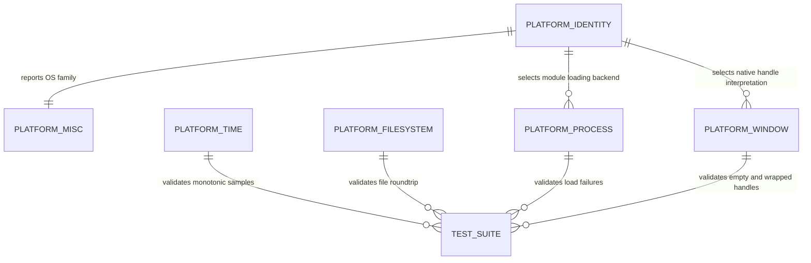

# Data Model: Core Foundation - Platform Abstraction Layer

**Feature**: 006-core-platform-abstraction  
**Date**: 2026-06-24

## Overview

This feature defines Core-layer platform abstraction entities. These are code-level entities that let engine code query platform identity, gather basic platform information, measure monotonic time, perform simple local file operations, load optional runtime modules by explicit path, and pass native window handles without leaking operating-system details into higher layers.

---

## Entities

### 1. Platform Identity (`SG_PLATFORM_*`)

Build-time platform identity constants for supported operating-system families.

| Macro | Value Rule | Description |
|-------|------------|-------------|
| `SG_PLATFORM_WINDOWS` | `1` only on Windows, otherwise `0` | Windows build target |
| `SG_PLATFORM_MAC` | `1` only on macOS, otherwise `0` | macOS build target |
| `SG_PLATFORM_LINUX` | `1` only on Linux, otherwise `0` | Linux build target |

**Validation Rules**:

- Exactly one supported platform macro must evaluate to `1`.
- Unsupported platforms must fail clearly at build time or report unsupported status during planning.
- Public call sites must use `SG_PLATFORM_*` rather than raw OS/compiler macros.

---

### 2. Platform Information (`FPlatformMisc`)

Queries host-level diagnostic information.

| Field / Result | Type | Required | Description |
|----------------|------|----------|-------------|
| `OSName` | Text value | Yes | Human-readable current operating system family/name |
| `CPUCoreCount` | Positive integer | Yes | Logical CPU core count when available |
| `AvailableMemoryBytes` | Unsigned integer | No | Available physical memory, or zero/unavailable when the platform cannot provide it |

**Validation Rules**:

- OS name must be non-empty on supported platforms.
- CPU core count must be at least `1`.
- Memory availability may be unavailable; unavailable must be represented safely without crashing.

**Failure States**:

```text
Supported -> QuerySuccess
Supported -> QueryUnavailable (optional field unavailable)
Unsupported -> BuildOrRuntimeFailure
```

---

### 3. Platform Timestamp (`FPlatformTime`)

Monotonic time values and duration conversion helpers.

| Field / Result | Type | Required | Description |
|----------------|------|----------|-------------|
| `Timestamp` | Opaque numeric value | Yes | Monotonic timestamp for elapsed-time measurements |
| `Seconds` | Floating-point duration | Yes | Converted elapsed seconds |
| `Milliseconds` | Floating-point duration | Yes | Converted elapsed milliseconds |
| `Microseconds` | Floating-point duration | Yes | Converted elapsed microseconds |

**Validation Rules**:

- Repeated timestamp reads in a single process must never move backward.
- Elapsed duration from a later timestamp minus an earlier timestamp must be non-negative.
- Conversion helpers must be deterministic for the same timestamp delta.

**State Transitions**:

```text
NoTimestamp -> CapturedStart -> CapturedEnd -> DurationComputed
```

---

### 4. File Operation Result (`FPlatformFileSystem`)

Represents the outcome of basic local filesystem operations.

| Operation | Required Behavior |
|-----------|-------------------|
| Exists | Reports whether a file or directory exists |
| ReadFile | Reads a file payload byte-for-byte |
| WriteFile | Writes a file payload byte-for-byte |
| CreateDirectory | Recursively creates missing parent directories and final directory |

**Validation Rules**:

- Read and write preserve 100% of bytes for representative payloads up to 1 MB.
- Missing files, directories used as files, and inaccessible paths fail without crashing.
- Recursive directory creation succeeds if the final directory exists after the operation.
- Paths with spaces must be preserved. Non-ASCII path behavior must complete or fail clearly without corrupting the path value.

**Failure States**:

```text
Requested -> Success
Requested -> MissingPath
Requested -> PermissionDenied
Requested -> InvalidPath
Requested -> TypeMismatch
```

---

### 5. Dynamic Module Handle (`FPlatformProcess`)

Represents an optional runtime module loaded by explicit file path.

| Field / Result | Type | Required | Description |
|----------------|------|----------|-------------|
| `ModuleHandle` | Opaque handle | Yes | Valid loaded module or invalid/null handle |
| `SymbolAddress` | Opaque address | No | Resolved entry point address or null/invalid |
| `ExplicitPath` | Path value | Yes | Full or relative file path supplied by caller |

**Validation Rules**:

- Loading requires an explicit file path.
- Bare module names and implicit platform search paths are not supported.
- Missing modules, missing symbols, and invalid handles are recoverable failures.
- Releasing an invalid handle is a safe no-op.
- A valid loaded handle has single ownership, cannot be copied, can transfer
  ownership through move operations, and is released exactly once either
  explicitly or when its owner is destroyed.

**State Transitions**:

```text
Invalid -> LoadAttempted -> Loaded -> SymbolResolved -> Released
Invalid -> LoadAttempted -> LoadFailed
Loaded -> SymbolLookupFailed -> Loaded
Loaded -> OwnerDestroyed -> Released
Invalid -> ReleaseNoOp
```

---

### 6. Native Window Handle (`FPlatformWindow`)

Opaque Core-owned representation of an operating-system window reference.

| Field / Result | Type | Required | Description |
|----------------|------|----------|-------------|
| `NativeHandle` | Opaque pointer/integer-sized value | Yes | Platform window reference or empty value |
| `IsValid` | Boolean | Yes | Whether the handle represents a non-empty window reference |

**Validation Rules**:

- Empty handles are invalid but safe to copy, compare, store, and pass around.
- Public Core headers must not include OS, windowing framework, RHI, Backend, Renderer, Application, or graphics API headers.
- Platform-specific backend code may retrieve the opaque value only behind platform-specific implementation boundaries.

**State Transitions**:

```text
Empty -> WrappedNativeHandle -> Valid
Valid -> Cleared -> Empty
```

---

## Entity Relationships



---

## Scope Boundaries

- Full window creation, input, events, and lifetime ownership are excluded.
- Threading primitives are excluded.
- Networking is excluded.
- Process spawning and command-line parsing are excluded.
- Environment variable management is excluded.
- File watching, permissions management, streaming I/O, and virtual filesystem behavior are excluded.
- Plugin lifecycle and module dependency management are excluded.
