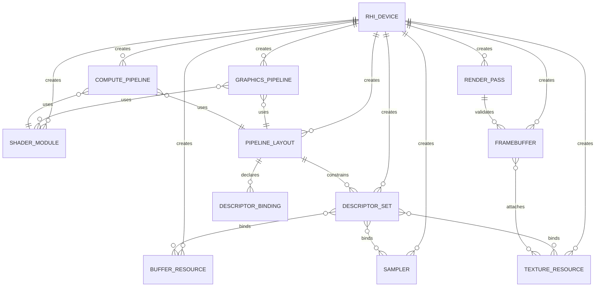

# Data Model: RHI Resource & Pipeline Interfaces

**Feature**: 008-rhi-resource-pipeline  
**Date**: 2026-06-26

## Overview

This feature defines RHI-layer resource and pipeline entities. These entities let engine code describe GPU resources, shader modules, binding layouts, descriptor sets, graphics/compute pipelines, render passes, and framebuffers in a backend-neutral way. The data model is contract-level: it captures identity, descriptions, lifecycle states, validation rules, and relationships without requiring real GPU allocation or graphics API handles.

## Shared Concepts

### Result / Status

Uses the existing RHI result model for recoverable outcomes.

**Required behavior**:
- Creation success returns a usable object and success status.
- Invalid descriptions return invalid-state or failed status.
- Unsupported format, usage, shader stage, or descriptor combination returns unsupported status.
- Invalidated object usage returns invalid-state status.

### Resource Lifecycle State

Applies to resources and pipeline-family objects introduced by this feature.

```text
Created -> Valid -> Invalidated
```

**Validation rules**:
- Valid objects can be queried and used in compatible operations.
- Invalidated objects remain safe to query for state but cannot be used for binding, pipeline creation, render pass compatibility, or framebuffer creation.
- Device shutdown or explicit mock invalidation can transition objects to Invalidated.

## Entities

### 1. Buffer Resource

**Purpose**: Represents a GPU-addressable byte range.

**Fields / Properties**:
- Size in bytes.
- Composable usage flags: vertex, index, uniform, storage, copy source, copy destination, indirect, and future-compatible categories.
- Lifecycle state.
- Creation result.

**Relationships**:
- Created by an RHI device.
- May be bound through descriptor sets.
- May be referenced by graphics pipeline vertex input contracts where applicable.

**Validation Rules**:
- Size must be greater than zero.
- Usage flags must include at least one valid usage.
- Incompatible usage flag combinations must be rejected explicitly.
- Invalidated buffers cannot be bound or used for pipeline/frame setup.

### 2. Texture Resource

**Purpose**: Represents a one-, two-, three-dimensional, cube, or array image.

**Fields / Properties**:
- Dimension type: 1D, 2D, 3D, cube, array.
- Width, height, depth.
- Mip level count.
- Array layer count.
- Sample count.
- Format.
- Composable usage flags: sampled, storage, color attachment, depth-stencil attachment, copy source, copy destination, presentation-adjacent.
- Lifecycle state.
- Creation result.

**Relationships**:
- Created by an RHI device.
- May be bound through descriptor sets.
- May be used as framebuffer attachment if compatible with render pass expectations.

**Validation Rules**:
- Width, height, and depth values required by the dimension type must be greater than zero.
- Cube textures must have square faces.
- Mip level and array layer counts must be valid for the dimension type.
- Format and usage combinations must be compatible.
- Invalidated textures cannot be bound or attached.

### 3. Sampler

**Purpose**: Represents texture sampling behavior.

**Fields / Properties**:
- Minification and magnification filtering.
- Mip filtering.
- Address modes for U/V/W axes.
- Optional comparison behavior.
- Lifecycle state.
- Creation result.

**Relationships**:
- Created by an RHI device.
- May be bound independently or as a combined texture-sampler descriptor.

**Validation Rules**:
- Filter and address mode values must be recognized by the RHI contract.
- Invalidated samplers cannot be bound.

### 4. Shader Module

**Purpose**: Represents shader payload identity used by pipeline descriptions.

**Fields / Properties**:
- Declared shader stage.
- Entry point identity.
- Opaque payload identity.
- Optional debug name.
- Lifecycle state.
- Creation result.

**Relationships**:
- Created by an RHI device.
- Referenced by graphics or compute pipeline descriptions.

**Validation Rules**:
- Stage must be declared.
- Entry point identity must be non-empty.
- Opaque payload identity must be present.
- Bytecode validation is out of scope.
- Unsupported future stages are reported explicitly rather than accepted silently.

### 5. Pipeline Layout

**Purpose**: Represents the binding contract between shader stages and descriptor sets.

**Fields / Properties**:
- One or more descriptor set layouts.
- Descriptor bindings per set.
- Set index.
- Binding slot.
- Descriptor type.
- Array count.
- Shader stage visibility.
- Lifecycle state.

**Relationships**:
- Created by an RHI device.
- Used by descriptor sets.
- Referenced by graphics and compute pipelines.

**Validation Rules**:
- Set indices and binding slots must be unique within their scope.
- Descriptor array counts must be greater than zero.
- Descriptor types must match resource categories.
- Invalidated layouts cannot create descriptor sets or pipelines.

### 6. Descriptor Binding

**Purpose**: Represents one declared resource binding.

**Fields / Properties**:
- Set index.
- Binding slot.
- Descriptor type.
- Array count.
- Shader stage visibility.

**Relationships**:
- Belongs to a pipeline layout.
- Constrains descriptor set updates.

**Validation Rules**:
- Binding slot must be unique within a set.
- Shader visibility must include at least one supported stage.
- Descriptor type determines the allowed resource category.

### 7. Descriptor Set

**Purpose**: Represents concrete resource assignments for one set index in a pipeline layout.

**Fields / Properties**:
- Parent pipeline layout identity.
- Set index.
- Bound resources by binding slot and array index.
- Ready/validity state.
- Lifecycle state.

**Relationships**:
- Created by an RHI device for a pipeline layout and set index.
- Binds buffers, textures, samplers, or combined texture-sampler resources.
- Used by future command recording and pipeline execution flows.

**Validation Rules**:
- Updates must target declared bindings.
- Resource category must match descriptor type.
- Array index must be within the declared array count.
- Invalidated resources or descriptor sets cannot be used.

### 8. Graphics Pipeline

**Purpose**: Represents fixed and programmable graphics state.

**Fields / Properties**:
- Shader stages.
- Pipeline layout.
- Vertex input description.
- Primitive topology.
- Rasterization behavior.
- Blend behavior.
- Depth-stencil behavior.
- Compatible render target / render pass information.
- Lifecycle state.
- Creation result.

**Relationships**:
- Created by an RHI device.
- References shader modules and a pipeline layout.
- Must be compatible with render pass/framebuffer expectations.

**Validation Rules**:
- Required shader stages must be present.
- Duplicate incompatible stages must be rejected.
- Referenced shader modules and layout must be Valid.
- Render target formats and attachment expectations must be compatible.

### 9. Compute Pipeline

**Purpose**: Represents compute execution state.

**Fields / Properties**:
- Exactly one compute shader stage.
- Pipeline layout.
- Lifecycle state.
- Creation result.

**Relationships**:
- Created by an RHI device.
- References one shader module and one pipeline layout.

**Validation Rules**:
- Must include exactly one compute stage.
- Non-compute stages must be rejected.
- Referenced shader module and layout must be Valid.

### 10. Render Pass

**Purpose**: Represents a single-subpass render target flow.

**Fields / Properties**:
- Attachment descriptions.
- Attachment roles: color and optional depth-stencil.
- Load behavior.
- Store behavior.
- Attachment formats.
- Sample counts.
- Lifecycle state.
- Creation result.

**Relationships**:
- Created by an RHI device.
- Used to validate graphics pipeline render target compatibility.
- Used by framebuffer creation.

**Validation Rules**:
- At least one color or depth-stencil attachment role must be declared.
- Attachment formats must be supported.
- Multi-subpass dependency modeling is out of scope.
- Invalidated render passes cannot create framebuffers or validate pipelines.

### 11. Framebuffer

**Purpose**: Represents concrete texture attachments compatible with a render pass.

**Fields / Properties**:
- Render pass reference.
- Texture attachments.
- Width and height.
- Attachment count.
- Lifecycle state.
- Creation result.

**Relationships**:
- Created by an RHI device.
- References a render pass and texture resources.

**Validation Rules**:
- Attachment count must match render pass expectations.
- Attachment formats must match render pass attachment descriptions.
- Attachment dimensions and sample counts must be compatible.
- Invalidated textures or render passes cannot be used.

## Entity Relationships



## Scope Boundaries

- Real GPU memory allocation is excluded.
- Shader bytecode validation and compilation are excluded.
- Resource upload scheduling is excluded.
- Backend object creation is excluded.
- Multi-subpass render pass dependency modeling is excluded.
- Ray tracing and mesh shader pipeline contracts are excluded.
- Render graph execution is excluded.
