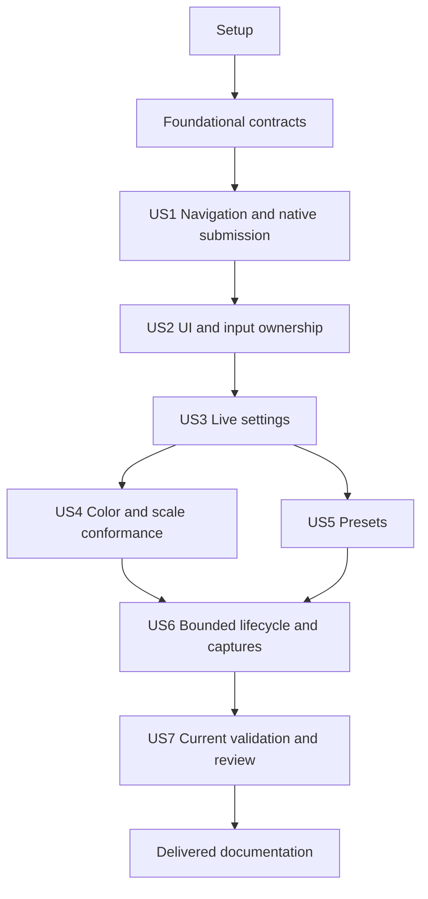

# Tasks: Application Interactive Rendering Lab & ImGui Integration

**Feature**: 030 | **Branch**: `030-interactive-rendering-lab` | **Date**: 2026-09-06
**Input**: [spec.md](spec.md), [plan.md](plan.md), [research.md](research.md), [data-model.md](data-model.md), [quickstart.md](quickstart.md), and all five [contracts](contracts/).
**Status**: Implementation started. Checked tasks record reviewed completion; native/hosted/human acceptance remains pending. Optional maintenance1 capability now selects a preferred path or bounded fallback; missing target inventory does not block Vulkan work. See Validation/030/README.md for remaining execution evidence gaps.

## Format and execution rules

- Each task has a sequential ID, an optional `[P]`, a `[USn]` in story phases, exact repository-relative file paths and explicit predecessor IDs.
- `[P]` means that after its listed prerequisites are complete it can run with the matching disjoint-file tasks identified below. It does not authorize concurrent edits to shared build/registration files or concurrent use of one physical device.
- Tests are required by FR-029 / SC-002–SC-008. Write the listed failure fixtures before their implementations; establish the relevant failure, then pass them at the story checkpoint. Do not register a placeholder suite that reports success.
- New paths below are intended files; inspect neighboring implementations before adding them. Preserve layer ownership and the public/private separation in the plan. Existing public signatures can be refined without weakening a contract.
- The fixed bounds/tolerances, normalized preset bytes, pinned dependency identity and native ownership rules come from the contracts. Do not substitute guessed tolerances or silently relax a limit to make a test pass.
- Formal captures use frozen inputs and before/after software guards. Preview, presets and UI smoke have no authority to modify Accepted references; current human decisions cannot be generated by automation.
- Register focused suites/build sources in serialized integration tasks. No task here requests a full editor, new effect, temporal history, VT, full profiler or optional backend.

## Phase 1: Setup (Shared Infrastructure)

**Goal**: Establish reproducible limits, source boundaries and regression inventories without claiming new evidence.

**Entry dependency**: None.

**Independent test**: Configuration/schema checks reproduce the design limits; no runtime or Accepted file is changed.

### Implementation and verification

- [X] T001 Record existing camera/output/Asset regression commands, frozen-input digests and no-claim rules in `Validation/030/README.md`; record available Windows/Linux device inventory and unknowns without treating optional maintenance1 support as an implementation gate. T021 owns runtime detection/fallback and later native tasks own actual execution evidence.
- [X] T002 [P] Encode resource/camera/tolerance/time limits in `Config/Validation/InteractiveLab/Limits-v1.json` and the four endurance/eight smoke/representative lifecycle case table in `Config/Validation/InteractiveLab/Coverage-v1.json`; retain all workload/profile functional, formal SDR and current human gates. (depends on T001)
- [X] T003 [P] Extend `.github/scripts/verify_output_transform_architecture.py` with additive 030 checks for private ImGui, shared build-only yyjson, no Application/Renderer native API calls and no runtime shader compilation; preserve all existing checks and their default behavior rather than create another checker. (depends on T001)
- [X] T004 Define focused-suite fixtures and bounded script coverage inventory in `Tests/Fixtures/InteractiveLab/README.md`; record explicit failure-first expectations and all 29 FR / 8 SC mappings without registering passing placeholder suites. (depends on T002, T003)

**Checkpoint**: Complete T001–T004 and satisfy the independent test above before claiming this increment complete.

## Phase 2: Foundational (Blocking Shared Contracts)

**Goal**: Freeze public engine values and compatibility defaults used by every story.

**Entry dependency**: Complete Phase 1. These shared contracts block all story implementations.

**Independent test**: Public headers build without ImGui/GLFW/native types; unsupported deferred submit does not submit work and old defaults remain valid.

### Tests (write before implementation)

- [X] T005 [P] Add default-Unsupported deferred-submit and default-RGBA/invalid-mask contract tests in `Tests/RHILabContractTests.cpp`; successful submit acceptance must not be asserted as presentation completion. (depends on T004)
- [X] T006 [P] Add finite/generation/range validation fixtures for camera, settings and copied UI values in `Tests/InteractiveLabValueTests.cpp`. (depends on T004)

### Implementation and verification

- [X] T007 Add `SubmitDeferred` with mandatory fence and default Unsupported behavior to `Source/RHI/Public/RHI/IRHICommandQueue.h`, plus explicit deferred/presentation capability values in `Source/RHI/Public/RHI/FRHIDeviceCapabilities.h` and `Source/RHI/Public/RHI/FRHIPresentationCapabilities.h`; preserve ordinary Submit callers. (depends on T005)
- [X] T008 Define validated `ERHIColorWriteMask` flags with RGBA default in `Source/RHI/Public/RHI/FRHIGraphicsPipelineDesc.h` and existing pipeline-state validation; no legacy alpha-factor behavior change. (depends on T007)
- [X] T009 Define generation-safe borrowed acquired-target and separate render/presentation lease values in `Source/RHI/Public/RHI/FRHIPresentationFrame.h`; make image-indexed ownership independent of the two slot indices. (depends on T008)
- [X] T010 Define finite/bounded camera, display, ownership and settings values with monotonic invalid-zero identities in `Source/Application/Public/Application/FFreeCameraState.h`, `Source/Application/Public/Application/FWindowDisplayState.h`, `Source/Application/Public/Application/FInputOwnershipSnapshot.h` and `Source/Application/Public/Application/FLabSettingsSnapshot.h`; include FCameraChangeSet with the camera values. (depends on T006, T009)
- [X] T011 Define copied vertices/indices/commands, slot-generation texture IDs, request/result records and color/reference-white settings in `Source/Renderer/Public/Renderer/FUIDrawSnapshot.h`, `Source/Renderer/Public/Renderer/FUITextureRequest.h` and `Source/Renderer/Public/Renderer/FUICompositionSettings.h`. (depends on T010)
- [X] T012 Introduce explicit InteractivePreview/FormalValidation execution-purpose and readback-selection values in `Source/Renderer/Public/Renderer/FOutputTransformPlan.h` and `Demo/StonerDemo/Private/FProductionContentDeferredExecution.h`; preserve formal default policy. (depends on T011)
- [X] T013 Register foundation suites in `Tests/Main.cpp` and wire `Tests/SConscript`; run them with existing output/RHI regressions and strict header/build checks, recording results in `Build/Validation/030/foundation.json`. (depends on T012)

**Checkpoint**: Complete T005–T013 and satisfy the independent test above before claiming this increment complete.

## Phase 3: User Story 1 — Navigate a Production Scene Interactively (P1 / MVP)

**Goal**: Deliver reusable navigation and a native UI-hidden lab with actual deferred presentation.

**Entry dependency**: Phase 2 complete. No other user story is required; use --lab-ui off for this checkpoint.

**Independent test**: On Lantern and Sponza, navigate/reset/resize/refocus without restart; native delayed-completion tests prove two slots, no image readback bridge, and separate presentation release.

### Tests (write before implementation)

- [X] T014 [P] [US1] Add +X-basis, normalized diagonal, speed/Shift, RMB/FOV/reset, 30/60/120 Hz and changed-aspect regression fixtures in `Tests/ApplicationFreeCameraTests.cpp`; preserve near/far 0.1/100 and the stated matrix tolerances. (depends on T013)
- [X] T015 [P] [US1] Add delayed render/present completion, stale borrowed-target, optional-extension detection/selection (present, absent, feature false, forced off, enablement failure), finite timeout, render-complete/present-pending independent retirement, capped predecessor/canceled-image ownership, terminal idle/assurance/watchdog failure and formal-default fixtures in `Tests/RHIDeferredSubmissionTests.cpp`. (depends on T013)

**T015 review**: The registered rhi-deferred-submission suite covers 21 submission/ownership/default assertions and 70 private Vulkan capability/retirement-policy assertions. Native deferred/borrowed suites cover real retained submission, injected delayed observation/finite waits, stale identity, cancellation and independent release. Session fixtures now additionally reject completed cleanup with retained native owners and preserve device-loss/drain-timeout failure through eventual cleanup; the independent child watchdog proves forced exit stays failed. Strict Debug/Release each pass 91 RHI, 26 session and 1 watchdog assertions, plus 29 deferred-native and 47 borrowed-target assertions. T034's new repeated focus/resize/pause regression reproduces and fixes the former integration failure. These complementary suites close T015 without claiming injected failures are observed GPU failures. See Validation/030/README.md.

### Implementation and verification

- [X] T016 [P] [US1] Implement reusable `FFreeCameraController` in `Source/Application/Private/FFreeCameraController.cpp` and `Source/Application/Public/Application/FFreeCameraController.h`; use current drawable aspect on initialize/reset, finite/clamped time, vertical FOV and discontinuity flags. (depends on T014)
- [X] T017 [P] [US1] Introduce bounded backend-private native submission records and persistent RHI-resource generation realization in `Source/Backend/Vulkan/Private/FDeferredNativeSubmission.h` and `Source/Backend/Vulkan/Private/FDeferredNativeSubmission.cpp`; retain native command/descriptor/buffer owners after return. (depends on T015)
- [X] T018 [P] [US1] Implement deferred acceptance and render completion retention in `Source/Backend/Metal/Private/FMetalQueue.mm` and its header, preserving existing Submit semantics and truthful queued/completed counters. (depends on T015)
- [X] T019 [US1] Refactor `Source/Backend/Vulkan/Private/FVulkanNativeContext.cpp` to record/submit through retained native records without per-call infinite waits/readback/cleanup; retain the existing formal synchronous facade over its own record. (depends on T017)
- [X] T020 [US1] Wire `Source/Backend/Vulkan/Private/FVulkanQueue.cpp` and `Source/Backend/Vulkan/Private/FVulkanFence.cpp` to real deferred submit, native fence polling and finite waits; do not fake completion or fall back to synchronous Submit. (depends on T019)

**T017/T019/T020 review**: Retained native command/descriptor/buffer/texture/pipeline ownership, bounded two-record admission, real fence polling/finite waits, and the preserved synchronous facade passed strict Debug/Release integration and 29 required native deferred assertions. Host-delayed completion and post-submit observation failure are explicit test simulations around real native submission. Presentation semaphores, borrowed images and presentation release remain T021/T022 work; these completed render-submission tasks do not close T015 or the US1 checkpoint. See Validation/030/README.md for working-tree evidence and limitations.

- [X] T021 [US1] Implement selected-device optional maintenance1 query/enablement and PresentationFence/AcquireHistory policy in `Source/Backend/Vulkan/Private/FVulkanNativeContext.cpp`, exposing backend-neutral mode/reason in `Source/RHI/Public/RHI/FRHIPresentationCapabilities.h`. Implement image-indexed synchronization, canceled-image ownership, replacement failure and capped predecessor retirement: <=8 images/generation, <=2 generations/16 records, <=512 MiB estimated swapchain bytes; coalesce/pause at cap. Missing extension selects fallback. Keep the two policies in backend-private helpers as needed, not a general framework; follow contracts/lab-runtime.md. (depends on T020)
- [X] T022 [US1] Register acquired Vulkan swapchain images as borrowed generation-tagged RHI render targets in `Source/Backend/Vulkan/Private/FVulkanNativeContext.cpp`; write final output directly, with acquire/render/present synchronization and no assumption that symbolic TextureCopy works. (depends on T021)

**T021/T022 review**: The capability-selected native helper and Context/queue/surface/swapchain bridge passed strict Debug/Release builds, 47 required native borrowed-target assertions per configuration, 67 existing required native regressions, and 374 related assertions. On the current M4 device, automatic mode selected enabled presentation fences and forced fallback selected acquire history. Real clear-frame probes cover twelve-frame reuse, distinct presentation proof, typed/semaphore submission, zero-extent public requests/resume, logical cancellation, invalid identity/owner rejection and terminal host-owner cleanup. Seventy policy assertions and 85 controlled-call assertions separately exercise bounded retirement rules. These backend implementation tasks are complete; T015's remaining failure/watchdog coverage and T034's integrated Lantern/Sponza checkpoint remain open. No formal 030 hardware acceptance, OS minimize/focus coverage or HDR human authority is claimed. See Validation/030/README.md.

- [X] T023 [US1] Expose borrowed drawable targets and separate presentation lease completion in `Source/Backend/Metal/Private/FMetalPresentationContext.mm` and `Source/Backend/Metal/Private/FMetalPresentationSurface.mm`; remove preview reliance on the formal facade wait. (depends on T018)
- [X] T024 [US1] Add engine cursor-mode and focus/extent update services in `Source/Application/Private/FWindowDriver.h`, `Source/Application/Private/FWindow.cpp`, `Source/Application/Private/FGlfwWindowDriver.cpp` and `Source/Application/Private/FHeadlessWindowDriver.cpp`; remove unconditional Escape close and clear pointer baselines/capture on focus loss. (depends on T016)
- [X] T025 [US1] Adapt existing calibration-only callers in `Demo/StonerDemo/Private/FProductionCameraPreview.cpp`, `Demo/StonerDemo/Private/FProductionCameraPreviewRun.cpp` and `Tests/ProductionCameraPreviewTests.cpp` to reused math while retaining frozen matrices/candidate bytes and explicit legacy exit policy. (depends on T024)
- [x] T026 [US1] Implement record/SubmitPreview/poll/retire seams in `Source/Renderer/Private/FOutputTransformExecutor.cpp` and its public header; queued preview must not call unconditional WaitForCompletion or satisfy formal Succeeded/probe publication. (depends on T022, T023)
- [x] T027 [US1] Split preview zero-readback bindings from formal six-readback/diagnostic requirements in `Demo/StonerDemo/Private/FProductionContentDeferredExecution.cpp` and `Demo/StonerDemo/Private/FProductionSubmissionHarness.cpp`; validate execution purpose explicitly. (depends on T026)
- [x] T028 [US1] Implement `Demo/StonerDemo/Private/FLabProductionFrameContext.cpp` and its header with two slots, per-slot mutable uniforms/attachments and immutable scene leases; enforce checked render-target budgets and retire render resources separately from presentation leases using the resource ownership table in contracts/lab-runtime.md. (depends on T027)
- [x] T029 [US1] Add backend-neutral acquired-target lab presentation bindings in `Demo/StonerDemo/Private/FDemoBackendFactory.h` and `Demo/StonerDemo/Private/FDemoBackendFactory.cpp`; bypass PresentProductionImage/readback-reupload without changing formal presentation APIs. (depends on T028)
- [x] T030 [US1] Implement Application session states and camera-only commands in `Source/Application/Private/FInteractiveLabSession.cpp` and `Source/Application/Public/Application/FInteractiveLabSession.h`; handle zero extent, fresh-input resume, busy-slot event service, bounded drain and explicit exit, including terminal-only fallback idle cleanup isolated from event service, 5 s failure deadline and 10 s process shutdown watchdog; retain native owners and distinguish IdleAssumed/Proven/Forced/DeviceLost. Use existing lifecycle/process facilities, no new executable. (depends on T025, T029)
**T030 review**: Application session/camera coordination, coalesced transitions, fresh-input resume, bounded diagnostics and independent terminal worker/watchdog are implemented. Two-slot pending-acquire cancellation is connected through Vulkan/Metal and the Demo facade. Debug/Release each passed 337 related assertions and 96 native regressions. The watchdog test uses shortened bounded deadlines and a deliberately blocked callback in a child process; it does not claim an observed GPU hang or formal hardware acceptance. T032 composes these callbacks with the actual strict-cooked scene loop, and T033 publishes actual terminal assurance/owner counters. See Validation/030/README.md.

- [x] T031 [US1] Implement core --interactive-lab / --lab-ui switches and validate-only --lab-vulkan-retirement auto|acquire-history selection and mode incompatibility/exit validation in `Demo/StonerDemo/Private/FDemoConfiguration.cpp` and `Demo/StonerDemo/Private/FDemoConfiguration.h`; no calibration/formal-capture coexistence. (depends on T030)
- [X] T032 [US1] Compose strict-cooked production startup, current-drawable camera and acquired-target loop in `Demo/StonerDemo/Private/FInteractiveLabRun.cpp` and `Demo/StonerDemo/Private/FStonerDemoApplication.cpp`; UI-off startup loads only existing scene/output closure, with no UI preparation; keep formal runs isolated from live state. (depends on T031)
**T032 review**: The UI-off lab now loads the existing strict-cooked scene/output closure, adapts the calibration camera to the actual drawable, and runs two deferred preview slots through the Renderer ticket and borrowed native target seams. Equivalent native BGRA8 SDR storage is explicitly bound only for zero-readback preview; formal output identity stays canonical. Initial Metal and forced-acquire-history Vulkan resize/minimize/restore runs passed; T033 repetition subsequently exposed intermittent transition failures, so lifecycle acceptance remains open. Debug/Release each passed 391 related assertions, 67 additional native regressions, and two 33-assertion scene lifecycle invocations; five Release Lantern/Sponza backend/mode smokes passed. Final fallback cleanup records IdleAssumed, independently of render completion. T034 checkpoint evidence and T015 remaining failure coverage are still open; T033 counters are reviewed below. UI-on remains explicitly unavailable until US2 is implemented. See Validation/030/README.md.

- [X] T033 [US1] Record actual image-copy/map/wait, idle-call, submitted/render-completed/present-released and quiescent-owner counters in `Demo/StonerDemo/Private/FLabProductionFrameContext.cpp`; zero-capture measurements include native operations, not only harness flags. Record selected mode/reason, active/retiring swapchain counts/estimated bytes, terminal idle duration/result and cleanup assurance separately; never count assumed cleanup as proven presentation release. (depends on T032)
**T033 review**: Actual Vulkan/Metal operation sites now publish readback copy/map/wait, idle, successful submission/completion and proven presentation-release counters. Frame retirement, native generation/image/byte gauges, peak bytes, terminal idle duration/result, cleanup assurance and remaining owners are recorded separately; assumed cleanup never increments presentation proof. Strict Debug/Release and positive readback controls pass. Each configuration passed 38 native counter assertions and five eight-frame Lantern/Sponza smokes with zero ordinary readback/idle calls and zero final presentation owners. These are preliminary local checks, not formal hardware evidence. Repeated optional scene resize/minimize tests also exposed intermittent Metal transition failure and Vulkan acquire-history transition timeout; a temporary transition-fix experiment hit the terminal watchdog and was reverted. Those failures were left open at the T033 pause and are resolved by the T015/T034 review below. See Validation/030/README.md.

- [X] T034 [US1] Register/run application-free-camera and rhi-deferred-submission in `Tests/Main.cpp`; run bounded UI-off Lantern/Sponza native smoke using scene/output-only generations (no dependency on later UI cooking) and legacy regressions, recording backend capability/failure identity in `Build/Validation/030/us1.json`. (depends on T033)

**T034 review**: The registered camera/RHI and affected suites pass in strict Debug/Release (396 related assertions per configuration), as do 120 additional native assertions. Six UI-off scene-only combinations per configuration cover Lantern/Sponza on Metal, automatic Vulkan and forced AcquireHistory; each passes 40 assertions with three real resize/minimize/restore cycles and ordered engine focus-loss/gain injection. Ordinary native readback/idle counts and final owners are zero; selected mode/reason and qualified cleanup are recorded in Build/Validation/030/us1.json. Focus-only display generations no longer rebuild native output, pause retains bounded borrowed targets, and ResizeRequired prevents further same-iteration frame admission. The before-fix failing fallback log remains failed. US1 local implementation checkpoint is complete (34/127); Windows/Linux, UI-enabled and formal physical/human closeout remain later tasks. See Validation/030/README.md.

**Checkpoint**: Complete T014–T034 and satisfy the independent test above before claiming this increment complete.

## Phase 4: User Story 2 — Operate Controls Without Moving the Camera (P1)

**Goal**: Provide real visible widgets, copied UI draw/texture infrastructure and zero-leak input ownership.

**Entry dependency**: US1 complete. Shared native UI plumbing is assigned here as its earliest consumer; US4 adds explicit appearance controls/conformance rather than blocking this story.

**Independent test**: Type/copy/paste, drag outside widgets, scroll and change focus/scale; camera state remains unchanged for UI-owned input and native UI text/geometry stays valid.

### Tests (write before implementation)

- [X] T035 [P] [US2] Add first-click, held-key quarantine, drag-outside, wheel, queued focus-loss/down, Escape/F1, UTF-8/clipboard and input-overflow fixtures in `Tests/ApplicationUIInputTests.cpp`. (depends on T034)
- [X] T036 [P] [US2] Add copied-packet range/offset/scissor, reset-callback, texture create/update/destroy and active-retired budgets and render-complete/present-pending texture retirement fixtures in `Tests/RendererUIDrawTests.cpp` and `Tests/UITextureRegistryTests.cpp`. (depends on T034)

**T036/T044/T050 review**: Checked immutable-packet validation and the bounded CPU-upload registry are implemented. Strict Debug/Release each pass 182 CPU assertions (27 packet/footprint, 40 registry ownership/budget, 66 lab-value and 49 output-transform) plus 30 actual Vulkan/Metal upload assertions; architecture checks pass. Registry tests cover copied full padded shadows, 256 slots/512 active-retired records, per-frame payload/request and aggregate byte limits, allocation rollback, cancellation, two render consumers and render-complete/present-pending retirement. Native tests prove exact uploaded texels, zero upload-side readback/wait increments and registry cleanup after actual render completion. Source/staging ownership follows the existing deferred command stream and render fence. Initial copy support is bounded to single-sample 2D RGBA8 UNorm/sRGB with portable 256-byte staging pitch/offset. This is local implementation evidence; Application texture acknowledgements, snapshot extraction, visible GPU composition and formal UI/native acceptance remain pending. T043 UI-first session integration also remains open.

### Implementation and verification

- [X] T037 [US2] Vendor unmodified ImGui v1.92.5 commit 6d910d5487d11ca567b61c7824b0c78c569d62f0 core and Cousine font/notices; record verified per-file hashes and source in `ThirdParty/imgui/UPSTREAM.md` and `ThirdParty/imgui/manifest.json`. (depends on T035)
- [X] T038 [US2] Build only the four pinned core sources once with uniform `Source/Application/Private/ImGuiUserConfig.h` in `Source/Application/SConscript`, `Demo/StonerDemo/SConscript` and `Tests/SConscript`; embed the font and prevent upstream headers/backends/ini/file/shell/platform defaults from leaking. (depends on T037)
- [X] T039 [US2] Extend ordered Unicode/Super/editing/cursor-enter/content-scale events in `Source/Application/Public/Application/FInputEvent.h`, `Source/Application/Public/Application/FWindowEvent.h` and `Source/Application/Private/FInputManager.cpp`; maintain cross-kind sequence and overflow close/focus latches. (depends on T035)
- [X] T040 [US2] Implement sole-owner GLFW text/scale callbacks and bounded clipboard services in `Source/Application/Private/FGlfwWindowDriver.cpp`, `Source/Application/Private/FHeadlessWindowDriver.cpp` and `Source/Application/Private/FWindow.cpp`; no text synthesis from key names or competing callbacks. (depends on T039)
**T035/T037–T040 review**: Added 33 input/ownership/clipboard fixtures, including a failure-first four-case input regression and a missing-router link failure. The private router kernel supplies typed same-frame capture fixtures; real widget capture and session integration remain T042/T043/T054, which are not closed by these tests. The sole native callback owner now emits text, repeat, Super, cursor-enter and content-scale events with a shared bounded event buffer and independent lifecycle latches. Overflow cancels navigation without inventing focus loss; repeat cannot rearm navigation. Clipboard services preserve valid non-BMP/decomposed bytes and reject malformed, NUL and over-budget data transactionally. The pinned 13-file upstream subset, font notices and hashes are recorded under ThirdParty/imgui; four core objects and a generated font object build once in Application, through the existing Demo/Test archive linkage with no public upstream include path. Strict Debug/Release each pass 276 related assertions; 38 existing required native preview assertions pass in Debug. These are local input/build checks, not an operational visible UI, a US2 checkpoint or final 030 hardware authority. See Validation/030/README.md.

- [X] T041 [US2] Implement private context lifecycle, English labels/bundled font, Unicode fallback diagnostics and result-bearing platform clipboard callbacks in `Source/Application/Private/FImGuiLabAdapter.cpp`. (depends on T038, T040)
- [X] T042 [US2] Translate all raw ordered engine events before NewFrame in `Source/Application/Private/FImGuiInputAdapter.cpp`; use logical DisplaySize and drawable/client FramebufferScale exactly once. (depends on T041)
**T041/T042 review**: The private context uses the fixed embedded font, disables ini/log persistence and default platform handlers, and exposes result-bearing Application clipboard callbacks. All bounded ordered raw engine events feed the private adapter before NewFrame, with actual drawable/logical scale, invalid/stale frame rejection and no previously-captured-event filtering. Real CPU UI-frame fixtures verify first-click text activation, non-BMP clipboard paste/editing, fallback diagnostics, three scales and lifecycle/time boundaries. Strict Debug/Release each pass 287 related assertions including 44 UI-input assertions; both architecture checks pass. RendererHasTextures remains unadvertised until T045; the initial CPU font atlas and control shell do not claim texture upload, visible GPU UI or an immutable draw snapshot. T043 session camera integration and T036/T044+ draw/texture work remain open.

- [X] T043 [US2] Implement same-frame staged camera arbitration, press-owner ledger, release-to-rearm quarantine and focus-generation handling in `Source/Application/Private/FLabInputRouter.cpp`; UI-owned events cannot update camera candidates. (depends on T042)
- [X] T044 [US2] Implement bounded slot-generation texture records and full-shadow copy-on-write uploads in `Source/Renderer/Private/FUITextureRegistry.cpp`; retain queued leases, readiness dependencies and destroy acknowledgements after zero snapshot leases and completed upload/render uses; presentation leases retain only output images/synchronization, not sampled UI textures. (depends on T036)
- [X] T045 [US2] Translate/acknowledge RendererHasTextures requests in `Source/Application/Private/FImGuiTextureAdapter.cpp`; cap retry at 120 eligible frames/5 seconds, acknowledge only successful preparation/retirement and fail whole UI preparation coherently. (depends on T044, T041)

**T045 review**: The private adapter now handles actual ImTextureData create/update/destroy requests, normalizes alpha fonts, publishes opaque slot-generation mappings only after successful Renderer preparation, and waits for retirement before destruction acknowledgement. Retry failures latch at 120 eligible frames or a 5-second monotonic wall deadline, with distinct diagnostics; minimized polls issue no uploads or eligible-frame retries. A 65-request burst progresses across two eligible frames without exceeding 64 calls, malformed/duplicate input fails before Renderer calls, and failure leaves upstream status/IDs unacknowledged. The real private context advertises RendererHasTextures only when its Renderer request callback is configured; dynamic embedded-font frames exercise create/update and context-close retirement against the registry. Strict Debug/Release each pass 200 related CPU assertions (23 texture-adapter cases) and 30 native upload regressions. Default callback-free contexts remain CPU fixtures. Snapshot extraction, UI-first session wiring and native visible composition remain pending.

- [X] T046 [P] [US2] Implement native color-write masks and cache fingerprint/validation in `Source/Backend/Vulkan/Private/FVulkanGraphicsPipeline.cpp` and `Source/Backend/Vulkan/Private/FVulkanPipelineCache.cpp`; retain RGBA default. (depends on T036)
- [X] T047 [P] [US2] Implement native color-write masks and pipeline identity in `Source/Backend/Metal/Private/FMetalGraphicsPipeline.mm`; RGB-only UI preserves target alpha one without changing legacy alpha factors. (depends on T036)

**T046/T047 review**: Native generic Vulkan pipelines now apply the validated RHI write mask, with compile-time bit correspondence checks. Metal explicitly maps its reversed component-bit ordering. Both cache identities include the mask; RGBA defaults and existing alpha blend factors are unchanged. New regression tests first reproduced RGB/RGBA/no-write cache collisions, then passed after the fix. Strict Debug/Release each pass all 210 Vulkan and 9 Metal pipeline assertions, including all 16 Metal mask identities and Vulkan invalid-bit rejection. Native UI alpha-preservation/readback fixtures remain T055/T056; no composited UI acceptance is claimed by these pipeline tests.

- [X] T048 [US2] Author `Content/Shaders/UI/UIDraw.vert`, `Content/Shaders/UI/UIDraw.frag` and `Content/Shaders/UI/UICopy.frag` plus descriptors; decode vertex before interpolation and sRGB texels before filtering, blend in each effective output domain using fixed white multiplier one initially. (depends on T046, T047)

**T048 review / T049 in progress**: The three repository-owned UI GLSL stages and their SPIR-V payloads are authored and validated. Vertex color decodes before interpolation; texture sampling relies on the registered sRGB/linear format; fragment composition applies the existing Rec.709-to-Rec.2020 matrix only for the PQ domain and keeps coverage for native blending. Scene copy writes alpha one. `Content/Shaders/UICopy.shader.json` lives at the shader root to reuse the existing fullscreen source/payload through forward-only relative locators; no dependency-path policy was relaxed. Both strict builds pass 14 Metal derivation/finalization assertions including repeatable derivation of all three UI stages, and 12 repository-ownership verifier tests pass. UI-only Vulkan and arm64 Metal cooking succeeds; explicit Lantern/Sponza root recipes and staging are present. All four Lantern/Sponza Vulkan/arm64 Metal lab recipes now cook successfully into new local immutable generations. The remaining non-Intel target checks and UI startup/enable integration are supplied by the later live-integration review below.

- [X] T049 [US2] Generate/validate SPIR-V and deterministic target MSL/metallib for UI descriptors; add explicit lab root recipes in `Config/Validation/InteractiveLab/Cook/Lantern.json` and `Config/Validation/InteractiveLab/Cook/Sponza.json`, with staging in `Source/Renderer/SConscript`; require these roots for UI-on startup/enable but not UI-off scene-only startup; never alter historical cooked generations or add runtime source fallback. (depends on T048)
**T049 local preflight increment**: `FInteractiveLabShaders` selects and copies both UI programs only from the supplied loaded generation and target, without device allocation or source fallback. Missing payloads/programs, duplicate UI programs, changed generation and backend mismatch reject without replacing prepared state. Strict Debug/Release each pass 20 assertions against the newly cooked Lantern Vulkan/arm64 Metal packages. Startup/F1 wiring is supplied by the later live-integration review below. Intel target cooking is unverified: the arm64 cooker rejects `Mac-Metal-X86_64` because the existing Metal finalizer requires target architecture to match the cooker process; the maintainer explicitly waived Intel macOS validation on 2026-09-08. Record this target as skipped, with no Intel pass claim or pending handoff. Continue remaining arm64/Vulkan implementation.

- [X] T050 [US2] Implement checked copied vertex/index/command validation, signed clip-to-drawable mapping and typed reset operation in `Source/Renderer/Private/FUIDrawValidator.cpp`; reject arbitrary callbacks/stale identities before native recording. (depends on T036)
- [X] T051 [US2] Extract immutable uint32-index snapshots and texture leases from private ImGui values in `Source/Application/Private/FImGuiDrawAdapter.cpp`; handle upstream 16/32-bit indices, first index and base vertex without retaining third-party pointers. (depends on T050, T045)
**T051 review**: The private extractor copies actual ImGui draw lists into uint32-index snapshots with retained opaque texture-generation leases. Whole-packet validation precedes publication; arbitrary callbacks, invalid offsets/counts, non-finite values and unresolved textures fail without exposing partial output. Multiple lists preserve global first-index/base-vertex offsets and deduplicate leases. The actual private UI context now exports these snapshots and advertises base-vertex support; later dynamic-font updates leave queued geometry and old atlas generations intact. Strict Debug/Release each pass 216 related assertions, including 13 extraction fixtures and 26 texture/context fixtures. Architecture checks pass. GPU composition and session integration remain pending.

- [X] T052 [US2] Implement scene-copy alpha-one plus indexed RGB-only UI draws in `Source/Renderer/Private/FUICompositionExecutor.cpp`; preflight all resources, load/blend correctly and select untouched scene output only on pre-submit UI failure. (depends on T049, T051)
**T052 component increment**: `FUICompositionExecutor` now preflights registry-owned leases, immutable geometry, settings/display identity, shader modules, buffers, pipelines, descriptors and a distinct RGBA16F target. Empty/fully clipped packets retain the original scene without a target or shader preparation. One command stream orders atlas uploads, alpha-one scene copy, load/RGB-only indexed blending, then shader-read transition. Prepared frames can record once; recording failure returns the error and requires command discard before reservation cancellation. The caller retains resources through render completion. Strict Debug/Release each pass 48 cooked-shader/native-composition checks across local Vulkan and arm64 Metal, including linear coverage, unchanged uncovered RGB, alpha one at every pixel, and no submit-time waits/readbacks; each configuration also passes 216 prior related assertions. Architecture checks pass. This component-only increment did not close T052; the later live-integration review below supplies graph/session wiring and scene fallback. It is not full T055/T056 conformance evidence.

- [X] T053 [US2] Add terminal UI insertion after all scene post-tonemap operations and before sole transfer in `Source/Renderer/Private/FOutputTransformGraphBuilder.cpp` and `Source/Renderer/Private/FOutputTransformExecutor.cpp`; empty/hidden UI omits its target/pass. (depends on T052)
**T053 graph increment**: Output-plan preparation accepts optional already-preflighted nonempty UI settings, adds a typed `TerminalUI` stage after all scene post-tonemap operations and before `OutputDeviceTransform`, and fingerprints UI white/display-generation values. Null UI preserves the existing plan text and omits the composition resource/pass. The graph declares one RGBA16F composite with a single UI writer feeding the sole transfer, and counts its fullscreen scene copy separately from indexed drawing. Duplicate/reordered UI stages and profile/domain mismatches reject. Legacy native/formal and preview executors reject UI before acquisition unless they explicitly support the terminal operation. Strict Debug/Release each pass 175 related assertions (11 new terminal checks) and 18 existing Vulkan/Metal native output checks. This graph-only increment did not close T053; the following slot and live-integration reviews supply the actual deferred bindings.

**T052/T053 slot integration increment**: Public `FUIRenderSession`/`FUIRenderFrame` keep the registry private and bound prepared owners to two. Demo now binds the prepared frame to the penultimate deferred output stage, retargets the sole transfer descriptor only while the command is idle, and validates the corresponding terminal graph through the preview ticket. Preparation NotReady/Unavailable selects the untouched scene before recording. Once recording starts, the exact RHI failure is retained and the command must be discarded; even failed partial atlas uploads retain their reservations until that discard. Actual render fences commit and release UI ownership independently of pending presentation leases, while UI targets count against the existing attachment budget until command retirement. Strict Debug/Release each pass 363 related assertions (including ticket matching, pending-upload fallback, independent render retirement, cancellation and partial-upload failure), plus 58 real cooked-shader/UI-composition assertions across M4 Vulkan and arm64 Metal. Three UI-off Lantern eight-frame native previews (Metal, Vulkan automatic, forced acquire-history fallback) complete with zero live readbacks/maps/waits/queue-idles/device-idles and zero final presentation owners. Logs remain local under `Build/Validation/030/us2/ui-slot-*`; architecture verification reports zero findings. This slot-only increment left the live Application adapter, startup/F1 and UI-first input connection to the subsequent review below. It did not by itself claim visible UI or formal hardware acceptance.

- [X] T054 [US2] Integrate visible input-test/control shell, F1 toggle, capture instructions and UI-first frame order in `Source/Application/Private/FImGuiLabAdapter.cpp` and `Demo/StonerDemo/Private/FInteractiveLabRun.cpp`; default UI on in lab; preflight UI dependencies in the same generation before startup/enable, reject missing-root startup or keep a later enable attempt UI-off with a diagnostic, and preserve the UI-off path. (depends on T043, T053)
**T043/T049/T052–T054 live-integration review**: The Application session now feeds and builds its private real UI before resolving the shared press-owner ledger and committing camera actions. F1 and the visible Hide UI control quarantine held navigation; first widget activation, text-owned F1, Escape cancellation, fresh release/press, busy-frame text servicing, suspended input cleanup and later enable rejection are covered. UI context/request cancellation occurs on the event thread before terminal native ownership transfer. Demo defaults to UI-on, preflights both shader programs from the selected immutable generation before startup/enable, and uses the current session/display identity with the existing fixed US2 settings revision. Prepared snapshots reach the actual deferred slot and graph ticket; real render fences retain/retire their resources. UI-off creates no context or Renderer UI session; historical scene-only packages remain usable. Windows/Linux UI-only cooking now succeeds locally; Vulkan and arm64 Metal lab cooking/derivation and the explicit Intel skip remain as recorded above.

Strict Debug/Release each pass 390 related assertions. Both configurations complete six eight-frame UI-on Lantern/Sponza previews on M4 Metal, Vulkan automatic and forced acquire-history fallback (12 runs total), each with actual UI submissions, zero image readbacks/maps/waits and live queue/device idles, and zero final presentation owners. Initial empty/atlas-pending frames use bounded scene fallback. Three additional Debug UI-off runs accept historical scene-only generations with zero UI submissions; UI-on against a missing-root generation rejects explicitly. The forced fallback reports its qualified terminal `IdleAssumed` when appropriate; this is not a proven presentation-release claim. Logs are `Build/Validation/030/us2/ui-live-*`, with cooking logs under `ui-shaders-windows-vulkan/` and `ui-shaders-linux-vulkan/`. Architecture verification has zero findings. T055/T056 native geometry/color/generation conformance and T057 remain open, as do cross-platform and human closeout authority; these local previews do not close them.

- [X] T055 [P] [US2] Implement indexed/textured/offset/scissor/mask native fixture execution in `Tests/VulkanUINativeTests.cpp`, including absent capability as Unsupported rather than a fake pass. (depends on T054)
- [X] T056 [P] [US2] Implement equivalent native UI fixtures in `Tests/MetalUINativeTests.cpp`, including queued font texture replacement and generation checks. (depends on T054)
**T055/T056 raster increment**: Shared native fixtures now compare every RGBA16F pixel for 100/150/200% framebuffer scales and texture alpha 0/128/255. Nonzero display origin, negative/fractional scissors, nonzero first-index/base-vertex with unused sentinels, two texture bindings, ResetState, sRGB decode-before-filtering, untouched scene RGB and alpha-one preservation are exercised through actual Vulkan/Metal queues. The first run passed all Vulkan cases but failed all nine Metal RGB cases: the Metal encoder incorrectly calculated `FirstIndex` byte offsets using the draw record's default UInt16 type. It now uses the actually bound Metal index type. Strict Debug/Release each pass 75 assertions per backend (150 total) plus 15 Metal command/pipeline regressions, with zero architecture findings and no widened tolerance. Preparation/record/submission counters remain free of implicit waits/readbacks; separate finite validation readbacks prove pixels. Logs are `Build/Validation/030/us2/ui-native-raster-*`. T055/T056 remain open pending the remaining queued texture-generation coverage and standalone suite integration under T057; no formal platform or HDR authority is claimed.

- [X] T057 [US2] Register/run application-ui-input, renderer-ui-draw and native UI suites in `Tests/Main.cpp`; verify 100/150/200 percent drawing/hit-test alignment, no input leakage and no implicit readbacks in `Build/Validation/030/us2.json`. (depends on T055, T056)

**T055–T057 local US2 checkpoint**: Standalone `vulkan-ui-native` and `metal-ui-native` suites now require their exact cooked backend fixture. Missing optional fixtures report Unsupported with no native-pass assertions; required missing fixtures and wrong-backend targets reject. Both backends replace an already-recorded font atlas generation, submit old/new draws before validation waits, compare their distinct opaque/quarter-coverage pixels, and acknowledge old-generation destruction only after completion and final lease release. Real ImGui widget hit tests cover 100/150/200% scale. Strict Debug/Release each pass 406 related CPU assertions plus 83 native assertions per backend. Preparation/record/submission remains free of implicit waits/readbacks. `Build/Validation/030/us2.json` records all 14 successful positive/negative-control runs, bounded log digests and working-tree provenance. Architecture verification passes with zero findings. Together with the preceding twelve live previews, this closes the local US2 implementation checkpoint (57/127 reviewed tasks). Windows/Linux native and human/HDR closeout remain pending; Intel macOS is explicitly skipped, and no formal same-SHA authority is claimed.

**Checkpoint**: Complete T035–T057 and satisfy the independent test above before claiming this increment complete.

## Phase 5: User Story 3 — Adjust Existing Rendering Settings Live (P1)

**Goal**: Expose coherent camera/output controls and supported feature-owned sections without restarting.

**Entry dependency**: US2 complete; real controls consume the existing UI shell and deferred presentation path.

**Independent test**: Ordinary edits reach the next eligible frame; failed/unsupported transitions retain valid effective state or explicitly pause, and debug widgets alone cause zero image readbacks.

### Tests (write before implementation)

- [X] T058 [P] [US3] Add next-eligible-frame, invalid/unsupported edit, latest-valid pending request, generation invalidation and fallback and rejected-ordinary-edit-versus-independent-capability-loss fixtures in `Tests/InteractiveLabSettingsTests.cpp`. (depends on T057)
- [ ] T059 [P] [US3] Add preview GPU-only visualization versus explicit numeric/formal readback selection, non-default debug stage/domain/range, Renderer-produced GPU texture registration/stale-generation/producer-order/budget and hidden-widget no-work tests in `Tests/InteractiveLabDebugTests.cpp`. (depends on T057)

### Implementation and verification

- [X] T060 [US3] Implement revisioned requested/pending/effective settings transactions in `Source/Application/Private/FLabSettingsController.cpp`; validate the complete request, preserve prior valid state and disable incompatible edits during transitions. (depends on T058)
**T058 / T060 policy increment**: The private settings controller now validates complete requests against bounded, generation-tagged output/white and debug-stage capability values. It keeps one immutable active transaction and one latest-valid pending request, commits only a matching completion, rejects stale camera/display identities, and separates invalid ordinary edits from independent capability-loss fallback/pause. Display refresh retains outstanding native-operation identity until completion but prevents stale publication. Unsupported HDR preserves requested intent while explicitly selecting available SDR; no available output pauses. Failure retains former bindings only when the caller confirms they remain usable. Strict Debug/Release each pass 132 settings/value/lifecycle assertions, including 29 settings-controller checks; architecture verification has zero findings. Logs: `Build/Validation/030/us2/settings-{debug,release}.log`. T060 remains open until session integration supplies frame eligibility and transition edit gating; native capability discovery/recreation and visible controls remain later US3 work. No live-settings/native-transition acceptance is claimed by this component test.

**T060 session integration review**: `FInteractiveLabSession` owns the private controller and exposes forward-declared value APIs for configure/request/current-generation refresh, eligible transaction admission, actual completion, requested/pending/effective state and failure/pause diagnostics. The Demo composition root remains responsible for native preparation before reporting completion. Busy/zero-extent/lifecycle-transition states prevent admission; active settings work prevents concurrent resize/drain service, has a bounded transition deadline, and suppresses UI GPU preparation. Output transitions quarantine navigation. A display event rejects old completion even before capability refresh. Strict Debug/Release each pass 145 settings/value/session assertions, including 13 new session checks for interlocked resize, stale completion, refresh/resume and terminal timeout. Architecture verification has zero findings. Logs are `Build/Validation/030/us2/settings-session-{debug,release}.log`. T060 is complete (59/127 reviewed tasks); visible controls, Demo transaction consumption and native output recreation remain T061–T065. This does not claim live mode switching or US3 completion.

- [X] T061 [US3] Define the bounded feature-owned section/command/debug-view registration seam in `Source/Application/Public/Application/FInteractiveLabSession.h` and `Source/Application/Private/FImGuiLabAdapter.cpp`; third-party UI types stay private and all edits use the same transaction path. (depends on T060)
**T061 registration review**: Feature-owned sections, candidate-edit commands and structured debug selections now use public Application values with private ImGui rendering. Registration freezes on first service and is bounded to 8 sections, 64 commands and 32 debug views, with 128-byte IDs/labels and atomic duplicate/oversize rejection. Command callbacks prepare only a copied complete settings candidate; session admission validates it and preserves prior valid intent on rejection/exception. Debug selections use the same path and never request a capture. Active native transactions disable controls; busy UI frames remain serviced. Strict Debug/Release each pass 244 settings/session/input/draw/texture assertions, including real section geometry, disabled controls and startup-freeze checks. Architecture verification has zero findings. Logs: `Build/Validation/030/us2/sections-{debug,release}.log`. This closes T061 (60/127 reviewed tasks), not the built-in panels, GPU diagnostic widgets or live output switching in later US3 tasks.

- [X] T062 [US3] Build separate loaded-scene, navigation, output, diagnostics and instruction sections in `Source/Application/Private/FImGuiLabAdapter.cpp`; show workload identity, pose/speed/FOV, requested/effective profile, failure reasons and unavailable measurements honestly. (depends on T061)
**T062 panel review**: The private UI now separates Loaded scene, Navigation, Output, Diagnostics and Instructions. Demo supplies bounded runtime facts from the actual loaded workload/root/generation, resolved output and submission counters; impossible counters/non-finite exposure reject. Camera pose, speed/FOV bounds, requested/pending/effective output, exposure, active transform and available settings failures are displayed. GPU time/full memory profiling are explicitly unavailable; unconfigured live settings/debug controls are labeled as such. The panel is scrollable and sized to the current logical window. Strict Debug/Release each pass 248 related assertions; each configuration also completes actual eight-frame Lantern Metal/Vulkan UI previews, with zero image copies/maps/readback waits and live queue/device idles, plus zero final presentation owners. Architecture verification has zero findings. Logs: `Build/Validation/030/us2/panels-*`. T062 is complete (61/127 reviewed tasks). These are local working-tree implementation checks, not formal HDR/human authority; interactive edits and native output switching remain T063–T065.

- [ ] T063 [US3] Wire existing three SDR tone maps, SDR variants, four supported HDR profiles, exposure and debug bypass controls in `Source/Application/Private/FLabSettingsController.cpp` and `Demo/StonerDemo/Private/FInteractiveLabRun.cpp`; carry complete debug mode/stage/domain/visualization-range values, map NumericReadback selection to existing HDRPreservingReadback without requesting capture, and mark SDR/HDR applicability and snapshot all frame settings together. (depends on T062)
**T063 output-parameter increment**: Preview output-stage parameters now use slot-local HostVisible buffers; formal output retains its existing storage. The idle-slot update seam validates and resolves exposure/tone settings, preflights all three shader payloads and updates retained buffers without recreating attachments/pipelines. Recorded slots reject mutation. Output profile/native white, diagnostics and post-process structure changes are excluded from this ordinary-update seam and require their dedicated paths. Strict Debug/Release each pass 150 production/output assertions, including exact uploaded parameter bytes, tone identity, stable resource identity and invalid/recorded-slot rejection. Preliminary local Metal/Vulkan eight-frame previews in both configurations confirm the storage path still presents real UI with zero image readbacks/maps/waits and live queue/device idles; they do not exercise user-driven parameter changes. Architecture verification has zero findings. Logs: `Build/Validation/030/us2/output-parameters-*`. T063 remains open pending session/Demo consumption and controls; reviewed count stays 61/127.

**T063 ordinary live-edit increment**: Exposure and the three existing SDR tone maps now submit complete settings candidates through the private UI/session transaction path. Demo initializes settings from the native output, stages ordinary parameters only for future acquired slots, and updates UI snapshots with actual settings revisions. Submitted slots retain their old parameters. Application remembers both strategy families; Renderer receives only the active family (a native test first caught rejection when both were passed). Current-output display refresh preserves valid intent across lifecycle transitions. The typed in-process session hook and recorded-frame result fields verify that actual native submissions consume +3 EV/Narkowicz settings across three resize/minimize cycles while invalid exposure preserves the valid pending request. Debug/Release each pass 334 related assertions and 41 native assertions per Metal/Vulkan scene run. Four additional Release UI-on eight-frame startups cover Metal/Vulkan SDR plus Metal PQ/EDR with actual UI, zero image readbacks/maps/waits/live idles and zero final presentation owners. Logs: `Build/Validation/030/us2/live-settings-*`. These working-tree checks claim neither HDR visual authority nor completed live output-mode switching. T063 remains open: capability inventory, mode recreation, complete diagnostic selection and navigation edit controls are still pending; reviewed count stays 61/127.

- [ ] T064 [US3] Implement bounded output recreation after render drain and mode-specific presentation retirement (fallback predecessor retained separately) in `Demo/StonerDemo/Private/FLabProductionFrameContext.cpp`; hold one latest-valid pending request, keep event handling live and retain previous effective bindings only while their swapchain remains usable; preserve requested state and report failure if replacement creation retires the old swapchain. (depends on T063)
- [ ] T065 [US3] Refresh generation-tagged display capability/reference-white snapshots in `Demo/StonerDemo/Private/FDemoBackendFactory.cpp` and `Source/Application/Private/FInteractiveLabSession.cpp`; visibly fall back to supported SDR or pause when effective capability is lost. (depends on T064)
- [ ] T066 [US3] Split BoundedVisualization GPU-only <=1024x1024 encoded-sRGB widget resources from NumericReadback in `Demo/StonerDemo/Private/FProductionContentDeferredExecution.cpp` and `Source/Renderer/Private/FOutputTransformExecutor.cpp`; add the Renderer-private GPU target registration path in `Source/Renderer/Private/FUITextureRegistry.cpp` with generation leases, producer-before-UI graph dependencies and the existing slot/generation/GPU/target budgets; skip widget target work when UI is hidden and preserve formal required probes and bypass semantics. (depends on T059, T065)
- [ ] T067 [US3] Route diagnostic widgets to sampled GPU textures and explicit numeric-readback intent in `Source/Application/Private/FImGuiLabAdapter.cpp` and `Demo/StonerDemo/Private/FInteractiveLabRun.cpp`; merely displaying debug views cannot enable image copies/maps. (depends on T066)
- [ ] T068 [US3] Register/run settings/debug suites and existing output-transform regressions in `Tests/Main.cpp`; exercise ordinary edits, invalid requests, capability loss and pending supersession through typed in-process session/API fixtures in `Tests/InteractiveLabSettingsTests.cpp` and `Tests/InteractiveLabDebugTests.cpp` (no JSON script/CLI parser dependency), recording results in `Build/Validation/030/us3.json`. (depends on T067)

**Checkpoint**: Complete T058–T068 and satisfy the independent test above before claiming this increment complete.

## Phase 6: User Story 4 — Keep UI Readable Across SDR and HDR (P2)

**Goal**: Finish adjustable reference-white presentation and prove color, scale and UI-off conformance.

**Entry dependency**: US3 complete for live profile/exposure controls. US2 already provides correct baseline UI composition; current physical HDR appearance is closed in US7.

**Independent test**: At 100/150/200 percent scale, text/hit targets/clipping pass; opaque UI is invariant at -3/0/+3 EV, blending preserves scene contribution, and UI-off fixtures retain exact scene semantics.

### Tests (write before implementation)

- [ ] T069 [P] [US4] Add linear-domain, alpha-one/RGB-mask, vertex-before-interpolation, texel-before-bilinear, exposure-invariance and stale-white-generation fixtures in `Tests/RendererUIColorTests.cpp` with vectors in `Tests/Fixtures/InteractiveLab/ui-color-v1.json`. (depends on T068)
- [ ] T070 [P] [US4] Add exact-dimension UI-disabled formal-versus-preview-path and bounded Forward integration fixtures in `Tests/InteractiveLabUIOffParityTests.cpp`; detect new passes/targets, altered matrices and probe changes rather than adapting comparisons. (depends on T068)

### Implementation and verification

- [ ] T071 [US4] Implement profile reference-white resolution and multiplier validation in `Source/Renderer/Private/FUICompositionSettings.cpp`; use normalized SDR white, 100-nit PQ white and the same-generation EDR packing denominator with no second gamut/view/transfer operation. (depends on T069)
- [ ] T072 [US4] Add default-one, finite [0.25,2] UI-white controls to `Source/Application/Private/FImGuiLabAdapter.cpp` and `Source/Application/Private/FLabSettingsController.cpp`; couple the effective value to the immutable presentation generation. (depends on T071)
- [ ] T073 [US4] Execute opaque, translucent, gradient and textured color vectors through `Content/Shaders/UI/UIDraw.frag`, `Tests/VulkanUINativeTests.cpp` and `Tests/MetalUINativeTests.cpp`; enforce the exact tolerances in contracts/ui-rendering.md and correct decode/filter order without changing Feature 029 versions. (depends on T072)
- [ ] T074 [US4] Complete finite 0.5-4 scale handling and <=16 font-size entries in `Source/Application/Private/FImGuiTextureAdapter.cpp` and `Source/Application/Private/FImGuiLabAdapter.cpp`; retain old atlas generations while queued and apply scale once to rendering/hit testing. (depends on T073)
- [ ] T075 [US4] Extend UI native fixtures in `Tests/MetalUINativeTests.cpp` and `Tests/VulkanUINativeTests.cpp` to verify effective output metadata/white generation, Metal EDRMetadata=nil and unchanged sole-transfer behavior; no automated HDR appearance score. (depends on T074)
- [ ] T076 [US4] Wire the shared UI terminal insertion into the existing bounded Forward fixture in `Tests/InteractiveLabUIOffParityTests.cpp`; preserve Deferred production authority and verify hidden/empty UI schedules omit all UI work. (depends on T070, T075)
- [ ] T077 [US4] Register/run renderer-ui-color and parity suites in `Tests/Main.cpp`; record scale/exposure/profile numeric results and preliminary UI-off comparisons in `Build/Validation/030/us4.json`, leaving physical acceptance explicitly pending. (depends on T076)

**Checkpoint**: Complete T069–T077 and satisfy the independent test above before claiming this increment complete.

## Phase 7: User Story 5 — Save and Restore a Local Lab Setup (P2)

**Goal**: Provide explicit bounded preset transactions and atomic safe export with the clarified current-window projection behavior.

**Entry dependency**: US3 complete. This story can proceed alongside US4 when shared settings/UI edits are serialized; it uses the foundational UI-white value contract.

**Independent test**: Round-trip every field/digest; restore at changed aspect with identical pose/vertical FOV and zero resize; reject malformed/wrong-workload records and export races without partial mutation or Accepted changes.

### Tests (write before implementation)

- [ ] T078 [P] [US5] Add pinned-writer normalization/digest/unknown-version/non-finite/oversize/wrong-workload tests plus same/different-aspect and zero-extent whole-import fixtures, unsupported-profile atomic rejection, and full debug mode/stage/domain/non-default-range round trips with zero automatic captures in `Tests/ApplicationLabPresetTests.cpp`. (depends on T068)
- [ ] T079 [P] [US5] Add file-exists races, explicit overwrite, interrupted publication, symlink escapes and protected destination tests in `Tests/InteractiveLabPresetExportTests.cpp` and `Tests/PlatformFileNoReplaceTests.cpp`. (depends on T068)

### Implementation and verification

- [ ] T080 [US5] Define the strict preset v1 schema and a small representative pinned-writer byte/digest fixture set in `Config/Validation/InteractiveLab/Preset-v1.schema.json` and `Tests/Fixtures/InteractiveLab/preset-v1.json`; preserve size/depth/value limits and all debug fields, with cross-platform typed round-trip checks rather than a custom serialization conformance suite. (depends on T078)
- [ ] T081 [US5] Extract existing yyjson 0.12.0 into one build-only library in `ThirdParty/yyjson/SConscript`, `Source/Asset/SConscript`, `Source/Application/SConscript` and `site_scons/LayerBuilder.py`; retain source-scoped includes/warnings and prove no duplicate globals or Asset-private API dependency. (depends on T080)
- [ ] T082 [US5] Implement bounded whole-record parsing and schema/finite/profile/source-identity validation in `Source/Application/Private/FLabPresetCodec.cpp` and `Source/Application/Private/FLabPresetCodec.h`; reject GPU handles/derived projection overrides, validate debug stage/domain/range against the requested profile and preserve requested output intent; unknown domains/stages or mismatches reject the complete record. (depends on T081)
- [ ] T083 [US5] Serialize validated typed values in schema field order with existing yyjson 0.12.0 `YYJSON_WRITE_NOFLAG` in `Source/Application/Private/FLabPresetCodec.cpp`; normalize zero, promote float32 exactly to double, hash digest-excluded compact bytes through public Asset SHA-256, and verify representative bytes plus numeric round trips without a custom float formatter. (depends on T082)
- [ ] T084 [US5] Add result-bearing atomic PublishFileNoReplace to `Source/Core/Public/Core/FPlatformFileSystem.h`, `Source/Core/Private/FPlatformFileSystem.cpp` and `Source/Core/Private/FPlatformFileSystemInternal.h`; define durability and existing-destination failure with no pre-check/rename race. (depends on T079)
- [ ] T085 [P] [US5] Implement durable atomic no-replace publication and cleanup in `Source/Core/Private/FPlatformFileSystemPosix.cpp`; retain existing destination bytes on collision and use only supported platform primitives behind Core. (depends on T084)
- [ ] T086 [P] [US5] Implement equivalent no-replace semantics with durable Win32 handles in `Source/Core/Private/FPlatformFileSystemWindows.cpp`; preserve long-path and local-filesystem behavior. (depends on T084)
- [ ] T087 [US5] Implement bounded path resolution, protected-root/symlink rejection, same-directory durable temporary writes and no-replace versus explicit replace in `Source/Application/Private/FLabPresetStore.cpp`; failures leave state/files unchanged and report a bounded diagnostic. (depends on T083, T085, T086)
- [ ] T088 [US5] Build target-independent workload revision/production root/source-closure digest and separate sourceContext provenance in `Demo/StonerDemo/Private/FInteractiveLabRun.cpp`; do not treat backend/cook/software SHA or exported extent as an aspect-match requirement. (depends on T087)
- [ ] T089 [US5] Apply the entire validated preset atomically in `Source/Application/Private/FInteractiveLabSession.cpp`; preserve pose/vertical FOV/near/far, rebuild current-aspect projection, reject an unsupported profile without changing session camera/requested/effective settings, handle independent current-output capability loss separately, defer otherwise valid imports at zero extent and require cancellation before unrelated edits. (depends on T088)
- [ ] T090 [US5] Add explicit import/export/cancel/overwrite actions with visible rejection/pending/effective status in `Source/Application/Private/FImGuiLabAdapter.cpp`; never restore UI visibility or silently substitute unsupported source intent. (depends on T089)
- [ ] T091 [US5] Wire --lab-preset-input and --lab-export-root with default Build/InteractiveLab/Exports in `Demo/StonerDemo/Private/FDemoConfiguration.cpp` and `Demo/StonerDemo/Private/FInteractiveLabRun.cpp`; reject live preset overrides for formal modes. (depends on T090)
- [ ] T092 [US5] Register/run application-lab-preset/export/Core filesystem tests and affected Asset JSON/cooker regressions in `Tests/Main.cpp` and `Tests/SConscript`; record zero Accepted/cooked mutations and numeric/current-window/full-debug-round-trip and unsupported-profile no-mutation results in `Build/Validation/030/us5.json`. (depends on T091)

**Checkpoint**: Complete T078–T092 and satisfy the independent test above before claiming this increment complete.

## Phase 8: User Story 6 — Keep Long Sessions Bounded and Recoverable (P2)

**Goal**: Close stress/failure behavior, bounded explicit captures and observable retirement/qualified compatibility cleanup.

**Entry dependency**: US3, US4 and US5 complete so lifecycle tests exercise the entire session. Essential two-slot/drain behavior was already delivered in US1.

**Independent test**: Repeated focus/resize/scale/minimize/UI/output transitions obey limits; no-capture runs have zero image readbacks, explicit captures stay bounded and drained owners reach the defined quiescent state.

### Tests (write before implementation)

- [ ] T093 [P] [US6] Add delayed completion, exhausted budgets, UIUnavailable recovery, zero-extent pending preset and output/focus/scale failure injection in `Tests/InteractiveLabLifecycleTests.cpp`. (depends on T077, T092)
- [ ] T094 [P] [US6] Add queue/staging limits, resize-generation mismatch, UI inclusion, cancellation and formal-isolation tests in `Tests/InteractiveLabCaptureTests.cpp`. (depends on T077, T092)

### Implementation and verification

- [ ] T095 [US6] Enforce active-plus-retired checked accounting in `Demo/StonerDemo/Private/FLabProductionFrameContext.cpp`: <=4096 axes/7,864,320 pixels, two slots/1 GiB targets, two <=9 MiB packets plus builder, and drain old targets before recreation. (depends on T093)
- [ ] T096 [US6] Complete aggregate 256-slot/512-generation, 64 MiB GPU plus 64 MiB CPU shadow, <=16 MiB/64-request upload and retry bounds in `Source/Renderer/Private/FUITextureRegistry.cpp`; never reclaim queued generations and recover UIUnavailable only through coherent reinitialization. (depends on T095)
- [ ] T097 [US6] Bound input/text/clipboard and 256x1024-byte diagnostics in `Source/Application/Private/FInteractiveLabSession.cpp` and `Source/Application/Private/FLabInputRouter.cpp`; expose active/peak owners, drops, camera changes and capability failures without full-profiler claims. (depends on T096)
- [ ] T098 [US6] Implement a separate two-request/128 MiB staging capture queue with <=1 completion per frame in `Demo/StonerDemo/Private/FLabProductionFrameContext.cpp`; validate stable extent/output/settings generation and explicit scene-only/UI-inclusive intent before recording. (depends on T094, T097)
- [ ] T099 [US6] Record and retire only explicitly requested numeric/image readbacks in `Demo/StonerDemo/Private/FProductionContentDeferredExecution.cpp` and `Source/Renderer/Private/FOutputTransformExecutor.cpp`; enabled debug widgets and ordinary frames keep native copies/maps at zero. (depends on T098)
- [ ] T100 [US6] Export bounded preview PNG/JSON and numeric HDR reports in `Demo/StonerDemo/Private/FInteractiveLabRun.cpp`; include tested frame identity/UI intent and non-authoritative labels, use protected export rules and prohibit baseline promotion or HDR image scoring. (depends on T099)
- [ ] T101 [US6] Complete busy-slot <=16 ms and minimized <=50 ms event-service handling, first-resumed-delta zero and five-second transition/drain deadlines and the ten-second terminal watchdog from T030 in `Source/Application/Private/FInteractiveLabSession.cpp` and `Demo/StonerDemo/Private/FLabProductionFrameContext.cpp`; retain live native references after timeout until completion/device teardown. (depends on T100)
- [ ] T102 [US6] Implement deterministic validate-only ordered input scripts and --lab-input-script/--lab-report arguments in `Demo/StonerDemo/Private/FDemoConfiguration.cpp` and `Demo/StonerDemo/Private/FInteractiveLabRun.cpp`; add `Config/Validation/InteractiveLab/Scripts/Settings-v1.json` and `Config/Validation/InteractiveLab/Scripts/Lifecycle-v1.json`; replay settings cases equivalent to T068's already-working typed fixtures through this new CLI entrypoint. (depends on T101)
- [ ] T103 [US6] Add subprocess ten-second shutdown-watchdog and unreleased-owner failure fixtures in `Tests/InteractiveLabLifecycleTests.cpp`; forced termination is a failed run and never a clean-drain success. (depends on T102)
- [ ] T104 [US6] Register/run interactive-lab-lifecycle/capture and affected native/output regressions in `Tests/Main.cpp`; exercise all limit boundaries and preliminary Lantern/Sponza stress on available native paths, recording actual peak/readback/quiescent counters in `Build/Validation/030/us6.json`. (depends on T103)

**Checkpoint**: Complete T093–T104 and satisfy the independent test above before claiming this increment complete.

## Phase 9: User Story 7 — Validate Interaction Without Weakening Scene Authority (P2)

**Goal**: Produce current, independently checked machine and human evidence for every required lane.

**Entry dependency**: US6 complete. Hardware availability or human review gaps remain open requirements; no prior exception is permission to carry evidence forward.

**Independent test**: Six hosted strict builds plus sanitizers/native/shader checks pass; the four fixed endurance cases, eight remaining profile-smoke cases and representative lifecycle stress, exact UI-off SDR parity and current navigation/four-profile HDR human decisions are complete at the recorded frozen software.

### Tests (write before implementation)

- [ ] T105 [US7] Add focused run/verify/closeout tests in `.github/scripts/test_interactive_lab_validation.py`: argv and frozen-revision guards, stale/wrong-case/digest/path/size mutations, fallback mislabeled Proven, forced-exit mislabeled pass, wrong selected-mode/over-budget retirement records, false smoke-as-endurance claims and absent/rejected human decisions; exercise shared-helper integration without duplicating 028/029 validator suites. (depends on T104)

### Implementation and verification

- [ ] T106 [US7] Define one bounded `Config/Validation/InteractiveLab/Report-v1.schema.json` with distinct report/bundle/human-request/human-decision definitions; link `Config/Validation/InteractiveLab/Coverage-v1.json` case IDs, actual frame counts and current software/device/profile/settings identities, with separate machine and human status, selected presentation mode/advertised/enabled capability/reason, outstanding presentation counts/estimated bytes and cleanup assurance/terminal idle/forced-exit fields per contracts/validation-evidence.md. (depends on T105)
- [ ] T107 [US7] Implement the thin run subcommand in `.github/scripts/interactive_lab_validation.py`, reusing `output_transform_provenance.require_frozen_revision` and `verify_output_transform_evidence.load_bounded_json`; add only bounded argv execution, case/frame-count expectations, fresh output and ten-second shutdown-watchdog failure reporting. (depends on T106)
- [ ] T108 [US7] Implement verify/closeout functions and subcommands in `.github/scripts/interactive_lab_validation.py`; reuse existing artifact/path/digest helpers and inherited SDR checks, validate mode-specific 030 counters, explicit compatibility limitations, focused branch coverage and the fixed case table from fresh artifact bytes, and require current physical/human linkage. Keep missing/rejected human or failed machine gates incomplete; do not copy or weaken 029 comparison/aggregate policy. (depends on T107)
- [ ] T109 [US7] Add six Windows/macOS/Linux Debug/strict Release builds and Linux ASan/UBSan plus TSan jobs in `.github/workflows/feature-030-interactive-lab.yml`, reusing existing commands with focused 030/affected regression suites and the one lab-tool test module; keep native and sanitizer claims distinct. (depends on T108)
- [ ] T110 [US7] Add bounded Lavapipe/macOS Metal native fixtures (Lavapipe auto selection plus forced AcquireHistory lifecycle/close within the existing Lantern smoke lane), one target-appropriate staged Sponza integration lane and existing 027/029 shader producer/consumer invocation patterns in `.github/workflows/feature-030-interactive-lab.yml`; retain applicable dual-architecture derivation and run the same lab tool in a fresh consumer job. Do not multiply hosted endurance by scene/profile or skip unavailable required coverage into green. (depends on T109)
- [ ] T111 [US7] Document commands for the fixed representative stress and all-profile smoke cases, unchanged formal SDR parity and current human review in `specs/030-interactive-rendering-lab/hardware-validation.md`; reuse inherited staging/session rules and existing tool commands, with exact manual fallback and owned follow-up for any required gap. (depends on T110)
- [ ] T112 [US7] Run focused/legacy/architecture/shader checks (including RHI boundaries, Strategy/Composite fit, PascalCase and UE-style naming) and evidence-runner mutation tests, resolve failures and align actual CLI instructions in `specs/030-interactive-rendering-lab/quickstart.md`; record preflight results in `Validation/030/CI/preflight.json` before freezing source. (depends on T111)
- [ ] T113 [US7] Freeze the final committed implementation and all validation-policy identities in `Validation/030/CI/software-freeze.json`; keep later evidence-only commits distinct and invalidate/repeat affected final runs if tested source changes. (depends on T112)
- [ ] T114 [US7] Run the final hosted matrix at frozen software, verify independent consumers and record actual run/job URLs, revision and digests in `Validation/030/CI/README.md`; any required failure stays open. (depends on T113)
- [ ] T115 [P] [US7] Run Windows Vulkan Sponza SDR endurance (120 warmup + 1000 measured frames) and Lantern SDR smoke (120 presented frames, validate-only forced AcquireHistory), captures disabled at frozen software; record actual capability/session/case/counters in `Validation/030/SDR/windows-vulkan.json`. (depends on T114)
- [ ] T116 [P] [US7] Run M4 Metal Sponza SDR endurance (120 warmup + 1000 measured frames) and Lantern SDR smoke (120 presented frames), captures disabled at frozen software; record actual case/identity/counters in `Validation/030/SDR/macos-metal.json`. (depends on T114)
- [ ] T117 [US7] Run M4 Lantern PQ2000 and EDR2000 endurance (120 warmup + 1000 measured frames each), plus 120-frame smoke for Lantern PQ1000/EDR1000 and Sponza all four HDR profiles; record numeric/metadata/case/counters in `Validation/030/HDR/macos-metal-matrix.json` without visual acceptance claims. (depends on T116)
- [ ] T118 [US7] Run the fixed lifecycle table: Sponza on Windows/M4 SDR gets 20 resize/UI/focus/minimize/font-scale cycles per class; Windows Sponza gets 20 supported-SDR mode cycles and M4 Lantern gets 20 full SDR/PQ1000/PQ2000/EDR1000/EDR2000/SDR cycles. Exercise remaining workload/backend classes once as defined in contracts/validation-evidence.md and record budgets/readback/quiescent results in `Validation/030/UI/physical-lifecycle.json`. (depends on T115, T117)
- [ ] T119 [US7] Run UI-disabled frozen-input formal SDR captures for Lantern/Sponza on both required physical lanes using inherited exact-dimension/probe rules; record current-SHA artifacts and comparisons in `Validation/030/SDR/formal-parity.json`, with live/preset/UI-smoke overrides rejected. (depends on T118)
- [ ] T120 [US7] Resolve any changed SDR result through workload revision, exact Candidate/calibration/probes and explicit maintainer acceptance; record links/decisions in `Validation/030/SDR/candidate-resolution.json`, or record verified unchanged parity with no replacement required. Never auto-align/scale/promote references. (depends on T119)
- [ ] T121 [US7] Collect current maintainer navigation/control/readability decisions for both workloads on required Windows/M4 lanes, including input capture and preset current-aspect restore, in `Validation/030/UI/maintainer-navigation.json`; preserve actual reviewer input and leave missing decisions open. (depends on T120)
- [ ] T122 [US7] Present all four M4 PQ/EDR profiles for both workloads for current live maintainer readability/brightness/scene review; link software/workload/device/profile/white/exposure/UI context and actual decisions in `Validation/030/HDR/maintainer-live-review.json`. Automation must not author approval or reuse 028/029 exceptions. (depends on T121)
- [ ] T123 [US7] Run the independent verify consumer and closeout subcommand from `.github/scripts/interactive_lab_validation.py` over the frozen bundle; record current results, decision digests, original evidence and any open gaps in `Validation/030/CI/aggregate.json` and `Validation/030/CI/README.md`; mark this task complete only when every required gate is satisfied. (depends on T122)

**Checkpoint**: Complete T105–T123 and satisfy the independent test above before claiming this increment complete.

## Phase 10: Polish & Cross-Cutting Concerns

**Goal**: Finish delivered documentation and traceability after implementation and required authority are complete.

**Entry dependency**: US7 final authority gate complete. These are documentation/evidence-only changes; source or validation-policy fixes reopen the frozen-software gate.

**Independent test**: Documentation describes actual shipped behavior and verified commands, evidence remains bounded and no historical reference/decision bytes are rewritten.

### Implementation and verification

- [ ] T124 Generate delivered architecture/usage/validation documentation in `doc/030-interactive-rendering-lab.html` from `doc/SYSTEM_DESIGN.MD` as required by the project-docs implementation hook; explain ownership, deferred lifecycle, limitations and current evidence. (depends on T123)
- [ ] T125 Reconcile shipped command examples, suite names, import-aspect behavior and hardware follow-up links in `specs/030-interactive-rendering-lab/quickstart.md` and `specs/030-interactive-rendering-lab/hardware-validation.md`; remove planned-command qualifiers only for verified implemented commands. (depends on T124)
- [ ] T126 Write `specs/030-interactive-rendering-lab/closeout.md` with tested software, hosted/native/human decisions and final gates; update 030 completion and 031-next status in `AGENTS.md`, `doc/roadmap.md` and `specs/002-engine-development-roadmap/phase-index.json` only after actual acceptance. (depends on T125)
- [ ] T127 Audit task/evidence links, bounded tracked PNG/JSON, diff scope and roadmap consistency; record final check commands/results in `Validation/030/CI/README.md` and retain all original 028/029 references and exceptions unchanged. (depends on T126)

**Checkpoint**: Complete T124–T127 and satisfy the independent test above before claiming this increment complete.

## Dependencies and execution order

These are real incremental dependencies, not seven unrelated implementations: UI controls need an operating native presentation path, and live settings need visible controls. Each story has a separate test checkpoint and needs no later story for its own implementation checkpoint. US4 and US5 can overlap after US3, with shared `FImGuiLabAdapter.cpp`, `FLabSettingsController.cpp`, `FInteractiveLabSession.cpp`, `Tests/Main.cpp` and SCons edits serialized. US7 separately closes the full feature's physical/human requirements; early story checkpoints are not formal feature acceptance.

Within each phase, listed predecessor IDs must be complete. Follow task order for shared-file edits even when a direct dependency only names the relevant capability. All source, shader and validation-policy work must finish before T113. Any subsequent tested-code/policy change establishes a new freeze and repeats affected final hosted/physical/parity/human validation; evidence-only documentation retains the original tested SHA.

## Parallel execution examples

Each row is an optional concurrency window, not an instruction to create agents. Start only when the listed predecessors are complete.

| Scope | Tasks that can run together | Prerequisite / isolation |
| --- | --- | --- |
| Setup | T002, T003 | T001; limits JSON and architecture script |
| Foundation | T005, T006 | T004; separate test sources |
| US1 | T014, T015 | T013; camera and RHI tests |
| US1 native implementation | T016, T017, T018 | T014, T015; Application/Vulkan/Metal source owners |
| US2 | T035, T036 | T034; input and Renderer tests |
| US2 native mask / fixtures | T046, T047; later T055, T056 | T036; later T054; different backend files/devices |
| US3 | T058, T059 | T057; settings and debug test sources |
| US4 | T069, T070 | T068; color and parity test sources |
| US5 | T078, T079; later T085, T086 | T068; later T084; distinct test/platform files |
| US6 | T093, T094 | T077, T092; lifecycle and capture test sources |
| US7 physical SDR | T115, T116 | T114; same frozen software, separate devices and evidence paths |

## Requirement and contract coverage

Coverage below names implementation and verification tasks; it does not assert they have passed.

| Spec requirements | Task coverage |
| --- | --- |
| FR-001 | T012, T030, T031, T032 |
| FR-002–FR-006 | T014, T016, T024, T025, T034 |
| FR-007–FR-010 | T035, T039, T040, T042, T043, T054, T074, T057 |
| FR-011–FR-015 | T058, T060, T061, T062, T063, T064, T065, T068 |
| FR-016 | T036, T044, T045, T050, T051, T052, T055, T056 |
| FR-017 | T048, T053, T069, T071, T072, T073, T075 |
| FR-018 | T070, T076, T077, T119, T120 |
| FR-019–FR-020 | T078, T079, T080, T081, T082, T083, T084, T085, T086, T087, T088, T089, T090, T091, T092 |
| FR-021 | T007, T017, T019, T020, T021, T022, T023, T026, T027, T028, T033, T066, T098, T099 |
| FR-022–FR-024 | T002, T015, T093, T095, T096, T097, T094, T101, T102, T103, T104 |
| FR-025–FR-027 | T012, T031, T091, T100, T105, T108, T113, T119, T120 |
| FR-028–FR-029 | T004, T105, T106, T109, T110, T114, T115, T116, T117, T118, T121, T122, T123 |
| SC-001 | T034, T068, T121 |
| SC-002 | T014, T035, T034, T057 |
| SC-003 | T058, T068, T093, T104 |
| SC-004 | T069, T074, T077, T121, T122 |
| SC-005 | T015, T033, T104, T115, T116, T117, T118 |
| SC-006 | T078, T079, T083, T089, T092 |
| SC-007 | T070, T119, T120 |
| SC-008 | T114, T121, T122, T123 |

| Design contract / model | Primary ownership and checks |
| --- | --- |
| Camera/input; camera state/change reasons, display state, input ownership | Foundation + US1/US2; US5 restores current aspect; US6 stress |
| UI rendering; immutable draw snapshots, texture generations, white settings | Foundation + US2/US4; US6 retirement accounting |
| Lab runtime; session/settings revisions, frame slots, presentation leases, captures | Foundation + US1/US3/US6; US7 actual backend counters |
| Lab preset; normalized record, source context, pending import | US5; US6 paused import recovery; US7 hands-on restore |
| Validation evidence; report and separate human decision | US7; Polish preserves tested software and closes roadmap |
| Research R01–R11 | Camera/input (US1/US2), pin/font/build (US2), draw/color (US2/US4), deferred native execution (US1), presets/Core/JSON (US5), budgets/evidence (US6/US7) |

## Implementation strategy

1. **MVP**: Complete Setup, Foundation and US1 (T001–T034). Demonstrate `--interactive-lab --lab-ui off` on the strict-cooked workloads with reusable navigation and actual deferred native presentation. Do not substitute the old readback/reupload preview. US2 supplies the specified UI capture behavior before a UI-enabled increment is considered delivered.
2. **Visible control increment**: Complete US2, then US3. Prove same-frame UI ownership and valid next-frame settings on real packets/presentation; keep all previous regression checkpoints passing.
3. **Complete session increment**: Complete US4 and US5, then US6. Verify color/scale, bounded presets/current-aspect restore, explicit captures and resource/failure bounds before collecting final authority.
4. **Acceptance increment**: Complete US7 at frozen software. Hosted results, physical runs, exact UI-off parity, navigation decisions and four-profile HDR review are separately required. A missing device/review or rejected Candidate leaves the related task and final gate unchecked.
5. **Delivery documentation**: Complete Polish only after acceptance. Use conventional commits for completed logical work groups, preserving unrelated working-tree changes and the tested implementation revision in evidence-only commits.

## Task inventory and format validation

| Phase / story | IDs | Tasks | Parallel-marked |
| --- | --- | ---: | ---: |
| Setup | T001–T004 | 4 | 2 |
| Foundation | T005–T013 | 9 | 2 |
| US1 | T014–T034 | 21 | 5 |
| US2 | T035–T057 | 23 | 6 |
| US3 | T058–T068 | 11 | 2 |
| US4 | T069–T077 | 9 | 2 |
| US5 | T078–T092 | 15 | 4 |
| US6 | T093–T104 | 12 | 2 |
| US7 | T105–T123 | 19 | 2 |
| Polish | T124–T127 | 4 | 0 |
| **Total** | **T001–T127** | **127** | **27** |

Generation checks: all IDs are unique and contiguous; all tasks use checkboxes, correctly ordered labels and explicit file paths; every dependency resolves to an earlier task; no cycle or later-story prerequisite blocks an earlier checkpoint; all seven stories have test criteria and parallel examples; coverage enumerates all 29 FR and 8 SC. Tasks are checked only after their actual completion criteria are met.
